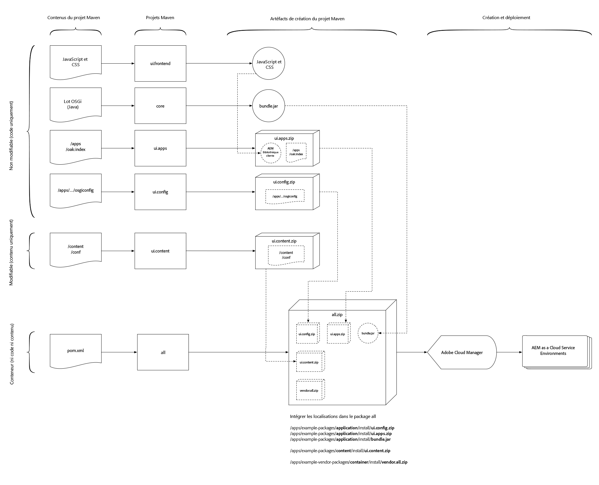

# Structure du projet AEM

>[!TIP]
>
>Familiarisez-vous avec l’utilisation [de base de l’archétype de projet](https://docs.adobe.com/content/help/en/experience-manager-core-components/using/developing/archetype/overview.html)AEM et le module externe [FileVault Content Maven](https://helpx.adobe.com/experience-manager/6-5/sites/developing/using/vlt-mavenplugin.html) lorsque cet article s’appuie sur ces connaissances et concepts.

Cet article décrit les modifications requises pour que les projets Adobe Experience Manager Maven soient compatibles avec le service AEM Cloud en veillant à ce qu’ils respectent la division du contenu modifiable et non modifiable. que les dépendances requises sont établies pour créer des déploiements non conflictuels et déterministes; et qu&#39;ils sont regroupés dans une structure déployable.

Les déploiements d’applications AEM doivent être composés d’un seul package AEM. Ce paquet doit à son tour contenir des sous-packages qui comprennent tout ce dont l&#39;application a besoin pour fonctionner, y compris le code, la configuration et tout contenu de base pris en charge.

AEM requiert une séparation du **contenu** et du **code**, ce qui signifie qu’un package de contenu unique **ne peut pas** être déployé **dans les zones** `/apps` et les zones d’écriture au moment de l’exécution (par ex. `/content`, `/conf`, `/home` ou autre élément non `/apps`) du référentiel. L’application doit séparer le code et le contenu dans des packages distincts pour le déploiement dans AEM.

La structure de packages décrite dans ce document est compatible avec **les déploiements de développement local et les déploiements de Cloud Services AEM** à la fois.

>[!TIP]
>
>Les configurations décrites dans ce sont fournies par [AEM Project Maven Archetype 21 ou version ultérieure](https://github.com/adobe/aem-project-archetype/releases).

## Zones mutables ou immuables du référentiel {#mutable-vs-immutable}

`/apps` et `/libs` sont considérées comme des zones **immuables** d’AEM, car elles ne peuvent pas être modifiées (création, mise à jour, suppression) après le démarrage d’AEM (c.-à-d. au moment de l’exécution). Toute tentative de modification d’une zone immuable au moment de l’exécution échouera.

Tout le reste dans le référentiel, `/content`, `/conf`, `/var`, `/etc`, `/oak:index`, `/system`, `/tmp`, etc. sont toutes des zones **modifiables** , ce qui signifie qu’elles peuvent être modifiées au moment de l’exécution.

>[!WARNING]
>
> Comme dans les versions précédentes d’AEM, ne `/libs` devez pas être modifié. Seul le code de produit AEM peut être déployé sur `/libs`.

## Structure de package recommandée {#recommended-package-structure}



Ce diagramme présente un aperçu de la structure de projet recommandée et des artefacts de déploiement de package.

La structure de déploiement d’application recommandée est la suivante :

+ Le `ui.apps` package, ou package de contenu, contient tout le code à déployer et se déploie uniquement vers `/apps`. Les éléments communs du `ui.apps` package comprennent, entre autres :
   + bundles OSGi
      + `/apps/my-app/install`
   + Configurations OSGi
      + `/apps/my-app/config`
   + Scripts HTML
      + `/apps/my-app/components`
   + JavaScript et CSS (via les bibliothèques client)
      + `/apps/my-app/clientlibs`
   + Incrustations de /libs
      + `/apps/cq`, `/apps/dam/`, etc.
   + Configurations adaptées au contexte de secours
      + `/apps/settings`
   + ACL (autorisations)
      + Tout `rep:policy` chemin sous `/apps`
   + Instructions de configuration OSGi Repo Init (et scripts associés)
      + [Repo Init](#repo-init) est la méthode recommandée pour déployer du contenu (mutable) qui fait logiquement partie de l’application AEM. Repo Init doit être utilisé pour définir :
         + Structures de contenu de référence
            + `/conf/my-app`
            + `/content/my-app`
            + `/content/dam/my-app`
         + Utilisateurs
         + Utilisateurs du service
         + Groupes
         + ACL (autorisations)
            + N’importe quel `rep:policy` chemin (mutant ou non modifiable)
+ Le `ui.content` package, ou package de code, contient tout le contenu et la configuration. Les éléments communs du `ui.content` package comprennent, entre autres :
   + Configurations adaptées au contexte
      + `/conf`
   + Structures de contenu requises et complexes (c.-à-d. Elargissement de contenu basé sur les structures de contenu de ligne de base définies dans l&#39;initialisation de redirection et qui s&#39;étend au-delà de ces structures.
      + `/content`, `/content/dam`, etc.
   + Taxonomies du balisage
      + `/content/cq:tags`
   + Index de chêne
      + `/oak:index`
   + Etc noeuds hérités
      + `/etc`
+ Le package `all` est un package conteneur qui inclut UNIQUEMENT les packages `ui.apps` et `ui.content` en tant qu’incorporés. Le package `all` ne doit pas avoir **de contenu** propre, mais déléguer tout déploiement au référentiel à ses sous-packages.

   Les packages sont désormais inclus à l’aide de la configuration [intégrée du module Maven Package Maven](#embeddeds)FileVault, plutôt que de la `<subPackages>` configuration.

   Pour les déploiements complexes d’Experience Manager, il peut être souhaitable de créer plusieurs `ui.apps` et `ui.content` projets/packs représentant des sites ou des locataires spécifiques dans AEM. Dans ce cas, assurez-vous que la division entre le contenu mutable et non modifiable est respectée et que les packages de contenu requis sont ajoutés sous forme de sous-packages dans le package de contenu  `all` .

   Par exemple, une structure complexe de package de contenu de déploiement peut ressembler à ceci :

   + `all` le package de contenu intègre les packages suivants, afin de créer un artefact de déploiement unique
      + `ui.apps.common` déploie le code requis par **les** sites A et B
      + `ui.apps.site-a` déploie le code requis par le site A
      + `ui.content.site-a` déploie le contenu et la configuration requis par le site A
      + `ui.apps.site-b` déploie le code requis par le site B
      + `ui.content.site-b` déploie le contenu et la configuration requis par le site B

## Types de package {#package-types}

Les packages doivent être marqués avec leur type de package déclaré.

+  packages ne doivent pas avoir de `packageType` jeu.
+ Les paquets de code (non modifiables) doivent définir leur `packageType` valeur sur `application`.
+ Les packages (mutables) de contenu doivent définir leur `packageType` valeur sur `content`.

Pour plus d&#39;informations, reportez-vous à la documentation [du module externe](https://jackrabbit.apache.org/filevault-package-maven-plugin/package-mojo.html#packageType) Apache Jackrabbit FileVault - Package Maven et au fragment [de configuration](#marking-packages-for-deployment-by-adoube-cloud-manager) FileVault Maven ci-dessous.

>[!TIP]
>
>Pour obtenir un extrait de code complet, reportez-vous à la section Fragments [XML](#xml-package-types) POM ci-dessous.

## Marquage de packs pour le déploiement par Adobe Cloud Manager {#marking-packages-for-deployment-by-adoube-cloud-manager}

Par défaut, Adobe Cloud Manager récupère tous les packages générés par la version de Maven. Toutefois, puisque le module du conteneur (`all`) est l’artefact de déploiement unique qui contient tous les modules de code et de contenu, nous devons nous assurer que **seul** le module du conteneur (`all`) est déployé. Pour ce faire, les autres modules générés par la version de Maven doivent être marqués avec la configuration du plug-in externe Maven du module de contenu FileVault de `<properties><cloudManagerTarget>none</cloudManageTarget></properties>`.

>[!TIP]
>
>Pour obtenir un extrait de code complet, reportez-vous à la section Fragments [XML](#pom-xml-snippets) POM ci-dessous.

## Repo Init{#repo-init}

Repo Init fournit des instructions, ou scripts, qui définissent les structures JCR, allant des structures de noeud courantes comme les arborescences de dossiers, aux utilisateurs, aux utilisateurs de service, aux groupes et à la définition d’ACL.

Les principaux avantages de Repo Init sont qu&#39;ils disposent d&#39;autorisations implicites pour exécuter toutes les actions définies par leurs scripts et sont appelés au début du cycle de vie du déploiement pour s&#39;assurer que toutes les structures JCR requises existent au moment de l&#39;exécution du code temporel.

Bien que les scripts Repo Init vivent eux-mêmes dans le `ui.apps` projet en tant que scripts, ils peuvent et doivent être utilisés pour définir les structures mutables suivantes :

+ Structures de contenu de référence
   + Examples: `/content/my-app`, `/content/dam/my-app`, `/conf/my-app/settings`
+ Utilisateurs du service
+ Utilisateurs
+ Groupes
+ Listes ACL

Les scripts Repo Init sont stockés en tant qu’ `scripts` entrées des configurations d’usine `RepositoryInitializer` OSGi. Ils peuvent donc être implicitement ciblés par le mode d’exécution, ce qui permet d’établir des différences entre les scripts Repo Init d’AEM Author et d’AEM Publish Services, voire entre les scripts Envs (Dev, Stage et Prod).

Notez que lors de la définition d’utilisateurs et de groupes, seuls les groupes sont considérés comme faisant partie de l’application et qu’ils font partie intégrante de sa fonction doivent être définis ici. Les utilisateurs et groupes d’organisation doivent toujours être définis au moment de l’exécution dans AEM ; par exemple, si un flux de travail personnalisé affecte du travail à un groupe nommé, ce groupe doit être défini via Repo Init dans l’application AEM. Toutefois, si le regroupement est simplement organisationnel, comme &quot;Wendy&#39;s Team&quot; et &quot;Sean&#39;s Team&quot;, il est préférable de les définir et de les gérer au moment de l’exécution dans AEM.

>[!TIP]
>
>Les scripts Repo Init *doivent* être définis dans le `scripts` champ intégré et la `references` configuration ne fonctionne pas.

Le vocabulaire complet des scripts Repo Init est disponible dans la documentation [d&#39;](https://sling.apache.org/documentation/bundles/repository-initialization.html#the-repoinit-repository-initialization-language)Apache Sling Repo Init.

>[!TIP]
>
>Pour obtenir un extrait de code complet, reportez-vous à la section [Extraits de code](#snippet-repo-init) Repo Init ci-dessous.

## Package de structure de référentiel {#repository-structure-package}

Les packages de code nécessitent de configurer la configuration du module externe FileVault Maven pour référencer un module `<repositoryStructurePackage>` qui applique la précision des dépendances structurelles (pour s&#39;assurer qu&#39;un package de code ne s&#39;installe pas par rapport à un autre). Vous pouvez [créer votre propre package de structure de référentiel pour votre projet](repository-structure-package.md).

Ceci est **uniquement requis** pour les packages de code, c’est-à-dire tout package marqué par `<packageType>application</packageType>`.

Pour savoir comment créer un package de structure de référentiel pour votre application, voir [Développement d’un package](repository-structure-package.md)de structure de référentiel.

Notez que les packages de contenu (`<packageType>content</packageType>`) ne **nécessitent pas** ce package de structure de référentiel.

>[!TIP]
>
>Pour obtenir un extrait de code complet, reportez-vous à la section Fragments [XML](#xml-repository-structure-package) POM ci-dessous.

## Incorporation de sous-packages dans le package{#embeddeds}

Le contenu ou les packages de code sont placés dans un dossier &quot;side-car&quot; spécial et peuvent être ciblés pour l’installation sur l’auteur AEM, la publication AEM ou les deux à l’aide de la `<embeddeds>` configuration du module externe FileVault Maven. Notez que la `<subPackages>` configuration ne doit pas être utilisée.

Cas d’utilisation courants :

+ Listes ACL/autorisations différentes entre les utilisateurs d’auteur AEM et les utilisateurs de publication AEM
+ Configurations utilisées pour la prise en charge des  uniquement sur l’auteur AEM
+ Code tel que les intégrations aux systèmes back-office, nécessaire uniquement pour s’exécuter sur l’auteur AEM


Pour de l’auteur AEM, de la publication AEM, ou des deux, le package est incorporé dans le module de   du `all` dans un emplacement de dossier spécial, au format suivant :

`/apps/<app-name>-packages/(content|application)/install(.author|.publish)?`

Ventilation de la structure de dossiers :

+ Le dossier de premier niveau **doit être** placé `/apps`.
+ Le dossier de deuxième niveau représente l’application avec le `-packages` post-fixe au nom du dossier. Souvent, il n’existe qu’un seul dossier de deuxième niveau dans lequel sont incorporés tous les sous-packages ; toutefois, il est possible de créer un nombre illimité de dossiers de deuxième niveau pour représenter au mieux la structure logique de l’application :
   + `/apps/my-app-packages`
   + `/apps/my-other-app-packages`
   + `/apps/vendor-packages`
   >[!WARNING]
   >
   >Par convention, les dossiers incorporés des sous-packages sont nommés avec le suffixe de `-packages`. Cela permet de s’assurer que le code de déploiement et les packages de contenu ne sont **pas** déployés dans le(s) dossier(s) cible(s) d’un sous-package `/apps/<app-name>/...` qui entraîne un comportement d’installation destructif et cyclique.

+ Le dossier de troisième niveau doit être :
   `application` ou `content`
   + Le `application` dossier contient des packages de code
   + Le `content` dossier contient des packages de contenu en orCe nom de dossier doit correspondre aux types [de](#package-types) package des packages qu’il contient.
+ Le dossier de quatrième niveau contient les sous-packages et doit être l’un des suivants :
   + `install` pour effectuer l’installation sur **l’auteur AEM et la publication AEM**
   + `install.author` à **installer uniquement** sur l’auteur AEM
   + `install.publish` pour **uniquement** l’installation sur AEM publishRemarque : seuls `install.author` et `install.publish` sont pris en charge . Les autres modes d’exécution **ne sont pas** pris en charge.

Par exemple, un déploiement qui contient des packs spécifiques d’auteur et de publication AEM peut se présenter comme suit :

+ `all`  package intègre les packages suivants, afin de créer un artefact de déploiement unique
   + `ui.apps` incorporé dans `/apps/my-app-packages/application/install` déploie le code vers l’auteur AEM et la publication AEM
   + `ui.apps.author` incorporé dans `/apps/my-app-packages/application/install.author` déploie le code uniquement vers l’auteur AEM
   + `ui.content` incorporé dans `/apps/my-app-packages/content/install` déploie le contenu et la configuration à l’auteur AEM et à la publication AEM
   + `ui.content.publish` incorporé dans `/apps/my-app-packages/content/install.publish` déploie le contenu et la configuration vers AEM publish uniquement

>[!TIP]
>
>Pour obtenir un extrait de code complet, reportez-vous à la section Fragments [XML](#xml-embeddeds) POM ci-dessous.

### Définition de filtre du package {#container-package-filter-definition}

En raison de l’incorporation du code et des sous-packages de contenu dans le package de , les chemins d’accès aux incorporés doivent être ajoutés au projet `filter.xml` de l’ensemble de projets pour s’assurer que les packages incorporés sont inclus dans le package de l’une fois créés.

Il vous suffit d’ajouter les `<filter root="/apps/<my-app>-packages"/>` entrées de tous les dossiers de deuxième niveau contenant des sous-packages à déployer.

>[!TIP]
>
>Pour obtenir un extrait de code complet, reportez-vous à la section Fragments [XML](#xml-container-package-filters) POM ci-dessous.

## Incorporation de packages tiers {#embedding-3rd-party-packages}

Tous les packages doivent être disponibles via le référentiel [public d’artefacts Maven d’](https://repo.adobe.com/nexus/content/groups/public/com/adobe/) Adobe ou un référentiel d’artefacts Maven tiers référencable accessible au public.

Si les packages tiers se trouvent dans le **référentiel public d’artefacts Maven d’Adobe**, aucune configuration supplémentaire n’est nécessaire pour qu’Adobe Cloud Manager puisse résoudre les artefacts.

Si les packages tiers se trouvent dans un **référentiel d’artefacts tiers public**, ce référentiel doit être enregistré dans le projet `pom.xml` et incorporé selon la méthode [décrite ci-dessus](#embeddeds). Si l’application ou le connecteur tiers requiert à la fois du code et des packages de contenu, chacun d’eux doit être incorporé aux emplacements appropriés dans votre package conteneur (`all`).

L’ajout de dépendances Maven suit les pratiques standard Maven et l’incorporation d’artefacts tiers (code et packages de contenu) est [décrite ci-dessus](#embedding-3rd-party-packages).

>[!TIP]
>
>Pour obtenir un extrait de code complet, reportez-vous à la section Fragments [XML](#xml-3rd-party-maven-repositories) POM ci-dessous.

## Dépendances du package entre les `ui.apps` packages `ui.content`{#package-dependencies}

Afin d&#39;assurer l&#39;installation correcte des paquets, il est recommandé que les dépendances inter-paquets soient établies.

La règle générale est que les packages contenant du contenu modifiable (`ui.content`) doivent dépendre du contenu non modifiable (`ui.apps`) qui prend en charge le rendu et l’utilisation du contenu modifiable.

>[!TIP]
>
>Pour obtenir un extrait de code complet, reportez-vous à la section Fragments [XML](#xml-package-dependencies) POM ci-dessous.

Les modèles courants pour les dépendances des packages de contenu sont les suivants :

### Dépendances du pack de déploiement simple {#simple-deployment-package-dependencies}

La casse simple définit le package de contenu `ui.content` modifiable de sorte qu’il dépend du package de code `ui.apps` immuable.

+ `all` ne comporte aucune dépendance
   + `ui.apps` ne comporte aucune dépendance
   + `ui.content` dépend de `ui.apps`

### Dépendances du pack de déploiement complexe {#complex-deploxment-package-dependencies}

Les déploiements complexes s’étendent sur la casse simple et définissent les dépendances entre le contenu mutable correspondant et les packages de code immuables. Au besoin, des dépendances peuvent également être établies entre des paquets de code immuables.

+ `all` ne comporte aucune dépendance
   + `ui.apps.common` ne comporte aucune dépendance
   + `ui.apps.site-a` dépend de `ui.apps.common`
   + `ui.content.site-a` dépend de `ui.apps.site-a`
   + `ui.apps.site-b` dépend de `ui.apps.common`
   + `ui.content.site-b` dépend de `ui.apps.site-b`

## Développement local et déploiement {#local-development-and-deployment}

Les structures de projet et l’organisation décrites dans cet article sont **entièrement compatibles** avec les instances AEM de développement local.

## Extraits de code XML POM {#pom-xml-snippets}

Voici quelques extraits de configuration Maven `pom.xml` qui peuvent être ajoutés aux projets Maven pour les aligner sur les recommandations ci-dessus.

### Types de package {#xml-package-types}

Le code et les packages de contenu, qui sont déployés sous forme de sous-packages, doivent déclarer un type d’**application** ou de **contenu** de package, selon ce qu’ils contiennent.

#### Types de packages {#container-package-types}

Le `all/pom.xml` projet de  **ne** déclare pas `<packageType>`devaleur.

#### Types de package de code (immuable) {#immutable-package-types}

Les packages de code doivent définir leur `packageType` valeur sur `application`.

Dans la `ui.apps/pom.xml`, les directives de configuration de `<packageType>application</packageType>` génération de la déclaration du `filevault-package-maven-plugin` module externe déclarent son type de package.

```xml
...
<build>
  <plugins>
    <plugin>
      <groupId>org.apache.jackrabbit</groupId>
      <artifactId>filevault-package-maven-plugin</artifactId>
      <extensions>true</extensions>
      <configuration>
        <group>${project.groupId}</group>
        <name>${my-app.ui.apps}</name>
        <packageType>application</packageType>
        <accessControlHandling>merge</accessControlHandling>
        <properties>
          <cloudManagerTarget>none</cloudManagerTarget>
        </properties>
      </configuration>
    </plugin>
    ...
```

#### Types de packages (mutables) de contenu {#mutable-package-types}

Les packages de contenu doivent définir leur `packageType` valeur sur `content`.

Dans la `ui.content/pom.xml`, la directive de configuration de `<packageType>content</packageType>` génération de la déclaration du `filevault-package-maven-plugin` module externe déclare son type de package.

```xml
...
<build>
  <plugins>
    <plugin>
      <groupId>org.apache.jackrabbit</groupId>
      <artifactId>filevault-package-maven-plugin</artifactId>
      <extensions>true</extensions>
      <configuration>
        <group>${project.groupId}</group>
        <name>${my-app.ui.content}</name>
        <packageType>content</packageType>
        <accessControlHandling>merge</accessControlHandling>
        <properties>
          <cloudManagerTarget>none</cloudManagerTarget>
        </properties>
      </configuration>
    </plugin>
    ...
```

### Marquage de packs pour le déploiement d’Adobe Cloud Manager {#cloud-manager-target}

Dans chaque projet générant un package, **à l’exception** du projet conteneur (`all`), ajoutez `<cloudManagerTarget>none</cloudManagerTarget>` à la configuration `<properties>` de la déclaration du `filevault-package-maven-plugin` module externe pour vous assurer qu’ils **ne sont pas** déployés par Adobe Cloud Manager. Le package conteneur (`all`) doit être le package unique déployé via Cloud Manager, qui à son tour intègre tous les packages de code et de contenu requis.

```xml
...
<build>
  <plugins>
    <plugin>
      <groupId>org.apache.jackrabbit</groupId>
      <artifactId>filevault-package-maven-plugin</artifactId>
      <extensions>true</extensions>
      <configuration>
        ...
        <properties>
          <cloudManagerTarget>none</cloudManagerTarget>
        </properties>
      </configuration>
    </plugin>
    ...
```

### Repo Init{#snippet-repo-init}

Les scripts Repo Init qui contiennent les scripts Repo Init sont définis dans la configuration d’usine OSGi via la `RepositoryInitializer` `scripts` propriété. Notez que puisque ces scripts sont définis dans les configurations OSGi, ils peuvent être facilement mis en plage par le mode d’exécution à l’aide de la sémantique habituelle des `../config.<runmode>` dossiers.

Notez que, comme les scripts sont généralement des déclarations multilignes, il est plus facile de les définir dans le `.config` fichier que dans le `sling:OsgiConfig` format des bases XML.

`/apps/my-app/config.author/org.apache.sling.jcr.repoinit.RepositoryInitializer-author.config`

```plain
scripts=["
    create service user my-data-reader-service

    set ACL on /var/my-data
        allow jcr:read for my-data-reader-service
    end

    create path (sling:Folder) /conf/my-app/settings
"]
```

La propriété `scripts` OSGi contient des directives définies par le langage [Repo Init d&#39;](https://sling.apache.org/documentation/bundles/repository-initialization.html#the-repoinit-repository-initialization-language)Apache Sling.

### Package de structure de référentiel {#xml-repository-structure-package}

Dans la section `ui.apps/pom.xml` et tout autre `pom.xml` qui déclare un package de code (`<packageType>application</packageType>`), ajoutez la configuration de package de structure de référentiel suivante au module externe FileVault Maven. Vous pouvez [créer votre propre package de structure de référentiel pour votre projet](repository-structure-package.md).

```xml
...
<build>
  <plugins>
    <plugin>
      <groupId>org.apache.jackrabbit</groupId>
      <artifactId>filevault-package-maven-plugin</artifactId>
      <extensions>true</extensions>
      <configuration>
        ...
        <repositoryStructurePackages>
          <repositoryStructurePackage>
              <groupId>${project.groupId}</groupId>
              <artifactId>repository-structure-pkg</artifactId>
              <version>${project.version}</version>
          </repositoryStructurePackage>
        </repositoryStructurePackages>
      </configuration>
    </plugin>
    ...
```

### Incorporation de sous-packages dans le package {#xml-embeddeds}

Dans la `all/pom.xml`, ajoutez les `<embeddeds>` directives suivantes à la déclaration du `filevault-package-maven-plugin` module externe. N&#39; **oubliez pas que vous n&#39;** utilisez pas `<subPackages>` la `/etc/packages` configuration, car cela inclura les sous-packages dans `/apps/my-app-packages/<application|content>/install(.author|.publish)?`plutôt que.

```xml
...
<plugin>
  <groupId>org.apache.jackrabbit</groupId>
  <artifactId>filevault-package-maven-plugin</artifactId>
  <extensions>true</extensions>
  <configuration>
      ...
      <embeddeds>

          <!-- Include the application's ui.apps and ui.content packages -->
          <!-- Ensure the artifactIds are correct -->

          <!-- Code package that deploys to BOTH AEM Author and AEM Publish -->
          <embedded>
              <groupId>${project.groupId}</groupId>
              <artifactId>my-app.ui.apps</artifactId>
              <type>zip</type>
              <target>/apps/my-app-packages/application/install</target>
          </embedded>

          <!-- Code package that deploys ONLY to AEM Author -->
          <embedded>
              <groupId>${project.groupId}</groupId>
              <artifactId>my-app.ui.apps.author</artifactId>
              <type>zip</type>
              <target>/apps/my-app-packages/application/install.author</target>
          </embedded>

          <!-- Content package that deploys to BOTH AEM Author and AEM Publish -->
          <embedded>
              <groupId>${project.groupId}</groupId>
              <artifactId>my-app.ui.content</artifactId>
              <type>zip</type>
              <target>/apps/my-app-packages/content/install</target>
          </embedded>

          <!-- Content package that deploys ONLY to AEM Publish -->
          <embedded>
              <groupId>${project.groupId}</groupId>
              <artifactId>my-app.ui.content.publish-only</artifactId>
              <type>zip</type>
              <target>/apps/my-app-packages/content/install.publish</target>
          </embedded>

          <!-- Include any other extra packages such as AEM WCM Core Components -->
          <embedded>
              <groupId>com.adobe.cq</groupId>
              <!-- Not to be confused; WCM Core Components' Code package's artifact is named `.content` -->
              <artifactId>core.wcm.components.content</artifactId>
              <type>zip</type>
              <target>/apps/vendor-packages/application/install</target>
          </embedded>

          <embedded>
              <groupId>com.adobe.cq</groupId>
              <!-- Not to be confused; WCM Core Components' Content package's artifact is named `.conf` -->
              <artifactId>core.wcm.components.conf</artifactId>
              <type>zip</type>
              <target>/apps/vendor-packages/content/install</target>
          </embedded>
      <embeddeds>
  </configuration>
</plugin>
...
```

### Définition de filtre du package {#xml-container-package-filters}

Dans le projet `all` `filter.xml` (`all/src/main/content/jcr_root/META-INF/vault/definition/filter.xml`), **incluez** tous les dossiers `-packages` qui contiennent des sous-modules à déployer :

```xml
<filter root="/apps/my-app-packages"/>
```

Si plusieurs `/apps/*-packages` sont utilisés dans le  incorporé, ils doivent tous être énumérés ici.

### Référentiels Maven tiers {#xml-3rd-party-maven-repositories}

>[!WARNING]
> L&#39;ajout d&#39;autres référentiels Maven peut allonger le temps de création de maven, car d&#39;autres référentiels Maven seront contrôlés pour détecter les dépendances.

Dans le projet de réacteur `pom.xml`, ajoutez toutes les directives de référentiel public tierce nécessaires Maven. La configuration complète `<repository>` doit être disponible auprès du fournisseur de référentiel tiers.

```xml
<repositories>
  ...
  <repository>
      <id>3rd-party-repository</id>
      <name>Public 3rd Party Repository</name>
      <url>https://repo.3rdparty.example.com/...</url>
      <releases>
          <enabled>true</enabled>
          <updatePolicy>never</updatePolicy>
      </releases>
      <snapshots>
          <enabled>false</enabled>
      </snapshots>
  </repository>
  ...
</repositories>
```

### Dépendances du package entre les `ui.apps` packages `ui.content`{#xml-package-dependencies}

Dans la `ui.content/pom.xml`, ajoutez les `<dependencies>` directives suivantes à la déclaration du `filevault-package-maven-plugin` module externe.

```xml
...
<plugin>
  <groupId>org.apache.jackrabbit</groupId>
  <artifactId>filevault-package-maven-plugin</artifactId>
  <extensions>true</extensions>
  <configuration>
      ...
      <dependencies>
        <!-- Declare the content package dependency in the ui.content/pom.xml on the ui.apps project -->
        <dependency>
            <groupId${project.groupId}</groupId>
            <artifactId>my-app.ui.apps</artifactId>
            <version>${project.version}</version>
        </dependency>
      </dependencies>
    ...
  </configuration>
</plugin>
...
```

### Nettoyage du dossier de du projet {#xml-clean-container-package}

Dans le `all/pom.xml` , ajoutez le `maven-clean-plugin` plug-in qui nettoiera le répertoire de  de avant une génération Maven.

```xml
<plugins>
  ...
  <plugin>
    <artifactId>maven-clean-plugin</artifactId>
    <executions>
      <execution>
        <id>auto-clean</id>
        <!-- Run at the beginning of the build rather than the default, which is after the build is done -->
        <phase>initialize</phase>
        <goals>
          <goal>clean</goal>
        </goals>
      </execution>
    </executions>
  </plugin>
  ...
</plugins>
```

## Ressources supplémentaires {#additional-resources}

+ [Gestion des packages à l’aide de Maven](https://helpx.adobe.com/experience-manager/6-5/sites/developing/using/vlt-mavenplugin.html)
+ [Module FileVault Content Package Maven](http://jackrabbit.apache.org/filevault-package-maven-plugin/)