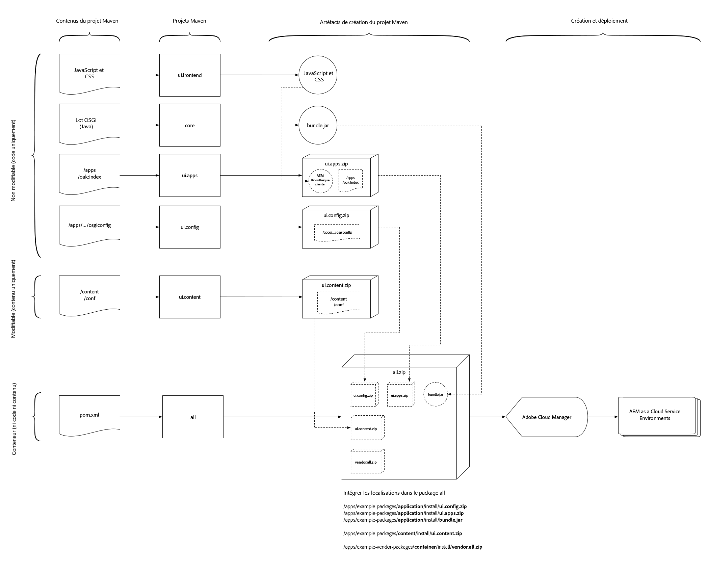
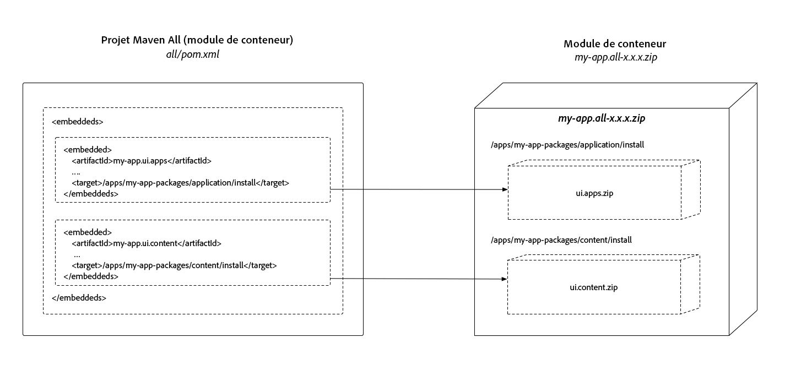

# Structure de projet AEM

>[!TIP]
>
>L’[archétype de projet AEM](https://experienceleague.adobe.com/en/docs/experience-manager-core-components/using/developing/archetype/overview#) et le [plug-in Maven FileVault Content](/help/implementing/developing/tools/maven-plugin.md) font partie des thèmes abordés dans cet article. Vous êtes donc invité à vous familiariser avec ces concepts.

Cet article décrit les modifications requises pour que les projets Maven Adobe Experience Manager soient compatibles avec AEM as a Cloud Service, en veillant à ce qu’ils respectent la division entre contenu modifiable et non modifiable. En outre, les dépendances sont établies pour créer des déploiements déterministes non conflictuels. Elles sont regroupées dans une structure déployable.

Les déploiements d’applications AEM doivent être constitués d’un seul package AEM. Ce package doit, à son tour, contenir des sous-packages qui comprennent tout ce dont l’application a besoin pour fonctionner, y compris le code, la configuration et tout contenu de référence nécessaire.

AEM requiert une séparation du **contenu** et du **code**, ce qui signifie qu’un même package de contenu **ne peut pas** être déployé **à la fois** dans les zones `/apps` et dans les zones accessibles en écriture au moment de l’exécution (`/content`, `/conf`, `/home` ou toute zone autre que `/apps`) du référentiel. L’application doit séparer le code et le contenu dans des packages distincts en vue du déploiement dans AEM.

La structure de package décrite dans ce document est compatible avec les déploiements de développement en local **et** les déploiements d’AEM Cloud Service.

>[!TIP]
>
>Les configurations décrites dans ce document sont fournies par [AEM Project Maven Archetype 24 ou version ultérieure](https://github.com/adobe/aem-project-archetype/releases).

## Zones modifiables et non modifiables du référentiel {#mutable-vs-immutable}

Les zones `/apps` et `/libs` d’AEM sont **immuables**. Une fois AEM démarré, vous ne pouvez pas créer, mettre à jour ou supprimer du contenu dans ces zones au moment de l’exécution. Toute tentative de modification d’une zone non modifiable au moment de l’exécution échoue.

Toutes les autres zones du référentiel (par exemple, `/content`, `/conf`, `/var`, `/etc`, `/oak:index`, `/system`, `/tmp`, etc.) sont toutes **modifiables**, ce qui signifie qu’elles peuvent être changées au moment de l’exécution.

>[!WARNING]
>
>Comme dans les versions précédentes d’AEM, `/libs` ne doit pas être modifié. Seul le code de produit AEM peut être déployé sur `/libs`.

### Index Oak {#oak-indexes}

Le processus de déploiement AEM as a Cloud Service gère les index Oak (`/oak:index`). En effet, Cloud Manager doit attendre le déploiement d’un nouvel index et sa réindexation complète avant de passer à la nouvelle image de code.

Ainsi, bien que les index Oak soient modifiables au moment de l’exécution, ils doivent être déployés sous forme de code pour pouvoir être installés avant les packages modifiables. Par conséquent, les configurations `/oak:index` font partie du package de code et non du package de contenu [comme décrit ci-dessous](#recommended-package-structure).

>[!TIP]
>
>Pour plus d’informations sur l’indexation dans AEM as a Cloud Service, voir [Recherche et indexation de contenu](/help/operations/indexing.md).

## Structure de package recommandée {#recommended-package-structure}



Ce diagramme présente un aperçu de la structure de projet recommandée et des artefacts de déploiement du package.

La structure de déploiement d’application recommandée est la suivante :

### Packages de code/lots OSGi

+ Le fichier Jar du bundle OSGi est généré et directement incorporé dans l’ensemble du projet.

+ Le package `ui.apps` contient tout le code à déployer. Il est déployé uniquement sur `/apps`. Voici un aperçu des éléments courants du package `ui.apps` :
   + [Définitions des composants et scripts HTL](https://experienceleague.adobe.com/en/docs/experience-manager-htl/content/overview#)
      + `/apps/my-app/components`
   + Code JavaScript et CSS (via les [bibliothèques clientes](/help/implementing/developing/introduction/clientlibs.md))
      + `/apps/my-app/clientlibs`
   + [Recouvrements](/help/implementing/developing/introduction/overlays.md) de `/libs`
      + `/apps/cq`, `/apps/dam/`, et ainsi de suite.
   + Configurations basées sur le contexte de secours
      + `/apps/settings`
   + Listes de contrôle d’accès (autorisations)
      + Tout `rep:policy` pour tout chemin d’accès sous `/apps`
   + [Scripts groupés précompilés](https://experienceleague.adobe.com/en/docs/experience-manager-core-components/using/developing/archetype/precompiled-bundled-scripts#)

>[!NOTE]
>
>Le même code doit être déployé dans tous les environnements. Ce code permet de s’assurer que les validations dans l’environnement d’évaluation sont également en production. Pour plus d’informations, voir la section [Modes d’exécution](/help/implementing/deploying/overview.md#runmodes).


### Packages de contenu

+ Le package `ui.content` contient l’ensemble du contenu et de la configuration. Le package de contenu contient toutes les définitions de nœud qui ne se trouvent pas dans les packages `ui.apps` ou `ui.config`, ou en d’autres termes, tout ce qui ne se trouve pas dans `/apps` ou `/oak:index`. Voici un aperçu des éléments courants du package `ui.content` :
   + Configurations basées sur le contexte
      + `/conf`
   + Structures de contenu complexes obligatoires (c’est-à-dire présentation de contenu qui s’appuie sur des structures de contenu de référence définies dans Repo Init et les étend),
      + `/content`, `/content/dam`, et ainsi de suite.
   + Taxonomies du balisage régies
      + `/content/cq:tags`
   + Nœuds `etc` hérités (idéalement, migrez ces nœuds vers des emplacements autres que/etc).
      + `/etc`

### Packages de conteneurs

+ Le package `all` est un package conteneur . Il comprend uniquement des artefacts déployables en tant qu’incorporations : le fichier JAR du lot OSGi et les packages `ui.apps`, `ui.config` et `ui.content`. Le package `all` ne doit pas comporter de **contenu ou de code** propre, mais doit déléguer tout le déploiement sur le référentiel à ses sous-packages ou aux fichiers Jar du lot OSGi.

  Les packages sont désormais inclus à l’aide de la [configuration intégrée du plug-in FileVault Package Maven](#embeddeds) et non à l’aide de la configuration `<subPackages>`.

  Pour les déploiements Experience Manager complexes, il peut être souhaitable de créer plusieurs projets/packages `ui.apps`, `ui.config` et `ui.content` représentant des clientes, des clients ou des sites spécifiques dans AEM. Si vous utilisez cette approche, respectez la répartition entre le contenu modifiable et non modifiable. Incorporez également les packages de contenu et les fichiers JAR par lots OSGi requis en tant que sous-packages dans le package de contenu de conteneur `all`.

  Une structure complexe d’un module de contenu de déploiement peut, par exemple, se présenter comme suit :

   + Le module de contenu `all` incorpore les packages suivants afin de créer un artefact de déploiement unique
      + `common.ui.apps` déploie le code requis par les sites A **et** B
      + `site-a.core` le fichier Jar des lots OSGi requis par le site A
      + `site-a.ui.apps` déploie le code requis par le site A
      + `site-a.ui.config` déploie les configurations OSGi requises par le site A
      + `site-a.ui.content` déploie le contenu et la configuration requis par le site A
      + `site-b.core` le fichier Jar des lots OSGi requis par le site B
      + `site-b.ui.apps` déploie le code requis par le site B
      + `site-b.ui.config` déploie les configurations OSGi requises par le site B
      + `site-b.ui.content` déploie le contenu et la configuration requis par le site B

+ Le package `ui.config` contient toutes les [configurations OSGi](/help/implementing/deploying/configuring-osgi.md) :
   + Considéré comme du code appartenant aux lots OSGi, mais ne contenant pas de nœuds de contenu standard. Ainsi, il est marqué comme un package de conteneur
   + Dossier d’organisation contenant des définitions de configuration OSGi spécifiques au mode d’exécution
      + `/apps/my-app/osgiconfig`
   + Un dossier de configuration OSGi commun contenant les configurations OSGi par défaut qui s’appliquent à toutes les cibles de déploiement AEM as a Cloud Service cibles.
      + `/apps/my-app/osgiconfig/config`
   + Dossiers de configuration OSGi spécifiques au mode d’exécution contenant les configurations OSGi par défaut qui s’appliquent à toutes les cibles de déploiement AEM as a Cloud Service
      + `/apps/my-app/osgiconfig/config.<author|publish>.<dev|stage|prod>`
   + Scripts de configuration OSGi Repo Init
      + [Repo Init](#repo-init) est la méthode recommandée pour déployer du contenu (mutable) faisant logiquement partie de l’application AEM. Les configurations OSGi Repo Init doivent être placées dans le dossier `config.<runmode>` approprié, comme indiqué ci-dessus, et être utilisées pour définir :
         + Structures de contenu de base
         + Utilisateurs
         + Utilisateurs du service
         + Groupes
         + Listes de contrôle d’accès (autorisations)

### Packages d’applications supplémentaires{#extra-application-packages}

Si d’autres projets AEM, eux-mêmes composés de leur propre module de contenu et package de code, sont utilisés par le déploiement AEM, leurs modules conteneurs doivent être incorporés dans le package `all` du projet.

Par exemple, un projet AEM incluant deux applications AEM de fournisseurs peut se présenter comme suit :

+ Le module de contenu `all` incorpore les packages suivants afin de créer un artefact de déploiement unique
   + `core` Jar des lots OSGi requis par l’application AEM
   + `ui.apps` déploie le code requis par l’application AEM
   + `ui.config` déploie les configurations OSGi requises par l’application AEM
   + `ui.content` déploie le contenu et la configuration requis par l’application AEM
   + `vendor-x.all` déploie tous les éléments (code et contenu) requis par l’application du fournisseur X
   + `vendor-y.all` déploie tout les éléments (code et contenu) requis par l’application du fournisseur Y

## Types de packages {#package-types}

Les packages doivent être marqués avec le type déclaré. Les types de packages permettent de clarifier l’objectif et le déploiement d’un package.

+ Les packages de conteneurs doivent définir leur `packageType` sur `container`. Les packages de conteneurs ne doivent pas contenir de nœuds standard. Seuls les lots, les configurations et les sous-packages OSGi sont autorisés. Les conteneurs dans AEM as a Cloud Service ne sont pas autorisés à utiliser les [hooks d’installation](https://jackrabbit.apache.org/filevault/installhooks.html).
+ Les packages de code (non modifiables) doivent définir leur `packageType` sur `application`.
+ Les packages de contenu (modifiables) doivent définir leur `packageType` sur `content`.


Pour plus d’informations, consultez la [documentation d’Apache Jackrabbit FileVault - Plug-in Maven pour les packages](https://jackrabbit.apache.org/filevault-package-maven-plugin/package-mojo.html#packageType), les [Types de packages Apache Jackrabbit](https://jackrabbit.apache.org/filevault/packagetypes.html) et le [Fragment de code de configuration FileVault Maven](#marking-packages-for-deployment-by-adoube-cloud-manager) ci-dessous.

>[!TIP]
>
>Pour obtenir un fragment de code complet, reportez-vous à la section [Fragments de code XML POM](#xml-package-types) ci-dessous.

## Marquage des packages pour déploiement par Adobe Cloud Manager {#marking-packages-for-deployment-by-adoube-cloud-manager}

Par défaut, Adobe Cloud Manager récupère tous les packages générés par la version Maven. Cependant, étant donné que le module conteneur (`all`) est l’artefact de déploiement unique qui contient tous les packages de code et modules de contenu, vous devez vous assurer que **seul** le conteneur (`all`) est déployé. Pour ce faire, les autres modules générés par la version Maven doivent être marqués avec la configuration suivante du plug-in Maven de module de contenu FileVault : `<properties><cloudManagerTarget>none</cloudManageTarget></properties>`.

>[!TIP]
>
>Pour obtenir un fragment de code complet, reportez-vous à la section [Fragments de code XML POM](#pom-xml-snippets) ci-dessous.

## Repo Init {#repo-init}

Repo Init fournit des instructions, ou scripts, qui définissent les structures JCR, allant des structures de nœud courantes comme les arborescences de dossiers, aux personnes utilisatrices, aux personnes utilisatrices de service, aux groupes et à la définition d’ACL.

Les principaux avantages de Repo Init sont qu’ils disposent d’autorisations implicites pour exécuter toutes les actions définies par leurs scripts. De plus, ces scripts sont appelés tôt dans le cycle de vie du déploiement, ce qui garantit que toutes les structures JCR requises existent au moment de l’exécution du code.

Bien que les scripts Repo Init résident eux-mêmes dans le projet `ui.config` en tant que scripts, ils peuvent et doivent être utilisés pour définir les structures mutables suivantes :

+ Structures de contenu de base
+ Utilisateurs du service
+ Utilisateurs
+ Groupes
+ ACL

Les scripts Repo Init sont stockés sous la forme d’entrées `scripts` de configurations d’usine OSGi `RepositoryInitializer`. Le mode d’exécution peut les cibler implicitement. Ce ciblage vous permet de différencier les scripts Repo Init entre les services de création AEM et de publication AEM, ou même entre les environnements de développement, d’évaluation et de production.

Il est préférable d’écrire les configurations OSGi Repo Init au format de configuration OSGi [`.config` car elles prennent en charge plusieurs lignes, ce qui constitue une exception aux bonnes pratiques d’utilisation de ](https://sling.apache.org/documentation/bundles/configuration-installer-factory.html#configuration-files-config-1) pour définir les configurations OSGi[`.cfg.json`.](https://sling.apache.org/documentation/bundles/configuration-installer-factory.html#configuration-files-cfgjson-1)

Lors de la définition des utilisateurs et des groupes, seuls les groupes sont considérés comme faisant partie de l’application et faisant partie intégrante de sa fonction. Vous définissez toujours des personnes utilisatrices et des groupes d’organisation au moment de l’exécution dans AEM. Par exemple, si un workflow personnalisé affecte du travail à un groupe nommé, définissez ce groupe au moyen de Repo Init dans l’application AEM. Cependant, si le regroupement est simplement organisationnel, comme « Équipe de Wendy » et « Équipe de Sean », il est préférable de définir et de gérer ces groupes au moment de l’exécution dans AEM.

>[!TIP]
>
>Les scripts Repo Init *doivent* être définis dans le champ `scripts` intégré. À défaut, la configuration `references` ne fonctionne pas.

Le vocabulaire complet des scripts Repo Init est disponible dans la [documentation d’Apache Sling Repo Init](https://sling.apache.org/documentation/bundles/repository-initialization.html#the-repoinit-repository-initialization-language).

>[!TIP]
>
>Pour obtenir un fragment de code complet, reportez-vous à la section [Fragments de code Repo Init](#snippet-repo-init) ci-dessous.

## Package de structure du référentiel {#repository-structure-package}

Les packages de code exigent que la configuration du plug-in Maven FileVault fasse référence à un `<repositoryStructurePackage>`, qui s’assure que les dépendances structurelles sont correctes (pour qu’un package de code ne s’installe pas sur un autre). Vous pouvez [créer votre propre package de structure de référentiel pour votre projet](repository-structure-package.md).

Cette exigence porte **uniquement** sur les packages de code, c’est-à-dire tout package marqué avec `<packageType>application</packageType>`.

Pour savoir comment créer un package de structure de référentiel pour votre application, voir [Développement d’un package de structure de référentiel](repository-structure-package.md).

Notez que les modules de contenu (`<packageType>content</packageType>`) **n’ont pas** besoin de ce package de structure de référentiel.

>[!TIP]
>
>Pour obtenir un fragment de code complet, reportez-vous à la section [Fragments de code XML POM](#xml-repository-structure-package) ci-dessous.

## Incorporer des sous-packages dans le package conteneur{#embeddeds}

Les packages de contenu ou de code sont placés dans un dossier sidecar spécial. Utilisez la configuration `<embeddeds>` du plug-in FileVault Maven pour les cibler en vue de leur installation sur AEM Author, AEM Publish ou les deux. N’utilisez pas la configuration `<subPackages>`.

Scénarios d’utilisation courants :

+ Listes de contrôles d’accès/autorisations différentes selon qu’il s’agit d’utilisateurs AEM Author ou AEM Publish
+ Configurations utilisées pour prendre en charge les activités uniquement sur AEM Author
+ Code tel que des intégrations aux systèmes administratifs, nécessaire uniquement pour une exécution sur AEM Author



Pour cibler l’instance de création AEM, l’instance de publication AEM ou les deux, le package est incorporé dans le package conteneur `all` dans un emplacement de dossier spécial, au format suivant :

`/apps/<app-name>-packages/(content|application|container)/install(.author|.publish)?`

Ventilation de cette structure de dossiers :

+ Le dossier de premier niveau **doit être** `/apps`.
+ Le dossier de deuxième niveau représente l’application, avec le `-packages` ajouté après le nom du dossier. Souvent, il n’existe qu’un seul dossier de deuxième niveau sous lequel tous les sous-packages sont incorporés. Cependant, il est possible de créer un nombre illimité de dossiers de deuxième niveau pour représenter la meilleure structure logique de l’application :
   + `/apps/my-app-packages`
   + `/apps/my-other-app-packages`
   + `/apps/vendor-packages`

  >[!WARNING]
  >
  >Par convention, les dossiers incorporés des sous-packages sont nommés avec le suffixe de `-packages`. Ce nommage garantit que le code de déploiement et les packages de contenu ne sont **pas** déployés dans les dossiers cibles des sous-packages sous `/apps/<app-name>/...`. Cette pratique empêche tout comportement d’installation destructif et cyclique.

+ Le dossier de troisième niveau doit être
  `application`, `content` ou `container`
   + Le dossier `application` contient des packages de code.
   + Le dossier `content` contient des modules de contenu.
   + Le dossier `container` contient tous les packages d’application [supplémentaires](#extra-application-packages) que l’application AEM peut ne pas inclure.
Ce nom de dossier correspond aux [types de packages](#package-types) qu’il contient.
+ Le dossier de quatrième niveau contient les sous-packages. Il doit s’agir de l’un des dossiers suivants :
   + `install` pour effectuer l’installation sur l’instance de création AEM **et** l’instance de publication AEM
   + `install.author` pour effectuer l’installation **uniquement** sur l’instance de création AEM
   + `install.publish` d’installer **uniquement** sur l’instance de publication AEM
Seules les cibles `install.author` et `install.publish` sont prises en charge. Les autres modes d’exécution **ne sont pas** pris en charge.

Par exemple, un déploiement qui contient des packages spécifiques à AEM Author et AEM Publish peut se présenter comme suit :

+ Le package conteneur `all` incorpore les packages suivants afin de créer un artefact de déploiement unique
   + `ui.apps` incorporé dans `/apps/my-app-packages/application/install` déploie le code sur AEM Author et AEM Publish
   + `ui.apps.author` incorporé dans `/apps/my-app-packages/application/install.author` déploie le code uniquement sur AEM Author
   + `ui.content` incorporé dans `/apps/my-app-packages/content/install` déploie le contenu et la configuration sur AEM Author et AEM Publish
   + `ui.content.publish` incorporé dans `/apps/my-app-packages/content/install.publish` déploie le contenu et la configuration uniquement sur AEM Publish

>[!TIP]
>
>Pour obtenir un fragment de code complet, reportez-vous à la section [Fragments de code XML POM](#xml-embeddeds) ci-dessous.

### Définition du filtre du package conteneur {#container-package-filter-definition}

En raison de l’incorporation des sous-packages de code et de contenu dans le package conteneur, les chemins d’accès cibles incorporés doivent être ajoutés au fichier `filter.xml` du projet de conteneur. Cela permet de s’assurer que les packages incorporés sont inclus dans le package conteneur lors de sa création.

Il vous suffit d’ajouter les entrées `<filter root="/apps/<my-app>-packages"/>` pour les dossiers de deuxième niveau contenant des sous-packages à déployer.

>[!TIP]
>
>Pour obtenir un fragment de code complet, reportez-vous à la section [Fragments de code XML POM](#xml-container-package-filters) ci-dessous.

## Incorporer des packages tiers {#embedding-3rd-party-packages}

Tous les packages doivent être disponibles via le [référentiel d’artefacts Maven public d’Adobe](https://repo1.maven.org/maven2/com/adobe/) ou un référentiel d’artefacts Maven tiers accessible au public et pouvant être référencé.

Si les packages tiers se trouvent dans le **référentiel d’artefacts Maven public d’Adobe**, aucune configuration supplémentaire n’est nécessaire pour qu’Adobe Cloud Manager puisse résoudre les artefacts.

Si les packages tiers se trouvent dans un **référentiel d’artefacts Maven tiers public**, ce référentiel doit être enregistré dans le fichier `pom.xml` du projet et incorporé selon la méthode [décrite ci-dessus](#embeddeds).

Les applications/connecteurs tiers doivent être incorporés à l’aide du package `all`, en tant que conteneur dans le package (`all`) conteneur de votre projet.

L’ajout de dépendances Maven suivant les pratiques Maven standard et l’incorporation d’artefacts tiers (packages de code et modules de contenu) sont [décrits ci-dessus](#embedding-3rd-party-packages).

>[!TIP]
>
>Pour obtenir un fragment de code complet, reportez-vous à la section [Fragments de code XML POM](#xml-3rd-party-maven-repositories) ci-dessous.

## Dépendances entre les packages `ui.apps` et `ui.content` packages {#package-dependencies}

Pour assurer l’installation correcte des packages, il est recommandé d’établir des dépendances entre les packages.

La règle est que les packages contenant du contenu modifiable (`ui.content`) doivent dépendre du code non modifiable (`ui.apps`) qui prend en charge le rendu et l’utilisation du contenu modifiable.

Une exception notable à cette règle générale est que le package de code non modifiable (`ui.apps` ou autre) contient __uniquement__ des bundles OSGi. Si tel est le cas, aucun package AEM ne doit déclarer une dépendance à son égard. En effet, les packages de code non modifiables, qui incluent __uniquement__ des lots OSGi, ne sont pas enregistrés avec le [Gestionnaire de modules](/help/implementing/developing/tools/package-manager.md) AEM. Par conséquent, tout package AEM qui en dépend a une dépendance insatisfaite et ne peut pas être installé.

>[!TIP]
>
>Pour obtenir un fragment de code complet, reportez-vous à la section [Fragments de code XML POM](#xml-package-dependencies) ci-dessous.

Les schémas courants applicables aux dépendances des modules de contenu sont les suivants :

### Dépendances de packages à déploiement simple {#simple-deployment-package-dependencies}

Dans ce scénario, le module de contenu modifiable `ui.content` est défini de telle sorte qu’il dépende du package de code non modifiable `ui.apps`.

+ `all` ne comporte aucune dépendance
   + `ui.apps` ne comporte aucune dépendance
   + `ui.content` dépend de `ui.apps`

### Dépendances de packages de déploiement complexes {#complex-deploxment-package-dependencies}

Les déploiements complexes s’étendent sur le cas simple et définissent des dépendances entre les packages de contenu modifiable et de code non modifiable correspondants. Suivant les besoins, des dépendances peuvent également être établies entre des packages de code non modifiable.

+ `all` ne comporte aucune dépendance
   + `common.ui.apps.common` ne comporte aucune dépendance
   + `site-a.ui.apps` dépend de `common.ui.apps`
   + `site-a.ui.content` dépend de `site-a.ui.apps`
   + `site-b.ui.apps` dépend de `common.ui.apps`
   + `site-b.ui.content` dépend de `site-b.ui.apps`

## Développement et déploiement en local {#local-development-and-deployment}

L’organisation et les structures de projet décrites dans cet article sont **entièrement compatibles** avec les instances AEM de développement local.

## Fragments de code XML POM {#pom-xml-snippets}

Vous trouverez, ci-après, des fragments de code de configuration `pom.xml` Maven pouvant être ajoutés aux projets Maven pour respecter les recommandations ci-dessus.

### Types de packages {#xml-package-types}

Les packages de code et modules de contenu, qui sont déployés sous forme de sous-packages, doivent déclarer un type d’**application** ou de **contenu**, selon ce qu’ils contiennent.

#### Types de packages conteneur {#container-package-types}

Le projet `all/pom.xml` du conteneur ne déclare **pas** de `<packageType>`.

#### Types de packages de code (non modifiable) {#immutable-package-types}

Les packages de code doivent définir leur `packageType` sur `application`.

Dans le fichier `ui.apps/pom.xml`, la directive de configuration de version `<packageType>application</packageType>` de la déclaration du plug-in `filevault-package-maven-plugin` déclare son type de package.

```xml
...
<build>
  <plugins>
    <plugin>
      <groupId>org.apache.jackrabbit</groupId>
      <artifactId>filevault-package-maven-plugin</artifactId>
      <extensions>true</extensions>
      <configuration>
        <group>${project.groupId}</group>
        <name>my-app.ui.apps</name>
        <packageType>application</packageType>
        <accessControlHandling>merge</accessControlHandling>
        <properties>
          <cloudManagerTarget>none</cloudManagerTarget>
        </properties>
      </configuration>
    </plugin>
    ...
```

#### Types de packages de contenu (modifiable) {#mutable-package-types}

Les modules de contenu doivent définir leur `packageType` sur `content`.

Dans le fichier `ui.content/pom.xml`, la directive de configuration de version `<packageType>content</packageType>` de la déclaration du plug-in `filevault-package-maven-plugin` déclare son type de package.

```xml
...
<build>
  <plugins>
    <plugin>
      <groupId>org.apache.jackrabbit</groupId>
      <artifactId>filevault-package-maven-plugin</artifactId>
      <extensions>true</extensions>
      <configuration>
        <group>${project.groupId}</group>
        <name>my-app.ui.content</name>
        <packageType>content</packageType>
        <accessControlHandling>merge</accessControlHandling>
        <properties>
          <cloudManagerTarget>none</cloudManagerTarget>
        </properties>
      </configuration>
    </plugin>
    ...
```

### Marquage des packages pour le déploiement d’Adobe Cloud Manager {#cloud-manager-target}

Dans chaque projet générant un package, **à l’exception** projet conteneur (`all`), ajoutez des `<cloudManagerTarget>none</cloudManagerTarget>` à la configuration `<properties>` de la déclaration du plug-in `filevault-package-maven-plugin` pour vous assurer que Adobe Cloud Manager ne les déploie pas** Le package conteneur (`all`) doit être le package unique déployé via Cloud Manager qui, à son tour, incorpore tous les packages de code et modules de contenu requis.

```xml
...
<build>
  <plugins>
    <plugin>
      <groupId>org.apache.jackrabbit</groupId>
      <artifactId>filevault-package-maven-plugin</artifactId>
      <extensions>true</extensions>
      <configuration>
        ...
        <properties>
          <cloudManagerTarget>none</cloudManagerTarget>
        </properties>
      </configuration>
    </plugin>
    ...
```

### Repo Init {#snippet-repo-init}

Les scripts Repo Init sont définis dans la configuration d’usine OSGi `RepositoryInitializer` via la propriété `scripts`. Comme vous définissez ces scripts dans des configurations OSGi, vous pouvez facilement les définir par mode d’exécution à l’aide de la sémantique de dossier `../config.<runmode>` habituelle.


Parce que les scripts sont généralement des déclarations multilignes, il est plus facile de les définir dans le fichier `.config` que dans le format `.cfg.json` basé sur JSON.

`/apps/my-app/config.author/org.apache.sling.jcr.repoinit.RepositoryInitializer-author.config`

```plain
scripts=["
    create service user my-data-reader-service

    set ACL on /var/my-data
        allow jcr:read for my-data-reader-service
    end

    create path (sling:Folder) /conf/my-app/settings
"]
```

La propriété OSGi `scripts` contient des directives définies par le [langage Repo Init d’Apache Sling](https://sling.apache.org/documentation/bundles/repository-initialization.html#the-repoinit-repository-initialization-language).

### Package de structure du référentiel {#xml-repository-structure-package}

Dans le fichier `ui.apps/pom.xml`, ainsi que dans tout autre fichier `pom.xml` qui déclare un package de code (`<packageType>application</packageType>`), ajoutez la configuration de package de structure de référentiel suivante au plug-in Maven FileVault. Vous pouvez [créer votre propre package de structure de référentiel pour votre projet](repository-structure-package.md).

```xml
...
<build>
  <plugins>
    <plugin>
      <groupId>org.apache.jackrabbit</groupId>
      <artifactId>filevault-package-maven-plugin</artifactId>
      <extensions>true</extensions>
      <configuration>
        ...
        <repositoryStructurePackages>
          <repositoryStructurePackage>
              <groupId>${project.groupId}</groupId>
              <artifactId>ui.apps.structure</artifactId>
              <version>${project.version}</version>
          </repositoryStructurePackage>
        </repositoryStructurePackages>
      </configuration>
    </plugin>
    ...
```

### Incorporer des sous-packages dans le package conteneur {#xml-embeddeds}

Dans le fichier `all/pom.xml`, ajoutez les directives `<embeddeds>` suivantes à la déclaration du plug-in `filevault-package-maven-plugin`. Souvenez-vous, **n&#39;utilisez pas** la configuration `<subPackages>`. La raison en est qu’elle inclut les sous-packages dans `/etc/packages` plutôt que dans `/apps/my-app-packages/<application|content|container>/install(.author|.publish)?`.

```xml
...
<plugin>
  <groupId>org.apache.jackrabbit</groupId>
  <artifactId>filevault-package-maven-plugin</artifactId>
  <extensions>true</extensions>
  <configuration>
      ...
      <embeddeds>

          <!-- Include the application's ui.apps and ui.content packages -->
          <!-- Ensure the artifactIds are correct -->

          <!-- OSGi Bundle Jar file that deploys to BOTH AEM Author and AEM Publish -->
          <embedded>
              <groupId>${project.groupId}</groupId>
              <artifactId>my-app.core</artifactId>
              <type>jar</type>
              <target>/apps/my-app-packages/application/install</target>
          </embedded>

          <!-- Code package that deploys to BOTH AEM Author and AEM Publish -->
          <embedded>
              <groupId>${project.groupId}</groupId>
              <artifactId>my-app.ui.apps</artifactId>
              <type>zip</type>
              <target>/apps/my-app-packages/application/install</target>
          </embedded>

           <!-- OSGi configuration code package that deploys to BOTH AEM Author and AEM Publish -->
          <embedded>
              <groupId>${project.groupId}</groupId>
              <artifactId>my-app.ui.config</artifactId>
              <type>zip</type>
              <target>/apps/my-app-packages/application/install</target>
          </embedded>

          <!-- Code package that deploys ONLY to AEM Author -->
          <embedded>
              <groupId>${project.groupId}</groupId>
              <artifactId>my-app.ui.apps.author</artifactId>
              <type>zip</type>
              <target>/apps/my-app-packages/application/install.author</target>
          </embedded>

          <!-- Content package that deploys to BOTH AEM Author and AEM Publish -->
          <embedded>
              <groupId>${project.groupId}</groupId>
              <artifactId>my-app.ui.content</artifactId>
              <type>zip</type>
              <target>/apps/my-app-packages/content/install</target>
          </embedded>

          <!-- Content package that deploys ONLY to AEM Publish -->
          <embedded>
              <groupId>${project.groupId}</groupId>
              <artifactId>my-app.ui.content.publish-only</artifactId>
              <type>zip</type>
              <target>/apps/my-app-packages/content/install.publish</target>
          </embedded>

          <!-- Include any other extra packages  -->
          <embedded>
              <groupId>com.vendor.x</groupId>
              <artifactId>vendor.plug-in.all</artifactId>
              <type>zip</type>
              <target>/apps/vendor-packages/container/install</target>
          </embedded>
      <embeddeds>
  </configuration>
</plugin>
...
```

### Définition du filtre du package conteneur {#xml-container-package-filters}

Dans le fichier `filter.xml` du projet `all` (`all/src/main/content/jcr_root/META-INF/vault/definition/filter.xml`), **incluez** tout dossier `-packages` contenant des sous-packages à déployer :

```xml
<filter root="/apps/my-app-packages"/>
```

Si plusieurs `/apps/*-packages` sont utilisés dans les cibles incorporées, ils doivent tous être énumérés ici.

### Référentiels Maven tiers {#xml-3rd-party-maven-repositories}

>[!WARNING]
>
>L’ajout de référentiels Maven supplémentaires peut allonger les délais de création Maven, car des dépendances sont recherchées dans d’autres référentiels Maven.

Dans le fichier `pom.xml` du projet Reactor, ajoutez toute directive de référentiel Maven public tierce qui s’avère nécessaire. La configuration `<repository>` complète doit être disponible auprès du fournisseur de référentiels tiers.

```xml
<repositories>
  ...
  <repository>
      <id>3rd-party-repository</id>
      <name>Public Third-Party Repository</name>
      <url>https://repo.3rdparty.example.com/...</url>
      <releases>
          <enabled>true</enabled>
          <updatePolicy>never</updatePolicy>
      </releases>
      <snapshots>
          <enabled>false</enabled>
      </snapshots>
  </repository>
  ...
</repositories>
```

### Dépendances entre les packages `ui.apps` et `ui.content` packages {#xml-package-dependencies}

Dans le fichier `ui.content/pom.xml`, ajoutez les directives `<dependencies>` suivantes à la déclaration du plug-in `filevault-package-maven-plugin`.

```xml
...
<plugin>
  <groupId>org.apache.jackrabbit</groupId>
  <artifactId>filevault-package-maven-plugin</artifactId>
  <extensions>true</extensions>
  <configuration>
      ...
      <dependencies>
        <!-- Declare the content package dependency in the ui.content/pom.xml on the ui.apps project -->
        <dependency>
            <groupId>${project.groupId}</groupId>
            <artifactId>my-app.ui.apps</artifactId>
            <version>${project.version}</version>
        </dependency>
      </dependencies>
    ...
  </configuration>
</plugin>
...
```

### Nettoyer le dossier cible du projet de conteneur {#xml-clean-container-package}

Dans `all/pom.xml`, ajoutez le plug-in `maven-clean-plugin` qui nettoie le répertoire cible avant une version Maven.

```xml
<plugins>
  ...
  <plugin>
    <artifactId>maven-clean-plugin</artifactId>
    <executions>
      <execution>
        <id>auto-clean</id>
        <!-- Run at the beginning of the build rather than the default, which is after the build is done -->
        <phase>initialize</phase>
        <goals>
          <goal>clean</goal>
        </goals>
      </execution>
    </executions>
  </plugin>
  ...
</plugins>
```

## Ressources supplémentaires {#additional-resources}

+ [Gestion des packages à l’aide de Maven](/help/implementing/developing/tools/maven-plugin.md)
+ [Plug-in Maven de module de contenu FileVault](https://jackrabbit.apache.org/filevault-package-maven-plugin/)
