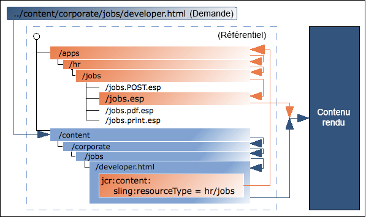

# Fondements techniques AEM {#aem-technical-foundations}

aem est une plate-forme robuste qui repose sur des technologies éprouvées, évolutives et flexibles. Ce document donne un aperçu détaillé des différentes parties qui composent l&#39;AEM et est conçu comme une annexe technique pour un développeur AEM à pile complète. Il ne s&#39;agit pas d&#39;un guide de prise en main. Si vous êtes novice dans AEM développement, veuillez consulter le [guide de développement de AEM Sites - WKND](develop-wknd-tutorial.md) en tant que première étape.

>[!TIP]
>
>Avant de se plonger dans les technologies de base de l&#39;AEM, l&#39;Adobe recommande de compléter le didacticiel [Getting Started Developing AEM Sites - WKND.](develop-wknd-tutorial.md)

## Fondamentaux {#fundamentals}

En tant que système gestion de contenu moderne, AEM s&#39;appuie sur les technologies web standard :

* Cycle request-response (XMLHttpRequest / XMLHttpResponse)
* HTML
* CSS
* JavaScript

Les couches de référentiel de contenu et de logique métier sous-jacentes sont créées à partir des technologies Java :

* JCR
* Sling
* les lots OSGi

## Référentiel de contenu Java {#java-content-repository}

La norme Java Content Repository (JCR), [JSR 283](https://docs.adobe.com/content/docs/en/spec/jcr/2.0/index.html), spécifie un moyen, indépendant du fournisseur et de l’implémentation, d’accéder au contenu d’un référentiel de contenu à un niveau granulaire et de manière bidirectionnelle. Le responsable des spécifications est détenu par Adobe Research (Suisse) AG.

Le package [JCR API 2.0](https://docs.adobe.com/docs/en/spec/javax.jcr/javadocs/jcr-2.0/index.html) , `javax.jcr.*` est utilisé pour l’accès direct et la manipulation du contenu du référentiel.

aem est basé sur un JCR.

## Apache Jackrabbit Oak {#jackrabbit-oak}

[Apache Jackrabbit Oak](https://jackrabbit.apache.org/oak/) est une mise en oeuvre d&#39;un référentiel de contenu hiérarchisé évolutif et hautement performant qui sert de base à des sites Web modernes de classe mondiale et à d&#39;autres applications de contenu exigeantes, conformes à la norme JCR.

Le chêne Jackrabbit (également appelé &quot;chêne&quot;), est la mise en oeuvre de la norme JCR sur laquelle l&#39;AEM est construite.

## Traitement de requête Sling {#sling-request-processing}

AEM repose sur [Sling ](https://sling.apache.org/site/index.html), un framework d’application web basé sur des principes REST. Il facilite le développement d’applications orientées contenu. Sling utilise un référentiel JCR, comme Apache Jackrabbit Oak, comme son magasin de données. The Apache Software Foundation a contribué au développement de Sling. Plus d’informations sont disponibles sur Apache.

### Introduction à Sling {#introduction-to-sling}

Avec Sling, le type de contenu à diffuser n’est pas la première considération en matière de traitement. Il s’agit plutôt de savoir si l’URL se résout en un objet de contenu pour lequel un script peut ensuite être identifié afin d’effectuer le rendu. Les auteurs de contenu web bénéficient ainsi d’un excellent support pour créer des pages facilement personnalisables selon leurs besoins.

Les avantages liés à cette flexibilité sont évidents dans les applications comportant un vaste éventail d’éléments de contenu différents ou dans les cas où des pages facilement personnalisables sont nécessaires. En particulier, lors de la mise en oeuvre d&#39;un système de Gestion de contenu Web tel que AEM.

See [Discover Sling in 15 minutes](https://sling.apache.org/documentation/getting-started/discover-sling-in-15-minutes.html) for the first steps for developing with Sling.

Le schéma suivant explique la résolution du script sling : il montre comment passer de la requête HTTP au nœud de contenu, du nœud de contenu au type de ressource, du type de ressource au script, ainsi que les variables de script sont disponibles.


The following diagram explains all the hidden, but powerful, request parameters you can use when dealing with the `SlingPostServlet`, the default handler for all POST requests that gives you endless options for creating, modifying, deleting, copying and moving nodes in the repository.


### Sling est centré sur le contenu {#sling-is-content-centric}

Sling est *centré sur le contenu*. Cela signifie que le traitement est axé sur le contenu au moment où chaque requête (HTTP) est mappée avec le contenu sous la forme d’une ressource JCR (un nœud de référentiel) :

* La première cible est la ressource (nœud JCR) qui contient le contenu
* Deuxièmement, la représentation, ou script, est située à partir des propriétés de ressource en combinaison avec certaines parties de la requête (par exemple, sélecteurs et/ou l&#39;extension).

### Sling RESTful {#restful-sling}

En raison de sa philosophie axée sur le contenu, Sling met en oeuvre un serveur orienté REST et propose ainsi un nouveau concept dans les cadres d’applications Web. Les avantages sont les suivants :

* Très RESTful, pas seulement en surface ; les ressources et les représentations sont correctement modélisées dans le serveur.
* Supprime un ou plusieurs modèles de données
   * D&#39;autres structures de gestion de contenu peuvent nécessiter la structure d&#39;URL, des objets métier et un schéma de base de données pour accéder à une ressource.
   * En utilisant Sling, ceci est réduit à : URL = ressource = structure JCR

### Décomposition d’URL {#url-decomposition}

Dans Sling, le traitement est piloté par l’URL de la requête de l’utilisateur. C’est l’URL qui définit le contenu à afficher par les scripts appropriés. Pour ce faire, les informations sont extraites de l’URL.

Si nous analysons l’URL suivante :

```text
https://myhost/tools/spy.printable.a4.html/a/b?x=12
```

Nous pouvons la décomposer comme suit :

| protocol | host |  | content path | selector(s) | extension |  | suffix |  | param(s) |
|---|---|---|---|---|---|---|---|---|---|
| `https://` | `myhost` | `/` | `tools/spy` | `.printable.a4.` | `html` | `/` | `a/b` | `?` | `x=12` |

* **protocole** - HTTPS
* **hôte** - Domaine du site
* **chemin** de contenu - chemin spécifiant le contenu à rendre et utilisé en combinaison avec l’extension ; dans cet exemple, ils traduisent en `tools/spy.html`
* **sélecteur(s)** - utilisé pour d’autres méthodes de rendu du contenu ; dans cet exemple une version compatible avec les imprimantes au format A4
* **extension** - format de contenu ; spécifie également le script à utiliser pour le rendu
* **suffixe** - Peut être utilisé pour spécifier des informations supplémentaires
* **param(s)** - Tout paramètre requis pour le contenu dynamique

#### De l’URL au contenu et aux scripts {#from-url-to-content-and-scripts}

Selon les principes de la décomposition des URL :

* Le mappage utilise le chemin d’accès au contenu extrait de la requête pour localiser la ressource.
* Une fois la ressource appropriée localisée, le type de ressource sling est extrait et utilisé pour localiser le script à utiliser pour le rendu du contenu.

La figure suivante illustre le mécanisme utilisé, qui sera examiné plus en détail dans les sections suivantes.



With Sling, you specify which script renders a certain entity (by setting the `sling:resourceType` property in the JCR node). Ce mécanisme offre plus de liberté que celui selon lequel le script accède aux entités de données (comme le ferait une instruction SQL dans un script PHP) puisqu’une ressource peut avoir plusieurs rendus.

#### Mapping Requests to Resources {#mapping-requests-to-resources}

La requête est décomposée et les informations nécessaires sont extraites. Une recherche de la ressource demandée (nœud de contenu) est effectuée dans le référentiel :

* First Sling checks whether a node exists at the location specified in the request; e.g. `../content/corporate/jobs/developer.html`
* If no node is found, the extension is dropped and the search repeated; e.g. `../content/corporate/jobs/developer`
* Si aucun noeud n’est trouvé, Sling renvoie le code http 404 (introuvable).

Sling permet également à des éléments autres que des nœuds JCR d’être des ressources, mais il s’agit là d’une fonctionnalité avancée.

### Locating the Script {#locating-the-script}

Lorsque la ressource appropriée (nœud de contenu) est localisée, le **type de ressource sling** est extrait. C’est un chemin qui localise le script à utiliser pour le rendu du contenu.

The path specified by the `sling:resourceType` can be either:

* Absolu
* Relatif à un paramètre de configuration

>[!TIP]
>
>Les chemins relatifs sont recommandés par l’Adobe lorsqu’ils augmentent la portabilité.

Tous les scripts Sling sont stockés dans des sous-dossiers `/apps` (mutable, user scripts) ou `/libs` (immuable, system scripts), qui seront recherchés dans cet ordre.

Autres points à noter sont :

* When the method (GET, POST) is required, it will be specified in uppercase as according to the HTTP specification e.g. `jobs.POST.esp`
* Divers moteurs de script sont pris en charge, mais les scripts courants recommandés sont HTL et JavaScript.

The list of script engines supported by the given instance of AEM are listed on the Felix Management Console ( `http://<host>:<port>/system/console/slingscripting`).

Using the previous example, if the `sling:resourceType` is `hr/jobs` then for:

* Requêtes GET/HEAD et URL se terminant par `.html` (types de requête par défaut, format par défaut)
   * Le script sera `/apps/hr/jobs/jobs.esp`; la dernière section du formulaire `sling:resourceType` forme le nom de fichier.
* Requêtes de POST (tous les types de requête, à l’exclusion des GET/HEAD, le nom de la méthode doit être en majuscules)
   * Le POST sera utilisé dans le nom du script.
   * Le script sera `/apps/hr/jobs/jobs.POST.esp`écrit.
* URL dans d’autres formats, sans se terminer par `.html`
   * Par exemple, `../content/corporate/jobs/developer.pdf`
   * Le script sera `/apps/hr/jobs/jobs.pdf.esp`; le suffixe est ajouté au nom du script.
* URL avec sélecteurs
   * Les sélecteurs peuvent être utilisés pour afficher le même contenu dans un autre format. Par exemple une version imprimable, un flux rss ou un résumé.
   * Si nous regardons une version adaptée à l&#39;imprimante dans laquelle le sélecteur peut être `print`; comme dans `../content/corporate/jobs/developer.print.html`
   * Le script sera `/apps/hr/jobs/jobs.print.esp`; le sélecteur est ajouté au nom du script.
* If no `sling:resourceType` has been defined then:
   * The content path will be used to search for an appropriate script (if the path based `ResourceTypeProvider` is active).
   * For example, the script for `../content/corporate/jobs/developer.html` would generate a search in `/apps/content/corporate/jobs/`.
   * Le type de noeud Principal sera utilisé.
* Si aucun script n’est trouvé, le script par défaut est utilisé.
   * The default rendition is currently supported as plain text (`.txt`), HTML (`.html`) and JSON (`.json`), all of which will list the node&#39;s properties (suitably formatted). The default rendition for the extension `.res`, or requests without a request extension, is to spool the resource (where possible).
* Pour la gestion des erreurs http (codes 403 ou 404), Sling recherche un script dans :
   * Emplacement `/apps/sling/servlet/errorhandler` des scripts personnalisés
   * Ou l’emplacement du script standard `/libs/sling/servlet/errorhandler/404.jsp`

Si plusieurs scripts s’appliquent pour une requête donnée, celui avec la meilleure correspondance est sélectionné. Plus une correspondance est spécifique, mieux c’est. En d’autres termes, plus le sélecteur correspond meilleur est le résultat, quelle que soit l’extension de requête ou la correspondance de nom de méthode.

Par exemple, envisagez une demande d’accès à la ressource.

* `/content/corporate/jobs/developer.print.a4.html`

de type

* `sling:resourceType="hr/jobs"`

En supposant que les scripts suivants sont présents dans l’emplacement correct :

1. `GET.esp`
1. `jobs.esp`
1. `html.esp`
1. `print.esp`
1. `print.html.esp`
1. `print/a4.esp`
1. `print/a4/html.esp`
1. `print/a4.html.esp`

L’ordre de préférence serait (8) - (7) - (6) - (5) - (4) - (3) - (2) - (1).

En plus des types de ressources (principalement définis par la propriété `sling:resourceType`), il existe également le super type de ressource. This is generally indicated by the `sling:resourceSuperType` property. Ces super types sont aussi pris en compte lors de la recherche d’un script. Les super types de ressources présentent l’avantage de former une hiérarchie de ressources où le type de ressource par défaut `sling/servlet/default` (utilisé par les servlets par défaut) est effectivement la racine.

Le super type de ressource d’une ressource peut être défini de deux manières :

* by the `sling:resourceSuperType` property of the resource.
* by the `sling:resourceSuperType` property of the node to which the `sling:resourceType` points.

Par exemple :

* `/`
   * `a`
   * `b`
      * `sling:resourceSuperType = a`
   * `c`
      * `sling:resourceSuperType = b`
   * `x`
      * `sling:resourceType = c`
   * `y`
      * `sling:resourceType = c`
      * `sling:resourceSuperType = a`

Hiérarchie de types de :

* `/x`
   * Is `[ c, b, a, <default>]`
* Lorsque `/y`
   * La hiérarchie est `[ c, a, <default>]`

This is because `/y` has the `sling:resourceSuperType` property whereas `/x` does not and therefore its supertype is taken from its resource type.

#### Sling Scripts Cannot be Called Directly {#sling-scripts-cannot-be-called-directly}

Dans Sling, les scripts ne peuvent pas être appelés directement car cela est contraire au strict concept d’un serveur REST. Sinon, vous mélangeriez les ressources et les représentations.

Si vous appelez la représentation (le script) directement, vous masquez la ressource dans le script, donc le framework (Sling) ne peut plus la détecter. Ainsi, vous perdez certaines fonctionnalités :

* Gestion automatique des méthodes http autres que GET, notamment :
   * les méthodes POST, PUT, DELETE qui sont gérées avec une implémentation par défaut de Sling
   * The `POST.jsp` script in your `sling:resourceType` location
* Votre architecture de code n&#39;est plus aussi propre ni aussi structurée qu&#39;elle devrait l&#39;être ; d&#39;importance primordiale pour le développement à grande échelle

### API Sling {#sling-api}

Il utilise le package de l’API Sling, les bibliothèques `org.apache.sling.*`de balises et les bibliothèques de balises.

### Référencement d’éléments existants avec sling:include {#referencing-existing-elements-using-sling-include}

En dernier lieu, il faut considérer la nécessité de référencer les éléments existants dans les scripts.

More complex scripts (aggregating scripts) might need to access multiple resources (for example navigation, sidebar, footer, elements of a list) and do so by including the *resource*.

Pour ce faire, vous pouvez utiliser la `sling:include("/<path>/<resource>")` commande. Cela inclura effectivement la définition de la ressource référencée.

## les lots OSGi {#osgi}

OSGi (Open Services Gateway Initiative) définit une architecture pour le développement et le déploiement d&#39;applications et de bibliothèques modulaires (elle est également connue sous le nom de Dynamic Module System for Java). Les conteneurs OSGi vous permettent de décomposer votre application en modules distincts (des fichiers jar contenant des méta-informations supplémentaires appelés « bundles » dans le jargon OSGi) et de gérer les interdépendances qui existent entre eux avec :

* Services mis en oeuvre dans le conteneur
* Un contrat entre le conteneur et votre demande

Ces services et contrats forment une architecture permettant à des éléments distincts de se détecter dynamiquement pour la collaboration.

Le framework OSGi offre ensuite le chargement/déchargement dynamique, la configuration et le contrôle de ces bundles, sans nécessiter de redémarrage.

>[!NOTE]
>
>Full information on OSGi technology can be found at the [OSGi website](https://www.osgi.org).
>
>En particulier, la page Basic Education (formation de base) contient un ensemble de présentations et de tutoriels.

Cette architecture vous permet d’étendre Sling en lui ajoutant des modules spécifiques aux applications. Sling, et donc AEM, utilise l&#39;implémentation [Apache Felix](https://felix.apache.org/) d&#39;OSGi. Ce sont deux ensembles de bundles OSGi exécutés dans un framework OSGi.

Cette extension permet d’appliquer les actions suivantes à l’un des modules dans votre installation :

* Installation de la version
* Début
* Arrêter
* Mettre à jour
* Désinstaller
* Voir l&#39;état actuel
* Accédez à des informations plus détaillées (par exemple, nom symbolique, version, emplacement, etc.) sur les lots spécifiques.

Voir [Configuration d’OSGi pour AEM en tant que Cloud Service](/help/implementing/deploying/configuring-osgi.md) pour plus d’informations.

## Structure dans le référentiel {#structure-within-the-repository}

La liste suivante donne un aperçu de la structure que vous verrez dans le référentiel.

* `/apps` - Application liée ; comprend des définitions de composants spécifiques à votre site Web. Les composants que vous développez peuvent être basés sur les composants prêts à l’emploi disponibles dans `/libs/core/wcm/components`.
* `/content` - Contenu créé pour votre site Web.
* `/etc`
* `/home` - Informations sur l&#39;utilisateur et le groupe.
* `/libs` - Bibliothèques et définitions qui appartiennent au coeur de l&#39;AEM. Les sous-dossiers dans `/libs` représentent les AEM fonctionnalités prêtes à l’emploi. Le contenu de `/libs` ne peut pas être modifié. Les fonctionnalités spécifiques à votre site Web doivent être créées sous `/apps`.
* `/tmp` - Espace de travail temporaire.
* `/var` - Les fichiers qui changent et sont mis à jour par le système ; comme les journaux d&#39;audit, les statistiques, la gestion des événements.

>[!CAUTION]
>
>Les modifications apportées à cette structure, ou aux fichiers qu’elle contient, doivent l’être prudemment. Assurez-vous de bien comprendre les implications de tout changement que vous apportez.
>
>Vous ne devez rien modifier dans le chemin `/libs`. For configuration and other changes copy the item from `/libs` to `/apps` and make any changes within `/apps`.
