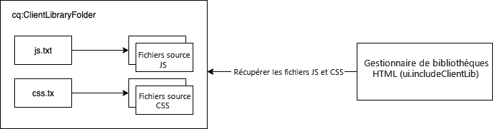

# Utilisation des bibliothèques côté client dans AEM as a Cloud Service {#using-client-side-libraries}

Les expériences digitales reposent largement sur un traitement côté client piloté par un code JavaScript et CSS complexe. Les bibliothèques côté client (clientlibs) vous permettent d’organiser et de stocker de manière centrale ces bibliothèques côté client dans le référentiel. Associée au [processus de création front-end dans l’archétype de projet AEM](https://experienceleague.adobe.com/docs/experience-manager-core-components/using/developing/archetype/uifrontend.html?lang=fr), la gestion de votre code front-end pour votre projet AEM devient simple.

Les avantages de l’utilisation de bibliothèques clientlibs dans AEM incluent les suivants :

* Le code côté client est stocké dans le référentiel comme tout autre code et contenu d’application.
* Les bibliothèques côté client dans AEM peuvent agréger tout le code CSS et JS dans un seul fichier.
* Exposer les bibliothèques côté client via un chemin accessible par le [Dispatcher](/help/implementing/dispatcher/disp-overview.md).
* Permet la réécriture des chemins d’accès pour les fichiers ou images référencés.

Les bibliothèques côté client sont la solution intégrée pour la diffusion de code CSS et JavaScript à partir d’AEM.

>[!TIP]
>
>Les développeurs front-end qui créent des projets CSS et JavaScript pour AEM doivent également se familiariser avec l’[archétype de projet AEM et son processus de création front-end automatisé](https://experienceleague.adobe.com/docs/experience-manager-core-components/using/developing/archetype/uifrontend.html?lang=fr).

## Que sont les bibliothèques côté client ? {#what-are-clientlibs}

Les sites requièrent du code JavaScript et CSS, ainsi que des ressources statiques telles que des icônes et des polices web, pour être traités côté client. Une bibliothèque cliente est un mécanisme d’AEM à référencer (par catégorie si nécessaire) et qui fournit ces ressources.

AEM collecte le CSS et code JavaScript du site dans un seul fichier, à un emplacement central, afin de s’assurer qu’une seule copie d’une ressource est incluse dans la sortie HTML. Cela optimise l’efficacité de la diffusion et permet à ces ressources d’être conservées de façon centralisée dans le référentiel par le biais d’un proxy, en assurant la sécurité de l’accès.

## Développement front-end pour AEM as a Cloud Service {#fed-for-aemaacs}

Tous les JavaScript, CSS et autres ressources front-end doivent être conservés dans le module [ui.frontend de l’archétype de projet AEM](https://experienceleague.adobe.com/docs/experience-manager-core-components/using/developing/archetype/uifrontend.html?lang=fr). La flexibilité de l’archétype vous permet d’utiliser les outils web modernes de votre choix pour créer et gérer ces ressources.

L’archétype peut ensuite compiler les ressources dans des fichiers CSS et JS uniques, en les incorporant automatiquement dans un `cq:clientLibraryFolder` dans le référentiel.

## Structure du dossier de bibliothèques côté client {#clientlib-folders}

Un dossier de bibliothèques côté client est un nœud de référentiel de type `cq:ClientLibraryFolder`. Sa définition au [format CND](https://jackrabbit.apache.org/node-type-notation.html) est :

```text
[cq:ClientLibraryFolder] > sling:Folder
  - dependencies (string) multiple
  - categories (string) multiple
  - embed (string) multiple
  - channels (string) multiple
```

* Les nœuds `cq:ClientLibraryFolder` peuvent être placés n’importe où dans la sous-arborescence `/apps` du référentiel.
* Utilisez la propriété `categories` du nœud pour identifier les catégories de bibliothèque auxquelles il appartient.

Chaque dossier `cq:ClientLibraryFolder` est rempli avec un jeu de fichiers JS et/ou CSS, ainsi que quelques fichiers annexes (voir ci-dessous). Les propriétés importantes du dossier `cq:ClientLibraryFolder` sont configurées comme suit :

* `allowProxy` : étant donné que toutes les bibliothèques clientes doivent être stockées sous `apps`, cette propriété permet d’accéder aux bibliothèques clientes par le biais d’un servlet proxy. Consultez la section [Rechercher un dossier de bibliothèques clientes et utiliser le servlet des bibliothèques clientes du proxy](#locating-a-client-library-folder-and-using-the-proxy-client-libraries-servlet) ci-dessous.
* `categories` : identifie les catégories dans lesquelles se trouve le jeu de fichiers JS et/ou CSS de ce dossier `cq:ClientLibraryFolder`. La propriété `categories` comportant plusieurs valeurs, elle permet à un dossier de bibliothèques d’appartenir à plusieurs catégories (voir ci-dessous pour savoir en quoi cela peut se révéler utile).

Si le dossier de bibliothèques clientes contient un ou plusieurs fichiers sources qui, à l’exécution, sont fusionnés en un seul fichier JS et/ou CSS. Le nom du fichier généré est le nom de nœud avec l’extension `.js` ou `.css`. Par exemple, le nœud de bibliothèque nommé `cq.jquery` donne le nom de fichier généré `cq.jquery.js` ou `cq.jquery.css`.

Les dossiers de bibliothèques clientes contiennent les éléments suivants :

* Les fichiers sources JS et/ou CSS 
* Ressources statiques qui prennent en charge les styles CSS, tels que les icônes, les polices web, etc.
* Un fichier `js.txt` et/ou un fichier `css.txt` qui identifie les fichiers sources à fusionner dans les fichiers JS et/ou CSS générés



## Création de dossiers de bibliothèque côté client {#creating-clientlib-folders}

Les bibliothèques clientes doivent être situées sous `/apps`. Cette règle permet en effet de mieux isoler le code du contenu et de la configuration.

Pour que les bibliothèques clientes situées sous `/apps` soient accessibles, un servlet proxy est utilisé. Les listes de contrôle d’accès (ACL) sont toujours appliquées sur le dossier de bibliothèques clientes, mais le servlet permet la lecture du contenu via `/etc.clientlibs/` si la propriété `allowProxy` est définie sur `true`.

1. Ouvrez CRXDE Lite dans un navigateur web (`https://<host>:<port>/crx/de`).
1. Sélectionnez le dossier `/apps` et cliquez sur **Créer > Créer un nœud**.
1. Attribuez un nom au dossier de bibliothèques, puis, dans la liste **Type**, sélectionnez `cq:ClientLibraryFolder`. Cliquez sur **OK**, puis sur **Enregistrer tout**.
1. Pour spécifier la ou les catégories auxquelles appartient la bibliothèque, sélectionnez le nœud `cq:ClientLibraryFolder`, ajoutez la propriété suivante, puis cliquez sur **Enregistrer tout** :
   * Nom : `categories`
   * Type : chaîne
   * Valeur : nom de la catégorie
   * Multi : sélectionné
1. Pour que les bibliothèques clientes soient accessibles par proxy sous `/etc.clientlibs`, sélectionnez le nœud `cq:ClientLibraryFolder`, ajoutez la propriété suivante, puis cliquez sur **Enregistrer tout** :
   * Nom : `allowProxy`
   * Type : booléen
   * Valeur : `true`
1. Si vous devez gérer des ressources statiques, créez un sous-dossier nommé `resources` sous le dossier de bibliothèques clientes.
   * Si vous stockez des ressources statiques ailleurs que sous le dossier `resources`, elles ne peuvent pas être référencées sur une instance de publication.
1. Ajoutez les fichiers sources dans le dossier de bibliothèques.
   * Cette opération est généralement effectuée par le processus de création front-end de l’[archétype de projet AEM](https://experienceleague.adobe.com/docs/experience-manager-core-components/using/developing/archetype/uifrontend.html?lang=fr).
   * Si vous le souhaitez, vous pouvez organiser les fichiers sources dans des sous-dossiers.
1. Sélectionnez le dossier de bibliothèques clientes et cliquez ensuite sur **Créer > Créer un fichier**.
1. Dans la zone du nom de fichier, saisissez l’un des noms suivants et cliquez ensuite sur OK :
   * **`js.txt` :** utilisez ce nom de fichier pour générer un fichier JavaScript.
   * **`css.txt` :** utilisez ce nom de fichier pour générer une feuille de style en cascade (CSS).
1. Ouvrez le fichier et saisissez le texte suivant pour identifier la racine du chemin d’accès des fichiers sources :
   * `#base=*[root]*`
   * Remplacez `[root]` par le chemin d’accès au dossier contenant les fichiers sources, par rapport au fichier TXT. Utilisez, par exemple, le texte suivant lorsque les fichiers sources se trouvent dans le même dossier que le fichier TXT :
      * `#base=.`
   * Le code suivant définit la racine en tant que dossier nommé mobile sous le nœud `cq:ClientLibraryFolder` :
      * `#base=mobile`
1. Sur les lignes situées sous `#base=[root]`, indiquez les chemins d’accès des fichiers sources par rapport à la racine. Placez chaque nom de fichier sur une ligne distincte.
1. Cliquez sur **Enregistrer tout**.

## Traitement des bibliothèques côté client {#serving-clientlibs}

Une fois votre dossier de bibliothèques clientes [configuré selon les besoins](#creating-clientlib-folders), vos bibliothèques clientes peuvent être demandées via proxy. Par exemple :

* Vous avez une bibliothèque cliente dans `/apps/myproject/clientlibs/foo`.
* Vous avez une image statique dans `/apps/myprojects/clientlibs/foo/resources/icon.png`.

La propriété `allowProxy` vous permet de demander :

* La bibliothèque cliente via `/etc.clientlibs/myprojects/clientlibs/foo.js`.
* L’image statique via `/etc.clientlibs/myprojects/clientlibs/foo/resources/icon.png`.

### Chargement des bibliothèques clientes via HTL {#loading-via-htl}

Une fois que vos bibliothèques clientes sont stockées et gérées dans leur dossier de bibliothèques clientes, il est possible d’y accéder via HTL.

Les bibliothèques clientes sont chargées à l’aide d’un modèle d’assistance fourni par AEM, accessible via `data-sly-use`. Des modèles d’assistance sont disponibles dans ce fichier, qui peut être appelé via `data-sly-call` :

Chaque modèle d’assistance exige une option `categories` pour référencer les bibliothèques clientes souhaitées. Cette option peut être un tableau de valeurs de chaîne ou une chaîne contenant une liste de valeurs séparées par des virgules.

Pour plus d’informations sur le chargement de bibliothèques clientes via HTL, [consultez la documentation HTL](https://experienceleague.adobe.com/docs/experience-manager-htl/using/getting-started/getting-started.html?lang=fr#loading-client-libraries).

<!--
### Setting Cache Timestamps {#setting-cache-timestamps}

This is possible. Still need detail.
-->

## Bibliothèques clientes dans l’instance de création et dans l’instance de publication {#clientlibs-author-publish}

La plupart des bibliothèques clientes sont requises sur l’instance de publication AEM. En d’autres termes, la plupart d’entre elles ont pour objectif de produire l’expérience de l’utilisateur final par rapport au contenu. Pour les bibliothèques clientes sur les instances de publication, [outils de création front-end](#fed-for-aemaacs) peuvent être utilisés et déployés via des dossiers de bibliothèques clientes [, comme décrit ci-dessus](#creating-clientlib-folders).

Cependant, il peut arriver que des bibliothèques clientes soient nécessaires pour personnaliser l’expérience de création. Par exemple, la personnalisation d’une boîte de dialogue peut nécessiter le déploiement de petits fragments de code CSS ou JS dans l’instance de création AEM.

### Gestion des bibliothèques clientes dans l’instance de création {#clientlibs-on-author}

Si vous devez utiliser des bibliothèques clientes dans l’instance de création, vous pouvez créer vos bibliothèques clientes sous `/apps` en utilisant les mêmes méthodes que pour la publication, mais créez-les directement sous `/apps/.../clientlibs/foo` au lieu de créer un projet entier pour les gérer.

Vous pouvez ensuite vous « rattacher » à l’instance JS de création en ajoutant vos bibliothèques clientes à une catégorie de bibliothèque cliente prête à l’emploi.

## Outils de débogage {#debugging-tools}

AEM s’accompagne de plusieurs outils pour déboguer et tester des dossiers de bibliothèques clientes.

### Détection de bibliothèques clientes {#discover-client-libraries}

Le composant `/libs/cq/granite/components/dumplibs/dumplibs` génère une page d’informations sur tous les dossiers de bibliothèques clientes du système. Le nœud `/libs/granite/ui/content/dumplibs` contient le composant comme type de ressource. Pour ouvrir la page, utilisez l’URL suivante (en changeant l’hôte et le port selon les besoins) :

`https://<host>:<port>/libs/granite/ui/content/dumplibs.test.html`

Les informations comprennent le chemin et le type de bibliothèque (CSS ou JS), ainsi que les valeurs des attributs de bibliothèque, tels que les catégories et les dépendances. Les tableaux suivants de la page affichent les bibliothèques dans chaque catégorie et canal.

### Affichage de la sortie générée {#see-generated-output}

Le composant `dumplibs` comprend un sélecteur de test qui affiche le code source généré pour les balises `ui:includeClientLib`. La page contient du code pour différentes combinaisons des attributs js, css et themed.

1. Appliquez l’une des méthodes suivantes pour ouvrir la page de sortie de test :
   * Sur la page `dumplibs.html`, cliquez sur le lien sous **Cliquez ici pour les résultats du test**.
   * Ouvrez l’URL suivante dans votre navigateur web (utilisez un hôte et un port différents, le cas échéant) :
      * `http://<host>:<port>/libs/granite/ui/content/dumplibs.html`
   * La page par défaut affiche le résultat pour les balises ne comportant aucune valeur pour l’attribut categories.
1. Pour afficher la sortie d’une catégorie, saisissez la valeur de la propriété `categories` de la bibliothèque cliente, puis cliquez sur **Envoyer la requête**.

## Autres fonctionnalités du dossier de bibliothèque cliente {#additional-features}

Plusieurs autres fonctionnalités sont prises en charge par les dossiers de bibliothèques clientes dans AEM. Toutefois, ces fonctionnalités ne sont pas requises dans AEM as a Cloud Service et, par conséquent, leur utilisation est découragée. À des fins d’exhaustivité, elles sont répertoriées ici.

>[!WARNING]
>
>Ces fonctionnalités supplémentaires des dossiers de bibliothèque cliente ne sont pas requises dans AEM as a Cloud Service et leur utilisation est donc déconseillée. À des fins d’exhaustivité, elles sont répertoriées ici.

### Gestionnaire de bibliothèque HTML Adobe Granite {#html-library-manager}

D’autres paramètres de bibliothèque cliente peuvent être contrôlés par le biais du panneau du **Gestionnaire de bibliothèque HTML Adobe Granite** de la console système à l’adresse `https://<host>:<port>/system/console/configMgr`.

### Propriétés de dossier supplémentaires {#additional-folder-properties}

Les autres propriétés de dossier permettent entre autres de contrôler les dépendances et les incorporations, mais ne sont généralement plus nécessaires et leur utilisation est déconseillée :

* `dependencies` : il s’agit d’une liste d’autres catégories de bibliothèques clientes dont dépend ce dossier de catégories. Par exemple, pour deux nœuds `cq:ClientLibraryFolder`, `F` et `G`, si un fichier de `F` nécessite un autre fichier de `G` pour fonctionner correctement, au moins l’une des propriétés `categories` de `G` doit figurer parmi les propriétés `dependencies` de `F`.
* `embed` : utilisé pour incorporer du code d’autres bibliothèques. Si le nœud `F` incorpore les nœuds `G` et `H`, le code HTML qui en résulte est une concentration du contenu des nœuds `G` et `H`.

### Liaison vers des dépendances {#linking-to-dependencies}

Lorsque le code de votre dossier de bibliothèques clientes fait référence à d’autres bibliothèques, identifiez ces dernières en tant que dépendances. La balise `ui:includeClientLib` qui fait référence à votre dossier de bibliothèques clientes fait en sorte que le code HTML contienne un lien vers le fichier de bibliothèque généré, ainsi que les dépendances.

Les dépendances doivent être un autre nœud `cq:ClientLibraryFolder`. Pour identifier les dépendances, ajoutez une propriété à votre nœud `cq:ClientLibraryFolder` avec les attributs suivants :

* **Nom :** dependencies
* **Type :** chaîne[]
* **Values :** valeur de la propriété categories du nœud cq:ClientLibraryFolder dont dépend le dossier de bibliothèques actif.

Par exemple, `/etc/clientlibs/myclientlibs/publicmain` comporte une dépendance sur la bibliothèque `cq.jquery`. La page qui fait référence à la bibliothèque cliente principale génère un fichier HTML qui comprend le code suivant :

```xml
<script src="/etc/clientlibs/foundation/cq.jquery.js" type="text/javascript">
<script src="/etc/clientlibs/mylibs/publicmain.js" type="text/javascript">
```

### Incorporation de code d’autres bibliothèques {#embedding-code-from-other-libraries}

Vous pouvez incorporer du code d’une bibliothèque cliente dans une autre bibliothèque cliente. Au moment de l’exécution, les fichiers JS et CSS générés de la bibliothèque d’intégration incluent le code de la bibliothèque incorporée.

L’incorporation de code se révèle utile pour permettre l’accès aux bibliothèques stockées dans des zones sécurisées du référentiel.

#### Dossiers de bibliothèques clientes spécifiques à une application {#app-specific-client-library-folders}

Il est conseillé de conserver tous les fichiers associés à une application dans leur dossier d’application sous `/apps`. Il est également recommandé d’empêcher les internautes d’accéder au dossier `/apps`. Pour répondre à ces deux exigences, créez sous `/etc` un dossier de bibliothèques clientes qui incorpore la bibliothèque cliente qui est située sous `/apps`.

Utilisez la propriété categories pour identifier le dossier de bibliothèque cliente à incorporer. Pour incorporer la bibliothèque, ajoutez une propriété au nœud `cq:ClientLibraryFolder` d’intégration à l’aide des attributs de propriété suivants :

* **Nom :** embed
* **Type :** chaîne[]
* **Valeur :** valeur de la propriété categories du nœud `cq:ClientLibraryFolder` à incorporer.

#### Utilisation de l’incorporation pour réduire les requêtes {#using-embedding-to-minimize-requests}

Dans certains cas, il se peut que le code HTML final généré pour une page standard par votre instance de publication comporte un nombre relativement important d’éléments `<script>`.

Dans ce cas, il peut être utile de combiner tout le code de bibliothèque cliente requis dans un seul fichier afin de réduire le nombre de requêtes aller-retour lors du chargement de la page. Pour ce faire, vous pouvez incorporer (`embed`) les bibliothèques requises dans la bibliothèque cliente spécifique à l’application à l’aide de la propriété du nœud `cq:ClientLibraryFolder`.

#### Chemins d’accès dans les fichiers CSS {#paths-in-css-files}

Lorsque vous incorporez des fichiers CSS, le code CSS généré utilise des chemins d’accès aux ressources qui sont relatifs à la bibliothèque d’intégration. Par exemple, la bibliothèque publiquement accessible `/etc/client/libraries/myclientlibs/publicmain` incorpore la bibliothèque cliente `/apps/myapp/clientlib` :

Le fichier `main.css` contient le style suivant :

```javascript
body {
  padding: 0;
  margin: 0;
  background: url(images/bg-full.jpg) no-repeat center top;
  width: 100%;
}
```

Le fichier CSS généré par le nœud `publicmain` contient le style suivant, en utilisant l’URL de l’image d’origine :

```javascript
body {
  padding: 0;
  margin: 0;
  background: url(../../../apps/myapp/clientlib/styles/images/bg-full.jpg) no-repeat center top;
  width: 100%;
}
```

#### Reportez-vous à la section Fichiers incorporés dans une sortie HTML {#see-embedded-files}

Pour remonter à l’origine du code incorporé, ou vous assurer que les bibliothèques clientes incorporées produisent les résultats escomptés, vous pouvez afficher les noms des fichiers incorporés au moment de l’exécution. Pour afficher les noms de fichiers, ajoutez le paramètre `debugClientLibs=true` à l’URL de votre page web. La bibliothèque générée contient des instructions `@import` au lieu du code incorporé.

Dans l’exemple de la section [Incorporation de code d’autres bibliothèques](#embedding-code-from-other-libraries), le dossier de bibliothèques clientes `/etc/client/libraries/myclientlibs/publicmain` intègre le dossier `/apps/myapp/clientlib`. L’ajout du paramètre à la page web génère le lien suivant dans le code source de la page web :

```xml
<link rel="stylesheet" href="/etc/clientlibs/mycientlibs/publicmain.css">
```

L’ouverture du fichier `publicmain.css` fait apparaître le code suivant :

```javascript
@import url("/apps/myapp/clientlib/styles/main.css");
```

1. Dans la barre d’adresse de votre navigateur web, ajoutez le texte suivant à l’URL de votre code HTML :
   * `?debugClientLibs=true`
1. Au chargement de la page, affichez la source de la page.
1. Cliquez sur le lien fourni comme href de l’élément de lien pour ouvrir le fichier et afficher le code source.

### Utilisation de préprocesseurs {#using-preprocessors}

AEM autorise les préprocesseurs enfichables et prend en charge [YUI Compressor](https://github.com/yui/yuicompressor#yui-compressor---the-yahoo-javascript-and-css-compressor) pour CSS et JavaScript, ainsi que [Google Closure Compiler (GCC)](https://developers.google.com/closure/compiler?hl=fr) pour JavaScript avec YUI défini comme préprocesseur par défaut d’AEM.

Les préprocesseurs enfichables permettent une utilisation flexible, notamment :

* La définition de ScriptProcessors peut traiter des sources de script.
* Les processeurs peuvent être configurés avec des options.
* Les processeurs peuvent être utilisés pour la minification, mais également pour les cas non minimisés.
* La bibliothèque cliente peut définir le processeur à utiliser.

>[!NOTE]
>
>Par défaut, AEM utilise le compresseur GCC pour réduire Javascript et pour transmettre le code à `ECMASCRIPT_2018`.

>[!CAUTION]
>
>Ne placez pas de bibliothèque minimisée dans une bibliothèque cliente. Fournissez plutôt la bibliothèque brute et, si une minification est requise, utilisez les options des préprocesseurs.

#### Utilisation {#usage}

Vous pouvez choisir de configurer les préprocesseurs par bibliothèque cliente ou à l’échelle du système.

* Ajoutez les propriétés à plusieurs valeurs `cssProcessor` et `jsProcessor` sur le nœud clientlibrary (bibliothèque cliente).

La définition de la configuration système par défaut via la configuration OSGi **Gestionnaire de bibliothèques HTML** n’est pas prise en charge. Elle s’appliquera uniquement au SDK local et non aux exécutions de pipeline full stack.

#### Format et exemples {#format-and-examples}

##### Format {#format}

```javascript
config:= mode ":" processorName options*;
mode:= "default" | "min";
processorName := "none" | <name>;
options := ";" option;
option := name "=" value;
```

##### YUI Compressor pour la minification CSS et GCC pour JS {#yui-compressor-for-css-minification-and-gcc-for-js}

```javascript
cssProcessor: ["default:none", "min:yui"]
jsProcessor: ["default:none", "min:gcc;compilationLevel=advanced"]
```

##### Typescript pour le prétraitement, puis GCC pour la minification et l’obfuscation {#typescript-to-preprocess-and-then-gcc-to-minify-and-obfuscate}

```javascript
jsProcessor: [
   "default:typescript",
   "min:typescript",
   "min:gcc;obfuscate=true"
]
```

##### Options GCC supplémentaires {#additional-gcc-options}

```javascript
failOnWarning (defaults to "false")
languageIn (defaults to "ECMASCRIPT5")
languageOut (defaults to "ECMASCRIPT_2018" as of release 21994, was previously "ECMASCRIPT5" )
compilationLevel (defaults to "simple") (can be "whitespace", "simple", "advanced")
```

Pour plus d’informations sur les options GCC, consultez la [documentation de GCC](https://developers.google.com/closure/compiler/docs/compilation_levels).

#### Définition de l’outil de minification par défaut du système {#set-system-default-minifier}

La définition du minificateur système par défaut n’est pas prise en charge dans AEM as a Cloud Service.
