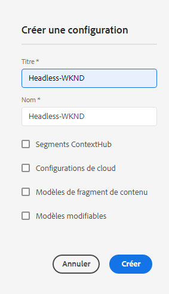
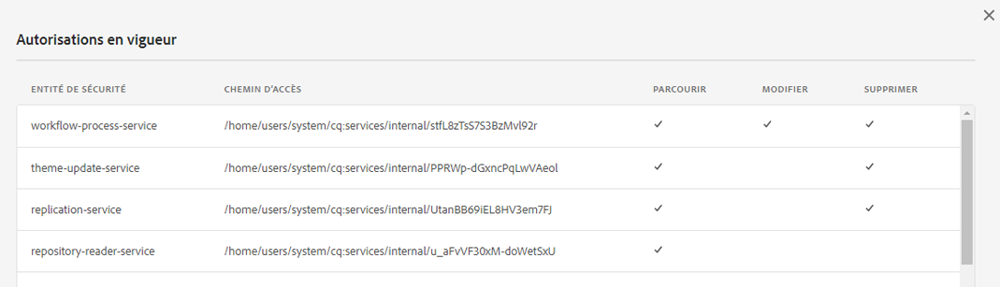
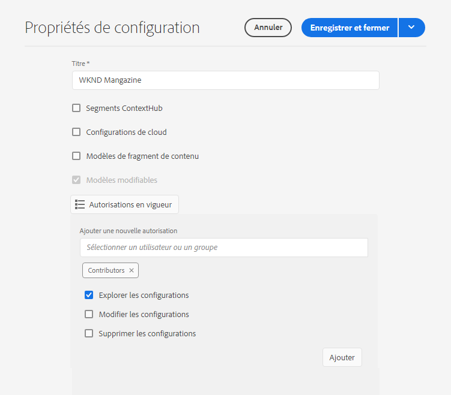

# Configurations et explorateur de configurations {#configuration-browser}

Les configurations Adobe Experience Manager (AEM) permettent de gérer les paramètres dans AEM et servent d’espaces de travail.

## Qu’est-ce qu’une configuration ?  {#what-is-a-configuration}

Une configuration peut être considérée sous deux angles différents.

* [Un administrateur](#configurations-administrator) utilise des configurations comme espaces de travail dans AEM afin de définir et de gérer des groupes de paramètres.
* [Un développeur](#configurations-developer) utilise le mécanisme de configuration sous-jacent qui implémente des configurations pour conserver et rechercher des paramètres dans AEM.

En résumé, du point de vue d’un administrateur, les configurations sont la manière dont vous créez des espaces de travail pour gérer les paramètres dans AEM, tandis que le développeur doit comprendre comment AEM utilise et gère ces configurations dans le référentiel.

Quelle que soit votre perspective, les configurations répondent à deux objectifs principaux dans AEM :

* Les configurations activent certaines fonctionnalités pour certains groupes d’utilisateurs.
* Les configurations définissent les droits d’accès pour ces fonctionnalités.

## Configurations en tant qu’administrateur {#configurations-administrator}

Les équipes d’administration et de création AEM peuvent considérer les configurations comme des espaces de travail. Ces espaces de travail peuvent être utilisés pour rassembler des groupes de paramètres et leur contenu associé à des fins d’organisation en implémentant des droits d’accès pour ces fonctionnalités.

Des configurations peuvent être créées pour de nombreuses fonctionnalités différentes dans AEM.

* [Segments Context Hub](/help/sites-cloud/authoring/personalization/contexthub-segmentation.md)
* [Modèles de fragment de contenu](/help/sites-cloud/administering/content-fragments/managing-content-fragment-models.md)
* [Modèles modifiables](/help/sites-cloud/authoring/page-editor/templates.md)
* diverses configurations de cloud

### Exemple {#administrator-example}

Par exemple, un administrateur ou une administratrice peut créer deux configurations pour les modèles modifiables.

* WKND-General
* WKND-Magazine

L’administrateur peut alors créer des modèles de page généraux à l’aide de la configuration WKND-General, puis des modèles spécifiques au magazine sous WKND-Magazine.

L’administrateur peut alors associer le WKND-General à tout le contenu du site WKND. Cependant, la configuration WKND-Magazine ne serait associée qu’au site du magazine.

En procédant comme suit :

* Lorsqu’un créateur ou une créatrice de contenu crée une nouvelle page pour le magazine, il ou elle peut choisir entre des modèles généraux (WKND-General) et des modèles de magazine (WKND-Magazine).
* Lorsqu’un créateur ou une créatrice de contenu crée une nouvelle page pour une autre partie du site qui n’est pas le magazine, il ou elle peut uniquement choisir parmi les modèles généraux (WKND-General).

Des configurations similaires sont possibles non seulement pour les modèles modifiables, mais également pour les configurations de cloud, les segments ContextHub et les modèles de fragments de contenu.

### Utilisation de l’explorateur de configurations {#using-configuration-browser}

L’explorateur de configurations permet à un administrateur de créer, gérer et configurer facilement des droits d’accès aux configurations dans AEM.

>[!NOTE]
>
>Il n’est possible de créer des configurations à l’aide de l’explorateur de configurations que si votre utilisateur dispose de droits `admin`. Ces droits d’`admin` sont également requis pour attribuer des droits d’accès à la configuration ou pour modifier une configuration d’une autre manière.

#### Création d’une configuration {#creating-a-configuration}

Il est simple de créer une configuration dans AEM à l’aide de l’explorateur de configurations.

1. Connectez-vous à AEM as a Cloud Service et, dans le menu principal, sélectionnez **Outils** > **Général** > **Explorateur de configurations**.
1. Sélectionnez **Créer**.
1. Indiquez un **Titre** et un **Nom** pour votre configuration.

   

   * Le **Titre** doit être descriptif.
   * Le **nom** deviendra celui du nœud dans le référentiel.
      * Il sera généré automatiquement en fonction du titre et ajusté selon les [conventions de dénomination AEM](naming-conventions.md).
      * Il peut être adapté si nécessaire.
1. Vérifiez le type de configuration que vous souhaitez autoriser.
   * [Segments Context Hub](/help/sites-cloud/authoring/personalization/contexthub-segmentation.md)
   * [Modèles de fragment de contenu](/help/sites-cloud/administering/content-fragments/managing-content-fragment-models.md)
   * [Modèles modifiables](/help/sites-cloud/authoring/page-editor/templates.md)
   * diverses configurations de cloud
1. Sélectionnez **Créer**.

>[!TIP]
>
>Les configurations peuvent être imbriquées.

#### Modification des configurations et de leurs droits d’accès {#access-rights}

Si vous considérez les configurations comme des espaces de travail, les droits d’accès peuvent être définis sur ces configurations afin de définir qui peut ou non accéder à ces espaces de travail.

1. Connectez-vous à AEM as a Cloud Service et dans le menu principal, sélectionnez **Outils** -> **Général** -> **Explorateur de configurations**.
1. Sélectionnez la configuration à modifier, puis sélectionnez **Propriétés** dans la barre d’outils.
1. Sélectionnez les fonctionnalités supplémentaires que vous souhaitez ajouter à la configuration.

   >[!NOTE]
   >
   >Il n’est pas possible de désélectionner une fonction une fois la configuration créée.

1. Utilisez le bouton **Autorisations en vigueur** pour afficher une matrice des rôles et les autorisations actuellement accordées aux configurations.
   
1. Pour attribuer de nouvelles autorisations, saisissez le nom de l’utilisateur ou du groupe dans le champ **Sélectionner un utilisateur ou un groupe** de la section **Ajouter de nouvelles autorisations**.
   * Le champ **Sélectionner un utilisateur ou un groupe** peut être renseigné par saisie semi-automatique en fonction des utilisateurs et des rôles existants.
1. Sélectionnez l’utilisateur ou le rôle approprié dans les résultats de saisie semi-automatique.
   * Vous pouvez sélectionner plusieurs utilisateurs ou rôles.
1. Vérifiez les options d’accès qu’un ou plusieurs utilisateurs ou rôles sélectionnés doivent avoir et cliquez sur **Ajouter**.
   
1. Répétez les étapes pour sélectionner des utilisateurs, des utilisatrices ou des rôles et attribuer des droits d’accès supplémentaires si nécessaire.
1. Sélectionnez **Enregistrer et fermer** lorsque vous avez terminé.

## Configurations en tant que développeur {#configurations-developer}

En tant que développeur, il est important de savoir comment AEM as a Cloud Service fonctionne avec les configurations et traite la résolution de configurations.

### Séparation de la configuration et du contenu {#separation-of-config-and-content}

Bien que l’[administrateur et les utilisateurs puissent considérer les configurations comme des espaces de travail](#configurations-administrator) pour gérer différents paramètres et contenus, il est important de comprendre que les configurations et le contenu sont stockés et gérés séparément par AEM dans le référentiel.

* `/content` abrite tout le contenu.
* `/conf` abrite l’ensemble de la configuration.

Le contenu fait référence à sa configuration associée au moyen d’une propriété `cq:conf`. AEM effectue une recherche en fonction du contenu et de sa propriété `cq:conf` contextuelle pour trouver la configuration appropriée.

### Exemple {#developer-example}

Dans cet exemple, supposons que vous ayez du code d’application concernant les paramètres de la gestion des actifs numériques.

```java
Conf conf = resource.adaptTo(Conf.class);
ValueMap imageServerSettings = conf.getItem("dam/imageserver");
String bgkcolor = imageServerSettings.get("bgkcolor", "FFFFFF");
```

Le point de départ de toute recherche de configuration est une ressource de contenu quelque part sous `/content`. Il peut s’agir d’une page, d’un composant au sein d’une page, d’une ressource ou d’un dossier de la gestion des ressources numériques. Dans ce contexte, c’est le contenu réel pour lequel nous recherchons la configuration appropriée qui s’applique.

Maintenant, avec l’objet `Conf`, nous pouvons récupérer l’élément de configuration qui nous intéresse. Dans ce cas, il s’agit de `dam/imageserver`, qui est une collection de paramètres associés au `imageserver`. L’appel `getItem` renvoie une `ValueMap`. Vous lisez ensuite une propriété de chaîne `bgkcolor` et fournissez une valeur par défaut de « FFFFFF » au cas où la propriété (ou l’élément de configuration complet) ne serait pas présent.

Examinons maintenant le contenu JCR correspondant :

```text
/content/dam/wknd
    + jcr:content
      - cq:conf = "/conf/wknd"
    + image.png [dam:Asset]

/conf/wknd
    + settings
      + dam
        + imageserver [cq:Page]
          + jcr:content
            - bgkcolor = "FF0000"
```

Dans cet exemple, nous supposons qu’il existe un dossier de la gestion des ressources numériques spécifique à WKND et une configuration correspondante. En commençant par cette `/content/dam/wknd` de dossier, vous pouvez voir qu’il existe une propriété de chaîne nommée `cq:conf` qui fait référence à la configuration qui s’applique à la sous-arborescence. La propriété est généralement définie sur le `jcr:content` d’une page ou d’un dossier de ressources. Ces liens `conf` sont explicites. Il est donc facile de les suivre en regardant simplement le contenu dans CRXDE.

À l’intérieur de `/conf`, suivez la référence et vérifiez qu’il existe un nœud `/conf/wknd`. Il s’agit d’une configuration. Sa recherche est transparente par rapport au code de l’application. L’exemple de code n’a jamais de référence dédiée. Il est masqué derrière l’objet `Conf`. La configuration qui s’applique est entièrement contrôlée par le contenu JCR.

Vous constatez que la configuration contient un nœud de `settings` à nom fixe qui contient les éléments réels, y compris les `dam/imageserver` dont vous avez besoin dans ce cas. Cet élément peut être considéré comme un « document de paramètres » et est généralement représenté par une `cq:Page` avec un `jcr:content` contenant le contenu réel.

Enfin, vous voyez la `bgkcolor` de propriété dont cet exemple de code a besoin. La `ValueMap` que nous récupérons dans `getItem` repose sur le nœud `jcr:content` de la page.

### Résolution de la configuration {#configuration-resolution}

L’exemple de base ci-dessus montrait une configuration unique. Mais dans de nombreux cas, on a besoin de différentes configurations, comme une configuration globale par défaut, une autre pour chaque marque et peut-être une configuration spécifique pour les sous-projets.

Pour prendre en charge cette recherche de configuration, AEM dispose d’un mécanisme d’héritage et de secours dans l’ordre de préférence suivant :

1. `/conf/<siteconfig>/<parentconfig>/<myconfig>`
   * Configuration spécifique référencée à partir de `cq:conf` quelque part dans `/content`
   * La hiérarchie est arbitraire et peut être conçue tout comme la structure de votre site. Ce n’est pas au code de l’application de le savoir
   * Modifiable au moment de l’exécution par les utilisateurs disposant de privilèges de configuration
1. `/conf/<siteconfig>/<parentconfig>`
   * Parcourir les parents pour les configurations de repli
   * Modifiable au moment de l’exécution par les utilisateurs disposant de privilèges de configuration
1. `/conf/<siteconfig>`
   * Parcourir les parents pour les configurations de repli
   * Modifiable au moment de l’exécution par les utilisateurs disposant de privilèges de configuration
1. `/conf/global`
   * Paramètres globaux du système
   * Valeurs par défaut globales pour votre installation
   * Défini par un rôle `admin`
   * Modifiable au moment de l’exécution par les utilisateurs disposant de privilèges de configuration
1. `/apps`
   * Valeurs par défaut de l’application
   * Corrigé par le déploiement des applications
   * Lecture seule au moment de l’exécution
1. `/libs`
   * Paramètres par défaut du produit AEM
   * Uniquement modifiable par Adobe, accès au projet non autorisé
   * Corrigé par le déploiement des applications
   * Lecture seule au moment de l’exécution

### Utilisation des configurations {#using-configurations}

Les configurations dans AEM reposent sur les configurations basées sur le contexte Sling. Les lots Sling fournissent une API de service qui peut être utilisée pour obtenir des configurations basées sur le contexte. Les configurations basées sur le contexte sont des configurations liées à une ressource de contenu ou à une arborescence de ressources comme [décrit dans l’exemple précédent](#developer-example).

Pour plus d’informations sur les configurations contextuelles, des exemples et leur utilisation, consultez la [documentation Sling](https://sling.apache.org/documentation/bundles/context-aware-configuration/context-aware-configuration.html).

### Console Web ConfMgr {#confmgr-web-console}

À des fins de débogage et de test, une console Web **ConfMgr** dans `https://<host>:<port>/system/console/conf` peut afficher des configurations pour un chemin/élément donné.


Indiquez simplement :

* **Content Path** (Chemin d’accès au contenu)
* **Item** (Élément)
* **User** (Utilisateur)

Cliquez sur **Résoudre** afin de voir quelles configurations sont résolues et d’obtenir des exemples de code qui permettent de résoudre ces configurations.

### Console Web de configuration basée sur le contexte {#context-aware-web-console}

À des fins de débogage et de test, une console Web de **configuration basée sur le contexte** dans `https://<host>:<port>/system/console/slingcaconfig` permet d’interroger des configurations basées sur le contexte dans le référentiel et d’afficher leurs propriétés.


Indiquez simplement :

* **Content Path** (Chemin d’accès au contenu)
* **Config Name** (Nom de configuration)

Cliquez sur **Résoudre** afin de récupérer les chemins d’accès au contexte et les propriétés associés pour la configuration sélectionnée.
