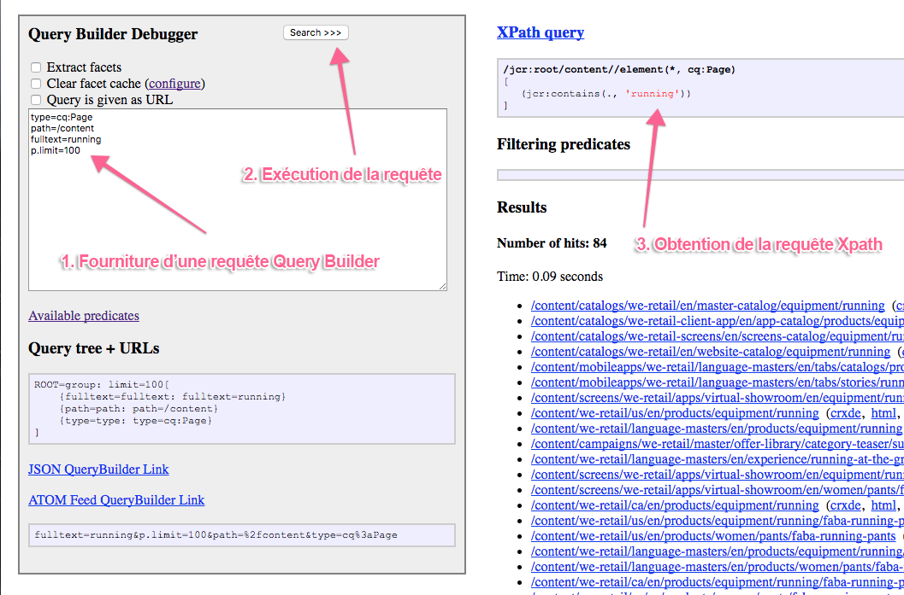

# API Query Builder {#query-builder-api}

Query Builder offre un moyen simple pour effectuer des requêtes sur le référentiel de contenu d’AEM. La fonctionnalité est exposée par le biais d’une API Java™ et d’une API REST. Ce document décrit ces API.

Le générateur de requêtes côté serveur ([`QueryBuilder`](https://developer.adobe.com/experience-manager/reference-materials/cloud-service/javadoc/com/day/cq/search/QueryBuilder.html)) accepte une description de requête, crée et exécute une requête XPath, filtre éventuellement le jeu de résultats et, si vous le souhaitez, extrait également des facettes.

La description de requête correspond simplement à un ensemble de prédicats ([`Predicate`](https://developer.adobe.com/experience-manager/reference-materials/cloud-service/javadoc/com/day/cq/search/Predicate.html)). Par exemple, un prédicat de texte intégral correspond à la fonction `jcr:contains()` dans XPath.

Pour chaque type de prédicat, il existe un composant Évaluateur ([`PredicateEvaluator`](https://developer.adobe.com/experience-manager/reference-materials/cloud-service/javadoc/com/day/cq/search/eval/PredicateEvaluator.html)) qui sait comment en effectuer la gestion pour XPath, pour le filtrage et pour l’extraction de facettes. Il est facile de créer des évaluateurs personnalisés, qui sont connectés via l’exécution du composant OSGi.

L’API REST permet d’accéder aux mêmes fonctionnalités via HTTP avec les réponses envoyées dans JSON.

>[!NOTE]
>
>L’API QueryBuilder est créée à l’aide de l’API JCR. Vous pouvez également interroger le JCR Adobe Experience Manager en utilisant l’API JCR depuis un lot OSGi. Pour plus d’informations, voir [Interrogation des données Adobe Experience Manager à l’aide de l’API JCR](https://experienceleague.adobe.com/docs/experience-manager-65/developing/platform/query-builder/querybuilder-api.html?lang=fr).

## Session Gem {#gem-session}

[AEM Gems](https://experienceleague.adobe.com/docs/events/experience-manager-gems-recordings/overview.html?lang=fr) est une série de sessions techniques approfondies sur Adobe Experience Manager dispensées par des experts Adobe.

Vous pouvez [examiner la session dédiée à Query Builder](https://experienceleague.adobe.com/docs/events/experience-manager-gems-recordings/gems2017/aem-search-forms-using-querybuilder.html?lang=fr) pour une présentation et utiliser l’outil.

## Exemples de requêtes {#sample-queries}

Ces exemples sont fournis dans la notation de style des propriétés Java™. Pour les utiliser avec l’API Java™, utilisez une `HashMap` Java™ comme dans l’exemple d’API suivant.

Pour le servlet JSON `QueryBuilder`, chaque exemple comprend un exemple de lien vers une installation AEM (à l’emplacement par défaut, `http://<host>:<port>`). Connectez-vous à votre instance AEM avant d’utiliser ces liens.

>[!CAUTION]
>
>Par défaut, le servlet JSON de générateur de requêtes affiche un maximum de dix accès.
>
>L’ajout du paramètre suivant permet au servlet d’afficher tous les résultats de la requête :
>
>`p.limit=-1`

>[!NOTE]
>
>Pour afficher les données JSON renvoyées dans votre navigateur, vous pouvez utiliser un plug-in tel que JSONView pour Firefox.

### Renvoi de tous les résultats {#returning-all-results}

La requête suivante **renvoie dix résultats** (ou, pour être précis, un maximum de dix), mais vous informe du **Nombre d’accès** disponibles :

`http://<host>:<port>/bin/querybuilder.json?path=/content&1_property=sling:resourceType&1_property.value=wknd/components/structure/page&1_property.operation=like&orderby=path`

```xml
path=/content
1_property=sling:resourceType
1_property.value=wknd/components/structure/page
1_property.operation=like
orderby=path
```

La même requête (avec le paramètre `p.limit=-1`) **renvoie tous les résultats** (il peut s’agir d’un nombre élevé en fonction de votre instance) :

`http://<host>:<port>/bin/querybuilder.json?path=/content&1_property=sling:resourceType&1_property.value=wknd/components/structure/page&1_property.operation=like&orderby=path&p.limit=-1`

```xml
path=/content
1_property=sling:resourceType
1_property.value=wknd/components/structure/page
1_property.operation=like
p.limit=-1
orderby=path
```

### Utilisation de p.guessTotal pour renvoyer les résultats {#using-p-guesstotal-to-return-the-results}

L’objectif du paramètre `p.guessTotal` est de renvoyer le nombre approprié de résultats pouvant être affichés en combinant les plus petites valeurs `p.offset` et `p.limit` possibles. Utilisé avec des jeux de résultats de grande taille, ce paramètre offre des performances accrues. Ce paramètre vous évite de calculer le total (en appelant `result.getSize()`, par exemple) et de lire tout le jeu de résultats, optimisé jusqu’à l’index et au moteur OAK. Ce processus peut constituer une différence importante lorsqu’il y a des centaines de milliers de résultats, tant sur le plan de la durée d’exécution que de l’utilisation de la mémoire.

L’inconvénient de ce paramètre est que les utilisateurs et les utilisatrices ne voient pas le total exact. Mais vous pouvez définir un nombre minimal, comme `p.guessTotal=1000`, pour qu’il soit toujours lu jusqu’à 1 000. Ainsi, vous obtenez des totaux exacts pour des jeux de résultats plus petits, mais s’il s’agit de plus, vous pouvez uniquement afficher « et plus ».

Ajoutez `p.guessTotal=true` à la requête ci-dessous pour voir comment cela fonctionne :

`http://<host>:<port>/bin/querybuilder.json?path=/content&1_property=sling:resourceType&1_property.value=wknd/components/structure/page&1_property.operation=like&p.guessTotal=true&orderby=path`

```xml
path=/content
1_property=sling:resourceType
1_property.value=wknd/components/structure/page
1_property.operation=like
p.guessTotal=true
orderby=path
```

La requête renvoie la valeur `p.limit` par défaut de `10` résultats avec un décalage de `0` :

```xml
"success": true,
"results": 10,
"total": 10,
"more": true,
"offset": 0,
```

Vous pouvez également utiliser une valeur numérique pour compter jusqu’à un nombre personnalisé de résultats maximums. Utilisez la même requête que ci-dessus, mais définissez la valeur de `p.guessTotal` sur `50` :

`http://<host>:<port>/bin/querybuilder.json?path=/content&1_property=sling:resourceType&1_property.value=wknd/components/structure/page&1_property.operation=like&p.guessTotal=50&orderby=path`

Elle renvoie la même limite par défaut de 10 résultats avec un décalage de 0, mais n’affiche, au maximum, que 50 résultats :

```xml
"success": true,
"results": 10,
"total": 50,
"more": true,
"offset": 0,
```

### Mise en œuvre de la pagination {#implementing-pagination}

Par défaut, Query Builder fournit également le nombre d’accès. En fonction de la taille du résultat, ce nombre peut prendre un certain temps, car déterminer le nombre exact implique de vérifier chaque résultat pour le contrôle d’accès. Le total est principalement utilisé pour implémenter la pagination pour l’interface utilisateur de la personne utilisatrice finale. Comme la détermination du nombre exact peut être lente, il est recommandé d’utiliser la fonction guessTotal pour mettre en œuvre la pagination.

Par exemple, l’interface utilisateur peut adapter l’approche suivante :

* Obtenez et affichez le nombre exact d’accès totaux ([SearchResult.getTotalMatches()](https://developer.adobe.com/experience-manager/reference-materials/cloud-service/javadoc/com/day/cq/search/result/SearchResult.html#getTotalMatches) ou total dans la réponse `querybuilder.json`) qui est inférieur ou égal à 100 ;
* Définir `guessTotal` sur 100 en appelant Query Builder.

* La réponse peut générer le résultat suivant :

   * `total=43`, `more=false` – Indique que le nombre total d’accès est de 43. L’interface utilisateur peut afficher jusqu’à dix résultats dans le cadre de la première page et fournir la pagination pour les trois pages suivantes. Vous pouvez également utiliser cette implémentation pour afficher un texte descriptif tel que **« 43 résultats trouvés »**.
   * `total=100`, `more=true` – Indique que le nombre total d’accès est supérieur à 100 et que le nombre exact est inconnu. L’interface utilisateur peut afficher jusqu’à dix résultats dans le cadre de la première page et fournir la pagination pour les dix pages suivantes. Vous pouvez également utiliser cette fonctionnalité pour afficher un texte descriptif tel que **« Plus de 100 résultats trouvés »**. Lorsque l’utilisateur ou l’utilisatrice accède aux pages suivantes, les appels effectués vers Query Builder augmentent la limite de `guessTotal`, ainsi que celle des paramètres `offset` et `limit`.

Utilisez également `guessTotal` dans les cas où l’interface utilisateur doit utiliser le défilement infini pour éviter que Query Builder ne détermine le nombre exact d’accès.

### Recherche et classement des fichiers JAR, en commençant par le plus récent {#find-jar-files-and-order-them-newest-first}

`http://<host>:<port>/bin/querybuilder.json?type=nt:file&nodename=*.jar&orderby=@jcr:content/jcr:lastModified&orderby.sort=desc`

```xml
type=nt:file
nodename=*.jar
orderby=@jcr:content/jcr:lastModified
orderby.sort=desc
```

### Recherche de toutes les pages et classement par date de la dernière modification {#find-all-pages-and-order-them-by-last-modified}

`http://<host>:<port>/bin/querybuilder.json?type=cq:Page&orderby=@jcr:content/cq:lastModified`

```xml
type=cq:Page
orderby=@jcr:content/cq:lastModified
```

### Recherche de toutes les pages et classement par date de la dernière modification, mais par ordre décroissant {#find-all-pages-and-order-them-by-last-modified-but-descending}

`http://<host>:<port>/bin/querybuilder.json?type=cq:Page&orderby=@jcr:content/cq:lastModified&orderby.sort=desc`

```xml
type=cq:Page
orderby=@jcr:content/cq:lastModified
orderby.sort=desc
```

### Recherche en texte intégral, avec classement par score {#fulltext-search-ordered-by-score}

`http://<host>:<port>/bin/querybuilder.json?fulltext=Management&orderby=@jcr:score&orderby.sort=desc`

```xml
fulltext=Management
orderby=@jcr:score
orderby.sort=desc
```

### Recherche des pages présentant une balise donnée {#search-for-pages-tagged-with-a-certain-tag}

`http://<host>:<port>/bin/querybuilder.json?type=cq:Page&tagid=wknd:activity/cycling&tagid.property=jcr:content/cq:tags`

```xml
type=cq:Page
tagid=wknd:activity/cycling
tagid.property=jcr:content/cq:tags
```

Utilisez le prédicat `tagid`, comme dans l’exemple, si vous connaissez l’ID de balise explicite.

Utilisez le prédicat `tag` pour le chemin d’accès au titre de la balise (sans espaces).

Étant donné que vous recherchiez des pages dans l’exemple précédent (nœuds `cq:Page`), utilisez le chemin d’accès relatif à partir de ce nœud pour le prédicat `tagid.property`, à savoir `jcr:content/cq:tags`. Par défaut, le prédicat `tagid.property` est `cq:tags`.

### Recherche dans plusieurs chemins (à l’aide de groupes) {#search-under-multiple-paths-using-groups}

`http://<host>:<port>/bin/querybuilder.json?fulltext=Experience&group.1_path=/content/wknd/us/en/magazine&group.2_path=/content/wknd/us/en/adventures&group.p.or=true`

```xml
fulltext=Experience
group.p.or=true
group.1_path=/content/wknd/us/en/magazine
group.2_path=/content/wknd/us/en/adventures
```

Cette requête utilise un *groupe* (appelé « `group` »), qui sert à délimiter les sous-expressions dans une requête, à l’instar des parenthèses dans des notations plus standard. Par exemple, la requête précédente peut être exprimée dans un style plus familier comme suit :

`"Experience" and ("/content/wknd/us/en/magazine" or "/content/wknd/us/en/adventures")`

Le prédicat `path` est utilisé à plusieurs reprises dans le groupe de l’exemple précédent. Pour différencier et classer les deux instances du prédicat (un classement est requis pour certains prédicats), vous devez faire précéder les prédicats de `N_` où `N` est l’index de classement. Dans l’exemple précédent, les prédicats obtenus sont `1_path` et `2_path`.

Le `p` dans `p.or` est un délimiteur spécial qui indique que ce qui suit (dans ce cas, `or`) est un *paramètre* du groupe, par opposition à un sous-prédicat du groupe, tel que `1_path`.

Si aucun `p.or` n’est indiqué, tous les prédicats sont associés avec AND ; en d’autres termes, chaque résultat doit répondre à l’ensemble des prédicats.

>[!NOTE]
>
>Vous ne pouvez pas utiliser le même préfixe numérique dans une seule requête, même pour des prédicats différents.

### Recherche de propriétés {#search-for-properties}

Dans ce cas, vous recherchez toutes les pages d’un modèle donné, à l’aide de la propriété `cq:template` :

`http://<host>:<port>/bin/querybuilder.json?property=cq%3atemplate&property.value=%2fconf%2fwknd%2fsettings%2fwcm%2ftemplates%2fadventure-page-template&type=cq%3aPageContent`

```xml
type=cq:PageContent
property=cq:template
property.value=/conf/wknd/settings/wcm/templates/adventure-page-template
```

L’inconvénient est que les nœuds `jcr:content` des pages sont renvoyés, et non les pages proprement dites. Pour remédier à ce problème, vous pouvez effectuer une recherche par chemin d’accès relatif :

`http://<host>:<port>/bin/querybuilder.json?property=jcr%3acontent%2fcq%3atemplate&property.value=%2fconf%2fwknd%2fsettings%2fwcm%2ftemplates%2fadventure-page-template&type=cq%3aPage`

```xml
type=cq:Page
property=jcr:content/cq:template
property.value=/conf/wknd/settings/wcm/templates/adventure-page-template
```

### Recherche de plusieurs propriétés {#search-for-multiple-properties}

Lorsque vous utilisez plusieurs fois le prédicat property, vous devez ajouter à nouveau les préfixes numériques :

`http://<host>:<port>/bin/querybuilder.json?1_property=jcr%3acontent%2fcq%3atemplate&1_property.value=%2fconf%2fwknd%2fsettings%2fwcm%2ftemplates%2fadventure-page-template&2_property=jcr%3acontent%2fjcr%3atitle&2_property.value=Cycling%20Tuscany&type=cq%3aPage`

```xml
type=cq:Page
1_property=jcr:content/cq:template
1_property.value=/conf/wknd/settings/wcm/templates/adventure-page-template
2_property=jcr:content/jcr:title
2_property.value=Cycling Tuscany
```

### Recherche de plusieurs valeurs de propriété {#search-for-multiple-property-values}

Pour éviter la constitution de groupes volumineux lorsque vous souhaitez rechercher plusieurs valeurs d’une propriété (`"A" or "B" or "C"`), vous pouvez fournir plusieurs valeurs au prédicat `property` :

`http://<host>:<port>/bin/querybuilder.json?property=jcr%3atitle&property.1_value=Cycling%20Tuscany&property.2_value=Ski%20Touring&property.3_value=Whistler%20Mountain%20Biking`

```xml
property=jcr:title
property.1_value=Cycling Tuscany
property.2_value=Ski Touring
property.3_value=Whistler Mountain Biking
```

Pour les propriétés à plusieurs valeurs, vous pouvez également exiger que plusieurs valeurs correspondent (`"A" and "B" and "C"`) :

`http://<host>:<port>/bin/querybuilder.json?property=jcr%3atitle&property.and=true&property.1_value=Cycling%20Tuscany&property.2_value=Ski%20Touring&property.3_value=Whistler%20Mountain%20Biking`

```xml
property=jcr:title
property.and=true
property.1_value=Cycling Tuscany
property.2_value=Ski Touring
property.3_value=Whistler Mountain Biking
```

## Amélioration des propriétés renvoyées {#refining-what-is-returned}

Par défaut, le servlet JSON QueryBuilder renvoie un jeu de propriétés par défaut pour chaque nœud dans les résultats de recherche (par exemple, chemin d’accès, nom et titre). Pour contrôler les propriétés renvoyées, vous pouvez effectuer l’une des opérations suivantes :

Spécifiez

```xml
p.hits=full
```

Dans ce cas, toutes les propriétés sont incluses pour chaque nœud :

`http://<host>:<port>/bin/querybuilder.json?p.hits=full&property=jcr%3atitle&property.value=Cycling%20Tuscany`

```xml
property=jcr:title
property.value=Cycling Tuscany
p.hits=full
```

Utilisez

```xml
p.hits=selective
```

Et spécifiez les propriétés à intégrer

```xml
p.properties
```

Séparées par un espace :

`http://<host>:<port>/bin/querybuilder.json?p.hits=selective&p.properties=sling%3aresourceType%20jcr%3aprimaryType&property=jcr%3atitle&property.value=Cycling%20Tuscany`

```xml
property=jcr:title
property.value=Cycling Tuscany
p.hits=selective
p.properties=sling:resourceType jcr:primaryType
```

Vous pouvez également inclure des nœuds enfants dans la réponse du Query Builder. Spécifiez

```xml
p.nodedepth=n
```

Où `n` correspond au nombre de niveaux que la requête doit renvoyer. Pour qu’un nœud enfant soit renvoyé, il doit être spécifié par le sélecteur de propriétés

```xml
p.hits=full
```

Exemple :

`http://<host>:<port>/bin/querybuilder.json?p.hits=full&p.nodedepth=5&property=jcr%3atitle&property.value=Cycling%20Tuscany`

```xml
property=jcr:title
property.value=Cycling Tuscany
p.hits=full
p.nodedepth=5
```

## Plus de prédicats {#morepredicates}

Pour plus de prédicats, consultez la [page de référence des prédicats de Query Builder](query-builder-predicates.md).

Vous pouvez également consulter le [JavaDoc relatif aux `PredicateEvaluator`classes](https://developer.adobe.com/experience-manager/reference-materials/cloud-service/javadoc/com/day/cq/search/eval/PredicateEvaluator.html). Ce JavaDoc contient la liste des propriétés que vous pouvez utiliser.

Le préfixe du nom de classe (par exemple, `similar` dans [`SimilarityPredicateEvaluator`](https://developer.adobe.com/experience-manager/reference-materials/cloud-service/javadoc/com/day/cq/search/eval/SimilarityPredicateEvaluator.html)), est la *propriété principale* de la classe. Cette propriété est également le nom du prédicat à utiliser dans la requête (en minuscules).

Pour ces propriétés principales, vous pouvez raccourcir la requête et utiliser `similar=/content/en` au lieu de la variante complète `similar.similar=/content/en`. La forme complète doit être utilisée pour toutes les propriétés non principales d’une classe.

## Exemple d’utilisation de l’API Query Builder {#example-query-builder-api-usage}

```java
   String fulltextSearchTerm = "WKND";

    // create query description as hash map (simplest way, same as form post)
    Map<String, String> map = new HashMap<String, String>();

// create query description as hash map (simplest way, same as form post)
    map.put("path", "/content");
    map.put("type", "cq:Page");
    map.put("group.p.or", "true"); // combine this group with OR
    map.put("group.1_fulltext", fulltextSearchTerm);
    map.put("group.1_fulltext.relPath", "jcr:content");
    map.put("group.2_fulltext", fulltextSearchTerm);
    map.put("group.2_fulltext.relPath", "jcr:content/@cq:tags");

    // can be done in map or with Query methods
    map.put("p.offset", "0"); // same as query.setStart(0) below
    map.put("p.limit", "20"); // same as query.setHitsPerPage(20) below

    Query query = builder.createQuery(PredicateGroup.create(map), session);
    query.setStart(0);
    query.setHitsPerPage(20);

    SearchResult result = query.getResult();

    // paging metadata
    int hitsPerPage = result.getHits().size(); // 20 (set above) or lower
    long totalMatches = result.getTotalMatches();
    long offset = result.getStartIndex();
    long numberOfPages = totalMatches / 20;

    //Place the results in XML to return to client
    DocumentBuilderFactory factory = DocumentBuilderFactory.newInstance();
    DocumentBuilder builder = factory.newDocumentBuilder();
    Document doc = builder.newDocument();

    //Start building the XML to pass back to the AEM client
    Element root = doc.createElement( "results" );
    doc.appendChild( root );

    // iterating over the results
for (Hit hit : result.getHits()) {
       String path = hit.getPath();

      //Create a result element
      Element resultel = doc.createElement( "result" );
      root.appendChild( resultel );

      Element pathel = doc.createElement( "path" );
      pathel.appendChild( doc.createTextNode(path ) );
      resultel.appendChild( pathel );
    }
```

La même requête exécutée sur HTTP à l’aide du servlet Query Builder (JSON) :

`http://<host>:<port>/bin/querybuilder.json?path=/content&type=cq:Page&group.p.or=true&group.1_fulltext=WKND&group.1_fulltext.relPath=jcr:content&group.2_fulltext=WKND&group.2_fulltext.relPath=jcr:content/@cq:tags&p.offset=0&p.limit=20`

## Stockage et chargement de requêtes {#storing-and-loading-queries}

Les requêtes peuvent être stockées dans le référentiel de manière à pouvoir les utiliser ultérieurement. `QueryBuilder` fournit la méthode `storeQuery` avec la signature suivante :

```java
void storeQuery(Query query, String path, boolean createFile, Session session) throws RepositoryException, IOException;
```

Si vous utilisez la méthode [`QueryBuilder#storeQuery`](https://developer.adobe.com/experience-manager/reference-materials/cloud-service/javadoc/com/day/cq/search/QueryBuilder.html#storeQuery-com.day.cq.search.Query-java.lang.String-boolean-javax.jcr.Session-), la `Query` donnée est stockée dans le référentiel sous la forme d’un fichier ou d’une propriété suivant la valeur de l’argument `createFile`. L’exemple suivant illustre l’enregistrement d’une `Query` sous `/mypath/getfiles` en tant que fichier :

```java
builder.storeQuery(query, "/mypath/getfiles", true, session);
```

Toutes les requêtes stockées précédemment peuvent être chargées à partir du référentiel en utilisant la méthode [`QueryBuilder#loadQuery`](https://developer.adobe.com/experience-manager/reference-materials/cloud-service/javadoc/com/day/cq/search/QueryBuilder.html#loadQuery-java.lang.String-javax.jcr.Session-) :

```java
Query loadQuery(String path, Session session) throws RepositoryException, IOException
```

Par exemple, une `Query` stockée sous `/mypath/getfiles` peut être chargée par l’extrait de code suivant :

```java
Query loadedQuery = builder.loadQuery("/mypath/getfiles", session);
```

## Tests et débogage {#testing-and-debugging}

Pour exécuter et déboguer des requêtes Query Builder, vous pouvez utiliser la console de débogage Query Builder à l’adresse suivante :

`http://<host>:<port>/libs/cq/search/content/querydebug.html`

Ou le servlet JSON de générateur de requêtes à l’adresse suivante :

`http://<host>:<port>/bin/querybuilder.json?path=/tmp`

Le `path=/tmp` est un exemple uniquement.

### Recommandations générales en matière de débogage {#general-debugging-recommendations}

### Obtention d’une requête XPath explicable par le biais de la journalisation {#obtain-explain-able-xpath-via-logging}

Expliquez **toutes** les requêtes au cours du cycle de développement par rapport à l’ensemble d’index cible.

1. Activez les journaux de débogage pour QueryBuilder afin d’obtenir une requête XPath explicable sous-jacente
   * Accédez à `https://<host>:<port>/system/console/slinglog`. Créez un enregistreur pour `com.day.cq.search.impl.builder.QueryImpl` lors du **débogage**.
1. Une fois que le débogage a été activé pour la classe ci-dessus, les journaux affichent la requête XPath générée par le générateur de requêtes.
1. Copiez la requête XPath à partir de l’entrée de journal pour la requête Query Builder associée. Par exemple :
   * `com.day.cq.search.impl.builder.QueryImpl XPath query: /jcr:root/content//element(*, cq:Page)[(jcr:contains(jcr:content, "WKND") or jcr:contains(jcr:content/@cq:tags, "WKND"))]`
1. Collez la requête XPath dans Explain Query en tant que XPath afin d’obtenir le plan de requête.

### Obtention d’une requête XPath explicable par le biais du débogueur Query Builder {#obtain-explain-able-xpath-via-the-query-builder-debugger}

Utilisez le débogueur AEM Query Builder pour générer une requête XPath explicable.



1. Indiquez la requête Query Builder dans le débogueur Query Builder.
1. Exécutez la recherche
1. Obtenez le XPath généré
1. Collez la requête XPath dans Explain Query en tant que XPath afin d’obtenir le plan de requête

>[!NOTE]
>
>Les requêtes ne provenant pas de générateur de requêtes (XPath, JCR-SQL2) peuvent être fournies directement à Explain Query.

## Débogage de requêtes à l’aide de la journalisation {#debugging-queries-with-logging}

>[!NOTE]
>
>La configuration des journaux est décrite dans le document [Journalisation](/help/implementing/developing/introduction/logging.md).

La sortie du journal (niveau INFO) de l’implémentation du générateur de requêtes lors de l’exécution de la requête décrite dans la section précédente [Test et débogage](#testing-and-debugging)

```xml
com.day.cq.search.impl.builder.QueryImpl executing query (predicate tree):
null=group: limit=20, offset=0[
    {group=group: or=true[
        {1_fulltext=fulltext: fulltext=WKND, relPath=jcr:content}
        {2_fulltext=fulltext: fulltext=WKND, relPath=jcr:content/@cq:tags}
    ]}
    {path=path: path=/content}
    {type=type: type=cq:Page}
]
com.day.cq.search.impl.builder.QueryImpl XPath query: /jcr:root/content//element(*, cq:Page)[(jcr:contains(jcr:content, "WKND") or jcr:contains(jcr:content/@cq:tags, "WKND"))]
com.day.cq.search.impl.builder.QueryImpl no filtering predicates
com.day.cq.search.impl.builder.QueryImpl query execution took 69 ms
```

Dans le cas d’une requête qui utilise des évaluateurs de prédicats qui filtrent ou appliquent un ordre personnalisé par comparateur, cela est également indiqué dans la requête :

```xml
com.day.cq.search.impl.builder.QueryImpl executing query (predicate tree):
null=group: [
    {nodename=nodename: nodename=*.jar}
    {orderby=orderby: orderby=@jcr:content/jcr:lastModified}
    {type=type: type=nt:file}
]
com.day.cq.search.impl.builder.QueryImpl custom order by comparator: jcr:content/jcr:lastModified
com.day.cq.search.impl.builder.QueryImpl XPath query: //element(*, nt:file)
com.day.cq.search.impl.builder.QueryImpl filtering predicates: {nodename=nodename: nodename=*.jar}
com.day.cq.search.impl.builder.QueryImpl query execution took 272 ms
```

## Liens JavaDoc {#javadoc-links}

| **Javadoc** | **Description** |
|---|---|
| [com.day.cq.search](https://developer.adobe.com/experience-manager/reference-materials/cloud-service/javadoc/com/day/cq/search/package-summary.html) | API Query Builder et Query de base |
| [com.day.cq.search.result](https://developer.adobe.com/experience-manager/reference-materials/cloud-service/javadoc/com/day/cq/search/result/package-summary.html) | API Result |
| [com.day.cq.search.facets](https://developer.adobe.com/experience-manager/reference-materials/cloud-service/javadoc/com/day/cq/search/facets/package-summary.html) | Facettes |
| [com.day.cq.search.facets.buckets](https://developer.adobe.com/experience-manager/reference-materials/cloud-service/javadoc/com/day/cq/search/facets/buckets/package-summary.html) | Intervalles (contenus dans les facettes) |
| [com.day.cq.search.eval](https://developer.adobe.com/experience-manager/reference-materials/cloud-service/javadoc/com/day/cq/search/eval/package-summary.html) | Évaluateurs de prédicats |
| [com.day.cq.search.facets.extractors](https://developer.adobe.com/experience-manager/reference-materials/cloud-service/javadoc/com/day/cq/search/facets/extractors/package-summary.html) | Extracteurs de facettes (pour les évaluateurs) |
| [com.day.cq.search.writer](https://developer.adobe.com/experience-manager/reference-materials/cloud-service/javadoc/com/day/cq/search/writer/package-summary.html) | JSON Result Hit Writer pour servlet Query Builder (`/bin/querybuilder.json`) |
