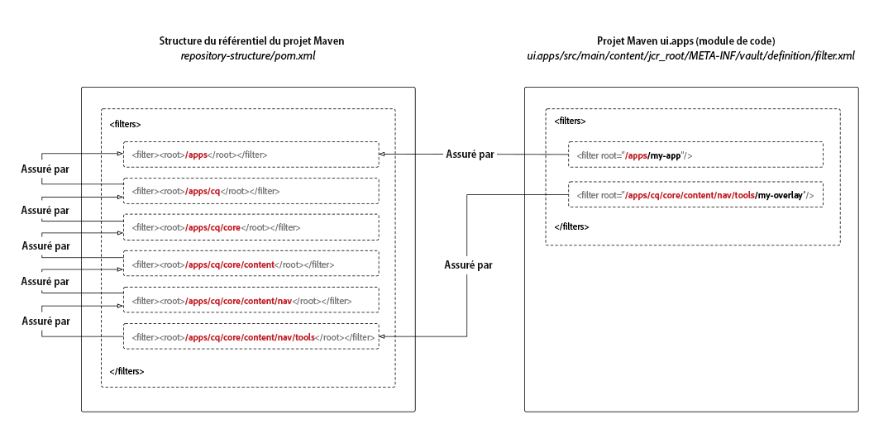

# Module de structure du référentiel de projet AEM

Les projets Maven pour Adobe Experience Manager as a Cloud Service nécessitent une définition de sous-package de structure de référentiel dont le seul objectif est de définir les racines du référentiel JCR dans lesquelles les sous-packages de code du projet sont déployés. Cela permet de s’assurer que l’installation des packs dans Experience Manager as a Cloud Service est automatiquement commandée par les dépendances des ressources JCR. Les dépendances manquantes peuvent conduire à des scénarios où des sous-structures seraient installées avant leurs structures parents et seraient donc supprimées de manière inattendue, ce qui interromprait le déploiement.

Si votre package de code se déploie dans un emplacement **non couvert** par le package de code, toutes les ressources ancêtres (ressources JCR plus proches de la racine JCR) doivent être recensées dans le package de structure du référentiel pour établir ces dépendances.



Le package de structure de référentiel définit l’état commun attendu `/apps` que le validateur de package utilise pour déterminer les zones « à l’abri des conflits potentiels », car il s’agit de racines standard.

Les chemins les plus courants à inclure dans le package de structure de référentiel sont les suivants :

+ `/apps`, qui est un nœud fourni par le système
+ `/apps/cq/...`, `/apps/dam/...`, `/apps/wcm/...`et `/apps/sling/...`, qui fournissent les recouvrements communs pour `/libs`.
+ `/apps/settings`, qui est le chemin racine de configuration reconnaissant le contexte partagé

Notez que ce sous-package **ne comporte** aucun contenu et se compose uniquement d’une `pom.xml` définition des racines du filtre.

## Création du package de structure de référentiel

Pour créer un package de structure de référentiel pour votre projet Maven, créez un nouveau sous-projet Maven vide, avec le `pom.xml` suivant, en mettant à jour les métadonnées du projet pour qu’elles soient conformes à votre projet Maven parent.

Mettez à jour le `<filters>` pour inclure toutes les racines du chemin d’accès au référentiel JCR dans lesquelles vos packages de code sont déployés.

Veillez à ajouter ce nouveau sous-projet Maven à la liste des projets parents `<modules>`.

```xml
<?xml version="1.0" encoding="UTF-8"?>
<project xmlns="http://maven.apache.org/POM/4.0.0" xmlns:xsi="http://www.w3.org/2001/XMLSchema-instance" xsi:schemaLocation="http://maven.apache.org/POM/4.0.0 http://maven.apache.org/maven-v4_0_0.xsd">
    <modelVersion>4.0.0</modelVersion>

    <!-- ====================================================================== -->
    <!-- P A R E N T  P R O J E C T  D E S C R I P T I O N                      -->
    <!-- ====================================================================== -->
    <parent>
        <groupId>com.my-company</groupId>
        <artifactId>my-app</artifactId>
        <version>x.x.x</version>
        <relativePath>../pom.xml</relativePath>
    </parent>

    <!-- ====================================================================== -->
    <!-- P R O J E C T  D E S C R I P T I O N                                   -->
    <!-- ====================================================================== -->
    <artifactId>ui.apps.structure</artifactId>
    <packaging>content-package</packaging>
    <name>UI Apps Structure - Repository Structure Package for /apps</name>

    <description>
        Empty package that defines the structure of the Adobe Experience Manager repository the code packages in this project deploy into.
        Any roots in the code packages of this project should have their parent enumerated in the filters list below.
    </description>

    <build>
        <plugins>
            <plugin>
                <groupId>org.apache.jackrabbit</groupId>
                <artifactId>filevault-package-maven-plugin</artifactId>
                <extensions>true</extensions>
                <properties>
                    <!-- Set Cloud Manager Target to none, else this package will be deployed and remove all defined filter roots -->
                    <cloudManagerTarget>none</cloudManagerTarget>
                </properties>
                <configuration>
                    <properties>
                        <!-- Set Cloud Manager Target to none, else this package will be deployed and remove all defined filter roots -->
                        <cloudManagerTarget>none</cloudManagerTarget>
                    </properties>
                    <filters>

                        <!-- /apps root -->
                        <filter><root>/apps</root></filter>

                        <!--
                        Examples of complex roots


                        Overlays of /libs typically require defining the overlayed structure, at each level here.

                        For example, adding a new section to the main AEM Tools navigation, necessitates the following rules:

                        <filter><root>/apps/cq</root></filter>
                        <filter><root>/apps/cq/core</root></filter>
                        <filter><root>/apps/cq/core/content</root></filter>
                        <filter><root>/apps/cq/core/content/nav/</root></filter>
                        <filter><root>/apps/cq/core/content/nav/tools</root></filter>


                        Any /apps level Context-aware configurations need to enumerated here. 
                        
                        For example, providing email templates under `/apps/settings/notification-templates/com.day.cq.replication` necessitates the following rules:

                        <filter><root>/apps/settings</root></filter>
                        <filter><root>/apps/settings/notification-templates</root></filter>
                        <filter><root>/apps/settings/notification-templates/com.day.cq.replication</root></filter>
                        -->

                    </filters>
                </configuration>
            </plugin>
        </plugins>
    </build>
</project>
```

## Référence au package de structure de référentiel

Pour utiliser le package de structure de référentiel, référencez-le par l’intermédiaire de tous projets Maven de package de code (les sous-packages qui se déploient vers `/apps`) en configurant les modules externes Maven `<repositoryStructurePackage>` du package de contenu FileVault.

Dans le package de code `ui.apps/pom.xml` et tout autre package de code `pom.xml`, ajoutez une référence à la configuration du package de structure de référentiel du projet (#repository-structure-package) dans le module externe Maven du package FileVault.

```xml
...
<build>
  <plugins>
    <plugin>
      <groupId>org.apache.jackrabbit</groupId>
      <artifactId>filevault-package-maven-plugin</artifactId>
      <extensions>true</extensions>
      <configuration>
        ...
        <repositoryStructurePackages>
          <repositoryStructurePackage>
              <groupId>${project.groupId}</groupId>
              <artifactId>ui.apps.structure</artifactId>
              <version>${project.version}</version>
          </repositoryStructurePackage>
        </repositoryStructurePackages>
      </configuration>
    </plugin>
    ...
</build>
<dependencies>
    <!-- Add the dependency for the repository structure package so it resolves -->
    <dependency>
        <groupId>${project.groupId}</groupId>
        <artifactId>ui.apps.structure</artifactId>
        <version>${project.version}</version>
        <type>zip</type>
    </dependency>
    ...
</dependencies>
```

## Cas d’utilisation du package à code multiple

Un cas d’utilisation moins courant et plus complexe prend en charge le déploiement de plusieurs packages de code installés dans les mêmes zones du référentiel JCR.

Par exemple :

+ Le package de code A se déploie dans `/apps/a`
+ Le package de code B se déploie dans `/apps/a/b`

Si une dépendance au niveau du package n’est pas établie à partir du package de code B sur le package de code A, le package de code B peut être déployé en premier dans `/apps/a`, suivi du package de code B qui est déployé dans `/apps/a`, ce qui entraîne la suppression du package précédemment installé `/apps/a/b`.

Dans ce cas :

+ Le package de code A doit définir une valeur `<repositoryStructurePackage>` sur le package de structure de référentiel du projet (qui doit avoir un filtre `/apps`).
+ Le package de code B doit définir une valeur `<repositoryStructurePackage>` sur le package de code A, car le package de code B se déploie dans l’espace partagé par le package de code A.

## Erreurs et débogage

Si les packages de structure de référentiel ne sont pas correctement configurés, une erreur est signalée lors de la création du projet Maven :

```
1 error(s) detected during dependency analysis.
Filter root's ancestor '/apps/some/path' is not covered by any of the specified dependencies.
```

Ce message indique que le package de code de saut n’a pas de `<repositoryStructurePackage>` qui comporte `/apps/some/path` dans sa liste de filtres.

## Ressources supplémentaires

+ [Module Maven de package de contenu FileVault](http://jackrabbit.apache.org/filevault-package-maven-plugin/)
