# Structure of the AEM UI {#structure-of-the-aem-ui}

L’interface utilisateur AEM comporte plusieurs principes sous-jacents et se compose de plusieurs éléments clés :

## Consoles {#consoles}

### Redimensionnement et mise en page de base {#basic-layout-and-resizing}

L’interface utilisateur est adaptée aux périphériques mobiles et de bureau. Toutefois, plutôt que de créer deux styles, AEM utilise un style qui fonctionne pour tous les écrans et les périphériques.

Tous les modules utilisent la même mise en page de base, AEM ceci peut être considéré comme :

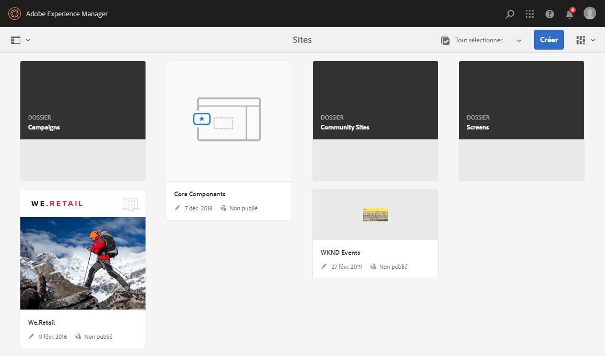

La mise en page respecte un style de conception réactif et s’adapte à la taille du périphérique/de la fenêtre que vous utilisez.

Par exemple, si la résolution passe sous 1 024 pixels (comme c’est le cas sur un appareil mobile), l’affichage est adapté en conséquence :

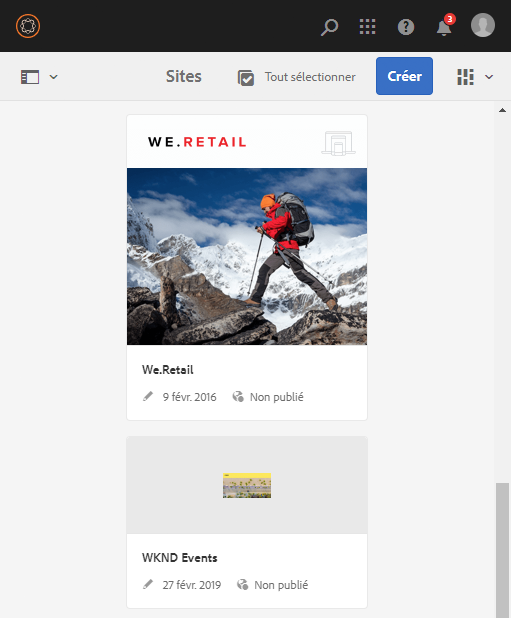

### Barre d’en-tête {#header-bar}

La barre d’en-tête affiche des éléments globaux, parmi lesquels :

* Le logo et le produit/la solution spécifique que vous utilisez actuellement ; pour AEM, cela forme également un lien vers la navigation globale.
* Rechercher
* Icône permettant d’accéder aux ressources d’aide
* Icône permettant d’accéder à d’autres solutions
* Indicateur des alertes ou éléments de boîte de réception (et accès à ces alertes) qui vous attendent
* L&#39;icône utilisateur, ainsi qu&#39;un lien vers votre gestion des profils

### Barre d’outils {#toolbar}

La barre d’outils est contextuelle par rapport à votre emplacement et aux outils de surfaces pertinents pour contrôler la vue ou les ressources dans la page ci-dessous. La barre d’outils est propre au produit, mais elle contient des éléments communs.

La barre d’outils affiche les actions actuellement disponibles à n’importe quel emplacement :

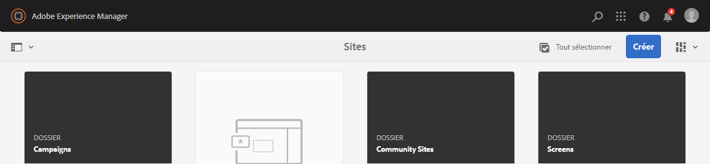

Le contenu dépend également du fait qu’une ressource est sélectionnée ou non :

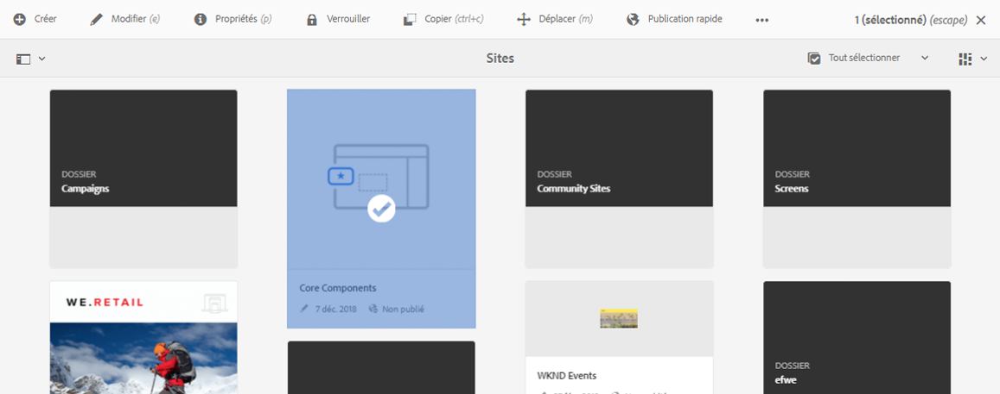

### Rail de gauche {#left-rail}

Le rail de gauche peut être ouvert/masqué suivant les besoins afin d’afficher les éléments suivants :

* **Contenu uniquement**
* **Arborescence de contenu**
* **Chronologie**
* **Références**
* **Filtrer**

La valeur par défaut est **Contenu uniquement** (rail masqué).

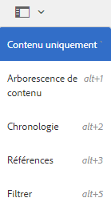

## Création de pages {#page-authoring}

Lors de la création de pages, les zones structurelles sont les suivantes.

### Cadre de contenu {#content-frame}

Le rendu du contenu de la page est effectué dans le cadre de contenu. Ce cadre de contenu est totalement indépendant de l’éditeur, afin de garantir l’absence de conflits dus à CSS ou JavaScript.

Le cadre de contenu se situe dans la partie droite de la fenêtre, sous la barre d’outils.

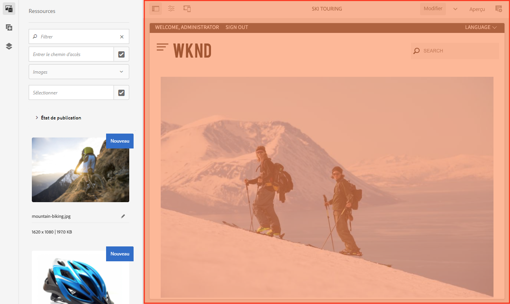

### Cadre d’éditeur {#editor-frame}

Le cadre de l’éditeur active les fonctions de modification.

Le cadre d’éditeur est un conteneur pour l’ensemble des éléments de création de pages. Il se situe au-dessus du cadre de contenu et comprend les éléments suivants :

* Barre d’outils supérieure
* Le panneau latéral
* Toutes les incrustations
* Tout autre élément de création de page ; par exemple, la barre d’outils des composants

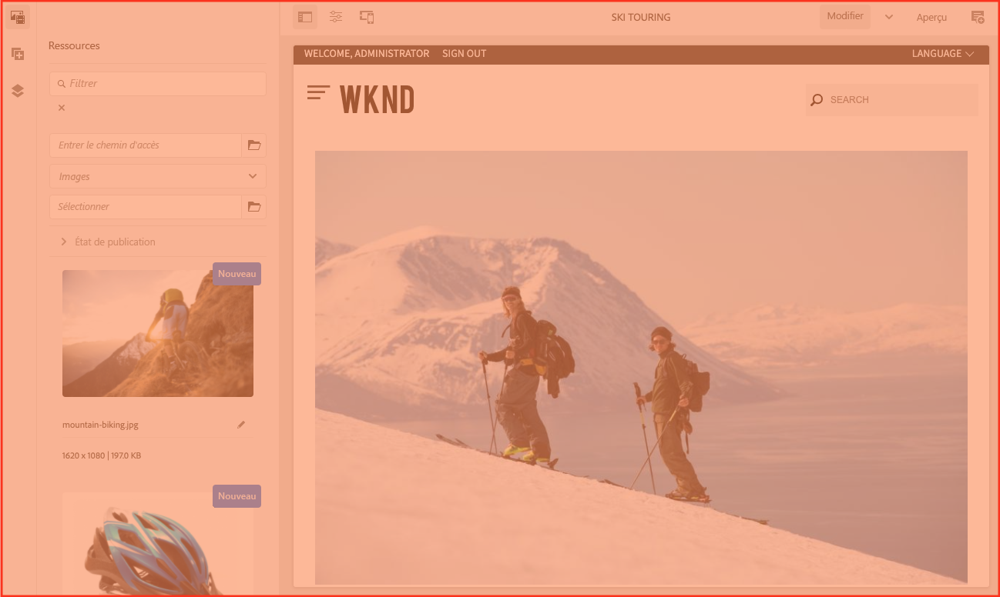

### Panneau latéral {#side-panel}

Il contient trois onglets par défaut. Les onglets **Ressources** et **Composants** vous permettent de sélectionner de tels éléments, de les faire glisser du panneau et de les déposer sur la page. L’onglet Arborescence **du** contenu vous permet d’examiner la hiérarchie du contenu de la page.

Par défaut, le panneau latéral est masqué. Lorsqu&#39;elle est sélectionnée, elle s&#39;affiche soit sur le côté gauche, soit elle glisse sur l&#39;ensemble de la fenêtre lorsque la taille de la fenêtre est inférieure à une largeur de 1 024 px ; comme, par exemple, sur un périphérique mobile.

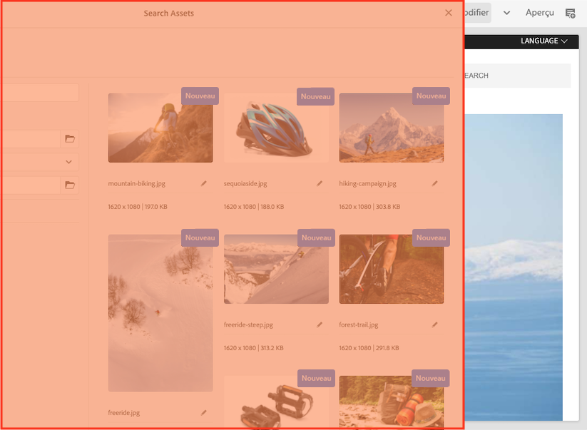

### Panneau latéral – Ressources {#side-panel-assets}

L’onglet Ressources vous permet de faire votre choix parmi un éventail de ressources. Vous pouvez également effectuer un filtrage sur un terme spécifique ou bien sélectionner un groupe.

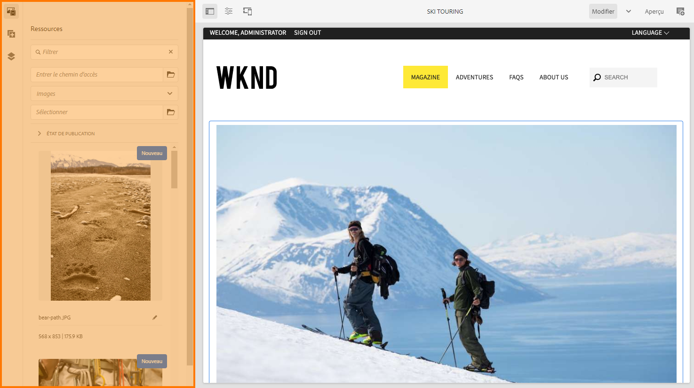

### Panneau latéral – Groupes de ressources {#side-panel-asset-groups}

Dans l’onglet Ressources, vous pouvez utiliser une liste déroulante pour sélectionner les groupes de ressources spécifiques.

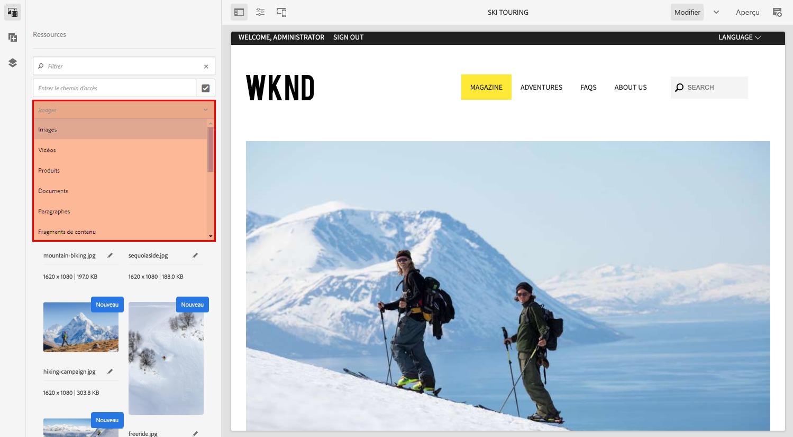

### Panneau latéral – Composants {#side-panel-components}

L’onglet Composants vous propose un éventail de composants à sélectionner. Vous pouvez également effectuer un filtrage sur un terme spécifique ou bien sélectionner un groupe.

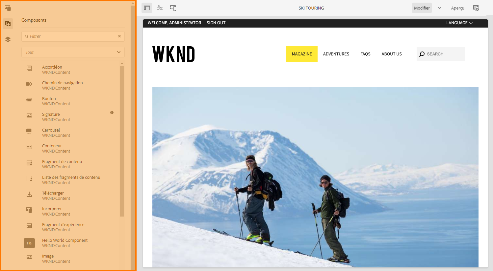

### Panneau latéral - Arborescence de contenu {#side-panel-content-tree}

Dans l’onglet Arborescence du contenu, vous pouvez vue la hiérarchie du contenu de la page. Un clic sur une entrée dans l’onglet permet d’accéder à l’élément et de le sélectionner sur la page dans l’éditeur.

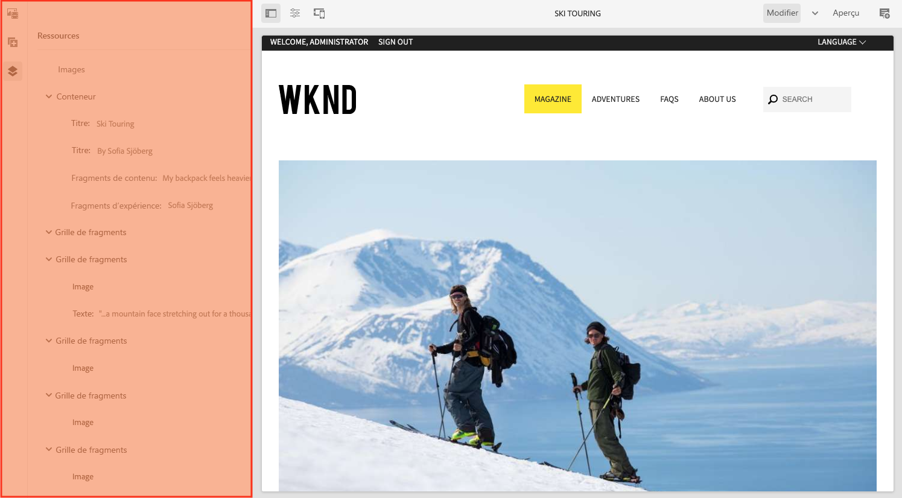

### Recouvrements {#overlays}

Ces incrustations recouvrent le cadre de contenu et sont utilisées par les [calques](#layer) pour appliquer le mécanisme d’interaction (de manière complètement transparente) avec les composants et leur contenu.

Les incrustations résident dans le cadre d’éditeur (avec tous les autres éléments de création de pages) même si, en fait, elles recouvrent les composants appropriés dans le cadre de contenu.

### Calque {#layer}

Un calque est un groupe indépendant de fonctionnalités pouvant être activées pour :

* Fournir une vue différente de la page
* Permet de manipuler et/ou d’interagir avec une page.

Les calques fournissent des fonctionnalités sophistiquées pour toute la page, par opposition aux actions spécifiques sur un composant individuel.

aem est fourni avec plusieurs calques déjà implémentés pour la création de pages ; par exemple, modifier, prévisualisation et annoter des calques.

>[!NOTE]
>
>Les calques constituent une puissante solution qui affecte la manière dont l’utilisateur affiche le contenu de la page et interagit avec celui-ci. Lorsque vous développez vos propres calques, vous devez veiller à ce qu’ils soient effacés lorsque vous les quittez.

### Sélecteur de calques {#layer-switcher}

Le sélecteur de calques vous permet de choisir le calque à utiliser. Lorsqu’il est fermé, il indique le calque en cours d’utilisation.

Le sélecteur de calques se présente sous la forme d’un menu déroulant dans la barre d’outils (dans la partie supérieure de la fenêtre, à l’intérieur du cadre d’éditeur).

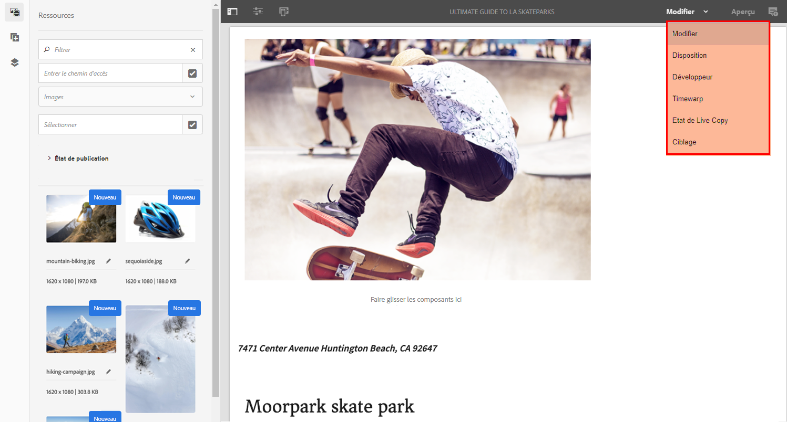

### Barre d’outils des composants {#component-toolbar}

Lorsque vous cliquez sur une instance d’un composant (simple clic ou double-clic lent), sa barre d’outils est affichée. La barre d’outils contient les actions spécifiques (par exemple, copier, coller, ouvrir l’éditeur) disponibles pour l’instance de composant sur la page.

En fonction de l’espace disponible, les barres d’outils de composant sont placées dans le coin supérieur, ou inférieur, droit du composant approprié.

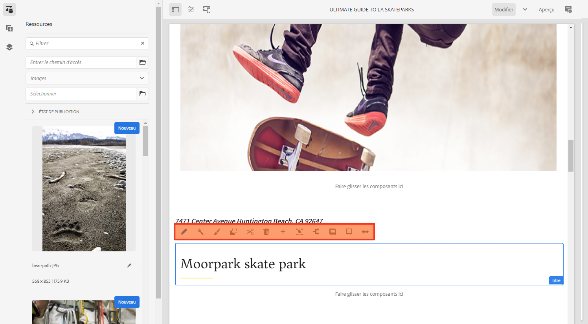

## Informations supplémentaires {#further-information}

<!--For more details about the concepts around the touch-enabled UI, continue to the article [Concepts of the AEM Touch-Enabled UI](/help/sites-developing/touch-ui-concepts.md).-->

Pour plus d’informations techniques, voir la documentation [JS définie](https://helpx.adobe.com/experience-manager/6-5/sites/developing/using/reference-materials/jsdoc/ui-touch/editor-core/index.html) pour l’éditeur de page tactile.
