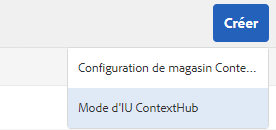
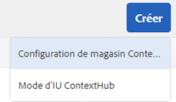

# Configuration de ContextHub {#configuring-contexthub}

ContextHub est un framework permettant de stocker, manipuler et présenter des données contextuelles. Pour plus de détails sur ContextHub, voir [Vue d’ensemble du développement ContextHub](contexthub.md).

Vous pouvez configurer la barre d’outils ContextHub pour contrôler si elle apparaît dans le mode d’aperçu, afin de créer des magasins ContextHub et d’ajouter des modules d’IU.

## Affichage et masquage de l’IU ContextHub {#showing-and-hiding-the-contexthub-ui}

Configurez le service Adobe Granite ContextHub OSGi pour afficher ou masquer l’[IU ContextHub](/help/sites-cloud/authoring/personalization/targeted-content.md) sur vos pages. Le PID de ce service est `com.adobe.granite.contexthub.impl.ContextHubImpl.`

Pour configurer le service, vous pouvez utiliser la [Console web](/help/implementing/deploying/configuring-osgi.md) ou un nœud JCR du référentiel :

* **Console web :** pour afficher l’IU, sélectionnez la propriété Afficher l’IU. Pour masquer l’interface utilisateur, désélectionnez la propriété Masquer l’interface utilisateur.
* **Nœud JCR :** pour afficher l’IU, définissez la propriété booléenne `com.adobe.granite.contexthub.show_ui` sur `true`. Pour masquer l’IU, définissez la propriété sur `false`.

Si l’UI ContextHub est activée, elle s’affiche uniquement sur les pages des instances de création AEM. L’interface utilisateur n’apparaît pas sur les pages des instances de publication.

## Ajout des modes et des modules d’IU ContextHub {#adding-contexthub-ui-modes-and-modules}

Configurez les modes et modules d’interface utilisateur qui s’affichent dans la barre d’outils ContextHub en mode d’aperçu :

* Modes d’interface utilisateur : groupes de modules connexes
* Modules : widgets qui exposent les données contextuelles d’un magasin et permettent aux auteurs et aux autrices de manipuler le contexte

Les modes d’IU s’affichent sous forme d’une série d’icônes dans la partie gauche de la barre d’outils. Lorsque cette option est sélectionnée, les modules d’un mode d’interface utilisateur s’affichent à droite.


Les icônes sont des références de la [bibliothèque d’icônes CoralUI](https://opensource.adobe.com/coral-spectrum/examples/#icon).

### Ajout d’un mode d’IU {#adding-a-ui-mode}

Ajoutez un mode d’IU afin de regrouper les modules ContextHub associés. Lorsque vous créez le mode d’interface utilisateur, vous fournissez le titre et l’icône qui s’affichent dans la barre d’outils ContextHub.

1. Sur le rail d’Experience Manager, sélectionnez Outils > Sites > ContextHub.
1. Sélectionnez le conteneur de configuration par défaut.
1. Sélectionnez la Configuration de ContextHub.
1. Sélectionnez le bouton Créer , puis sélectionnez Mode d’interface utilisateur ContextHub.

   

1. Saisissez les valeurs pour les propriétés suivantes :

   * Titre du mode d’IU : titre qui identifie le mode d’IU.
   * Icône de mode : sélecteur de l’[icône de l’IU Coral](https://opensource.adobe.com/coral-spectrum/examples/#icon) à utiliser ; par exemple `coral-Icon--user`.
   * Activé : sélectionnez cette option pour afficher le mode d’interface utilisateur dans la barre d’outils ContextHub

1. Sélectionnez Enregistrer.

### Ajout d’un module d’IU {#adding-a-ui-module}

Ajoutez un module d’IU ContextHub à un mode d’IU afin qu’il s’affiche dans la barre d’outils ContextHub pour prévisualiser le contenu d’une page. Lorsque vous ajoutez un module d’IU, vous créez une instance d’un type de module qui est enregistré auprès de ContextHub. Pour ajouter un module d’interface utilisateur, vous devez connaître le nom du type de module associé.

AEM propose un type de module d’IU de base, ainsi que plusieurs types de modules d’IU d’exemple sur lesquels vous pouvez baser un module d’IU. Le tableau suivant présente une brève description de chacun d’entre eux. Pour plus d’informations sur le développement d’un module d’interface utilisateur personnalisé, voir [Création de modules d’interface utilisateur ContextHub](extending-contexthub.md#creating-contexthub-ui-module-types).

Les propriétés du module d’IU incluent une configuration de détails où vous pouvez fournir des valeurs pour des propriétés spécifiques au module. Vous fournissez la configuration de détails au format JSON. La colonne Type de module du tableau fournit des liens vers des informations sur le code JSON requis pour chaque type de module d’UI.

| Type de module | Description | Magasin |
|---|---|---|
| [contexthub.base](sample-modules.md#contexthub-base-ui-module-type) | Type de module d’IU générique | Configuré dans les propriétés du module d’IU |
| [contexthub.browserinfo](sample-modules.md#contexthub-browserinfo-ui-module-type) | Affiche des informations sur le navigateur. | `surferinfo` |
| [contexthub.datetime](sample-modules.md#contexthub-datetime-ui-module-type) | Affiche la date et l’heure. | `datetime` |
| [contexthub.location](sample-modules.md#contexthub-location-ui-module-type) | Affiche la latitude et la longitude du client ou de la cliente, ainsi que l’emplacement sur une carte. Vous permet de modifier l’emplacement. | `geolocation` |
| [contexthub.screen-orientation](sample-modules.md#contexthub-screen-orientation-ui-module-type) | Affiche l’orientation de l’écran de l’appareil (paysage ou portrait). | `emulators` |
| [contexthub.tagcloud](sample-modules.md#contexthub-tagcloud-ui-module-type) | Affiche des statistiques sur les balises de page. | `tagcloud` |
| [granite.profile](sample-modules.md#granite-profile-ui-module-type) | Affiche les informations de profil de l’utilisateur actuel, y compris `authorizableID`, `displayName` et `familyName`. Vous pouvez modifier la valeur de `displayName` et de `familyName`. | `profile` |

1. Sur le rail d’Experience Manager, sélectionnez Outils > Sites > ContextHub.
1. Sélectionnez le conteneur de configuration auquel vous souhaitez ajouter un module d’IU.
1. Sélectionnez ou saisissez la configuration ContextHub à laquelle vous souhaitez ajouter le module d’IU.
1. Sélectionnez le mode d’IU auquel vous ajoutez le module d’IU.
1. Sélectionnez le bouton Créer , puis sélectionnez Module d’IU ContextHub (générique).

   

1. Saisissez les valeurs pour les propriétés suivantes :

   * Titre du module d’UI : titre qui identifie le module d’UI
   * Type de module : le type de module
   * Activé : sélectionnez cette option pour afficher le module d’UI dans la barre d’outils ContextHub

1. (Facultatif) Pour remplacer la configuration de magasin par défaut, saisissez un objet JSON pour configurer le module d’UI.
1. Sélectionnez Enregistrer.

## Création d’un magasin ContextHub {#creating-a-contexthub-store}

Créez un magasin ContextHub pour conserver les données utilisateur et accéder aux données selon vos besoins. Les magasins ContextHub sont basés sur des candidats de magasins enregistrés. Lorsque vous créez le magasin, vous avez besoin de la valeur du paramètre storeType avec lequel le candidat de magasin a été enregistré. (Voir [Création de candidats de magasin personnalisés](extending-contexthub.md#creating-custom-store-candidates).)

### Configuration de magasin détaillée {#detailed-store-configuration}

Lorsque vous configurez un magasin, la propriété Configuration de détails vous permet de fournir des valeurs pour les propriétés spécifiques au magasin. La valeur est basée sur le paramètre `config` de la fonction `init` du magasin. Par conséquent, la nécessité de fournir ou non cette valeur et son format dépend du magasin.

La valeur de la propriété Configuration de détails est un objet `config` au format JSON.

### Exemples de candidats de magasins {#sample-store-candidates}

AEM fournit des exemples de candidats de magasins sur lesquels vous pouvez baser un magasin.

| Type de magasin | Description |
|---|---|
| [aem.segmentation](sample-stores.md#aem-segmentation-sample-store-candidate) | Magasin pour les segments ContextHub résolus et non résolus. Récupère automatiquement les segments de SegmentManager ContextHub |
| [contexthub.geolocation](sample-stores.md#contexthub-geolocation-sample-store-candidate) | Stocke la latitude et la longitude de l’emplacement du navigateur. |
| [granite.emulators](sample-stores.md#granite-emulators-sample-store-candidate) | Définit les propriétés et les fonctionnalités d’un certain nombre d’appareils et détecte l’appareil client actuel. |
| [granite.profile](sample-stores.md#granite-profile-sample-store-candidate) | Stocke les données de profil de l’utilisateur actuel. |
| [contexthub.surferinfo](sample-stores.md#contexthub-surferinfo-sample-store-candidate) | Stocke des informations sur le client, telles que les informations relatives à l’appareil, le type de navigateur et l’orientation de la fenêtre. |

1. Sur le rail d’Experience Manager, sélectionnez Outils > Sites > ContextHub.
1. Sélectionnez le conteneur de configuration par défaut.
1. Sélectionner la configuration Contexthub
1. Pour ajouter un magasin, sélectionnez l’icône Créer , puis Configuration de magasin ContextHub.

   

1. Indiquez les valeurs des propriétés de configuration de base, puis sélectionnez Suivant :

   * **Titre de configuration :** le titre qui identifie le magasin
   * **Type de magasin :** la valeur de la propriété storeType du magasin candidat sur laquelle baser le magasin
   * **Obligatoire :** sélectionnez cette option.
   * **Activé :** sélectionnez cette option pour activer le magasin

1. (Facultatif) Pour remplacer la configuration de magasin par défaut, saisissez un objet JSON dans la zone Configuration des détails (JSON).
1. Sélectionnez Enregistrer.

## Exemple : en utilisant un service JSONP  {#example-using-a-jsonp-service}

Cet exemple illustre comment configurer un magasin et afficher les données dans un module d’IU. Dans cet exemple, le service MD5 du site jsontest.com est utilisé comme source de données pour un magasin. Le service renvoie le code de hachage MD5 d’une chaîne donnée, au format JSON.

Le magasin contexthub.generic-jsonp est configuré de sorte qu’il stocke les données de l’appel de service `https://md5.jsontest.com/?text=%22text%20to%20md5%22`. Le service renvoie les données suivantes qui s’affichent dans un module d’IU :

```javascript
{
   "md5": "919a56ab62b6d5e1219fe1d95248a2c5",
   "original": "\"text to md5\""
}
```

### Création d’un magasin contexthub.generic-jsonp {#creating-a-contexthub-generic-jsonp-store}

L’exemple de candidat de magasin contexthub.generic-jsonp vous permet de récupérer les données d’un service JSONP ou web qui renvoie des données JSON. Pour ce candidat de magasin, utilisez la configuration de magasin afin de fournir les détails du service JSONP à utiliser.

La fonction [init](contexthub-api.md#init-name-config) de la classe JavaScript `ContextHub.Store.JSONPStore` définit un objet `config` qui initialise ce candidat de magasin. L’objet `config` contient un objet `service` qui inclut des détails sur le service JSONP. Pour configurer le magasin, il vous suffit de fournir l’objet `service` au format JSON comme valeur de la propriété Configuration de détails.

Pour enregistrer les données à partir du service MD5 du site jsontest.com, suivez la procédure décrite dans [Création d’un magasin ContextHub](#creating-a-contexthub-store) à l’aide des propriétés suivantes :

* **Titre de configuration :** md5
* **Type de magasin :** contexthub.generic-jsonp
* **Obligatoire :** sélectionnez cette option.
* **Activé :** sélectionnez cette option.
* **Configuration des détails (JSON) :**

  ```javascript
  {
   "service": {
   "jsonp": false,
   "timeout": 1000,
   "ttl": 1800000,
   "secure": false,
   "host": "md5.jsontest.com",
   "port": 80,
   "params":{
   "text":"text to md5"
       }
     }
   }
  ```

### Ajout d’un module d’IU pour les données MD5 {#adding-a-ui-module-for-the-md-data}

Ajoutez un module d’IU à la barre d’outils ContextHub pour afficher les données stockées dans l’exemple de magasin MD5. Dans cet exemple, le module contexthub.base est utilisé pour générer le module d’IU suivant :


Utilisez la procédure décrite dans [Ajout d’un module d’IU](#adding-a-ui-module) pour ajouter le module d’IU à un mode d’IU existant, comme l’exemple de mode d’IU Persona. Pour le module d’IU, utilisez les valeurs de propriété suivantes :

* **Titre du module d’IU :** MD5
* **Type de module :** contexthub.base.
* **Configuration des détails (JSON) :**

  ```javascript
  {
   "icon": "coral-Icon--data",
   "title": "MD5 Conversion",
   "storeMapping": { "md5": "md5" },
   "template": "<p> {{md5.original}}</p>;
                <p>{{md5.md5}}</p>"
  }
  ```

## Débogage de ContextHub {#debugging-contexthub}

Une procédure de débogage pour ContextHub peut être activée afin de permettre la résolution des incidents. Le mode de débogage peut être activé via la configuration ContextHub ou via CRXDE.

### Via la configuration {#via-the-configuration}

Modifiez la configuration de ContextHub et cochez l’option **Débogage**.

1. Dans le rail, sélectionnez **Outils > Sites > ContextHub**
1. Sélectionnez le **Conteneur de configurations** par défaut
1. Sélectionnez la **Configuration ContextHub** puis sélectionnez **Modifier l’élément sélectionné**
1. Sélectionnez **Déboguer** puis **Enregistrer**.

### Via CRXDE {#via-crxde}

Utilisez CRXDE Lite pour définir la propriété `debug` sur **true** sous :

* `/conf/global/settings/cloudsettings` ou
* `/conf/<site>/settings/cloudsettings`

### COnsigner des messages de débogage pour ContextHub {#logging-debug-messages-for-contexthub}

Configurez le service OSGi ContextHub d’Adobe Granite (PID = `com.adobe.granite.contexthub.impl.ContextHubImpl`) pour consigner des messages de débogage détaillés qui s’avèrent utiles dans le cadre du développement.

Pour configurer le service, vous pouvez utiliser la [Console web](/help/implementing/deploying/configuring-osgi.md) ou un nœud JCR du référentiel :

* Console web : pour consigner des messages de débogage, sélectionnez la propriété Debug.
* Nœud JCR : pour consigner des messages de débogage, définissez la propriété booléenne `com.adobe.granite.contexthub.debug` sur `true`.

### Mode silencieux {#silent-mode}

Le mode silencieux supprime toutes les informations de débogage. Contrairement à l’option de débogage normal, qui peut être définie séparément pour chaque configuration ContextHub, le mode silencieux est un paramètre global qui est prioritaire par rapport à tout paramètre de débogage au niveau de la configuration de ContextHub.

Cela est utile pour votre instance de publication, où vous ne souhaitez pas voir d’informations de débogage. Puisqu’il s’agit d’un paramètre global, il est activé via OSGi.

1. Ouvrez la **Configuration de la console web Adobe Experience Manager** à l’adresse `http://<host>:<port>/system/console/configMgr`
1. Recherchez **Adobe Granite ContextHub**.
1. Cliquez sur la configuration **Adobe Granite ContextHub** pour en modifier les propriétés.
1. Cochez l’option **Mode silencieux** et cliquez sur **Enregistrer**.

## Désactiver ContextHub {#disabling-contexthub}

ContextHub peut être désactivé pour éviter qu’il charge js/css et s’initialise. Il existe deux options pour désactiver ContextHub :

* Modifiez la configuration de ContextHub et cochez l’option **Désactiver ContextHub**

   1. Dans le rail, sélectionnez **Outils > Sites > ContextHub**
   1. Sélectionnez le **Conteneur de configurations** par défaut
   1. Sélectionnez la **Configuration ContextHub** puis sélectionnez **Modifier l’élément sélectionné**
   1. Sélectionnez **Désactiver ContextHub** et sélectionnez **Enregistrer**

ou

* Utilisez CRXDE Lite pour définir la propriété `disabled` sur **true** sous `/conf/global/settings/cloudsettings/<configName>/contexthub`.
