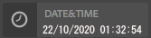
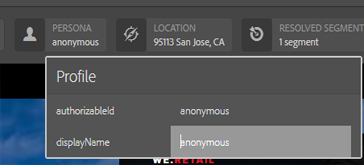

# Exemples de types de module d’IU ContextHub {#sample-contexthub-ui-module-types}

ContextHub fournit plusieurs exemples de module d’IU que vous pouvez utiliser dans vos solutions. Les informations suivantes sont fournies :

* Fonctionnalités principales du module d’IU.
* Où trouver le code source afin de pouvoir l’ouvrir à des fins d’apprentissage.
* Configuration du module d’IU.

Pour plus d’informations sur l’ajout de modules d’IU à ContextHub, voir [Ajout d’un module d’IU](configuring-contexthub.md#adding-a-ui-module). Pour plus d’informations sur le développement de modules d’IU, voir [Création de types de modules d’IU ContextHub](extending-contexthub.md#creating-contexthub-ui-module-types).

## Type de module d’IU contexthub.base {#contexthub-base-ui-module-type}

Le type de module d’IU contexthub.base est le type de base pour tous les autres types de module d’IU. En tant que tel, il fournit des fonctionnalités génériques pour le rendu des données de magasin.

Les fonctionnalités suivantes sont disponibles :

* **Titre et icône :** spécifiez un titre pour le module d’IU et une icône. L’icône peut être référencée à l’aide d’une URL ou de la bibliothèque d’icônes de l’IU Coral.
* **Stockage des données :** identifiez un ou plusieurs magasins à partir desquels récupérer les données.
* **Contenu :** spécifiez le contenu qui s’affiche dans le module d’IU tel qu’il apparaît dans la barre d’outils ContextHub.
* **Contenu de fenêtre contextuelle :** spécifiez le contenu visible dans la fenêtre contextuelle lorsque vous cliquez ou appuyez sur le module d’IU.
* **Mode Plein écran :** permet de contrôler si le mode plein écran est autorisé.

Le code source se trouve dans `/libs/granite/contexthub/code/ui/container/js/ContextHub.UI.BaseModuleRenderer.js`.

### Configuration {#configuration}

Configurez le module d’IU contexthub.base à l’aide d’un objet JavaScript au format JSON. Incluez l’une des propriétés suivantes pour configurer les fonctionnalités du module d’IU :

* **image :** URL d’une image à afficher en tant qu’icône.
* **icon :** nom d’une classe d’icône [IU Coral](https://opensource.adobe.com/coral-spectrum/examples/#icon). Si vous spécifiez une valeur pour les propriétés de l’icône et de l’image, l’image est utilisée.
* **title :** nom du module d’IU. Le titre apparaît lorsque le pointeur s’arrête sur l’icône du module d’IU.
* **fullscreen :** valeur booléenne qui indique si le module d’IU prend en charge le mode plein écran. Utilisez `true` pour prendre en charge le mode plein écran et `false` pour ne pas accepter le mode plein écran.
* **template :** modèle [Handlebars](https://handlebarsjs.com/) qui spécifie le contenu à afficher dans la barre d’outils ContextHub. Utilisez au maximum deux balises `<p>`.
* **storeMapping :** mappage de clé/magasin. Utilisez la clé dans les modèles Handlebar pour accéder aux données de magasin ContextHub associées.
* **list :** tableau d’éléments à afficher en tant que liste dans une fenêtre contextuelle lorsque l’on clique sur le module d’IU. Si vous ajoutez cet élément, n’incluez pas popoverTemplate. La valeur est un tableau d’objets avec les clés suivantes :
   * title : le texte à afficher pour cet élément ;
   * image : (facultatif) URL d’une image qui doit être affichée à gauche ;
   * icon : (facultatif) une classe d’icône CUI qui doit s’afficher à gauche ; ignorée si une image est spécifiée ;
   * selected : (facultatif) valeur booléenne qui spécifie si cet élément doit être affiché comme sélectionné (true=selected). Par défaut, les éléments sélectionnés sont visibles en gras. Utilisez une propriété `listType` pour configurer d’autres aspects (voir ci-dessous).
* **listType :** style à utiliser pour les éléments de liste déroulante. Utilisez l’une des valeurs suivantes :
   * checkmark
   * checkbox
   * radio
* **popoverTemplate :** modèle Handlebars qui spécifie le contenu à afficher dans une fenêtre contextuelle lorsque l’on clique sur le module d’IU. Si vous ajoutez cet élément, n’incluez pas l’élément `list`.

### Exemple {#example}

L’exemple suivant configure un module d’IU `ontexthub.base` pour afficher des informations issues d’un magasin [contexthub.emulators](sample-stores.md#granite-emulators-sample-store-candidate). L’élément `template` montre comment obtenir les données du magasin en utilisant la clé que l’élément `storeMapping` établit.

```javascript
{
   "icon": "coral-Icon--move",
    "title": "Screen Resolution",
    "storeMapping": {
      "emulator": "emulators"
    },
    "template": "<p>{{{ i18n \"Resolution\"}}}</p><p>{{{emulator.currentDevice.width}}} x {{{emulator.currentDevice.height}}}</p>"
}
```


## Type de module d’UI contexthub.browserinfo {#contexthub-browserinfo-ui-module-type}

Le module d’IU `contexthub.browserinfo` affiche des informations sur le navigateur web du client et son système d’exploitation. Les informations sont obtenues à partir du magasin surferinfo, en fonction du magasin candidat [contexthub.surferinfo](sample-stores.md#contexthub-surferinfo-sample-store-candidate).


Le code source du module d’IU est disponible dans `/libs/granite/contexthub/components/modules/browserinfo`. Bien que `contexthub.browserinfo` étende le module d’IU `contexthub.base`, il ne remplace ni ne fournit de fonctions supplémentaires. L’implémentation offre une configuration par défaut pour le rendu des informations du navigateur.

### Configuration {#configuration-1}

Les instances du module d’IU contexthub.browserinfo ne requièrent pas de valeur pour la configuration détaillée. Le texte JSON suivant représente la configuration par défaut du module.

```javascript
{
   "icon":"coral-Icon--globe",
   "title":"Browser/OS Information",
   "storeMapping":{"surferinfo":"surferinfo"},
   "template":"<p>{{surferinfo.browser.family}} {{surferinfo.browser.version}}</p><p>{{surferinfo.os.name}} {{surferinfo.os.version}}</p>"
}
```

## Type de module d’IU contexthub.datetime {#contexthub-datetime-ui-module-type}

Le module d’IU `contexthub.datetime` affiche la date et l’heure stockées dans un magasin nommé datetime, basé sur le magasin candidat `contexthub.datetime`.



Le module fournit un formulaire contextuel qui vous permet de modifier la date et l’heure dans le magasin.

La source du module d’IU `contexthub.datetime` se trouve à l’adresse `/libs/granite/contexthub/components/modules/datetime`.

### Configuration {#configuration-2}

Les instances du module d’IU contexthub.datetime ne requièrent pas de valeur pour la configuration détaillée. Le texte JSON suivant représente la configuration par défaut du module.

```javascript
{
   "icon":"coral-Icon--clock",
   "title":"DATE&TIME",
   "clickable":true,
   "storeMapping":{"d":"datetime"},
   "template":"<p class=\"contexthub-module-line1\">{{i18n \"Date&Time\"}}</p><p class=\"contexthub-module-line2\">{{d.formatted.locale.date}} {{d.formatted.locale.time}}</p>",
   "popoverTemplate":"<div class=\"datetime center\"><div class=\"coral-DatePicker-calendar\" data-init=\"datepicker\"><input class=\"coral-Textfield\" type=\"datetime\" value=\"{{d.formatted.iso}}\"><button class=\"coral-Button coral-Button--secondary coral-Button--square\" title=\"{{i18n \"Datetime picker\"}}\"><i class=\"coral-Icon coral-Icon--calendar coral-Icon--sizeS\"></i></button></div></div>"
}
```

## Type de module d’IU contexthub.location {#contexthub-location-ui-module-type}

Le module d’IU `contexthub.location` affiche la longitude et la latitude du client. Le module présente une fenêtre contextuelle qui affiche une carte Google sur laquelle vous pouvez cliquer pour modifier l’emplacement actuel. Le module obtient des informations à partir d’un magasin ContextHub nommé geolocation et basé sur le magasin candidat [granite.geolocation](sample-stores.md#contexthub-geolocation-sample-store-candidate).


La source du module d’IU se trouve à l’adresse `/etc/cloudsettings/default/contexthub/geolocation`.

### Configuration {#configuration-4}

Les instances du module d’IU contexthub.geolocation ne requièrent pas de valeur pour la configuration détaillée. Le texte JSON suivant représente la configuration par défaut du module.

```javascript
{
 "icon":"coral-Icon--compass",
 "title":"Location",
 "clickable":true,
 "editable":{"key":"/geolocation","disabled":[],"hidden":["/geolocation/generatedThumbnail","/geolocation/city","/geolocation/country"]},
 "fullscreen":true,
 "storeMapping":{"g":"geolocation"},
 "template":"<p>{{i18n \"Location\"}}</p><p>{{g.address.postalCode}} {{g.address.city}}{{#if g.address.city}}{{#if g.address.region}},{{/if}}{{/if}} {{g.address.region}}</p>",
 "list":[
  {"title":"Basel, Switzerland",
  "data":{"longitude":7.58929,"latitude":47.554746,"city":"Basel","country":"Switzerland"}},
  {"title":"Melbourne, Australia",
  "data":{"longitude":144.96328,"latitude":-37.814107,"city":"Melbourne","country":"Australia"}},
  {"title":"Beijing, China",
  "data":{"longitude":116.407526,"latitude":39.90403,"city":"Beijing","country":"China"}},
  {"title":"New York, NY, USA",
  "data":{"longitude":-74.005973,"latitude":40.714353,"city":"New York","country":"United States"}},
  {"title":"Paris, France",
  "data":{"longitude":2.352222,"latitude":48.856614,"city":"Paris","country":"France"}},
  {"title":"Rio de Janeiro, Brazil",
  "data":{"longitude":-43.20071,"latitude":-22.913395,"city":"Rio","country":"Brazil"}},
  {"title":"San Jose, CA, USA",
  "data":{"longitude":-121.894955,"latitude":37.339386,"city":"San Jose","country":"United States"}},
  {"title":"Tokyo, Japan",
  "data":{"longitude":139.691706,"latitude":35.689487,"city":"Shinjuku","country":"Japan"}}
 ],
 "listType":"checkmark"
}
```

## Type de module d’IU contexthub.screen-orientation {#contexthub-screen-orientation-ui-module-type}

Le module d’IU `contexthub.screen-orientation` affiche l’orientation actuelle de l’écran du client. Bien que désactivé par défaut, le module présente une fenêtre contextuelle qui permet de sélectionner une orientation. Le module obtient des informations à partir d’un magasin ContextHub nommé emulators et basé sur le magasin candidat [granite.emulators](sample-stores.md#granite-emulators-sample-store-candidate).


La source du module d’IU se trouve à l’adresse `/libs/granite/contexthub/components/modules/screen-orientation`.

### Configuration {#configuration-5}

Les instances du module d’IU `contexthub.screen-orientation` ne nécessitent pas de valeur pour la configuration détaillée. Le texte JSON suivant représente la configuration par défaut du module. La propriété `clickable` est définie sur `false` par défaut. Si vous remplacez la configuration par défaut pour définir `clickable` sur `true`, cliquez sur le module pour afficher un pop-up dans lequel vous pouvez sélectionner l’orientation.

```javascript
{
   "icon":"coral-Icon--rotateRight",
   "title":"Screen Orientation",
   "clickable":false,
   "storeMapping":{"emulator":"emulators"},
   "template":"<p>{{{ i18n \"Screen Orientation\" }}}</p><p>{{{ emulator.currentDevice.orientation }}}",
   "listReference":"/emulators/orientations",
   "listType":"checkmark"
}
```

## Type de module d’IU contexthub.tagcloud {#contexthub-tagcloud-ui-module-type}

Le module d’IU `contexthub.tagcloud` affiche des informations sur les balises. Dans la barre d’outils, le module d’IU affiche le nombre de balises. Le pop-up affiche un nuage de balises et une zone de texte pour l’ajout de nouvelles balises. Le module obtient des informations à partir d’un magasin ContextHub nommé tagcloud et basé sur le magasin candidat `contexthub.tagcloud`.


La source du module d’IU se trouve à l’adresse `/libs/granite/contexthub/components/modules/tagcloud`.

### Configuration {#configuration-6}

Les instances du module d’IU `contexthub.tagcloud` ne nécessitent pas de valeur pour la configuration détaillée. Le texte JSON suivant représente la configuration par défaut du module.

```javascript
{
   "icon":"coral-Icon--tag",
   "title":"TagCloud",
   "clickable":true,
   "storeMapping":{"t":"tagcloud"},
   "maxTags":20,
   "template":"<p class=\"contexthub-module-line1\">{{i18n \"TagCloud\"}}</p><p class=\"contexthub-module-line2\">{{stats.total}} {{i18n \"Tags\"}}</p>",
   "popoverTemplate":"<div class=\"contexthub-popover-content center\"><p class=\"stats\">{{stats.total}} {{i18n \"Tags\"}} | {{stats.hits}} {{i18n \"Hits\"}} | {{i18n \"Last tag\"}}: {{#if stats.recent}}{{stats.recent}}{{else}}{{i18n \"Unknown\"}}{{/if}}</p><p class=\"tagcloud\">{{#each tags}}<span class=\"tag{{this.weight}}\">{{this.name}}</span> {{/each}}</p><div class=\"coral-InputGroup\"><input type=\"text\" class=\"coral-InputGroup-input coral-Textfield tag-name\" placeholder=\"{{i18n \"Add a namespace:my/tag\"}}\" pattern=\"^[A-Za-z0-9_\\-]+(:[A-Za-z0-9_\\-\\/]+)?$\" title=\"{{i18n \"namespace:my/tag\"}}\"><span class=\"coral-InputGroup-button\"><button class=\"coral-Button coral-Button--secondary coral-Button--square contexthub-new-tag\" type=\"button\" title=\"{{i18n \"increment\"}}\"><i class=\"coral-Icon coral-Icon--sizeS coral-Icon--add\"></i></button></span></div></div>"
}
```

## Type de module d’IU granite.profile {#granite-profile-ui-module-type}

Le module d’IU ContextHub `granite.profile` affiche le nom d’affichage de l’utilisateur actuel. Le pop-up affiche le nom d’utilisateur et permet de modifier la valeur du nom d’affichage. Le module obtient des informations à partir d’un magasin ContextHub nommé profile et basé sur le magasin candidat [granite.profile](sample-stores.md#granite-profile-sample-store-candidate).



La source du module d’IU se trouve à l’adresse `/libs/granite/contexthub/components/modules/profile`.

### Configuration {#configuration-7}

Les instances du module d’IU `granite.profile` ne nécessitent pas de valeur pour la configuration détaillée. Le texte JSON suivant représente la configuration par défaut du module.

```javascript
{
   "icon":"coral-Icon--user",
   "title":"Profile",
   "clickable":true,
   "editable":{
      "key":"/profile",
      "disabled":["/profile/authorizableId"],
      "hidden":["/profile/avatar","/profile/path"]},
   "storeMapping":{"p":"profile"},
   "template":"<p class=\"contexthub-module-line1\">{{i18n \"Persona\"}}</p><p class=\"contexthub-module-line2\">{{p.displayName}}</p>",
   "listType":"checkmark"
}
```
