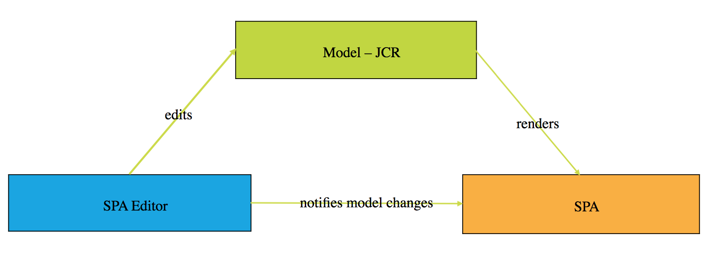

# Aperçu de l’éditeur d’application d’une seule page {#spa-editor-overview}

Les applications d’une seule page (SPA) peuvent améliorer considérablement l’expérience des utilisateurs de sites web. Le souhait des développeurs est de pouvoir créer des sites avec des structures SPA. Les auteurs, pour leur part, souhaitent modifier facilement du contenu dans AEM pour un site conçu à l’aide de telles structures.

L’éditeur de SPA constitue une solution complète pour la prise en charge des SPA dans AEM. Cette page fournit un aperçu de la structure de la prise en charge des SPA dans AEM, du fonctionnement de l’éditeur de SPA et de la synchronisation entre la structure SPA et AEM.

## Présentation {#introduction}

Les sites créés à l’aide de structures SPA courantes, telles que React et AngularJS, chargent leur contenu via le format JSON dynamique et ne fournissent pas la structure HTML dont l’éditeur de page AEM a besoin pour passer des commandes de modification.

Pour activer la modification d’applications d’une seule page dans AEM, il faut qu’il y ait une correspondance entre la sortie JSON de l’application et le modèle de contenu dans le répertoire AEM afin d’enregistrer les modifications apportées au contenu.

La prise en charge des applications d’une seule page dans AEM s’accompagne d’une fine couche JS qui interagit avec le code JS de l’application lorsqu’elle est chargée dans l’éditeur de pages avec lequel des événements peuvent être envoyés. L’emplacement des commandes d’édition peut être activé pour permettre une modification en contexte. Cette fonction repose sur le concept de point de terminaison de l’API Content Services, étant donné que le contenu de l’application d’une seule page doit être chargé par le biais de Content Services.

Pour de plus amples informations sur les SPA dans AEM, consultez les documents suivants :

* [Plan directeur de SPA](blueprint.md) pour connaître les exigences techniques d’une SPA
* [Prise en main des applications monopages en AEM à l’aide de React](getting-started-react.md) pour découvrir rapidement une application monopage simple à l’aide de React
* [Prise en main des applications monopages en AEM à l’aide d’Angular](getting-started-angular.md) pour une visite rapide d’une application monopage simple à l’aide d’Angular

## Concevoir {#design}

Le composant de page d’une application d’une seule page ne fournit pas les composants HTML de ses composants enfants via le fichier HTL ou JSP. Cette opération est déléguée à la structure SPA. La représentation des composants ou du modèle enfant est récupérée en tant que structure de données JSON à partir du JCR. Les composants SPA sont ensuite ajoutés à la page en fonction de cette structure. Ce comportement permet de différencier la composition initiale du corps du composant de page à partir d’équivalents non SPA.

### Gestion du modèle de page {#page-model-management}

The resolution and the management of the page model is delegated to a provided `PageModel` library. L’application d’une seule page doit utiliser la bibliothèque de modèles de page pour être initialisée et créée par l’éditeur d’applications d’une seule page. La bibliothèque de modèle de page est fournie indirectement au composant de page AEM via le npm `cq-react-editable-components`. Le modèle de page est un interpréteur entre AEM et l’application d’une seule page. Par conséquent, elle doit toujours être présente. Lorsque la page est créée, une bibliothèque supplémentaire `cq.authoring.pagemodel.messaging` doit être ajoutée afin de permettre la communication avec l’éditeur de page.

Si le composant de page SPA hérite du composant principal de la page, deux options sont possibles pour faire en sorte que la catégorie de la bibliothèque cliente `cq.authoring.pagemodel.messaging` soit disponible :

* Si le modèle est modifiable, ajoutez-le à la stratégie de page.
* Vous pouvez également ajouter les catégories via `customfooterlibs.html`.

Pour chaque ressource du modèle exporté, l’application d’une seule page met en correspondance un composant réel qui effectue le rendu. Le modèle, représenté sous la forme JSON, est ensuite rendu à l’aide des mappages de composants au sein d’un conteneur.

>[!CAUTION]
>
>The inclusion of the `cq.authoring.pagemodel.messaging` category should be limited to the context of the SPA Editor.

### Type de données de communication {#communication-data-type}

When the `cq.authoring.pagemodel.messaging` category is added to the page, it will send a message to the Page Editor to establish the JSON communication data type. Lorsque le type de données de communication est défini sur JSON, les requêtes GET communiquent avec les points de terminaison du modèle Sling d’un composant. À la suite d’une mise à jour dans l’éditeur de page, la représentation JSON du composant mis à jour est envoyée à la bibliothèque modèle de page. Celle-ci informe ensuite l’application d’une seule page des mises à jour.

## Workflow {#workflow}

Vous pouvez comprendre le flux de l’interaction entre l’application d’une seule page et l’AEM en considérant l’éditeur d’une seule page comme un médiateur entre les deux.

* La communication s’effectue au format JSON au lieu du format HTML.
* L’éditeur de page fournit la dernière version du modèle de page à l’application d’une seule page par le biais de l’API de messagerie et de l’iFrame.
* Le gestionnaire de modèles de pages informe l’éditeur qu’il est prêt pour le montage et transmet le modèle de page sous la forme d’une structure JSON.
* L’éditeur ne modifie pas la structure DOM de la page en cours de création ; en fait, il n’y accède même pas. Au lieu de cela, il fournit le modèle de page le plus récent.

### Processus de l’éditeur d’applications monopages de base {#basic-spa-editor-workflow}

En gardant à l’esprit les éléments clés de l’éditeur d’applications monopages, la procédure de modification d’une application d’une seule page d’une AEM s’affiche comme suit pour l’auteur.

1. L’éditeur d’applications monopages se charge.
1. L’application d’une seule page est chargée dans un cadre distinct.
1. L’application d’une seule page demande du contenu JSON et effectue le rendu des composants côté client.
1. SPA Editor détecte les composants rendus et génère des incrustations.
1. L’auteur clique sur l’incrustation et affiche la barre d’outils de modification du composant.
1. L’éditeur d’applications monopages conserve les modifications avec une demande de POST adressée au serveur.
1. L’éditeur d’applications monopages demande la mise à jour de JSON dans l’éditeur d’applications monopages, qui est envoyé à l’application avec un Événement DOM.
1. L’application d’une seule page effectue le rendu du composant concerné, en mettant à jour son DOM.

>[!NOTE]
>
>Gardez à l’esprit :
>
>* Le SPA est toujours responsable de son affichage.
>* L’éditeur d’application d’une seule page est isolé de l’application d’une seule page.
>* En production (publication), l’éditeur d’application d’une seule page n’est jamais chargé.

### Processus de montage de page client-serveur {#client-server-page-editing-workflow}

Il s’agit d’un aperçu plus détaillé de l’interaction client-serveur lors de la modification d’une application d’une seule page.

1. L’application d’une seule page s’initialise et demande le modèle auprès de l’exportateur de modèle Sling.
1. À son tour, l’exportateur demande au référentiel les ressources qui composent la page.
1. Le référentiel renvoie alors les ressources demandées.
1. L’exportateur de modèle Sling renvoie le modèle de la page.
1. L’application d’une seule page instancie ses composants sur la base du modèle de page.
1. **6a** Le contenu informe l’éditeur qu’il est prêt pour la création.

   **6b** L’éditeur de page demande les configurations de création du composant.

   **6c** L’éditeur de page reçoit les configurations de composant.
1. Lorsque l’auteur modifie un composant, l’éditeur de page envoie une demande de modification au servlet POST par défaut.
1. La ressource est mise à jour dans le référentiel.
1. La ressource mise à jour est fournie au servlet POST.
1. Le servlet POST par défaut informe l’éditeur de page que la ressource a été mise à jour.
1. L’éditeur de page demande le nouveau modèle de page.
1. Les ressources qui composent la page font l’objet d’une demande auprès du référentiel.
1. Les ressources qui composent la page sont fournies à l’exportateur de modèle Sling par le référentiel.
1. Le modèle de page mis à jour est renvoyé à l’éditeur.
1. L’éditeur de page met à jour la référence de modèle de page de l’application d’une seule page.
1. L’application d’une seule page met à jour ses composants en fonction de la nouvelle référence de modèle de page.
1. Les configurations de composant des éditeurs de page sont mises à jour.

   **17a** L’application d’une seule page signale à l’éditeur de page que le contenu est prêt.

   **17b** L’éditeur de page fournit les configurations de composant à l’application d’une seule page.

   **17c** L’application d’une seule page fournit des configurations de composant mises à jour.

### Processus de création {#authoring-workflow}

Il s’agit d’un aperçu plus détaillé axé sur l’expérience de création.

1. L’application d’une seule page récupère le modèle de page.
1. **2a** Le modèle de page fournit à l’éditeur les données requises pour la création.

   **2b** Une fois informé, l’orchestrateur de composants met à jour la structure de contenu de la page.
1. L’orchestrateur de composants interroge le mappage entre le type de ressource AEM et un composant SPA.
1. L’orchestrateur de composants instancie, de manière dynamique, le composant SPA sur la base du mappage entre le modèle de page et le composant.
1. L’éditeur de page met à jour le modèle de page.
1. **6a** Le modèle de page fournit des données de création mises à jour à l’éditeur de page.

   **6b** Le modèle de page distribue les modifications à l’orchestrateur de composants.
1. L’orchestrateur de composants récupère le mappage de composant.
1. L’orchestrateur de composants met à jour le contenu de la page.
1. Une fois que l’application d’une seule page a terminé la mise à jour du contenu de la page, l’éditeur de page charge l’environnement de création.

## Conditions requises et limites {#requirements-limitations}

Pour permettre à l’auteur d’utiliser l’éditeur de page pour modifier le contenu d’une application d’une seule page, votre application d’une seule page doit être mise en oeuvre pour interagir avec le SDK AEM SPA Editor. Veuillez consulter le [guide Prise en main des applications monopages dans AEM document Réagir](getting-started-react.md) pour obtenir un minimum de connaissances nécessaires pour que votre application fonctionne.

### Structures prises en charge {#supported-frameworks}

Le SDK SPA Editor prend en charge les versions minimales suivantes :

* Réagir à 16.x et plus
* Angular 6.x et supérieur

Les versions précédentes de ces structures peuvent fonctionner avec le SDK AEM SPA Editor, mais ne sont pas prises en charge.

### Cadres supplémentaires {#additional-frameworks}

D’autres infrastructures SPA peuvent être mises en oeuvre pour fonctionner avec le SDK AEM SPA Editor. Veuillez consulter le document de [plan directeur](blueprint.md) de l’application d’une seule page pour connaître les exigences qu’une structure doit satisfaire pour créer une couche spécifique à la structure composée de modules, de composants et de services pour travailler avec l’éditeur AEM d’application d’une seule page.

### Utilisation de plusieurs sélecteurs {#multiple-selectors}

D’autres sélecteurs personnalisés peuvent être définis et utilisés dans le cadre d’une application d’une seule page d’application d’une seule page développée pour le SDK d’une application d’une seule page AEM. Toutefois, cette prise en charge requiert que le `model` sélecteur soit le premier sélecteur et que l’extension soit `.json` conforme aux exigences de l’exportateur JSON.

### Exigences de l’éditeur de texte {#text-editor-requirements}

Si vous souhaitez utiliser l’éditeur en place d’un composant de texte créé dans l’application d’une seule page, une configuration supplémentaire est requise.

1. Définissez un attribut (il peut s’agir de n’importe quel attribut) sur l’élément wrapper de conteneur contenant le texte HTML. Dans le cas du projet WKND SPA, c&#39;est un `
` élément et le sélecteur qui a été utilisé est `data-rte-editelement`.
1. Définissez la configuration `editElementQuery` du composant de texte AEM correspondant `cq:InplaceEditingConfig` qui pointe vers ce sélecteur, par ex. `data-rte-editelement`. Cela permet à l’éditeur de savoir quel élément HTML encapsule le texte HTML.

Pour plus d’informations sur la `editElementQuery` propriété et la configuration de l’éditeur de texte enrichi, voir [Configurer l’éditeur de texte enrichi.](/help/implementing/developing/extending/rich-text-editor.md)

### Restrictions {#limitations}

L’Adobe prend entièrement en charge le SDK de l’éditeur d’applications d’une seule page. En tant que nouvelle fonctionnalité, il continue d’être amélioré et développé. Les fonctionnalités AEM suivantes ne sont pas encore prises en charge par l’éditeur d’applications monopages :

* Mode cible
* ContextHub
* Modification des images intégrées
* Modifier les configurations (ex. auditeurs)
* Système de style
* Annuler/rétablir
* Différence de page et déformation temporelle
* Fonctionnalités de réécriture HTML côté serveur telles que le vérificateur de liens, le service de réécriture CDN, le raccourcissement d’URL, etc.
* Mode développeur
* aem lancements
