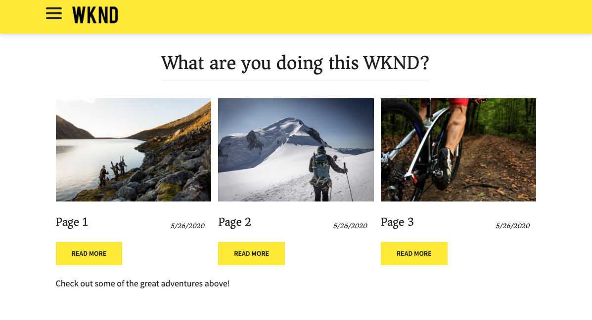

# Présentation et présentation des applications monopages {#spa-introduction}

Les applications d’une seule page (SPA) peuvent améliorer considérablement l’expérience des utilisateurs de sites web. Le souhait des développeurs est de pouvoir créer des sites avec des structures SPA. Les auteurs, pour leur part, souhaitent modifier facilement du contenu dans AEM pour un site conçu à l’aide de telles structures.

L’éditeur de SPA constitue une solution complète pour la prise en charge des SPA dans AEM. Cet article décrit l’utilisation d’une application d’application d’une seule page pour la création et montre comment elle se rapporte à l’AEM SPA Editor sous-jacent.

## Présentation {#introduction}

### Objectif de l&#39;article {#article-objective}

Cet article présente les concepts de base des applications monopages avant de guider le lecteur dans une présentation pas à pas de l’éditeur d’applications monopages en utilisant une application d’application monopages simple pour démontrer l’édition de base du contenu. Il détaille ensuite la construction de la page et comment l&#39;application SPA se rattache à l&#39;éditeur SPA AEM et interagit avec lui.

L’objectif de cette introduction et de cette présentation est de montrer à un développeur AEM pourquoi les applications monopages sont pertinentes, comment elles fonctionnent généralement, comment l’éditeur d’applications monopages AEM gère les applications monopages et comment elles diffèrent d’une application d’application d’un site Web standard.

La procédure pas à pas est basée sur la fonctionnalité AEM standard et l&#39;exemple d&#39;application WKND SPA Project. Pour suivre, veuillez [télécharger et installer l&#39;exemple d&#39;application WKND SPA Project sur GitHub ici.](https://github.com/adobe/aem-guides-wknd-spa)

>[!CAUTION]
>
>Ce document utilise l’application [](https://github.com/adobe/aem-guides-wknd-spa) WKND SPA Project à des fins de démonstration uniquement. Il ne doit être utilisé pour aucun travail de projet.

>[!TIP]
>
>Tout projet AEM doit tirer parti de l’archétype [de projet](https://docs.adobe.com/content/help/en/experience-manager-core-components/using/developing/archetype/overview.html)AEM, qui prend en charge les projets d’application d’une seule page à l’aide de React ou d’Angular et qui utilise le SDK d’application d’une seule page.

### Qu&#39;est-ce qu&#39;un APM ? {#what-is-a-spa}

Une application d’une seule page diffère d’une page conventionnelle en ce qu’elle est rendue côté client et qu’elle est principalement pilotée par JavaScript, en utilisant les appels Ajax pour charger des données et mettre à jour dynamiquement la page. La plupart ou la totalité du contenu est récupérée une fois au chargement d’une seule page avec des ressources supplémentaires chargées de manière asynchrone, selon les besoins, en fonction de l’interaction de l’utilisateur avec la page.

Cela réduit la nécessité d’actualiser les pages et offre à l’utilisateur une expérience transparente, rapide et qui ressemble davantage à une expérience d’application native.

L’éditeur d’applications d’une seule page permet aux développeurs de créer des applications d’une seule page qui peuvent être intégrées à un site AEM, ce qui permet aux auteurs de contenu de modifier le contenu de l’application d’une seule page aussi facilement que tout autre contenu de l’AEM.

### Pourquoi une ZPS ? {#why-a-spa}

En étant plus rapide, fluide et plus semblable à une application native, une application d’une seule page devient une expérience très attrayante non seulement pour le visiteur de la page Web, mais également pour les marketeurs et les développeurs en raison de la nature du fonctionnement des applications d’une seule page.


#### Visiteurs {#visitors}

* Les visiteurs souhaitent des expériences de type natif lorsqu’ils interagissent avec du contenu.
* Il existe des données claires indiquant que plus une page est rapide, plus une conversion est probable.

#### Marqueurs {#marketers}

* Les marketeurs veulent offre des expériences riches et originales pour inciter les visiteurs à s&#39;engager pleinement dans le contenu.
* La personnalisation peut rendre ces expériences encore plus attrayantes.

#### Développeurs {#developers}

* Les développeurs veulent une séparation nette des préoccupations entre le contenu et la présentation.
* Une séparation nette rend le système plus extensible et permet un développement frontal indépendant.

### Comment fonctionne une application d’une seule page ? {#how-does-a-spa-work}

L’idée Principale derrière une application d’une seule page est que les appels à un serveur et sa dépendance sont réduits afin de minimiser les retards dus à la latence du serveur, de sorte que l’application d’une seule page puisse être réactive.

Dans une page Web séquentielle traditionnelle, seules les données nécessaires à la page immédiate sont chargées. Cela signifie que lorsque le visiteur passe à une autre page, le serveur est appelé pour les ressources supplémentaires. Des appels supplémentaires peuvent s’avérer nécessaires lorsque le visiteur interagit avec les éléments de la page. Ces appels multiples peuvent donner une impression de retard ou de retard car la page doit rattraper les demandes du visiteur.


Pour une expérience plus fluide, qui approche ce qu’un visiteur attend des applications mobiles natives, une application d’une seule page, charge toutes les données nécessaires pour le visiteur au premier chargement. Bien que cette opération puisse prendre un peu plus de temps au début, elle élimine ensuite la nécessité d’appels de serveur supplémentaires.

En effectuant le rendu côté client, les éléments de page réagissent plus rapidement et les interactions avec la page par le visiteur sont immédiates. Toutes les données supplémentaires qui peuvent être nécessaires sont appelées de manière asynchrone afin d’optimiser la vitesse de la page.

>[!TIP]
>
>Pour obtenir des détails techniques sur le fonctionnement des applications monopages en AEM, consultez les articles suivants :
>* [Prise en main des applications monopages dans AEM Utilisation de la fonction Réagir](getting-started-react.md)
>* [Prise en main des applications monopages dans AEM Utilisation d’Angular](getting-started-angular.md)

>
>
Pour en savoir plus sur la conception, l’architecture et le processus technique de l’éditeur d’applications monopages, voir l’article :
>* [Aperçu de l’éditeur d’application d’une seule page](editor-overview.md).


## Modification du contenu avec l’application d’une seule page {#content-editing-experience-with-spa}

Lorsqu’une application d’une seule page est créée pour tirer parti de l’éditeur d’une seule page, l’auteur du contenu ne remarque aucune différence lors de la modification et de la création de contenu. Une fonctionnalité AEM commune est disponible et aucune modification du flux de travail de l’auteur n’est requise.

1. Modifiez l’application WKND SPA Project en AEM.

   `http://localhost:4502/editor.html/content/wknd-spa-react/us/en/home.html`

   

1. Sélectionnez un composant de texte et notez qu’une barre d’outils s’affiche comme pour tout autre composant. Sélectionnez **Modifier**.

   

1. Modifiez le contenu normalement dans AEM et notez que les modifications sont conservées.

   

1. Utilisez l’explorateur de ressources pour faire glisser une nouvelle image dans un composant d’image.

   

1. Le changement est maintenu.

   

D’autres outils de création, tels que le glisser-déposer de composants supplémentaires sur la page, la réorganisation des composants et la modification de la mise en page, sont pris en charge, comme dans toute application AEM non-SPA.

>[!NOTE]
>
>L’éditeur d’applications monopages ne modifie pas le DOM de l’application. L&#39;APS lui-même est responsable du DOM.
>
>Pour voir comment cela fonctionne, passez à la section suivante de cet article Applications [SPA et à l’éditeur](#spa-apps-and-the-aem-spa-editor)d’applications SPA AEM.

## Applications d’application d’une seule page et éditeur d’applications d’une seule page AEM {#spa-apps-and-the-aem-spa-editor}

L’expérience de comportement d’une application d’une seule page d’une seule page d’une seule page permet de mieux comprendre comment une application SAP fonctionne avec l’éditeur d’une seule page d’AEM.

### Utilisation d’une application SPA {#using-an-spa-application}

1. Chargez l’application WKND SPA Project sur le serveur de publication ou à l’aide de l’option **Vue as Published** du menu **Page Information** (Informations sur la page) de l’éditeur de page.

   `http://<host>:<port>/content/wknd-spa-react/us/en/home.html`

   

   Notez la structure des pages, y compris la navigation vers les pages enfants, le menu et les cartes d’article.

1. Accédez à une page enfant à l’aide du menu et voyez que la page se charge immédiatement sans qu’il faille procéder à une actualisation.

   

1. Ouvrez les outils de développement intégrés à votre navigateur et surveillez l’activité du réseau lorsque vous parcourez les pages enfants.

   

   Il y a très peu de trafic lorsque vous passez d’une page à l’autre dans l’application. La page n’est pas rechargée et seules les nouvelles images sont demandées.

   L’application d’une seule page gère le contenu et le routage entièrement du côté client.

Ainsi, si la page n’est pas rechargée lors de la navigation dans les pages enfants, comment est-elle chargée ?

La section suivante, [Chargement d’une application](#loading-a-spa-application)d’application d’application d’une seule page, approfondit la procédure de chargement de l’application d’une seule page et explique comment le contenu peut être chargé de façon synchrone et asynchrone.

### Chargement d’une application d’application d’une seule page {#loading-a-spa-application}

1. Si ce n’est pas déjà fait, chargez l’application de Journal We.Retail sur le serveur de publication ou à l’aide de la **Vue d’options Publié** dans le menu Informations **sur la** page de l’éditeur de page.

   `http://<host>:<port>/content/wknd-spa-react/us/en/home.html`

   

1. Utilisez l’outil intégré de votre navigateur pour vue la source de la page.
1. Notez que le contenu de la source est limité.

   ```html
    <!DOCTYPE html>
    <html lang="en">
    <head>
        <meta charset="UTF-8"/>
        <title>WKND SPA React Home Page</title>
   
        <meta name="template" content="spa-page-template"/>
        <meta name="viewport" content="width=device-width, initial-scale=1"/>
   
    <link rel="stylesheet" href="/etc.clientlibs/wknd-spa-react/clientlibs/clientlib-base.min.css" type="text/css">
   
    <meta name="theme-color" content="#000000"/>
    <link rel="icon" href="/etc.clientlibs/wknd-spa-react/clientlibs/clientlib-react/resources/favicon.ico"/>
    <link rel="apple-touch-icon" href="/etc.clientlibs/wknd-spa-react/clientlibs/clientlib-react/resources/logo192.png"/>
    <link rel="manifest" href="/etc.clientlibs/wknd-spa-react/clientlibs/clientlib-react/resources/manifest.json"/>
   
    <!-- AEM page model -->
    <meta property="cq:pagemodel_root_url" content="/content/wknd-spa-react/us/en.model.json"/>
    <link href="//fonts.googleapis.com/css?family=Source+Sans+Pro:400,600|Asar&display=swap" rel="stylesheet"/>
    <meta property="cq:datatype" content="JSON"/>
    <meta property="cq:wcmmode" content="edit"/>
   
    <link rel="stylesheet" href="/libs/cq/gui/components/authoring/editors/clientlibs/internal/page.min.css" type="text/css">
    <link rel="stylesheet" href="/etc.clientlibs/wcm/foundation/clientlibs/main.min.css" type="text/css">
    <script type="text/javascript" src="/libs/cq/gui/components/authoring/editors/clientlibs/internal/messaging.min.js"></script>
    <script type="text/javascript" src="/libs/cq/gui/components/authoring/editors/clientlibs/utils.min.js"></script>
    <script type="text/javascript" src="/libs/granite/author/deviceemulator/clientlibs.min.js"></script>
    <script type="text/javascript" src="/libs/cq/gui/components/authoring/editors/clientlibs/internal/page.min.js"></script>
    <script type="text/javascript" src="/etc.clientlibs/wcm/foundation/clientlibs/main.min.js"></script>
    <script type="text/javascript" src="/etc.clientlibs/clientlibs/granite/jquery.min.js"></script>
    <script type="text/javascript" src="/etc.clientlibs/clientlibs/granite/utils.min.js"></script>
    <script type="text/javascript" src="/etc.clientlibs/clientlibs/granite/jquery/granite.min.js"></script>
    <script type="text/javascript" src="/etc.clientlibs/foundation/clientlibs/jquery.min.js"></script>
    <script type="text/javascript" src="/etc.clientlibs/foundation/clientlibs/shared.min.js"></script>
   
    <!--cq{"decorated":false,"type":"cq/cloudconfig/components/scripttags/header","path":"/content/wknd-spa-react/us/en/home/jcr:content/cloudconfig-header","structurePath":"/content/wknd-spa-react/us/en/home/jcr:content/cloudconfig-header","selectors":null,"servlet":"Script /libs/cq/cloudconfig/components/scripttags/header/header.html","totalTime":2,"selfTime":2}-->
   
    <link rel="stylesheet" href="/etc.clientlibs/wknd-spa-react/clientlibs/clientlib-react.min.css" type="text/css">
   
    </head>
   
    <body class="page basicpage">
        <noscript>You need to enable JavaScript to run this app.</noscript>
    <div id="spa-root"></div>
   
    <script type="text/javascript" src="/etc.clientlibs/wknd-spa-react/clientlibs/clientlib-react.min.js"></script>
   
    <script type="text/javascript" src="/etc.clientlibs/core/wcm/components/commons/site/clientlibs/container.min.js"></script>
    <script type="text/javascript" src="/etc.clientlibs/wknd-spa-react/clientlibs/clientlib-base.min.js"></script>
   
    <script type="text/javascript" src="/libs/cq/gui/components/authoring/editors/clientlibs/internal/pagemodel/messaging.min.js"></script>
   
    <link rel="stylesheet" href="/etc.clientlibs/wknd-spa-react/clientlibs/clientlib-author.min.css" type="text/css">
   
    <!--cq{"decorated":true,"type":"cq/cloudserviceconfigs/components/servicecomponents","path":"/content/wknd-spa-react/us/en/home/jcr:content/cloudservices","selectors":null,"servlet":"Script /libs/cq/cloudserviceconfigs/components/servicecomponents/servicecomponents.jsp","totalTime":2,"selfTime":2}-->
   
    <!--cq{"decorated":false,"type":"cq/cloudconfig/components/scripttags/footer","path":"/content/wknd-spa-react/us/en/home/jcr:content/cloudconfig-footer","structurePath":"/content/wknd-spa-react/us/en/home/jcr:content/cloudconfig-footer","selectors":null,"servlet":"Script /libs/cq/cloudconfig/components/scripttags/footer/footer.html","totalTime":2,"selfTime":2}-->
   
    </body>
    </html>
    <!--cq{"decorated":false,"type":"wknd-spa-react/components/page","path":"/content/wknd-spa-react/us/en/home/jcr:content","selectors":null,"servlet":"Script /apps/spa-project-core/components/page/page.html","totalTime":39,"selfTime":33}-->
   ```

   La page ne comporte aucun contenu dans son corps. Il est principalement composé de feuilles de style et d&#39;un appel à divers scripts tels que `clientlib-react.min.js`.

   Ces scripts sont les pilotes Principaux de cette application et sont responsables du rendu de tout le contenu.

1. Utilisez les outils intégrés de votre navigateur pour inspecter la page. Affichez le contenu du modèle DOM entièrement chargé.

   

1. Accédez à l&#39;onglet Réseau de l&#39;Inspecteur et rechargez la page.

   Ignorant les demandes d’image, notez que les Principales ressources chargées pour la page sont la page elle-même, CSS, le code JavaScript de réaction, ses dépendances, ainsi que les données JSON de la page.

   

1. Chargez le `home.model.json` dans un nouvel onglet.

   `http://<host>:<port>/content/wknd-spa-react/us/en/home.model.json`

   

   L’éditeur d’applications monopages AEM utilise [AEM Content Services](/help/assets/content-fragments/content-fragments.md) pour diffuser l’intégralité du contenu de la page sous forme de modèle JSON.

   En implémentant des interfaces spécifiques, les modèles Sling fournissent les informations nécessaires à l’application d’une seule page. La diffusion des données JSON est déléguée vers le bas à chaque composant (de la page, au paragraphe, au composant, etc.).

   Chaque composant choisit ce qu’il expose et comment il est rendu (côté serveur avec HTL ou côté client avec React ou Angular). Cet article porte sur le rendu côté client avec React.

1. Le modèle peut également regrouper les pages afin qu’elles soient chargées de manière synchrone, ce qui réduit le nombre de rechargements de page nécessaires.

   Dans l&#39;exemple du Journal We.Retail, les pages `home`, `page-1`, `page-2`et `page-3` sont chargées de manière synchrone, les visiteurs visitant généralement toutes ces pages.

   Ce comportement n’est pas obligatoire et est entièrement définissable.

   

1. Pour vue cette différence de comportement, rechargez la `home` page et effacez l&#39;activité réseau de l&#39;inspecteur. Accédez au menu `page-1` de la page et vérifiez que la seule activité réseau est une demande d’image de `page-1`. `page-1` n’a pas besoin de se charger.

   

### Interaction avec l’éditeur d’applications monopages {#interaction-with-the-spa-editor}

En utilisant l’exemple d’application WKND SPA Project, il est clair comment l’application se comporte et est chargée une fois publiée, en exploitant les services de contenu pour la diffusion de contenu JSON ainsi que le chargement asynchrone des ressources.

De plus, pour l’auteur de contenu, la création de contenu à l’aide d’un éditeur d’application d’une seule page est transparente dans AEM.

Dans la section suivante, nous étudierons le contrat qui permet à l&#39;éditeur d&#39;application d&#39;une seule page d&#39;établir des relations entre les composants de l&#39;application d&#39;une seule page d&#39;une page d&#39;une page d&#39;une page d&#39;une page d&#39;une page d&#39;une page d&#39;une page d&#39;une page d&#39;une page d&#39;une page d&#39;une page d&#39;une page d&#39;une page d&#39;une autre.

1. Chargez l’application WKND SPA Project dans l’éditeur et passez en mode **Prévisualisation** .

   `http://<host>:<port>/editor.html/content/wknd-spa-react/us/en/home.html`

1. A l’aide des outils de développement intégrés à votre navigateur, inspectez le contenu de la page. A l’aide de l’outil de sélection, sélectionnez un composant modifiable sur la page et vue le détail de l’élément.

   Notez que le composant possède un nouvel attribut de données `data-cq-data-path`.

   

   Par exemple, 

   `data-cq-data-path="/content/wknd-spa-react/us/en/home/jcr:content/root/responsivegrid/text`

   Ce chemin d’accès permet la récupération et l’association de l’objet de configuration de contexte de modification de chaque composant.

   Il s’agit du seul attribut de balisage requis par l’éditeur pour reconnaître qu’il s’agit d’un composant modifiable dans l’application d’une seule page. En fonction de cet attribut, l’éditeur d’applications monopages détermine la configuration modifiable associée au composant, de sorte que le cadre, la barre d’outils, etc. appropriés soient définis. est chargé.

   Certains noms de classe spécifiques sont également ajoutés pour marquer les espaces réservés et pour la fonctionnalité de glisser-déposer des ressources.

   >[!NOTE]
   >
   >Ce comportement diffère des pages générées côté serveur dans AEM, où un `cq` élément est inséré pour chaque composant modifiable.
   >
   >Cette approche dans l’éditeur d’applications monopages élimine la nécessité d’injecter des éléments personnalisés, en n’utilisant qu’un attribut de données supplémentaire, ce qui rend le balisage plus simple pour le développeur frontal.

## Étapes suivantes {#next-steps}

Maintenant que vous comprenez l’expérience de modification de l’application d’une seule page en AEM et comment une application d’une seule page se rapporte à l’éditeur d’une seule page, plongez-vous dans la compréhension de la création d’une application d’une seule page.

* [Prise en main des applications monopages dans AEM à l’aide de React](getting-started-react.md) montre comment une application monopage de base est créée pour fonctionner avec l’éditeur d’applications monopages dans AEM à l’aide de React
* [Prise en main des applications monopages en AEM à l’aide d’Angular](getting-started-angular.md) montre comment une application monopage de base est conçue pour fonctionner avec l’éditeur d’applications monopages en AEM à l’aide d’Angular
* [Présentation](editor-overview.md) de l’éditeur d’applications d’une seule page approfondit le modèle de communication entre l’AEM et l’application d’une seule page.
* [Le développement d’une application d’une seule page pour AEM](developing.md) décrit comment convaincre les développeurs de l’interface de développer une application d’une seule page pour les AEM ainsi que comment les applications d’une seule page interagissent avec l’architecture de l’AEM.
