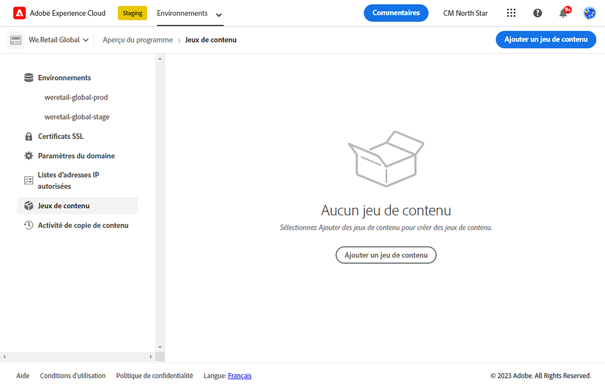
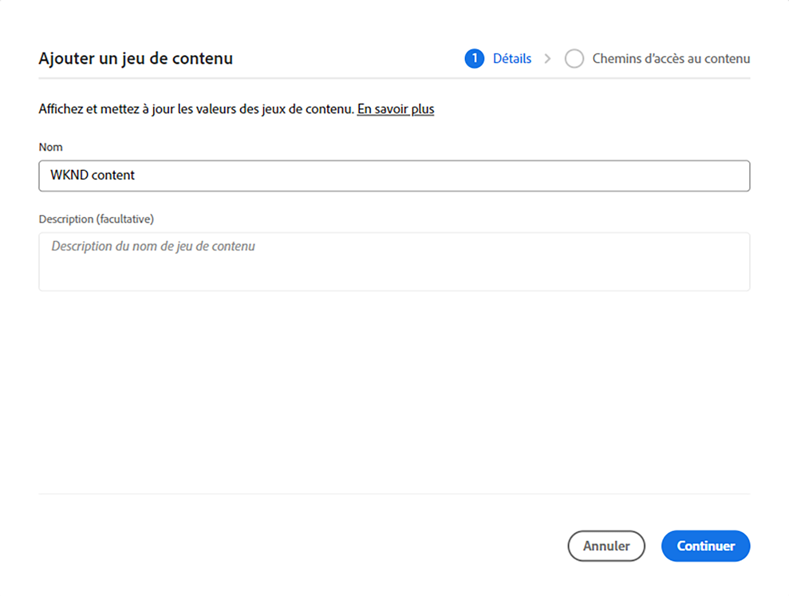
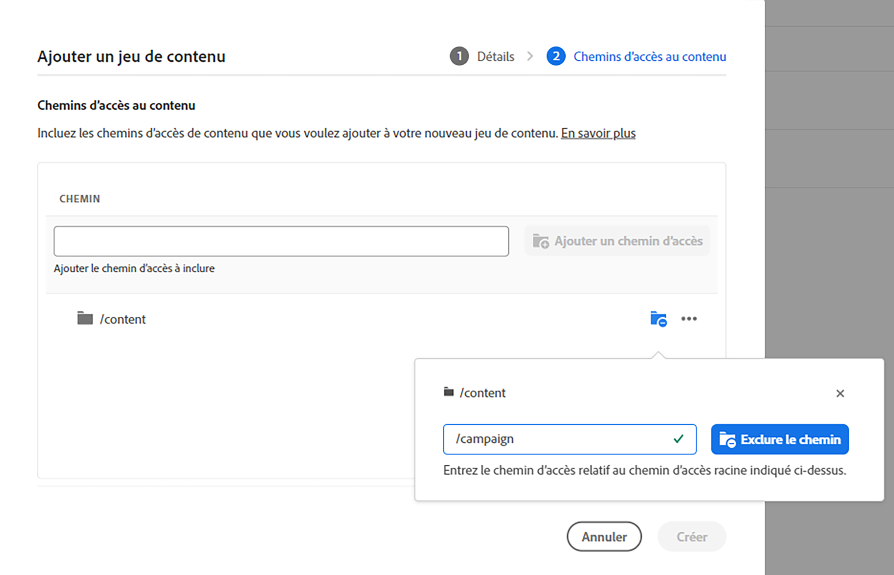
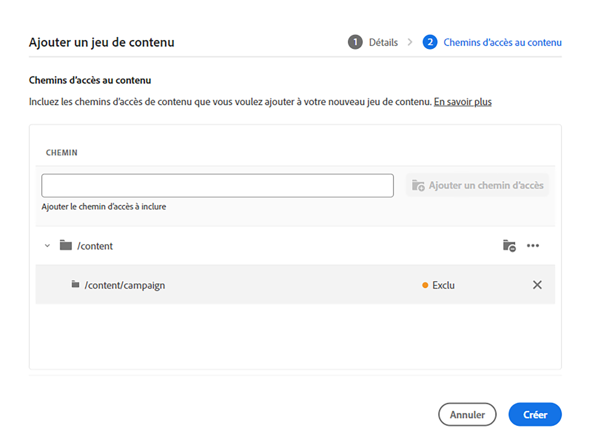
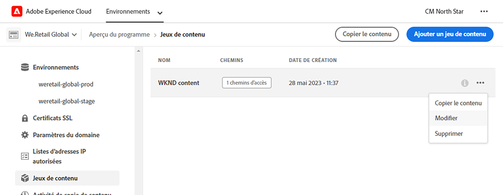
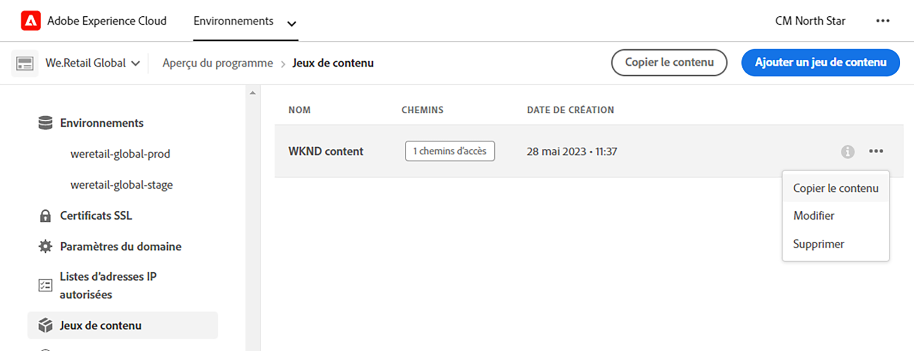
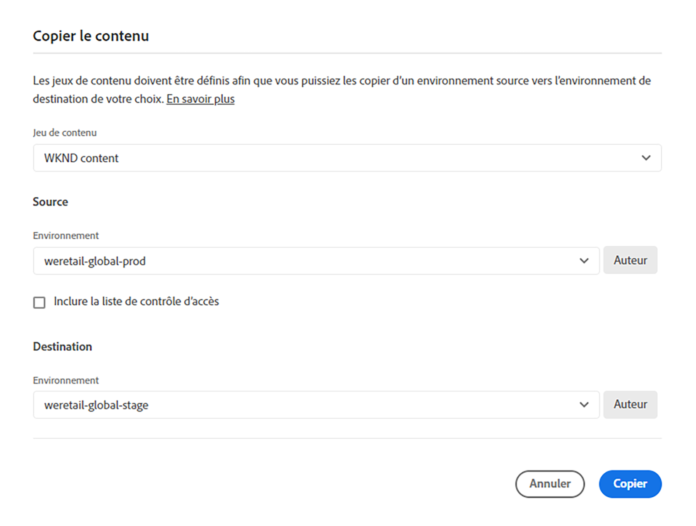
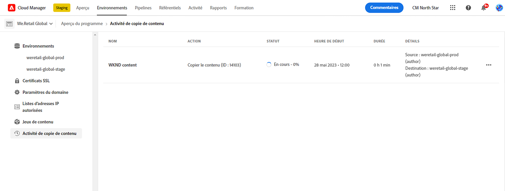
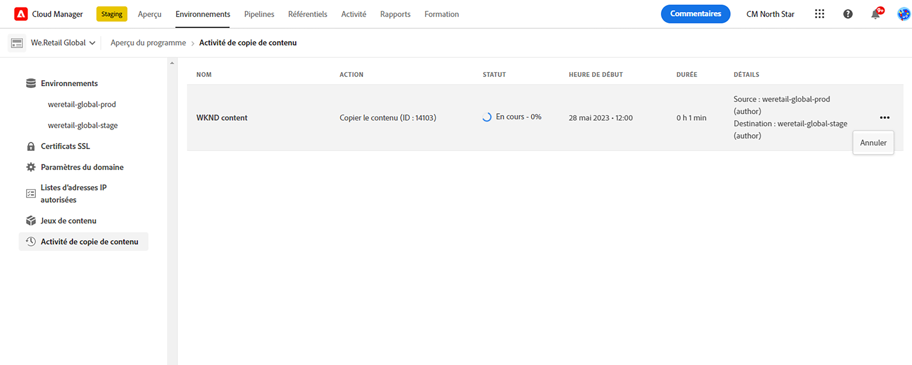

# Outil de copie de contenu {#content-copy}

L’outil de copie de contenu permet de copier du contenu modifiable à la demande à partir des environnements de production depuis AEM as a Cloud Service vers des environnements inférieurs, et ce à des fins de test.

## Présentation {#introduction}

Les données actuelles et réelles sont utiles à des fins de test, de validation et d’acceptation par l’utilisateur. L’outil de copie de contenu vous permet de copier du contenu d’un environnement AEM as a Cloud Service de production vers un environnement d’évaluation, de développement ou de [Environnement de développement rapide (RDE)](/help/implementing/developing/introduction/rapid-development-environments.md) pour de tels tests.

Le contenu à copier est défini par un jeu de contenu. Un jeu de contenu est constitué d’une liste de chemins JCR qui contiennent le contenu modifiable à copier d’un environnement source de service de création vers un environnement cible de service de création, dans le même programme Cloud Manager. Les chemins d’accès suivants sont autorisés dans un jeu de contenu.

```text
/content
/conf/**/settings/wcm
/conf/**/settings/dam/cfm/models
/conf/**/settings/graphql/persistentQueries
/etc/clientlibs/fd/themes
```

Lors de la copie de contenu, l’environnement source est la source de vérité.

* Si le contenu a été modifié dans l’environnement de destination, il est remplacé par le contenu de la source si les chemins d’accès sont les mêmes.
* Si les chemins d’accès sont différents, le contenu de la source est fusionné avec le contenu de la destination.

## Autorisations {#permissions}

Pour utiliser l’outil de copie de contenu, certaines autorisations sont requises dans les environnements source et cible.

| Fonctionnalité copie de contenu | Groupe d’administrateurs et administratrices AEM | Rôle de responsable de déploiement |
|---|---|---|
| Créer et modifier des [jeux de contenu](#create-content-set) | Non requis | Obligatoire |
| Démarrer ou annuler le [processus de copie de contenu](#copy-content) | Requis | Requis |

Pour plus d’informations sur les autorisations et sur la façon de les définir, voir [Équipe AEM as a Cloud Service et Profils de produit](/help/onboarding/aem-cs-team-product-profiles.md).

## Créer un jeu de contenu {#create-content-set}

Pour qu’un contenu puisse être copié, un jeu de contenu doit être défini. Une fois définis, les jeux de contenu peuvent être réutilisés pour copier du contenu. Pour créer un jeu de contenu, suivez la procédure décrite ci-après.

1. Connectez-vous à Cloud Manager à l’adresse [my.cloudmanager.adobe.com](https://my.cloudmanager.adobe.com/) et sélectionnez l’organisation et le programme appropriés.

1. À l’aide du panneau de navigation latéral, accédez à l’onglet **Visionneuses de contenu** à partir de la page **Aperçu**.

1. Dans le coin supérieur droit de l’écran, cliquez sur **Ajouter un jeu de contenu**.

   

1. Dans l’onglet **Détails** de l’assistant, indiquez un nom et une description pour le jeu de contenu, puis sélectionnez **Continuer**.

   

1. Dans l’onglet **Chemins d’accès au contenu** de l’assistant, indiquez les chemins d’accès au contenu modifiable à inclure dans le jeu de contenu.

   1. Entrez le chemin dans le champ **Ajouter un chemin d’accès à inclure**.
   1. Cliquez sur **Ajouter un chemin** pour ajouter le chemin d’accès au jeu de contenu.
   1. Le cas échéant, cliquez de nouveau sur **Ajouter un chemin**.
      * Jusqu’à cinquante chemins sont autorisés.

   

1. Si vous devez affiner ou limiter votre jeu de contenu, les sous-chemins peuvent être exclus.

   1. Dans la liste des chemins d’accès inclus, appuyez ou cliquez sur l’icône **Ajouter des sous-chemins à exclure** en regard du chemin que vous devez limiter.
   1. Saisissez le sous-chemin d’accès à exclure sous le chemin d’accès sélectionné.
   1. Sélectionnez **Exclure le chemin**.
   1. Sélectionnez à nouveau **Ajouter des sous-chemins d’exclusion** pour ajouter des chemins d’accès supplémentaires à exclure, si nécessaire.
      * Les chemins exclus doivent être relatifs au chemin inclus.
      * Le nombre de chemins exclus n’est pas limité.

   

1. Si nécessaire, vous pouvez modifier les chemins spécifiés.

   1. Cliquez sur le X en regard des sous-chemins exclus pour pouvoir les supprimer.
   1. Cliquez sur le bouton représentant des points de suspension en regard des chemins pour afficher les options **Modifier** et **Supprimer**.

   

1. Sélectionnez **Créer** pour créer le jeu de contenu.

Le jeu de contenu peut désormais être utilisé pour copier du contenu entre des environnements.

## Modification d’un jeu de contenu {#edit-content-set}

Procédez de la même façon que lors de la création d’une étape de contenu. Au lieu de cliquer sur **Ajouter un jeu de contenu**, sélectionnez un jeu existant dans la console, puis sélectionnez **Modifier** dans le menu représentant des points de suspension.



Lors de la modification de votre jeu de contenu, vous pouvez développer les chemins configurés pour que s’affichent les sous-chemins exclus.

## Copie de contenu {#copy-content}

Une fois qu’un jeu de contenu a été créé, vous pouvez l’utiliser pour copier du contenu. Procédez comme suit pour copier du contenu.

>[!NOTE]
> N’utilisez pas la copie de contenu dans un environnement lorsqu’une opération de [transfert de contenu](/help/journey-migration/content-transfer-tool/using-content-transfer-tool/overview-content-transfer-tool.md) s’exécute dans cet environnement.

1. Connectez-vous à Cloud Manager à l’adresse [my.cloudmanager.adobe.com](https://my.cloudmanager.adobe.com/) et sélectionnez l’organisation et le programme appropriés.

1. Accédez à l’écran **Environnements** à partir de la page **Vue d’ensemble**.

1. Accédez à la page **Jeux de contenu** à partir de l’écran **Environnements**.

1. Sélectionnez un jeu de contenu dans la console, puis **Copier le contenu** dans le menu représentant des points de suspension.

   

   >[!NOTE]
   >
   >Un environnement ne peut pas être sélectionné si :
   >
   >* L’utilisateur ne dispose pas des autorisations appropriées.
   >* Un pipeline en cours d’exécution ou une opération de copie de contenu est en cours dans l’environnement.
   >* L’environnement est en veille ou en train de démarrer.

1. Dans la boîte de dialogue **Copier le contenu**, spécifiez la source et la destination de votre action de copie de contenu.

   

   * Le contenu ne peut être copié que d’un environnement supérieur vers un environnement inférieur ou entre des environnements de développement/RDE où la hiérarchie des environnements est la suivante (du plus haut au plus bas) :
      * Production
      * Évaluation
      * Développement/RDE

1. Si nécessaire, vous pouvez également sélectionner **Inclure les listes de contrôle d’accès** dans votre processus de copie.

1. Sélectionnez **Copie**.

Le processus de copie démarre. Le statut du processus de copie est répercuté dans la console pour le jeu de contenu sélectionné.

## Activité de copie de contenu {#copy-activity}

Vous pouvez surveiller le statut de vos processus de copie à la page **Activité de copie de contenu**.

1. Connectez-vous à Cloud Manager à l’adresse [my.cloudmanager.adobe.com](https://my.cloudmanager.adobe.com/) et sélectionnez l’organisation et le programme appropriés.

1. Accédez à l’écran **Environnements** à partir de la page **Aperçu**.

1. Accédez à la page **Activité de copie de contenu** à partir de l’écran **Environnements**.



### Statuts de la copie de contenu {#statuses}

Une fois que vous avez commencé à copier du contenu, le processus peut avoir l’un des statuts suivants.

| État | Description |
|---|---|
| En cours | L’opération de copie de contenu est en cours. |
| Échec | L’opération de copie de contenu a échoué. |
| Terminé | L’opération de copie de contenu est terminée avec succès. |
| Annulé | L’utilisateur ou l’utilisatrice annule une opération de copie de contenu après l’avoir démarrée |

### Annulation d’un processus de copie {#canceling}

Si vous devez abandonner une opération de copie de contenu après son démarrage, vous pouvez éventuellement l’annuler.

Pour ce faire, sur la page **Activité de copie de contenu**, sélectionnez l’action **Annuler** à partir du menu représentant des points de suspension pour le processus de copie que vous avez démarré précédemment.



>[!NOTE]
>
>Lorsque vous annulez une opération de copie de contenu, une copie partielle du contenu peut s’afficher dans l’environnement de destination. Cette situation peut rendre l’environnement de destination inutilisable.
>
>Si votre environnement se trouve dans un tel état en raison d’une annulation, contactez l’Assistance clientèle d’Adobe pour obtenir de l’aide.

### Accès aux journaux {#accessing-logs}

Vous pouvez consulter les journaux des environnements source et de destination pour tout processus de copie de contenu terminé.

Pour ce faire, sur la page **Copier l’activité de contenu**, sélectionnez l’action **Journaux** dans le menu avec points de suspension du processus de copie pour lequel vous souhaitez consulter les journaux, puis choisissez pour quel environnement.


Les journaux sont téléchargés sur votre ordinateur local. Si le téléchargement ne commence pas, vérifiez les paramètres du bloqueur de fenêtres contextuelles.

## Limites {#limitations}

L’outil de copie de contenu présente les limites suivantes.

* Le contenu ne peut pas être copié d’un environnement inférieur vers un environnement supérieur.
* Il ne peut être copié que depuis et vers les services de création.
* Une copie de contenu ne peut pas être effectuée sur plusieurs programmes.
* L’exécution simultanée d’opérations de copie de contenu sur le même environnement n’est pas possible.
* Vous pouvez spécifier jusqu’à cinquante chemins par jeu de contenu. Il n’existe aucune limitation sur les chemins exclus.
* N’utilisez pas l’outil de copie de contenu comme outil de clonage ou de mise en miroir, car il ne peut pas effectuer le suivi du contenu déplacé ou supprimé sur la source.
* L’outil de copie de contenu ne dispose d’aucune fonctionnalité de contrôle de version et ne peut pas détecter automatiquement le contenu modifié ou le contenu créé dans l’environnement source dans un jeu de contenu depuis la dernière opération de copie de contenu.
   * Si vous souhaitez mettre à jour votre environnement de destination avec des modifications de contenu depuis la dernière opération de copie de contenu uniquement, vous devez créer un jeu de contenu. Ensuite, spécifiez les chemins d’accès sur l’instance source où des modifications ont été apportées depuis la dernière opération de copie de contenu.
* Les informations de version ne sont pas incluses dans une copie de contenu.

## Problèmes connus {#known-issues}

Tenez compte du problème connu suivant lors de l&#39;utilisation de la fonctionnalité [de copie de contenu.](/help/implementing/developing/tools/content-copy.md)

* Si une ressource de l’environnement source est renommée, l’opération de copie de contenu peut échouer en raison d’UUID en conflit dans l’environnement cible.
   * Pour éviter cette erreur, au lieu de renommer des ressources, supprimez-les d’abord, puis recréez-les avec le nouveau nom de ressource souhaité.
