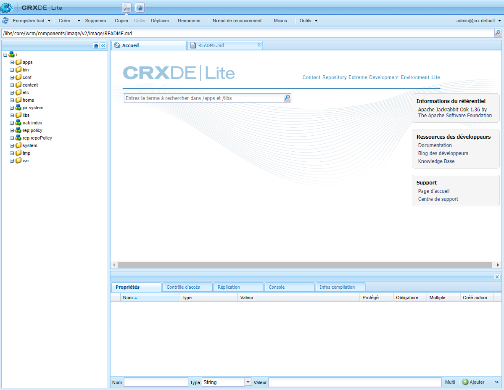

# Utilisation de CRXDE Lite {#using-crxde-lite}

CRXDE Lite fait partie du démarrage rapide d’AEM et vous permet d’accéder au référentiel et de le modifier dans vos environnements de développement locaux depuis le navigateur. CRXDE Lite permet de modifier des fichiers, des dossiers, des nœuds et des propriétés. Le référentiel entier est accessible dans cette interface conviviale.

>[!NOTE]
>
>CRXDE Lite est disponible uniquement dans vos environnements de développement local. Il n’est pas disponible dans AEM as a Cloud Service.

## Prise en main de CRXDE Lite {#getting-started-with-crxde-lite}

Pour commencer avec CRXDE Lite :

1. Lancez le programme de démarrage rapide de votre développement AEM local.
1. Ouvrez l’URL `https://<host>:<port>/crx/de` dans votre navigateur.
1. Entrez votre **nom d’utilisateur** et votre **mot de passe**.
1. Cliquez sur **OK**.

L’interface utilisateur de CRXDE Lite s’affiche comme suit dans votre navigateur :

>[!TIP]
>
>Vous pouvez également accéder à CRXDE Lite à partir du menu AEM. Dans le menu principal, sélectionnez **Outils** > **Général** > **CRXDE Lite**.

## Présentation de l’interface utilisateur {#overview-of-the-user-interface}

L’interface utilisateur CRXDE Lite comporte de nombreuses parties et de nombreuses fonctions.

### Barre de commutation supérieure {#top-switcher-bar}

La barre de commutation supérieure permet de basculer rapidement entre le CRXDE Lite et le [Gestionnaire de packages](package-manager.md).

### Widget de chemin de nœud {#node-path-widget}

Le widget de chemin de nœud affiche le chemin d’accès au nœud actuellement sélectionné.

Vous pouvez également l’utiliser pour sauter vers un nœud en entrant le chemin à la main ou en le collant à partir d’un autre endroit et en appuyant sur Entrée.

Il permet aussi de rechercher des nœuds par nom de nœud. Entrez le nom du nœud que vous souhaitez rechercher et patientez (ou sélectionnez l’icône de recherche sur le côté droit). Si un ou plusieurs nœuds sont chargés dans le volet de l’explorateur, la liste s’affiche. Vous pouvez sélectionner le chemin et appuyer sur Entrée pour y accéder. Cela ne fonctionne que pour les nœuds actuellement chargés dans l’application cliente CRXDE dans le navigateur. Pour effectuer une recherche dans tout le référentiel, utilisez **Outils** > **Requête**.

### Volet de l’explorateur {#explorer-pane}

Le **Volet de l’explorateur** affiche une arborescence de tous les nœuds du référentiel.

Cliquez sur un nœud pour afficher ses propriétés dans l’onglet **Propriétés**. Après avoir cliqué sur un nœud, vous pouvez sélectionner une action dans la barre d’outils. Cliquez de nouveau sur le nœud pour le renommer.

Filtre de navigation dans l’arborescence (l’icône en forme de paire de jumelles) vous permet de filtrer les nœuds du référentiel pour lesquels le nom contient le texte saisi. S’applique uniquement aux nœuds qui ont été chargés localement.

### Volet de modification {#edit-pane}

Le **volet de modification** permet d’afficher le contenu du fichier actuellement sélectionné dans le référentiel. Chaque fichier ouvert est représenté par son propre onglet dans le volet.

L’onglet **Accueil** permet de rechercher du contenu et/ou de la documentation et d’accéder à la documentation destinée aux développeurs et à l’assistance Adobe.

Double-cliquez sur un fichier dans le **volet Explorateur** pour afficher son contenu dans le **volet de modification**. Vous pouvez ensuite le modifier et enregistrer les modifications.

Une fois le fichier modifié dans le **volet de modification**, les outils suivants sont disponibles dans la barre d’outils :

* **Afficher dans l’arborescence** – affiche le fichier dans l’arborescence du référentiel.
* **Rechercher/Remplacer** – effectue une recherche ou un remplacement.

Double-cliquez sur la ligne d’état du **Volet Modifier** pour ouvrir la boîte de dialogue **Aller à la ligne** et saisir un numéro de ligne spécifique.

### Onglet Propriétés {#properties-tab}

L’onglet **Propriétés** affiche les propriétés du nœud que vous avez sélectionné. Vous pouvez ajouter de nouvelles propriétés ou supprimer celles qui existent déjà.

### Onglet Contrôle d’accès {#access-control-tab}

L’onglet **Contrôle d’accès** affiche les autorisations en fonction du chemin d’accès, du référentiel ou du principal actuel.

Les autorisations sont ventilées dans les catégories suivantes.

* **Politiques de contrôle d’accès applicables** – les politiques qui peuvent être appliquées à la sélection en cours
* **Politiques de contrôle d’accès local** – les politiques actuelles appliquées localement à la sélection en cours
* **Politiques de contrôle d’accès en vigueur** – les politiques actuelles appliquées à la sélection en cours, qui peuvent être définies localement ou héritées des nœuds parents

>[!NOTE]
>
Pour pouvoir voir les informations de contrôle d’accès, l’utilisateur connecté à CRXDE Lite doit avoir le droit de lire les entrées ACL.

### Onglet Réplication {#replication-tab}

L’onglet **Réplication** affiche l’état de réplication du nœud actuel. Vous pouvez répliquer et supprimer la réplication du nœud actif.

### Onglet Console {#console-tab}

L’onglet **Console** affiche les messages des journaux. Vous pouvez configurer le niveau de journalisation, effacer la console, épingler à la position de défilement sélectionnée et activer/désactiver l’affichage des messages.

### Onglet Infos sur le build {#build-info-tab}

L’onglet **Infos sur le build** affiche des informations pendant la création d’un lot.

### Bouton Actualiser {#refresh-button}

Le **bouton Actualiser** actualise la sélection actuelle. Les modifications des autres utilisateurs sont mises à jour dans votre vue du référentiel. Les modifications que vous avez apportées ne sont pas concernées.

### Bouton Enregistrer tout {#save-all-button}

Le bouton **Enregistrer tout** enregistre toutes les modifications que vous avez apportées. Tant que vous ne décidez pas d’enregistrer, les modifications sont temporaires. Elles sont perdues lorsque vous quittez la console.

* **Rétablir** – ignore toutes les modifications que vous avez apportées au nœud sélectionné depuis le dernier enregistrement, puis recharge l’état actuel du référentiel pour le nœud sélectionné
* **Rétablir tout** – ignore toutes les modifications que vous avez apportées au référentiel entier depuis le dernier enregistrement, puis recharge l’état actuel du référentiel

### Bouton Créer {#create-button}

Le **bouton Créer** est un menu déroulant permettant de créer les éléments suivants sous le nœud sélectionné :

* Nœud – un nœud de type arbitraire
* Fichier – un nœud `nt:file` et son sous-nœud nt:resource
* Dossier – un nœud `nt:folder`

### Bouton Supprimer {#delete-button}

Le **bouton Supprimer** supprime le nœud sélectionné.

### Bouton Copier {#copy-button}

Le **bouton Copier** copie le nœud sélectionné.

## Bouton Coller {#paste-button}

Le **bouton Coller** colle le nœud copié sous le nœud sélectionné.

### Bouton Déplacer {#move-button}

Le **bouton Déplacer** déplace le nœud sélectionné vers le nœud défini dans la boîte de dialogue.

### Renommer {#rename-button}

Le **bouton Renommer** renomme le nœud sélectionné.

### Mixins {#mixins-button}

Le **bouton Mixins** permet d’ajouter des types de mixin au type de nœud. Les types de mixin sont principalement utilisés pour ajouter des fonctions avancées.

### Outils {#tools-button}

Le **bouton Outils** est un menu déroulant avec les outils suivants disponibles :

* **Configuration du serveur** – pour accéder à la console Felix (également disponible sur `https://<host>:<port>/system/console/configMgr`)
* **Requête** – pour interroger le référentiel
* **Privilèges** – pour afficher et ajouter des privilèges
* **Contrôle d’accès de test** – pour tester l’autorisation pour un contrôle d’accès et/ou principal
* **Exporter le type de nœud** – pour exporter les types de nœud dans le système en tant que notation CND
* **Importer le type de nœud** – pour importer les types de nœud en utilisant la notation CND.

### Widget de connexion {#login-widget}

Le **widget de connexion** affiche l’utilisateur actuellement connecté.

Cliquez dessus pour vous connecter ou vous reconnecter en tant qu’un autre utilisateur. `@crx.default` indique que vous vous trouvez dans l’espace de travail par défaut (et unique) du référentiel.

L’option **Préférences** peut être utilisée pour définir la langue de votre interface utilisateur et pour afficher et personnaliser les touches de raccourci pour différentes actions telles que l’enregistrement, la recherche, la création de note, etc.

## Création d’un dossier {#creating-a-folder}

Pour créer un dossier avec CRXDE Lite :

1. Ouvrez CRXDE Lite dans un navigateur.
1. Dans le volet de navigation, cliquez avec le bouton droit sur le dossier sous lequel vous souhaitez créer le nouveau dossier, sélectionnez **Créer...**, puis **Créer un dossier...**.

1. Entrez le **nom** du dossier et cliquez sur **OK**.

1. Cliquez sur **Enregistrer tout** pour enregistrer les modifications sur le serveur.

## Création d’un nœud {#creating-a-node}

Pour créer un nœud avec CRXDE Lite, procédez comme suit :

1. Ouvrez CRXDE Lite dans un navigateur.
1. Dans le [**volet Explorateur**](#explorer-pane), cliquez avec le bouton droit sur le nœud où vous souhaitez créer le nouveau nœud, sélectionnez **Créer**, puis **Créer un nœud**.
1. Entrez le **Nom** et sélectionnez le **Type**.
1. Cliquez sur **OK**.
1. Cliquez sur le bouton [**Enregistrer tout**](#save-all-button) pour enregistrer les modifications sur le serveur.

Vous pouvez désormais adapter le nœud à vos besoins en modifiant les propriétés ou en ajoutant de nouveaux nœuds.

>[!NOTE]
>
La plupart des opérations de modification, y compris **Créer un nœud**, conserve toutes les modifications en mémoire et les stocke dans le référentiel lors de l’enregistrement uniquement (avec le bouton [**Enregistrer tout**](#save-all-button)). Cependant, certaines opérations telles que le déplacement sont automatiquement conservées.
>
La validation du nœud créé qui est ou non autorisé par le type de nœud du nœud parent est également effectuée par le référentiel lors de l’enregistrement des modifications. Si vous recevez un message d’erreur lors de l’enregistrement d’un nœud, vérifiez si la structure du contenu est valide (par exemple, vous ne pouvez pas créer de nœud `nt:unstructured` en tant qu’enfant du nœud `nt:folder`).

## Création d’une propriété {#creating-a-property}

Pour créer une propriété avec CRXDE Lite :

1. Ouvrez CRXDE Lite dans un navigateur.
1. Dans le [**volet Explorateur**](#explorer-pane), sélectionnez le nœud dans lequel vous souhaitez ajouter la nouvelle propriété.
1. Dans l’onglet [**Propriétés**](#properties-tab) du volet inférieur, entrez le **Nom**, le **Type** et la **Valeur**.
1. Cliquez sur **Ajouter**.
1. Cliquez sur le bouton [**Enregistrer tout**](#save-all-button) pour enregistrer les modifications sur le serveur.

## Création d’un fichier {#creating-a-file}

Pour créer un fichier avec CRXDE Lite, procédez comme suit :

1. Ouvrez CRXDE Lite dans un navigateur.
1. Dans le [**volet Explorateur**](#explorer-pane), cliquez avec le bouton droit sur le composant dans lequel vous souhaitez créer le fichier, sélectionnez **Créer**, puis **Créer un fichier**.
1. Entrez le **Nom** du fichier, y compris son extension.
1. Cliquez sur **OK**.
1. Le nouveau fichier s’ouvre sous la forme d’un onglet dans le [**volet de modification**](#edit-pane).
1. Modifiez le fichier.
1. Cliquez sur le bouton [**Enregistrer tout**](#save-all-button) pour enregistrer les modifications.

## Exportation et importation de types de nœuds {#exporting-and-importing-node-types}

CRXDE Lite permet d’importer et/ou exporter des définitions de type de nœud dans la [notation Compact Namespace et Node Type Definition (CND)](https://jackrabbit.apache.org/jcr/node-type-notation.html).

Pour exporter une définition de type de nœud dans CRXDE Lite :

1. Ouvrez CRXDE Lite dans un navigateur.
1. Sélectionnez le nœud requis.
1. Sélectionnez **Outils**, puis **Exporter le type de nœud**.
1. La définition s’affiche en notation CND dans un nouvel onglet de votre navigateur.
1. Enregistrez les informations si nécessaire.

Pour importer une définition de type de nœud :

1. Ouvrez CRXDE Lite dans un navigateur.
1. Sélectionnez **Outils**, puis **Importer le type de nœud**.
1. Un nouvel onglet s’ouvre dans le [**volet de modification**](#edit-pane) intitulé **Type de nœud d’importation**.
1. Saisissez la notation CND pour la définition dans la zone de texte de l’onglet **Type de nœud d’importation**.
1. Cochez **Autoriser la mise à jour** si vous mettez à jour une définition existante.
1. Cliquez sur **Importer**.

## Journalisation {#logging}

CRXDE Lite permet d’afficher le fichier `error.log` qui se trouve sur le système de fichiers sous `<aem-install-dir>/crx-quickstart/logs` et de filtrer selon le niveau de journalisation approprié. Procédez comme suit :

1. Ouvrez CRXDE Lite dans un navigateur.
1. Dans le menu déroulant situé à droite de l’[**onglet Console**](#console-tab) au bas de la fenêtre, sélectionnez **Journaux du serveur**.
1. Cliquez sur l’icône **Arrêter** pour afficher les messages.

Vous pouvez effectuer les actions suivantes :

* Ajuster les paramètres du journal dans la console Felix en cliquant sur l’icône **Configurations de journalisation**.
* Effacer les messages en cliquant sur l’icône **Effacer la console**.
* Épingler le message à la sélection en cours en cliquant sur l’icône **Épingler la console**.
* Activer ou désactiver l’affichage des messages en cliquant sur l’icône **Stop**.
