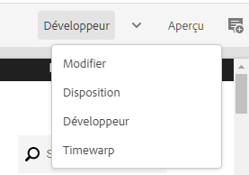
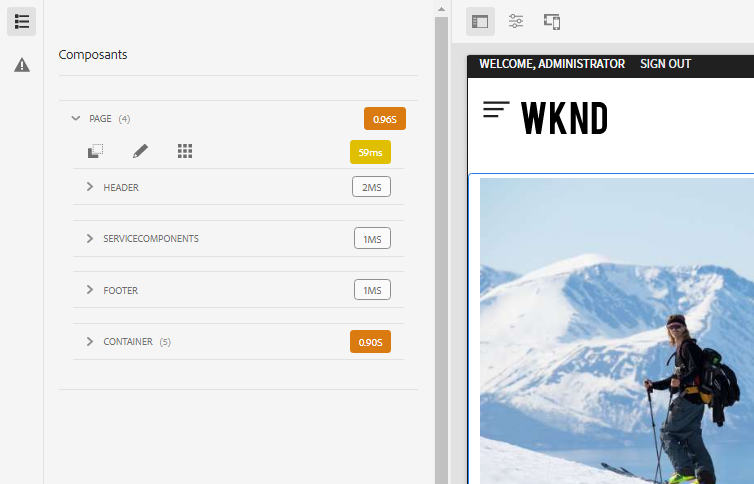
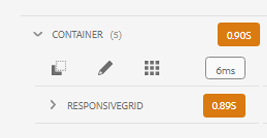
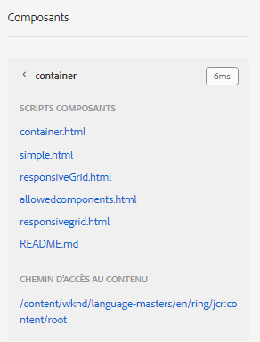
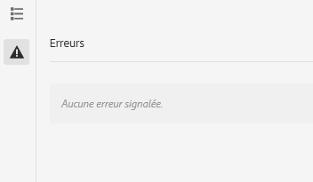

# Mode Développeur {#developer-mode}

Lors de la modification de pages dans AEM, plusieurs [modes](/help/sites-cloud/authoring/sites-console/introduction.md#page-modes) sont disponibles, y compris le mode Développeur. Le mode Développeur ouvre un panneau latéral avec plusieurs onglets qui procurent au développeur des informations techniques sur la page en cours.

Deux onglets sont disponibles :

* **[Composants](#components)**, pour visualiser les informations de structure et de performances.
* **[Erreurs](#errors)**, pour afficher les problèmes rencontrés.

Ils aident les développeurs à :

* **découvrir** la manière dont les pages sont composées ;
* **déboguer** en vérifiant la nature des événements, ainsi que leur emplacement et le moment où ils surviennent, afin de résoudre des problèmes.

>[!NOTE]
>
>Le mode Développeur :
>
>* n’est pas disponible sur les appareils mobiles ou les petites fenêtres sur les ordinateurs de bureau (en raison de l’espace restreint) ; ce qui se produit lorsque la largeur est inférieure à 1 024 px ;
>* n’est disponible que pour les utilisateurs qui sont membres du groupe `administrators`.

## Ouvrir le mode Développeur {#opening-developer-mode}

Le mode Développeur est implémenté sous la forme d’un panneau latéral dans l’éditeur de page. Pour ouvrir le panneau, sélectionnez **Développeur** dans le sélecteur de mode au niveau de la barre d’outils de l’éditeur de page :

Le panneau est divisé en deux onglets :

* **[Composants](#components)** : il présente une arborescence de composants, similaire à l’[arborescence de contenu](/help/sites-cloud/authoring/page-editor/editor-side-panel.md#content-tree) pour les auteurs.
* **[Erreurs](#errors)** : lorsque des problèmes se produisent, les détails sont affichés pour chaque composant.

### Onglet Composants {#components}

Il présente une arborescence de composants qui :

* décrit la chaîne de composants et de modèles rendus sur la page. L’arborescence peut être développée pour afficher le contexte dans la hiérarchie.
* affiche le temps de calcul côté serveur nécessaire au rendu du composant ;
* permet de développer l’arborescence et de sélectionner des composants spécifiques dans l’arborescence. La sélection permet d’accéder aux détails du composant, par exemple :
   * le chemin du référentiel ;
   * les liens vers les scripts (accessibles dans CRXDE Lite)
   * Les informations sur le composant, comme indiqué dans la section [Console des composants](/help/sites-cloud/authoring/components-console.md)
* Les composants sélectionnés dans l’arborescence sont indiqués par une bordure bleue dans l’éditeur.

Cet onglet de composants permet d’effectuer les opérations suivantes :

* déterminer et comparer le temps de rendu par composant ;
* visualiser et comprendre la hiérarchie ;
* comprendre, puis améliorer, le temps de chargement de la page en recherchant les composants lents.

Chaque entrée de composant peut comporter les options suivantes :

* **Afficher les détails** : lien vers une liste qui affiche :
   * tous les scripts de composants utilisés pour le rendu du composant ;
   * le chemin du contenu de référentiel pour cet élément spécifique.

     

* **Modifier le script :** lien qui ouvre le script du composant dans CRXDE Lite.

* **Afficher les détails du composant :** : affiche les informations sur le composant dans la [Console des composants](/help/sites-cloud/authoring/components-console.md).

Le développement d’une entrée de composant en appuyant ou en cliquant sur le chevron peut également afficher :

    * la hiérarchie au sein du composant sélectionné ;
    * les temps de rendu pour le composant sélectionné de manière isolée, tous les composants individuels imbriqués qu’il contient, ainsi que le total combiné.

### Onglet Erreurs {#errors}

L’onglet **Erreurs** devrait toujours rester vide (comme ci-dessus), mais lorsque des problèmes surviennent, les informations suivantes sont affichées pour chaque composant :

* Un avertissement s’affiche si le composant écrit une entrée dans le journal d’erreurs, avec les détails de l’erreur et des liens directs vers le code correspondant dans CRXDE Lite.
* Un avertissement s’affiche si le composant ouvre une session d’administrateur.

Par exemple, si une méthode non définie est appelée, l’erreur résultante s’affiche dans l’onglet **Erreurs** et l’entrée du composant dans l’arborescence de l’onglet **Composants** est également marquée d’un indicateur lorsqu’une erreur se produit.
