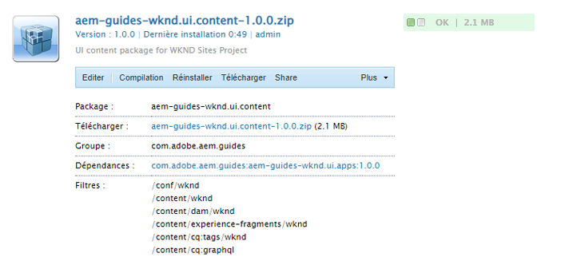

# Gestionnaire de packages {#working-with-packages}

Les packages permettent d’importer et d’exporter le contenu du référentiel. Vous pouvez utiliser des packages pour installer un nouveau contenu, transférer du contenu entre les instances et sauvegarder le contenu du référentiel.

À l’aide du gestionnaire de packages, vous pouvez transférer des packages entre votre instance AEM et votre système de fichiers local à des fins de développement.

## Que sont les packages ? {#what-are-packages}

Un package est un fichier zip contenant le contenu du référentiel dans un formulaire de sérialisation de système de fichiers, appelé sérialisation du coffre, fournissant une représentation des fichiers et des dossiers facile à utiliser et à modifier. Le contenu inclus dans le package est défini à l’aide de filtres.

Un package contient également les méta-informations du coffre, notamment les définitions des filtres et les informations de configuration de l’importation. Des propriétés de contenu supplémentaires, qui ne sont pas utilisées pour l’extraction du package, peuvent être incluses dans le package, telles qu’une description, une image visuelle ou une icône. Ces propriétés de contenu supplémentaires sont destinées au consommateur du package de contenu et ne sont fournies qu’à titre d’informations.

>[!NOTE]
>
>Les packages représentent la version actuelle du contenu au moment où le package est créé. Elles n’incluent aucune version précédente du contenu qu’AEM conserve dans le référentiel.

## Packages dans AEM as a Cloud Service {#aemaacs-packages}

Les packages de contenu créés pour les applications AEM as a Cloud Service doivent avoir une séparation nette entre le contenu non modifiable et le contenu modifiable. Par conséquent, le gestionnaire de packages ne peut être utilisé que pour gérer les packages avec du contenu. Tout code doit être déployé via Cloud Manager.

>[!NOTE]
>
>Les packages ne peuvent renfermer que du contenu. Toute fonctionnalité (par exemple, contenu stocké sous `/apps`) doit être [déployée à l’aide de votre pipeline CI/CD dans Cloud Manager](/help/implementing/cloud-manager/deploy-code.md).

>[!IMPORTANT]
>
>L’interface utilisateur du Gestionnaire de package peut renvoyer un message d’erreur **non défini** si l’installation d’un package prend plus de 10 minutes.
>
>Cela n’est pas dû à une erreur lors de l’installation, mais à une temporisation que Cloud Service applique à toutes les requêtes.
>
>N’essayez pas d’effectuer une nouvelle installation si une telle erreur s’affiche. L’installation se déroule correctement en arrière-plan. Si vous redémarrez l’installation, plusieurs processus d’importation simultanés peuvent provoquer des conflits.

Pour plus d’informations sur la gestion des packages pour AEMaaCS, consultez la section [Déploiement sur AEM as a Cloud Service](/help/implementing/deploying/overview.md) dans le guide d’utilisation du déploiement.

## Taille du package {#package-size}

Adobe recommande de ne pas créer de packages volumineux. Cela permet d’éviter des problèmes de délai d’expiration lors du chargement et du téléchargement des packages.

En règle générale, un package doit être transmis dans son intégralité dans un délai de 60 secondes. La formule suivante est fournie à titre de guide.

```text
MaxPackageSize (in MB) = ConnectionSpeed (in MB/s) * 60 s
```

Comme le trafic réseau est variable et qu’il est toujours inférieur à la valeur théorique maximale annoncée, essayez d’utiliser un outil de test de vitesse de connexion Internet en ligne.

Les vitesses Internet sont presque toujours différentes pour les chargements et les téléchargements. En supposant que vous deviez charger et télécharger des packages, vous devez utiliser la valeur la plus faible (généralement la vitesse de chargement) dans votre calcul.

### Exemple {#example}

En utilisant un outil de test de vitesse Internet, je vois que ma vitesse de chargement actuelle est d’environ 100 Mbit/s.

```text
100 Mbps = 12.5 MB/s
12.5 MB/s * 60 s = 750 MB
```

Donc tous les packages que je crée doivent être inférieurs à 750 Mo.

>[!NOTE]
>
>Les vitesses du réseau sont soumises aux conditions locales actuelles. Même avec un test de vitesse récent, votre débit réel peut varier.
>
>Par conséquent, la formule fournie est uniquement une indication et la taille maximale réelle recommandée du package peut varier.

## Gestionnaire de packages {#package-manager}

Le Gestionnaire de packages gère les packages de votre installation AEM. Après avoir [attribué les autorisations nécessaires](#permissions-needed-for-using-the-package-manager), vous pouvez utiliser le Gestionnaire de packages pour différentes actions, comme la configuration, la création, le téléchargement et l’installation des packages.

### Autorisations requises {#required-permissions}

Pour créer, modifier, charger et installer des packages, les utilisateurs doivent disposer des autorisations appropriées sur les nœuds suivants :

* Droits complets à l’exception de la suppression sur `/etc/packages`
* Le nœud contenant le contenu du package

>[!CAUTION]
>
>L’octroi d’autorisations pour les packages peut entraîner la divulgation d’informations sensibles et la perte de données.
>
>Pour limiter ces risques, il est vivement recommandé d’accorder des autorisations à des groupes spécifiques sur des sous-arborescences dédiées uniquement.

### Accéder au gestionnaire de packages {#accessing}

Vous pouvez accéder au gestionnaire de packages de trois façons :

1. À partir du menu principal d’AEM > **Outils** > **Déploiement** > **Packages**
1. Depuis [CRXDE Lite](crxde.md) en utilisant la barre de sélection supérieure
1. Directement en accédant à `http://<host>:<port>/crx/packmgr/`

### Interface utilisateur du gestionnaire de packages {#ui}

Le gestionnaire de packages est divisé en quatre zones fonctionnelles principales :

* **Panneau de navigation de gauche** - Ce panneau vous permet de filtrer et de trier la liste des packages.
* **Liste de packages** - Il s’agit de la liste des packages de votre instance, filtrée et triée selon les sélections effectuées dans le panneau de navigation de gauche.
* **Journal d’activité** - Ce panneau est d’abord réduit et se développe pour détailler l’activité du gestionnaire de packages, comme lorsqu’un package est créé ou installé. L’onglet Journal d’activité comporte des boutons supplémentaires pour :
   * **Effacer le journal**
   * **Afficher/Masquer**
* **Barre d’outils** - La barre d’outils contient des boutons d’actualisation pour le panneau de navigation de gauche et la liste des packages, ainsi que des boutons pour rechercher, créer et charger des packages.


Cliquez sur une option dans le panneau de navigation de gauche pour filtrer immédiatement la liste des packages.

Cliquez sur le nom d’un package pour développer l’entrée dans la liste des packages et afficher plus de détails sur le package.



Plusieurs actions peuvent être effectuées sur un package via les boutons de la barre d’outils disponibles lorsque les détails du package sont développés.

* [Modifier](#edit-package)
* [Créer](#building-a-package)
* [Réinstaller](#reinstalling-packages)
* [Télécharger](#downloading-packages-to-your-file-system)

D’autres actions sont disponibles sous le bouton **Plus**.

* [Supprimer](#deleting-packages)
* [Couverture](#package-coverage)
* [Contenu](#viewing-package-contents-and-testing-installation)
* [Réencapsuler](#rewrapping-a-package)
* [Autres versions](#other-versions)
* [Désinstaller](#uninstalling-packages)
* [Tester l’installation](#viewing-package-contents-and-testing-installation)
* [Valider](#validating-packages)
* [Répliquer](#replicating-packages)

### Statut du package {#package-status}

Chaque entrée de la liste des packages comporte un indicateur de statut qui vous permet de connaître d’un coup d’œil le statut du package. Si vous passez la souris sur le statut, vous verrez apparaître une info-bulle contenant le détail du statut.


Si le package a été modifié ou n’a jamais été conçu, le statut est présenté comme un lien permettant de prendre des mesures rapides afin de le concevoir à nouveau ou de l’installer.

## Paramètres du package {#package-settings}

Un package est essentiellement un ensemble de filtres et les données du référentiel basées sur ces filtres. Dans l’interface utilisateur du gestionnaire de modules, vous pouvez cliquer sur un package, puis sur le bouton **Modifier** pour afficher les détails d’un package, y compris les paramètres suivants.

* [Paramètres généraux](#general-settings)
* [Filtres de package](#package-filters)
* [Dépendances des packages](#package-dependencies)
* [Paramètres avancés](#advanced-settings)
* [Captures d’écran des packages](#package-screenshots)

### Paramètres généraux {#general-settings}

Vous pouvez modifier différents paramètres du package pour définir des informations telles que la description du package, les dépendances et les informations sur le fournisseur.

La boîte de dialogue **Paramètres du package** est accessible via le bouton **Modifier** lors de la [création](#creating-a-new-package) ou de la [modification](#viewing-and-editing-package-information) d’un package. Une fois les modifications effectuées, cliquez sur **Enregistrer**.


| Champ | Description |
|---|---|
| Nom | Le nom du package |
| Groupe | Pour organiser des packages, vous pouvez saisir le nom d’un nouveau groupe ou sélectionner un groupe existant. |
| Version | Texte à utiliser pour la version |
| Description | Brève description du package permettant le balisage HTML pour le formatage |
| Miniature | L’icône qui s’affiche dans la liste des packages |

### Filtres de package {#package-filters}

Les filtres identifient les nœuds du référentiel à inclure dans le package. Une **définition de filtre** spécifie les informations suivantes :

* **Chemin d’accès racine** du contenu à inclure
* **Règles** incluant ou excluant certains nœuds sous le chemin d’accès racine

Ajoutez des règles à l’aide du bouton **+**. Supprimez des règles à l’aide du bouton **-**.

Les règles sont appliquées selon leur ordre, donc positionnez-les dans l’ordre de votre choix à l’aide des boutons fléchés **haut** et **bas**.

Les filtres peuvent ne comporter aucune règle ou en comporter plusieurs. Lorsqu’aucune règle n’est définie, le package contient tout le contenu sous le chemin d’accès racine.

Vous pouvez définir une ou plusieurs définitions de filtre pour un package. Utilisez plusieurs filtres de manière à inclure le contenu de différents chemins d’accès racine.


Lors de la création de règles, vous définissez une expression régulière (également appelée regex, regexp ou expression rationnelle) pour spécifier tous les nœuds que vous souhaitez inclure ou exclure.

| Type de règle | Description |
|---|---|
| inclusion | Inclusion inclut tous les fichiers et dossiers du répertoire spécifié qui correspondent à l’expression régulière. Inclusion **n’inclura pas** d’autres fichiers ou dossiers sous le chemin d’accès racine spécifié. |
| Exclusion | Exclusion exclut tous les fichiers et dossiers correspondant à l’expression régulière. |

Les filtres de package sont le plus souvent définis lors de la première [création du package](#creating-a-new-package). Cependant, ils peuvent également être modifiés ultérieurement. Le package devra alors être recréé pour mettre à jour son contenu en fonction des nouvelles définitions de filtre.

>[!TIP]
>
>Un package peut contenir plusieurs définitions de filtre de manière à pouvoir combiner facilement des nœuds de différents emplacements en un seul package.

>[!TIP]
>
>Pour plus d’informations, voir la documentation [Apache Jackrabbit - Filtre d’espace de travail](https://jackrabbit.apache.org/filevault/filter.html).

### Dépendances {#dependencies}


| Champ | Description | Exemple/Détails |
|---|---|---|
| Testé avec | Le nom et la version du produit auquel ce package est destiné ou avec lequel il est compatible. | `AEMaaCS` |
| Problèmes résolus | Champ de texte permettant de répertorier les informations relatives aux bugs corrigés dans ce package, un bug par ligne. | - |
| Dépend de | Répertorie les autres packages nécessaires pour que le package actuel s’exécute comme prévu une fois installé. | `groupId:name:version` |
| Remplace | Liste des packages obsolètes que ce package remplace | `groupId:name:version` |

### Paramètres avancés {#advanced-settings}


| Champ | Description | Exemple/Détails |
|---|---|---|
| Nom | Nom du fournisseur du package | `WKND Media Group` |
| URL | Adresse URL du fournisseur | `https://wknd.site` |
| Lien | Lien spécifique au package vers une page de fournisseur | `https://wknd.site/package/` |
| Requiert | Définit s’il existe des restrictions lors de l’installation du package. | **Administrateur** - Le package ne doit être installé qu’avec des privilèges Administrateur <br>**Redémarrage** - AEM doit être redémarré après l’installation du package |
| Traitement AC | Indique comment les informations de contrôle d’accès définies dans le package sont traitées lors de son importation | **Ignorer** - Les ACL dans le référentiel sont conservées <br>**Remplacer** - Les ACL dans le référentiel sont remplacées <br>**Fusionner** - Les deux ensembles de ACL sont fusionnés <br>**FusionnerConserver** - Le contrôle dʼaccès dans le contenu est fusionné avec celui fourni avec le module en ajoutant les entrées de contrôle dʼaccès des principaux non présentes dans le contenu <br>**Effacer** - Les ACL sont effacées |

### Captures d’écran des packages {#package-screenshots}

Vous pouvez joindre plusieurs captures dʼécran à votre package pour fournir une représentation visuelle de la façon dont le contenu apparaît.


## Actions de package {#package-actions}

De nombreuses actions peuvent être entreprises sur un package.

### Création d’un package {#creating-a-new-package}

1. [Accédez au gestionnaire de packages](#accessing).

1. Cliquez sur **Créer un package**.

   >[!TIP]
   >
   >Si votre instance comporte de nombreux packages, une structure de dossiers peut être mise en place. Il est alors plus facile de naviguer vers le dossier cible requis avant de créer le nouveau package.

1. Dans la boîte de dialogue **Nouveau package**, saisissez les champs suivants :

   

   * **Nom du package** - Sélectionnez un nom explicite pour vous aider (vous et les autres) à identifier facilement le contenu du package.

   * **Version** - Champ de texte permettant d’indiquer une version. Elle est ajoutée au nom du package pour former le nom du fichier ZIP.

   * **Groupe** - Il s’agit du nom du groupe (ou du dossier) cible. Les groupes vous aident à organiser vos packages. Si le dossier n’existe pas encore, il est créé pour le groupe. Si vous ne renseignez pas le nom du groupe, le package est créé dans la liste des packages principale.

1. Cliquez sur **OK** pour créer le package.

1. AEM place le nouveau package en haut de la liste des packages.

   

1. Cliquez sur **Modifier** pour définir le [contenu du package](#package-contents). Cliquez sur **Enregistrer** une fois la modification des paramètres terminée.

1. Vous pouvez maintenant [créer](#building-a-package) votre package.

Il n’est pas obligatoire de concevoir immédiatement le package après lʼavoir créé. Un package non conçu ne contient aucun contenu et se compose uniquement des données du filtre et des autres métadonnées.

>[!TIP]
>
>Pour éviter les délais d’expiration, Adobe recommande [&#x200B; de ne pas créer de packages volumineux](#package-size).

### Concevoir un package {#building-a-package}

Un package est souvent conçu au moment où vous [créez le package](#creating-a-new-package), mais vous pouvez y revenir ultérieurement pour concevoir ou reconcevoir le package. Cela peut s’avérer utile si le contenu du référentiel ou les filtres du package ont été modifiés.

1. [Accédez au gestionnaire de packages](#accessing).

1. Ouvrez les détails du package dans la liste des packages en cliquant sur son nom.

1. Cliquez sur **Concevoir**. Une boîte de dialogue vous demande de confirmer que vous souhaitez créer le package, car tout contenu existant du package sera remplacé.

1. Cliquez sur **OK**. AEM crée le package et répertorie tout le contenu ajouté au package dans la liste des activités. Une fois l’opération terminée, AEM affiche un message de confirmation indiquant que le package a été conçu et (lorsque vous fermez la boîte de dialogue) met à jour les informations de la liste de packages.

>[!TIP]
>
>Pour éviter les délais d’expiration, Adobe recommande [&#x200B; de ne pas créer de packages volumineux](#package-size).

### Modifier un package {#edit-package}

Une fois quʼun package est téléchargé dans AEM, vous pouvez modifier ses paramètres.

1. [Accédez au gestionnaire de packages](#accessing).

1. Ouvrez les détails du package dans la liste des packages en cliquant sur son nom.

1. Cliquez sur **Modifier** et mettez à jour les **[Paramètres du package](#package-settings)**, au besoin.

1. Cliquez sur **Enregistrer**.

En fonction des modifications que vous avez apportées, vous devrez peut-être [concevoir à nouveau le package](#building-a-package) pour mettre à jour son contenu.

### Réencapsuler un package {#rewrapping-a-package}

Une fois qu’un package a été créé, il peut être réencapsulé. La réencapsulation modifie les informations du package telles que la miniature, la description, etc., sans toucher à son contenu.

1. [Accédez au gestionnaire de packages](#accessing).

1. Ouvrez les détails du package dans la liste des packages en cliquant sur son nom.

1. Cliquez sur **Modifier** et mettez à jour les **[Paramètres du package](#package-settings)**, au besoin.

1. Cliquez sur **Enregistrer**.

1. Cliquez sur **Plus** > **Réencapsuler**. Une boîte de dialogue vous demandera une confirmation.

### Afficher d’autres versions de package {#other-versions}

Comme chaque version d’un package apparaît dans la liste comme n’importe quel autre package, le gestionnaire de packages peut trouver d’autres versions d’un package sélectionné.

1. [Accédez au gestionnaire de packages](#accessing).

1. Ouvrez les détails du package dans la liste des packages en cliquant sur son nom.

1. Cliquez sur **Plus** > **Autres versions**. Une boîte de dialogue s’ouvre alors avec une liste d’autres versions du même package avec des informations sur le statut.

### Afficher le contenu du package et test de l’installation {#viewing-package-contents-and-testing-installation}

Une fois un package créé, vous pouvez afficher son contenu.

1. [Accédez au gestionnaire de packages](#accessing).

1. Ouvrez les détails du package dans la liste des packages en cliquant sur son nom.

1. Pour afficher le contenu, cliquez sur **Plus** > **Contenu**, et le gestionnaire de modules répertorie l’intégralité du contenu du package dans le journal des activités.

   

1. Pour exécuter un essai de l’installation, cliquez sur **Plus** > **Test de l’installation** et le Gestionnaire de modules établit un rapport sur les résultats dans le journal d’activité comme si l’installation avait été effectuée.

   

### Télécharer des packages sur votre système de fichiers {#downloading-packages-to-your-file-system}

1. [Accédez au gestionnaire de packages](#accessing).

1. Ouvrez les détails du package dans la liste des packages en cliquant sur son nom.

1. Cliquez sur le bouton **Télécharger** ou sur le nom du fichier lié au package dans la zone des détails du package.

1. AEM télécharge le package sur votre ordinateur.

>[!TIP]
>
>Pour éviter les délais d’expiration, Adobe recommande [&#x200B; de ne pas créer de packages volumineux](#package-size).

### Chargement des packages à partir du système de fichiers {#uploading-packages-from-your-file-system}

1. [Accédez au gestionnaire de packages](#accessing).

1. Sélectionnez le dossier de groupe dans lequel vous souhaitez que le package soit chargé.

1. Cliquez sur le bouton **Charger le package**.

1. Fournissez les informations nécessaires sur le package chargé.

   

   * **Package** - Servez-vous du bouton **Parcourir…** pour sélectionner le package requis dans votre système de fichiers local.
   * **Forcer le chargement** - Si un package portant ce nom existe déjà, cette option force le chargement et remplace le package existant.

1. Cliquez sur **OK**, le package sélectionné est chargé et la liste des packages est mise à jour en conséquence.

Le contenu du package existe désormais sur AEM, mais pour rendre le contenu disponible, veillez à [installer le package](#installing-packages).

>[!TIP]
>
>Pour éviter les délais d’expiration, Adobe recommande [&#x200B; de ne pas créer de packages volumineux](#package-size).

### Validation de packages {#validating-packages}

Les packages pouvant modifier le contenu existant, il est souvent utile de valider ces modifications avant de les installer.

#### Options de validation {#validation-options}

Le gestionnaire de packages peut effectuer les validations suivantes :

* [Imports de packages OSGi](#osgi-package-imports)
* [Recouvrements](#overlays)
* [ACL](#acls)

##### Valider les importations de packages OSGi {#osgi-package-imports}

>[!NOTE]
>
>Les packages ne pouvant pas être utilisés pour déployer du code dans AEMaaCS, la validation **Imports de packages OSGi** est inutile.

**Contenu vérifié**

Cette validation inspecte le package pour tous les fichiers JAR (lots OSGi), extrait leur `manifest.xml` (qui contient les dépendances de version sur lesquelles le lot OSGi repose) et vérifie que l’instance AEM exporte lesdites dépendances avec les versions correctes.

**Comment est-ce rapporté**

Toutes les dépendances de version qui ne peuvent pas être satisfaites par l’instance AEM est répertoriées dans le journal d’activité du Gestionnaire de packages.

**États d’erreur**

Si les dépendances ne sont pas satisfaites, les lots OSGi du package avec ces dépendances ne démarrent pas. Cela entraîne un déploiement d’application interrompu, car tout ce qui repose sur le lot OSGi non démarré ne fonctionnera pas correctement.

**Résolution d’erreurs**

Pour résoudre des erreurs dues à des lots OSGi non satisfaits, il faut ajuster la version dépendante du lot avec des importations non satisfaites.

##### Valider les recouvrements {#overlays}

>[!NOTE]
>
>Les packages ne pouvant pas être utilisés pour déployer du code dans AEMaaCS, la validation **Recouvrements** est inutile.

**Contenu vérifié**

Cette validation détermine si le package en cours d’installation contient un fichier qui est déjà recouvert dans l’instance AEM de destination.

Par exemple, étant donné un recouvrement présent dans `/apps/sling/servlet/errorhandler/404.jsp`, un package contenant `/libs/sling/servlet/errorhandler/404.jsp`, il modifiera donc le fichier existant dans `/libs/sling/servlet/errorhandler/404.jsp`.

**Comment est-ce rapporté**

Ces recouvrements sont décrits dans le Journal d’activités du Gestionnaire de packages.

**États d’erreur**

Un état d’erreur signifie que le package tente de déployer un fichier déjà recouvert. Par conséquent, les modifications du package seront remplacées (et donc « masquées ») par le recouvrement et ne prendront pas effet.

**Résolution d’erreurs**

Pour résoudre ce problème, le responsable du fichier de recouvrement dans `/apps` doit réviser les modifications apportées au fichier recouvert dans `/libs` et incorporer les modifications requises, le cas échéant, dans le recouvrement (`/apps`) et redéployer le fichier recouvert.

>[!NOTE]
>
>Le mécanisme de validation ne peut pas vérifier si le contenu recouvert a été correctement incorporé dans le fichier recouvert. Par conséquent, cette validation continuera à signaler des conflits même après que les modifications nécessaires auront été apportées.

##### Valider les ACL {#acls}

**Contenu vérifié**

Cette validation vérifie quelles autorisations sont ajoutées, comment elles sont gérées (fusion/remplacement) et si les autorisations actuelles sont affectées.

**Comment est-ce rapporté**

Les autorisations sont décrites dans le Journal d’activités du Gestionnaire de packages.

**États d’erreur**

Aucune erreur explicite ne peut être fournie. La validation indique simplement si de nouvelles autorisations ACL sont ajoutées ou affectées par l’installation du package.

**Résolution d’erreurs**

À l’aide des informations fournies par la validation, les nœuds concernés peuvent être examinés dans CRXDE et les listes de contrôle d’accès peuvent être ajustées dans le package, le cas échéant.

>[!CAUTION]
>
>Il est recommandé de sʼassurer que les packages n’affectent pas les ACL fournies par AEM, car cela pourrait entraîner un comportement inattendu du produit.

#### Exécuter la validation {#performing-validation}

La validation des packages peut se faire de deux manières différentes :

* [via l’interface utilisateur du gestionnaire de packages](#via-package-manager).
* [via une requête de POST HTTP, telle que cURL](#via-post-request).

La validation doit toujours avoir lieu après le chargement du package, mais avant son installation.

##### Validation de packages via le Gestionnaire de packages {#via-package-manager}

1. [Accédez au gestionnaire de packages](#accessing).

1. Ouvrez les détails du package dans la liste des packages en cliquant sur son nom.

1. Pour valider le package, cliquez sur **Plus** > **Valider**.

1. Dans la boîte de dialogue modale qui s’affiche alors, utilisez les cases à cocher pour sélectionner le ou les types de validation et commencez la validation en cliquant sur **Valider**.

1. La ou les validations sélectionnées sont ensuite exécutées et les résultats sont affichés dans le Journal d’activité du Gestionnaire de packages.

##### Validation de packages via une requête HTTP POST {#via-post-request}

La requête POST se présente comme suit.

```
https://<host>:<port>/crx/packmgr/service.jsp?cmd=validate&type=osgiPackageImports,overlays,acls
```

Le paramètre `type` peut être n’importe quelle liste non triée séparée par des virgules qui comprend :

* `osgiPackageImports`
* `overlays`
* `acls`

La valeur par défaut de `type` est `osgiPackageImports` si elle n’est pas explicitement transmise.

Si vous utilisez cURL, exécutez une instruction semblable à celle-ci :

```shell
curl -v -X POST --user admin:admin -F file=@/Users/SomeGuy/Desktop/core.wcm.components.all-1.1.0.zip 'http://localhost:4502/crx/packmgr/service.jsp?cmd=validate&type=osgiPackageImports,overlays,acls'
```

Lors de la validation par le biais dʼune requête POST, la réponse est renvoyée sous la forme d’un objet JSON.

### Affichage de la couverture du package {#package-coverage}

Les packages sont définis par leurs filtres. Vous pouvez demander au Gestionnaire de packages d’appliquer les filtres d’un package au contenu de votre référentiel existant, afin de montrer le contenu du référentiel qui est couvert par la définition du filtre du package.

1. [Accédez au gestionnaire de packages](#accessing).

1. Ouvrez les détails du package dans la liste des packages en cliquant sur son nom.

1. Cliquez sur **Plus** > **Couverture**.

1. Les détails de la couverture sont répertoriés dans le journal d’activité.

### Installation des packages {#installing-packages}

Le chargement d’un package ajoute uniquement le contenu du package au référentiel, mais il n’est pas accessible. Vous devez installer le package chargé pour utiliser son contenu.

>[!CAUTION]
>
>L’installation d’un package peut remplacer ou supprimer le contenu existant. Ne chargez un package que si vous avez la certitude qu’il ne supprime pas ou ne remplace pas le contenu dont vous avez besoin.

Avant l’installation de votre package, le gestionnaire de modules crée automatiquement un package instantané contenant le contenu qui sera remplacé. Cet instantané est réinstallé lorsque vous désinstallez le package.

1. [Accédez au gestionnaire de packages](#accessing).

1. Ouvrez les détails du package que vous souhaitez installer à partir de la liste des packages en cliquant sur le nom du package.

1. Cliquez soit sur le bouton **Installer** dans les détails de l’élément, soit sur le lien **Installer** dans le statut du package.

1. Une boîte de dialogue demande confirmation et permet de spécifier des options supplémentaires.

   * **Extraire uniquement** - Extraire le package uniquement afin qu’aucun instantané ne soit créé et que la désinstallation ne soit pas possible
   * **Enregistrer le seuil** - Nombre de nœuds transitoires jusqu’au déclenchement de la sauvegarde automatique (augmentez si vous rencontrez des exceptions de modifications simultanées).
   * **Extraire les sous-packages** - Activer l’extraction automatique des sous-packages
   * **Gestion du contrôle d’accès** - Spécifie comment les informations de contrôle d’accès définies dans le package sont traitées lors de l’installation du package (les options sont les mêmes que les [paramètres avancés des packages](#advanced-settings))
   * **Gestion des dépendances** - Spécifier comment les dépendances sont gérées lors de l’installation

1. Cliquez sur **Installer**.

1. Le journal des activités détaille la progression de l’installation.

Une fois l’installation terminée et réussie, la liste des packages est mise à jour et le mot **Installé** apparaît dans le statut du package.

### Réinstaller les packages {#reinstalling-packages}

La réinstallation des packages effectue les mêmes étapes sur un package déjà installé que celle traitées lors de [l’installation initiale du package](#installing-packages).

### Chargement et installation basés sur le système de fichiers {#file-system-based-upload-and-installation}

Vous pouvez complètement renoncer au gestionnaire de packages lors de l’installation de packages. AEM peut détecter les packages placés à un emplacement spécifique du système de fichiers local de l’ordinateur hôte et les charger et installer automatiquement.

1. Sous le dossier d’installation d’AEM, il y a un dossier `crx-quicksart` à côté du fichier jar et du fichier `license.properties`. Créez un dossier nommé `install` sous `crx-quickstart` résultant au chemin d’accès `<aem-home>/crx-quickstart/install`.

1. Dans ce dossier, ajoutez vos packages. Ils sont chargés et installés automatiquement sur votre instance.

1. Une fois le chargement et l’installation terminés, vous pouvez voir les packages dans Gestionnaire de packages comme si vous aviez utilisé l’interface utilisateur du Gestionnaire de packages pour les installer.

Si l’instance est en cours d’exécution, le chargement et l’installation démarrent immédiatement lorsque vous l’ajoutez au package dans le dossier `install`.

Si l’instance n’est pas en cours d’exécution, les packages placés dans le dossier `install` sont installés au démarrage par ordre alphabétique.

### Désinstaller les packages {#uninstalling-packages}

La désinstallation d’un package ramène le contenu du référentiel à l’instantané réalisé automatiquement par le gestionnaire de packages avant l’installation.

1. [Accédez au gestionnaire de packages](#accessing).

1. Ouvrez les détails du package que vous souhaitez désinstaller à partir de la liste des packages en cliquant sur le nom du package.

1. Pour supprimer le contenu de ce package du référentiel, cliquez sur **Plus** > **Désinstaller**.

1. Une boîte de dialogue vous invite à confirmer et énumère toutes les modifications apportées.

1. Le package est supprimé et l’instantané est appliqué. La progression du processus s’affiche dans le journal des activités.

### Supprimer des packages {#deleting-packages}

La suppression d’un package supprime uniquement ses détails du gestionnaire de packages. Si ce package a déjà été installé, le contenu installé n’est pas supprimé.

1. [Accédez au gestionnaire de packages](#accessing).

1. Ouvrez les détails du package que vous souhaitez supprimer de la liste des packages en cliquant sur le nom du package.

1. AEM vous invite à confirmer que vous souhaitez supprimer le package. Cliquez sur **OK** pour confirmer la suppression.

1. Les informations sur le package sont supprimées et les détails sont signalés dans le journal d’activité.

### Répliquer les packages {#replicating-packages}

Répliquez le contenu d’un package afin de l’installer dans l’instance de publication.

1. [Accédez au gestionnaire de packages](#accessing).

1. Ouvrez les détails du package que vous souhaitez répliquer depuis la liste des packages en cliquant sur le nom du package.

1. Cliquez sur **Plus** > **Répliquer**.

1. Le package est répliqué et les détails sont signalés dans le journal d’activité.

## Distribution logicielle {#software-distribution}

Les packages AEM peuvent être utilisés pour créer et partager du contenu dans les environnements AEMaaCS.

[Distribution logicielle](https://downloads.experiencecloud.adobe.com) fournit des packages AEM à utiliser sur le SDK AEM de développement local. Les packages AEM fournis sur la distribution logicielle ne doivent pas être installés sur les environnements cloud AEMaaCS, sauf approbation expresse de l’assistance clientèle Adobe.

Pour plus d’informations, consultez la [documentation sur la distribution logicielle](https://experienceleague.adobe.com/docs/experience-cloud/software-distribution/home.html?lang=fr).
