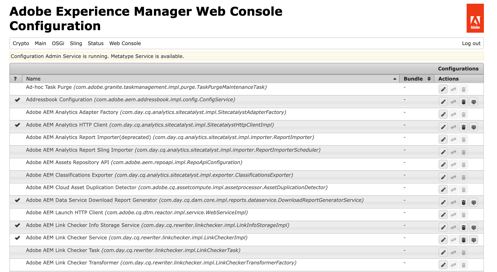
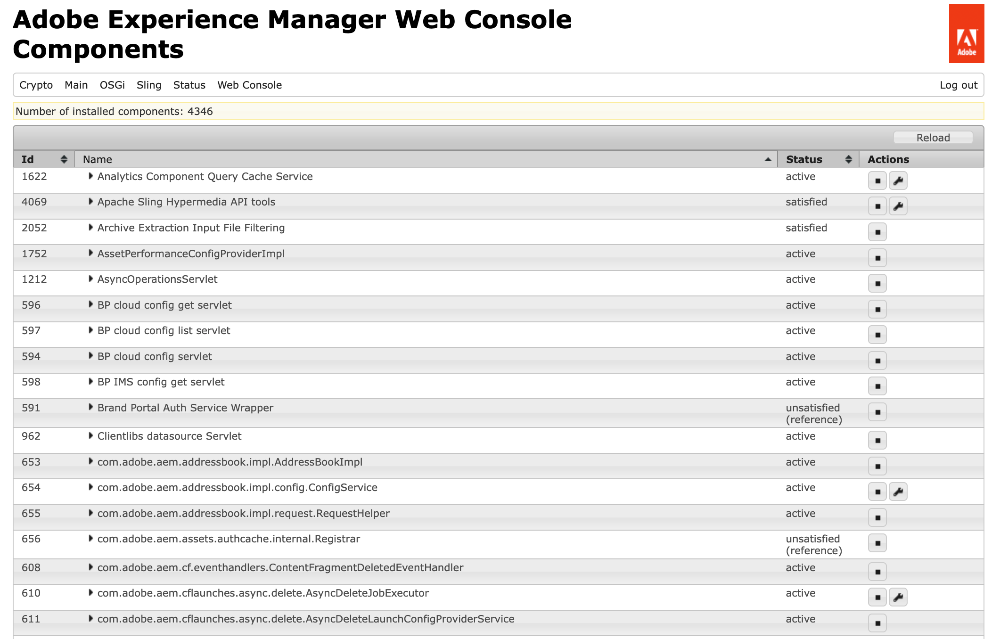

# Console web {#web-console}

Découvrez comment utiliser la console web Adobe Experience Manager (AEM) pour gérer les paramètres OSGi et les lots pour le développement local.

## Vue d’ensemble {#overview}

AEM as a Cloud Service traite la [configuration et le code comme immuables au moment de l’exécution.](/help/release-notes/aem-cloud-changes.md#apps-libs-immutable) Cela signifie que toutes les configurations doivent être déployées comme vous le feriez pour le code dans un environnement de production. Pour les instances de production, cela garantit que les points de contrôle qualité sont franchis et offre un niveau de stabilité et de clarté de votre environnement actuel.

Cependant, des mises à jour et des modifications de lots ad hoc [configuration OSGi](/help/implementing/deploying/configuring-osgi.md) sont souvent nécessaires pour tester les développements locaux. Dans le cadre d’AEM as a Cloud Service SDK](/help/implementing/developing/introduction/aem-as-a-cloud-service-sdk.md) la console web permet ces mises à jour en temps réel.[

AEM as a Cloud Service s’exécutant localement, vous pouvez accéder à la console à partir de `http://<host>:<port>/system/console`.

La console web propose une sélection d’écrans et d’options pour la maintenance des lots OSGi, notamment :

* [Configuration](#configuration) : pour la configuration des lots OSGi. Il s’agit donc du mécanisme sous-jacent pour la configuration des paramètres système d’AEM
* [Lots](#bundles) : pour installer des lots
* [Composants](#components) : pour contrôler le statut des composants requis pour AEM
* [Génération de configurations OSGi](#generating-osgi-configurations) : pour générer automatiquement des configurations OSGi au format JSON.

Toutes les modifications apportées sont immédiatement appliquées au SDK en cours d’exécution. Aucun redémarrage n’est requis.

Dans la console web, toute description qui mentionne les paramètres par défaut est liée aux valeurs par défaut de Sling. AEM ayant ses propres paramètres par défaut, ces derniers peuvent être différents de ceux documentés par la console.

La console web de Adobe Experience Manager (AEM) repose sur la [console de gestion web Apache Felix](https://felix.apache.org/documentation/subprojects/apache-felix-web-console.html). Apache Felix est un travail de la communauté pour mettre en œuvre la plateforme de service OSGi R4, qui inclut le framework OSGi et les services standard.

>[!NOTE]
>
>La console web n’est disponible que dans AEM as a Cloud Service SDK à des fins de développement local. Il n’est pas disponible en production.

>[!TIP]
>
>Pour vérifier le statut de vos configurations, lots et composants OSGi dans un environnement de production, utilisez le [Developer Console.](/help/implementing/developing/introduction/aem-developer-console.md)

## Configuration {#configuration}

L’écran **Configuration** est utilisé pour configurer les lots OSGi et est donc le mécanisme sous-jacent pour configurer les paramètres système d’AEM. L’onglet **Configuration** est accessible soit via :

* Le menu déroulant : **OSGi -> Configuration**
* URL : `http://<host>:<port>/system/console/configMgr`

Une liste des configurations s’affiche :

Deux types de configurations sont disponibles à partir de la liste de cet écran :

* **Configurations** vous permet de mettre à jour les configurations existantes. Ils possèdent une identité persistante (PID) et peuvent être :
   * Standard et intégrales pour AEM : elles sont requises. Si elles sont supprimées, les valeurs sont renvoyées aux paramètres par défaut.
   * Instances créées à partir des configurations d’usine : ces instances sont créées par l’utilisateur ou l’utilisatrice et la suppression supprime l’instance.
* **Configurations d’usine** vous permet de créer une instance de l’objet de fonctionnalité requis. Elles sont affectées à une identité persistante, puis répertoriées dans la liste des configurations.

En sélectionnant une entrée quelconque dans la liste, vous pourrez voir les paramètres associés à cette configuration :

Vous pouvez mettre à jour les paramètres selon vos besoins et :

* **Enregistrer** pour enregistrer les modifications apportées.
   * Pour une configuration d’usine, cela crée une instance avec une identité persistante.
   * La nouvelle instance est ensuite répertoriée sous Configurations.
* **Réinitialiser** pour réinitialiser les paramètres affichés à l’écran sur ceux enregistrés en dernier.
* **Supprimer** pour supprimer la configuration actuelle.
   * Si elle est standard, les paramètres sont renvoyés aux paramètres par défaut.
   * S’il est créé à partir d’une configuration d’usine, l’instance spécifique est supprimée.
* **Dissocier** pour dissocier la configuration actuelle du lot.
* **Annuler** pour annuler les modifications actuelles.

>[!TIP]
>
>Consultez [Configuration d’OSGi pour Adobe Experience Manager as a Cloud Service](/help/implementing/deploying/configuring-osgi.md) pour plus de détails sur les configurations OSGi.

## Lots {#bundles}

L’écran **Lots** permet d’installer les lots OSGi requis par AEM. L’écran est accessible par l’une des méthodes suivantes :

* Le menu déroulant : **OSGi -> Lots**
* URL : `http://<host>:<port>/system/console/bundles`

Une liste de lots s’affiche :

À l’aide de cet écran, vous pouvez :

* **Installer ou Mettre à jour** pour installer un nouveau lot ou mettre à jour un lot existant.
   * Vous pouvez utiliser l’option **Parcourir** pour trouver le fichier contenant votre lot et spécifier s’il doit **commencer** immédiatement et à quel **niveau de départ**.
* **Recharger** pour actualiser la liste affichée.
* **Actualiser les packages** pour vérifier les références de tous les packages et actualiser, si nécessaire.
   * Par exemple, après une mise à jour, l’ancienne et la nouvelle version peuvent toujours être exécutées en raison de références antérieures. Cette option permettra de vérifier et de déplacer toutes les références vers la nouvelle version, afin d’arrêter l’ancienne version.
* **Démarrer** pour démarrer un lot en fonction du niveau de départ spécifié.
* **Arrêter** pour arrêter le lot.
* **Désinstaller** pour désinstaller le lot du système.

La liste spécifie le statut du lot. cliquez sur le nom d’un lot spécifique avec pour afficher des informations supplémentaires.

>[!TIP]
>
>Après la **Mise à jour**, Adobe vous recommande de cliquer sur **Actualiser les packages**.

## Composants {#components}

L’écran **Composants** vous permet d’activer et de désactiver des composants. Il est accessible par les éléments suivants :

* Le menu déroulant : **Principal -> Composants**
* URL : `http://<host>:<port>/system/console/components`

Une liste de composants s’affiche. Des icônes sont disponibles pour chaque ligne afin de vous permettre d’activer, de désactiver ou (le cas échéant) d’ouvrir les détails de la configuration pour un composant spécifique.

Cliquez sur le nom d’un composant spécifique pour afficher des informations supplémentaires sur son statut. Vous pouvez également activer, désactiver ou recharger le composant.

>[!NOTE]
>
>L’activation ou la désactivation d’un composant ne s’applique que jusqu’au redémarrage de SDK.
>
>L’état de départ est défini dans le descripteur de composant, qui est généré pendant le développement et stocké dans le lot au moment de la création du lot.

## Génération de configurations OSGi {#generating-osgi-configs}

La console web peut être utilisée pour configurer des composants OSGi et exporter des configurations OSGi au format JSON. Cela s’avère utile pour configurer des composants OSGi fournis par AEM dont vous ne connaissez peut-être pas les propriétés OSGi et les formats de valeur lorsque vous définissez des configurations OSGi dans votre projet AEM.

Consultez le document [Configuration d’OSGi pour Adobe Experience Manager as a Cloud Service](/help/implementing/deploying/configuring-osgi.md#generating-osgi-configurations-using-the-web-console) pour plus d’informations.
