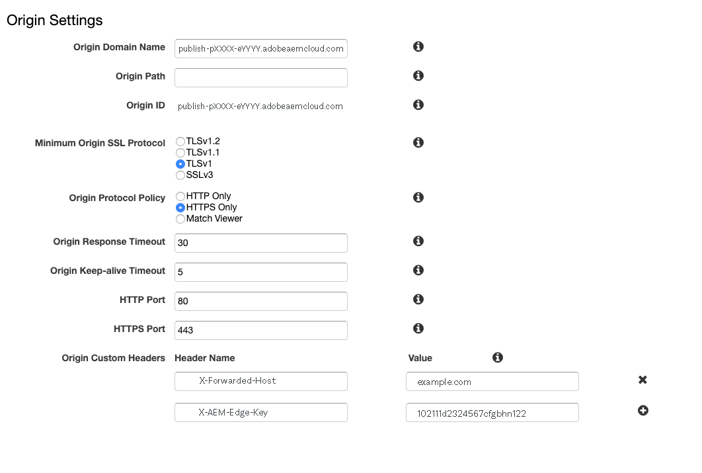

# Réseau de diffusion de contenu dans AEM as a Cloud Service {#cdn}

>[!CONTEXTUALHELP]
>id="aemcloud_golive_cdn"
>title="Réseau de diffusion de contenu dans AEM as a Cloud Service"
>abstract="AEM as a Cloud Service est fourni avec un réseau CDN intégré. Son principal objectif est de réduire la latence en fournissant du contenu pouvant être mis en cache à partir des nœuds CDN en périphérie, près du navigateur. Il est entièrement géré et configuré afin de permettre des performances optimales des applications AEM."

AEM as a Cloud Service est fourni avec un réseau CDN intégré, conçu pour réduire la latence en fournissant du contenu pouvant être mis en cache à partir des nœuds Edge près du navigateur de l’utilisateur. Ce réseau CDN entièrement géré est optimisé pour les performances de l’application AEM.

Le réseau CDN géré par AEM répond aux besoins de la plupart des clients en matière de performances et de sécurité. Pour le niveau de publication, les clients et clientes peuvent choisir d’acheminer le trafic via leur propre réseau CDN, qu’ils ou elles doivent gérer. Cette option est disponible au cas par cas, en particulier lorsque les clients disposent d’intégrations héritées existantes avec un fournisseur de réseau CDN, difficiles à remplacer.

Les clients et clientes qui souhaitent effectuer une publication au niveau Edge Delivery Services peuvent tirer parti du réseau CDN géré par Adobe. Voir [Réseau CDN géré par Adobe](#aem-managed-cdn). <!-- CQDOC-21758, 5b -->


<!-- ERROR: NEITHER URL IS FOUND (HTTP ERROR 404) Also, see the following videos [Cloud 5 AEM CDN Part 1](https://experienceleague.adobe.com/docs/experience-manager-learn/cloud-service/cloud-5/cloud5-aem-cdn-part1.html) and [Cloud 5 AEM CDN Part 2](https://experienceleague.adobe.com/docs/experience-manager-learn/cloud-service/cloud-5/cloud5-aem-cdn-part2.html) for additional information about CDN in AEM as a Cloud Service. -->

## Réseau CDN géré par Adobe {#aem-managed-cdn}

<!-- CQDOC-21758, 5a -->

Pour préparer la diffusion de contenu à l’aide du réseau CDN intégré d’AEM via l’interface utilisateur en libre-service de Cloud Manager, vous pouvez tirer parti des fonctionnalités du réseau CDN géré par Adobe. Cette fonctionnalité vous permet de gérer la gestion du réseau CDN en libre-service, y compris la configuration et l’installation de certificats SSL tels que les certificats DV (Validation de domaine) ou EV/OV (Validation d’organisation/étendue). Pour plus d’informations sur ces méthodes, voir :

* [Edge Delivery Services dans Cloud Manager](/help/implementing/cloud-manager/edge-delivery/introduction-to-edge-delivery-services.md)
* [Introduction aux noms de domaine personnalisés](/help/implementing/cloud-manager/custom-domain-names/introduction.md)
* [Introduction à la gestion des certificats SSL](/help/implementing/cloud-manager/managing-ssl-certifications/introduction-to-ssl-certificates.md)
* [Configuration d’un réseau CDN](/help/implementing/cloud-manager/domain-mappings/add-domain-mapping.md)

**Limitation du trafic**

Par défaut, dans le cas d’une configuration de réseau CDN géré par AEM, tout le trafic public peut se diriger vers le service de publication, tant pour les environnements de production que les environnements de non-production (de développement et d’évaluation). Vous pouvez limiter le trafic vers le service de publication pour un environnement donné (par exemple, en limitant l’évaluation par une plage d’adresses IP) au moyen de l’interface utilisateur de Cloud Manager.

Consultez [Gestion des listes d’adresses IP autorisées](/help/implementing/cloud-manager/ip-allow-lists/introduction.md) pour en savoir plus.

>[!CAUTION]
>
>Le réseau CDN géré par AEM ne traite que les requêtes provenant des adresses IP autorisées. Si vous pointez votre propre réseau CDN sur le réseau géré par AEM, assurez-vous que les adresses IP de votre réseau CDN sont incluses dans la Liste autorisée IP.

### Configuration du trafic sur le réseau CDN {#cdn-configuring-cloud}

Vous pouvez configurer le trafic sur le réseau CDN de différentes manières, notamment :

* blocage du trafic malveillant à l’aide de [règles de filtrage du trafic](/help/security/traffic-filter-rules-including-waf.md) (y compris les règles WAF avancées éventuellement sous licence)
* modification de la nature de la [requête et réponse](/help/implementing/dispatcher/cdn-configuring-traffic.md#request-transformations)
* application des redirections 301/302 [côté client](/help/implementing/dispatcher/cdn-configuring-traffic.md#client-side-redirectors)
* déclaration des [sélecteurs d’origine](/help/implementing/dispatcher/cdn-configuring-traffic.md#client-side-redirectors) pour inverser une requête de proxy vers des serveurs principaux non AEM

Utilisez les fichiers YAML dans Git pour configurer ces fonctionnalités. Vous pouvez également utiliser le [Pipeline de configuration](/help/implementing/dispatcher/cdn-configuring-traffic.md) de Cloud Manager pour les déployer.

### Configurer les pages d’erreur du réseau CDN {#cdn-error-pages}

Vous pouvez configurer une page d’erreur de réseau CDN pour remplacer la page par défaut sans marque. Cette page personnalisée s’affiche dans les rares cas où AEM n’est pas disponible. Pour plus d’informations, voir [Pages d’erreur de configuration du réseau CDN](/help/implementing/dispatcher/cdn-error-pages.md).

### Purge du contenu mis en cache sur le réseau CDN {#purge-cdn}

La définition de la durée de vie (TTL) à l’aide de l’en-tête de contrôle du cache HTTP est une approche efficace pour équilibrer les performances de diffusion du contenu et l’actualisation du contenu. Cependant, dans les cas où il est essentiel de diffuser immédiatement le contenu mis à jour, il peut être bénéfique de purger directement le cache du réseau CDN.

Découvrez [configuration d’un jeton API de purge](/help/implementing/dispatcher/cdn-credentials-authentication.md#purge-API-token) et [purge du contenu CDN mis en cache](/help/implementing/dispatcher/cdn-cache-purge.md).

### Authentification de base sur le réseau CDN {#basic-auth}

Pour les cas d’utilisation d’authentification légers, notamment les parties prenantes de l’entreprise qui examinent le contenu, protégez le contenu en affichant une boîte de dialogue d’authentification de base nécessitant un nom d’utilisateur et un mot de passe. [En savoir plus](/help/implementing/dispatcher/cdn-credentials-authentication.md).

## Le réseau CDN du client ou de la cliente pointe vers le réseau CDN géré par AEM {#point-to-point-CDN}

>[!CONTEXTUALHELP]
>id="aemcloud_golive_byocdn"
>title="Le CDN du client ou de la cliente (ou proxy) pointe vers le CDN géré par AEM."
>abstract="AEM as a Cloud Service offre aux clients une option pour utiliser son réseau CDN. Pour le niveau de publication, les clients et clientes peuvent éventuellement privilégier leur propre réseau CDN, mais il leur appartiendra de le gérer. Ce scénario sera possible au cas par cas, en fonction de certaines conditions préalables, y compris, mais sans s’y limiter, le fait que le client ou la cliente possède une ancienne intégration avec son fournisseur CDN, et qu’il soit difficile de l’abandonner."

Si un client ou une cliente doit utiliser son réseau CDN existant (ou tout type de proxy inverse, par exemple une répartition de charge ou un WAF), il ou elle peut le gérer et le pointer vers le réseau CDN géré par AEM, dans la mesure où les conditions suivantes sont satisfaites :

* Le client ou la cliente doit disposer d’un réseau CDN existant, ce qui serait coûteux à remplacer.
* Le client doit le gérer.
* Le client doit être en mesure de configurer le réseau CDN pour fonctionner avec AEM as a Cloud Service. Consultez les instructions de configuration présentées ci-dessous.
* Le client ou la cliente doit disposer de spécialistes en ingénierie sur le réseau CDN qui sont à sa disposition en cas de problème.
* Le client doit effectuer et réussir un test de charge avant de passer en production.

Instructions de configuration :

1. Pointez votre réseau CDN sur l’entrée du réseau CDN d’Adobe en tant que domaine d’origine. Par exemple, `publish-p<PROGRAM_ID>-e<ENV-ID>.adobeaemcloud.com`.
1. Définissez le SNI sur l’entrée du réseau CDN d’Adobe.
1. Définissez l’en-tête hôte sur le domaine d’origine. Par exemple : `Host:publish-p<PROGRAM_ID>-e<ENV-ID>.adobeaemcloud.com`.
1. Définissez l’en-tête `X-Forwarded-Host` avec le nom de domaine afin qu’AEM puisse déterminer l’en-tête hôte. Par exemple : `X-Forwarded-Host:example.com`.
1. Définir `X-AEM-Edge-Key`. La valeur doit être configurée à l’aide d’un pipeline de configuration Cloud Manager, comme décrit dans [cet article](/help/implementing/dispatcher/cdn-credentials-authentication.md#CDN-HTTP-value).

   * Ce paramétrage est nécessaire afin que le réseau CDN d’Adobe puisse valider la source des requêtes et transmettre les en-têtes `X-Forwarded-*` à l’application AEM. Par exemple,`X-Forwarded-For` est utilisé pour déterminer l’adresse IP du client. Il incombe donc à l’appelant approuvé (c’est-à-dire au réseau CDN géré par le client ou la cliente) de s’assurer que les en-têtes `X-Forwarded-*` sont corrects (voir la note ci-dessous).
   * L’accès à l’entrée du réseau CDN d’Adobe peut être aussi bloqué lorsqu’une balise `X-AEM-Edge-Key` n’est pas présente. Informez Adobe si vous avez besoin d’un accès direct à l’entrée du CDN d’Adobe (à bloquer).

Voir [Exemples de configurations de fournisseur de réseau CDN](#sample-configurations) pour consulter des exemples de configuration provenant de principaux fournisseurs de réseau CDN.

Avant d’accepter le trafic en direct, vous devez vérifier auprès du service clientèle d’Adobe que le routage du trafic de bout en bout fonctionne correctement.

Après avoir défini la `X-AEM-Edge-Key`, vous pouvez tester la requête afin de déterminer si elle est correctement acheminée comme suit.

Sous Linux® :

```
curl https://publish-p<PROGRAM_ID>-e<ENV-ID>.adobeaemcloud.com -H "X-Forwarded-Host: example.com" -H "X-AEM-Edge-Key: <PROVIDED_EDGE_KEY>"
```

Sous Windows :

```
curl https://publish-p<PROGRAM_ID>-e<ENV-ID>.adobeaemcloud.com --header "X-Forwarded-Host: example.com" --header "X-AEM-Edge-Key: <PROVIDED_EDGE_KEY>"
```

>[!NOTE]
>
>Lorsque vous utilisez votre propre réseau CDN, il n’est pas nécessaire d’installer les domaines et les certificats dans Cloud Manager. Le routage dans le réseau CDN d’Adobe est effectué à l’aide de la `publish-p<PROGRAM_ID>-e<ENV-ID>.adobeaemcloud.com` de domaine par défaut, qui doit être envoyée dans l’en-tête du `Host` de requête. Le remplacement de l’en-tête `Host` de la requête par un nom de domaine personnalisé peut acheminer la requête de manière incorrecte via le réseau CDN Adobe ou entraîner des erreurs 421.

>[!NOTE]
>
>Les clients qui gèrent leur propre réseau de diffusion de contenu doivent garantir l’intégrité des en-têtes envoyés au réseau de diffusion de contenu AEM. Par exemple, il est recommandé aux clients d’effacer tous les en-têtes `X-Forwarded-*` et de les définir sur des valeurs connues et contrôlées. Par exemple, `X-Forwarded-For` doit contenir l’adresse IP du client, tandis que `X-Forwarded-Host` doit contenir l’hôte du site.

>[!NOTE]
>
>Les environnements de programme Sandbox ne prennent pas en charge un réseau CDN fourni par le client.

Le passage du réseau CDN client au réseau CDN géré par AEM n’est nécessaire que dans le cas d’une interruption du cache. En utilisant les stratégies d’optimisation du cache décrites dans cet article, l’ajout d’un réseau CDN client ne doit introduire qu’une latence négligeable.

Cette configuration de réseau CDN client est prise en charge pour le niveau de publication et le niveau d’aperçu, mais pas au niveau de la création.

### Configuration du débogage

Pour déboguer une configuration BYOCDN, utilisez l’en-tête `x-aem-debug` avec une valeur de `edge=true`. Par exemple :

Sous Linux® :

```
curl https://publish-p<PROGRAM_ID>-e<ENV-ID>.adobeaemcloud.com -v -H "X-Forwarded-Host: example.com" -H "X-AEM-Edge-Key: <PROVIDED_EDGE_KEY>" -H "x-aem-debug: edge=true"
```

Sous Windows :

```
curl https://publish-p<PROGRAM_ID>-e<ENV-ID>.adobeaemcloud.com -v --header "X-Forwarded-Host: example.com" --header "X-AEM-Edge-Key: <PROVIDED_EDGE_KEY>" --header "x-aem-debug: edge=true"
```

Ce processus reflète certaines propriétés utilisées dans la requête dans l’en-tête de réponse `x-aem-debug`. Par exemple :

```
x-aem-debug: byocdn=true,edge=true,edge-auth=edge-auth,edge-key=edgeKey1,X-AEM-Edge-Key=set,host=publish-p87058-e257304-cmstg.adobeaemcloud.com,x-forwarded-host=wknd.site,adobe_unlocked_byocdn=true
```

Ce processus permet de vérifier des détails tels que les valeurs de l’hôte, la configuration de l’authentification Edge et la valeur de l’en-tête x-forwarded-host. Il identifie également si une clé Edge est définie et quelle clé est utilisée en cas de correspondance.

>[!NOTE]
>
>Vous pouvez utiliser un environnement de développement rapide (RDE) pour déployer et tester votre configuration :
>
>* [Environnements de développement rapide](/help/implementing/developing/introduction/rapid-development-environments.md)
>* [Utilisation d’un environnement de développement rapide](https://experienceleague.adobe.com/fr/docs/experience-manager-learn/cloud-service/developing/rde/how-to-use#deploy-configuration-yaml-files)

### Exemples de configurations de fournisseur de réseau CDN {#sample-configurations}

Vous trouverez ci-dessous plusieurs exemples de configuration de plusieurs grands fournisseurs de réseau CDN.

**Akamai**


**Amazon CloudFront**




**Cloudflare**


### Erreurs courantes {#common-errors}

Les exemples de configurations fournis montrent les paramètres de base nécessaires. Cependant, une configuration client peut avoir d’autres règles d’impact qui suppriment, modifient ou réorganisent les en-têtes nécessaires pour qu’AEM as a Cloud Service diffuse le trafic. Vous trouverez ci-dessous les erreurs courantes qui se produisent lors de la configuration d’un réseau CDN géré par le client pour pointer vers AEM as a Cloud Service.

**Redirection vers le point d’entrée du service de publication**

Lorsqu’une requête reçoit une réponse 403 interdit, cela signifie qu’il manque certains en-têtes requis dans la requête. Une cause courante est que le réseau CDN gère le trafic des domaines apex et `www`, mais n’ajoute pas l’en-tête correct pour le domaine `www`. Ce problème peut être trié en vérifiant vos journaux CDN AEM as a Cloud Service et les en-têtes de requête nécessaires.

**Erreur 421 : redirection mal dirigée**

Une erreur 421 avec le message `Requested host does not match any Subject Alternative Names (SANs) on TLS certificate` indique que le `Host` HTTP ne correspond à aucun hôte répertorié sur le certificat. Ce problème indique généralement que le paramètre `Host` ou SNI est incorrect. Assurez-vous que les paramètres `Host` et SNI pointent vers l’hôte publish-p&lt;PROGRAM_ID>-e.adobeaemcloud.com.

**Trop de boucles de redirection**

Lorsqu’une page reçoit une boucle « Trop de redirections », un en-tête de requête est ajouté au réseau CDN qui correspond à une redirection qui la force à se rétablir. Par exemple :

* Une règle de réseau CDN est créée pour correspondre au domaine apex ou au domaine www et ajoute uniquement l’en-tête X-Forwarded-Host du domaine apex.
* Une demande de domaine apex correspond à cette règle de réseau CDN, qui ajoute le domaine apex en tant qu’en-tête X-Forwarded-Host.
* Une requête est envoyée à l’origine où une redirection correspond explicitement à l’en-tête hôte pour le domaine apex (par exemple, ^example.com).
* Une règle de réécriture est déclenchée, qui réécrit la demande du domaine apex sur https avec le sous-domaine www.
* Cette redirection est ensuite envoyée au serveur Edge du client, où la règle de réseau CDN est redéclenchée en ajoutant à nouveau l’en-tête X-Forwarded-Host pour le domaine apex et non le sous-domaine www. Ensuite, le processus recommence jusqu’à ce que la requête échoue.

Pour résoudre ce problème, évaluez votre stratégie de redirection SSL, les règles du réseau CDN, ainsi que les combinaisons de règles de redirection et de réécriture.

## En-têtes de géolocalisation {#geo-headers}

Le réseau de diffusion de contenu géré par AEM ajoute des en-têtes à chaque requête avec les éléments suivants :

* Le code de pays : `x-aem-client-country`
* Le code continent : `x-aem-client-continent`

>[!NOTE]
>
>S’il existe un réseau CDN géré par le client, ces en-têtes reflètent l’emplacement du serveur proxy du réseau CDN du client plutôt que le client réel. Les clients doivent gérer les en-têtes de géolocalisation via leur propre réseau CDN lors de l’utilisation d’un réseau CDN géré par le client.

Les valeurs des codes de pays sont les codes Alpha-2 décrits dans la norme [ISO 3166-1](https://fr.wikipedia.org/wiki/ISO_3166-1).

Les valeurs des codes du continent sont les suivantes :

* AF Afrique
* AN Antarctique
* AS Asie
* EU Europe
* NA Amérique du Nord
* OC Océanie
* SA Amérique du Sud

Ces informations sont utiles pour la redirection vers une URL différente en fonction du pays d’origine de la demande. Utilisez l’en-tête Vary pour mettre en cache les réponses qui dépendent des informations géographiques. Par exemple, les redirections vers la page de destination d’un pays spécifique doivent toujours contenir `Vary: x-aem-client-country`. Si nécessaire, vous pouvez utiliser `Cache-Control: private` pour empêcher la mise en cache. Voir aussi [Mise en cache](/help/implementing/dispatcher/caching.md#html-text).
