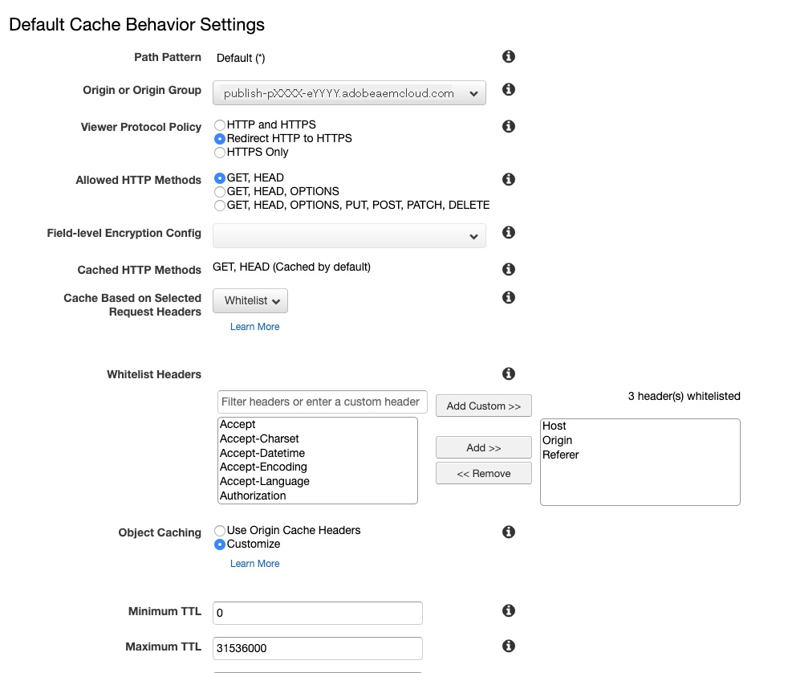

# Réseau de diffusion de contenu dans AEM as a Cloud Service {#cdn}

>[!CONTEXTUALHELP]
>id="aemcloud_golive_cdn"
>title="Réseau de diffusion de contenu dans AEM as a Cloud Service"
>abstract="AEM as a Cloud Service est fourni avec un réseau CDN. Son principal objectif est de réduire la latence en fournissant du contenu pouvant être mis en cache à partir des nœuds CDN en périphérie, près du navigateur. Il est entièrement géré et configuré afin de permettre des performances optimales des applications AEM."

AEM as a Cloud Service est fourni avec un réseau de diffusion de contenu intégré. Son principal objectif est de réduire la latence en fournissant du contenu pouvant être mis en cache à partir des nœuds CDN en périphérie, près du navigateur. Il est entièrement géré et configuré afin de permettre des performances optimales des applications AEM.

Le réseau de diffusion de contenu géré par AEM satisfait à la plupart des exigences de performances et de sécurité du client. Pour le niveau de publication, les clients peuvent éventuellement y pointer à partir de leur propre réseau de diffusion de contenu, qu’ils doivent gérer. Ce scénario est autorisé au cas par cas, en fonction de certaines conditions préalables, y compris, mais sans s’y limiter, le fait que le client dispose d’une intégration héritée avec son fournisseur de réseau de diffusion de contenu difficile à abandonner.

<!-- ERROR: NEITHER URL IS FOUND (HTTP ERROR 404) Also, see the following videos [Cloud 5 AEM CDN Part 1](https://experienceleague.adobe.com/docs/experience-manager-learn/cloud-service/cloud-5/cloud5-aem-cdn-part1.html) and [Cloud 5 AEM CDN Part 2](https://experienceleague.adobe.com/docs/experience-manager-learn/cloud-service/cloud-5/cloud5-aem-cdn-part2.html) for additional information about CDN in AEM as a Cloud Service. -->

## Réseau de diffusion de contenu géré AEM  {#aem-managed-cdn}

Suivez les sections ci-dessous pour utiliser l’interface utilisateur en libre-service de Cloud Manager pour préparer la diffusion de contenu à l’aide du réseau CDN prêt à l’emploi d’AEM :

1. [Gestion des certificats SSL](/help/implementing/cloud-manager/managing-ssl-certifications/introduction.md)
1. [Gestion des noms de domaine personnalisés](/help/implementing/cloud-manager/custom-domain-names/introduction.md)

**Limitation du trafic**

Par défaut, pour une configuration de réseau de diffusion de contenu AEM, tout le trafic public peut se diriger vers le service de publication, tant pour les environnements de production que de non-production (développement et évaluation). Vous pouvez limiter le trafic vers le service de publication pour un environnement donné (par exemple, en limitant l’évaluation par une plage d’adresses IP) au moyen de l’interface utilisateur de Cloud Manager.

Consultez le document [Gestion des listes d’adresses IP autorisées](/help/implementing/cloud-manager/ip-allow-lists/introduction.md) pour en savoir plus.

>[!CAUTION]
>
>Seules les requêtes des adresses IP autorisées sont diffusées par AEM réseau de diffusion de contenu géré. Si vous pointez votre propre réseau de diffusion de contenu vers le réseau de diffusion de contenu géré par AEM, assurez-vous que les adresses IP de votre réseau de diffusion de contenu sont incluses dans la liste autorisée.

## Le réseau de diffusion de contenu du client pointe vers le réseau de diffusion de contenu géré par AEM {#point-to-point-CDN}

>[!CONTEXTUALHELP]
>id="aemcloud_golive_byocdn"
>title="Le réseau de diffusion de contenu du client pointe vers le réseau de diffusion de contenu géré par AEM"
>abstract="AEM as a Cloud Service offre aux clients une option pour utiliser son réseau CDN. Pour le niveau de publication, les clients peuvent éventuellement y pointer à partir de leur propre réseau de diffusion de contenu, qu’ils doivent gérer. Ce scénario est autorisé au cas par cas, en fonction de certaines conditions préalables, y compris, mais sans s’y limiter, le fait que le client dispose d’une intégration héritée avec son fournisseur de réseau de diffusion de contenu difficile à abandonner."

Si un client doit utiliser son réseau de diffusion de contenu existant, il peut le gérer et le pointer vers le réseau de diffusion de contenu géré par AEM, à condition que les conditions suivantes soient satisfaites :

* Le client doit disposer d’un réseau de diffusion de contenu existant potentiellement onéreux à remplacer.
* Le client doit en assurer la gestion.
* Le client doit être en mesure de configurer le réseau CDN pour utiliser AEM as a Cloud Service. Consultez les instructions de configuration présentées ci-dessous.
* Le client doit disposer d’ingénieurs maîtrisant le réseau de diffusion de contenu et disponibles en cas de problèmes liés aux cas.
* Le client doit effectuer et réussir un test de charge avant de passer en production.

Instructions de configuration :

1. Pointez votre réseau CDN sur l’entrée du réseau CDN d’Adobe en tant que domaine d’origine. Par exemple, `publish-p<PROGRAM_ID>-e<ENV-ID>.adobeaemcloud.com`.
1. Définissez le SNI sur l’entrée du CDN Adobe.
1. Définissez l’en-tête hôte sur le domaine d’origine. Par exemple : `Host:publish-p<PROGRAM_ID>-e<ENV-ID>.adobeaemcloud.com`.
1. Définissez l’en-tête `X-Forwarded-Host` avec le nom de domaine afin qu’AEM puisse déterminer l’en-tête hôte. Par exemple : `X-Forwarded-Host:example.com`.
1. Définir `X-AEM-Edge-Key`. La valeur doit provenir d’Adobe.

   * Nécessaire afin que le réseau de diffusion de contenu de l’Adobe puisse valider la source des requêtes et transmettre la variable `X-Forwarded-*` en-têtes vers l’application AEM. Par exemple,`X-Forwarded-For` est utilisé pour déterminer l’adresse IP du client. Il incombe donc à l’appelant de confiance (c’est-à-dire au réseau de diffusion de contenu géré par le client) de veiller à l’exactitude de la variable `X-Forwarded-*` en-têtes (voir la note ci-dessous).
   * L’accès à l’entrée du réseau de diffusion de contenu d’Adobe peut être aussi bloqué lorsqu’une balise `X-AEM-Edge-Key` n’est pas présente. Informer Adobe si vous avez besoin d’un accès direct à l’entrée du CDN d’Adobe (pour être bloqué).

Voir [Exemples de configurations de fournisseur de réseau CDN](#sample-configurations) pour consulter des exemples de configuration provenant de principaux fournisseurs de réseau CDN.

Avant d’accepter le trafic en direct, vous devez vérifier auprès du service clientèle d’Adobe que le routage du trafic de bout en bout fonctionne correctement.

Après avoir obtenu le `X-AEM-Edge-Key`, vous pouvez tester la requête afin de déterminer si elle est correctement acheminée comme suit :

Sous Linux® :

```
curl https://publish-p<PROGRAM_ID>-e<ENV-ID>.adobeaemcloud.com -H "X-Forwarded-Host: example.com" -H "X-AEM-Edge-Key: <PROVIDED_EDGE_KEY>"
```

Sous Windows :

```
curl https://publish-p<PROGRAM_ID>-e<ENV-ID>.adobeaemcloud.com --header "X-Forwarded-Host: example.com" --header "X-AEM-Edge-Key: <PROVIDED_EDGE_KEY>"
```

>[!NOTE]
>
>Lorsque vous utilisez votre propre réseau de diffusion de contenu, vous n’avez pas besoin d’installer les domaines et les certificats dans Cloud Manager. Le routage dans le réseau de diffusion de contenu Adobe est effectué à l’aide du domaine par défaut. `publish-p<PROGRAM_ID>-e<ENV-ID>.adobeaemcloud.com` qui doit être envoyé dans la requête `Host` en-tête . Remplacement de la requête `Host` avec un nom de domaine personnalisé peut entraîner un incorrectement routage de la requête par le réseau de diffusion de contenu Adobe.


>[!NOTE]
>
>Les clients qui gèrent leur propre réseau de diffusion de contenu doivent garantir l’intégrité des en-têtes envoyés au réseau de diffusion de contenu AEM. Par exemple, il est recommandé aux clients d’effacer tous les en-têtes `X-Forwarded-*` et de les définir sur des valeurs connues et contrôlées. Par exemple, `X-Forwarded-For` doit contenir l’adresse IP du client, tandis que `X-Forwarded-Host` doit contenir l’hôte du site.

>[!NOTE]
>
>Les environnements de programme Sandbox ne prennent pas en charge un réseau CDN fourni par le client.

Le saut supplémentaire entre le réseau de diffusion de contenu client et le réseau de diffusion de contenu AEM n’est nécessaire que s’il manque un cache. En utilisant les stratégies d’optimisation du cache décrites dans cet article, l’ajout d’un réseau CDN client ne doit introduire qu’une latence négligeable.

Cette configuration du réseau de diffusion de contenu client est prise en charge pour le niveau de publication, mais pas devant le niveau de création.

### Exemples de configurations de fournisseur de réseau CDN {#sample-configurations}

Vous trouverez ci-dessous plusieurs exemples de configuration de plusieurs principaux fournisseurs de réseau de diffusion de contenu.

**Akamai**


**Amazon CloudFront**




**Cloudflare**


## En-têtes de géolocalisation {#geo-headers}

Le réseau de diffusion de contenu géré par AEM ajoute des en-têtes à chaque requête avec :

* Le code de pays : `x-aem-client-country`
* Le code continent : `x-aem-client-continent`

>[!NOTE]
>
>S’il existe un réseau de diffusion de contenu géré par le client, ces en-têtes reflètent l’emplacement du serveur proxy du réseau de diffusion de contenu des clients plutôt que le client réel. Par conséquent, pour le réseau de diffusion de contenu géré par le client, les en-têtes de géolocalisation doivent être gérés par le réseau de diffusion de contenu client.

Les valeurs des codes de pays sont les codes Alpha-2 décrits [ici](https://fr.wikipedia.org/wiki/ISO_3166-1).

Les valeurs des codes du continent sont les suivantes :

* AF Afrique
* AN Antarctique
* AS Asie
* EU Europe
* NA Amérique du Nord
* OC Océanie
* SA Amérique du Sud

Ces informations peuvent s’avérer utiles dans certains cas d’utilisation, tels que la redirection vers une URL différente en fonction de l’origine (pays) de la requête. Utilisez l’en-tête Vary pour mettre en cache les réponses qui dépendent des informations géographiques. Par exemple, les redirections vers la page d’entrée d’un pays spécifique doivent toujours contenir `Vary: x-aem-client-country`. Si nécessaire, vous pouvez utiliser `Cache-Control: private` pour empêcher la mise en cache. Voir aussi [Mise en cache](/help/implementing/dispatcher/caching.md#html-text).
