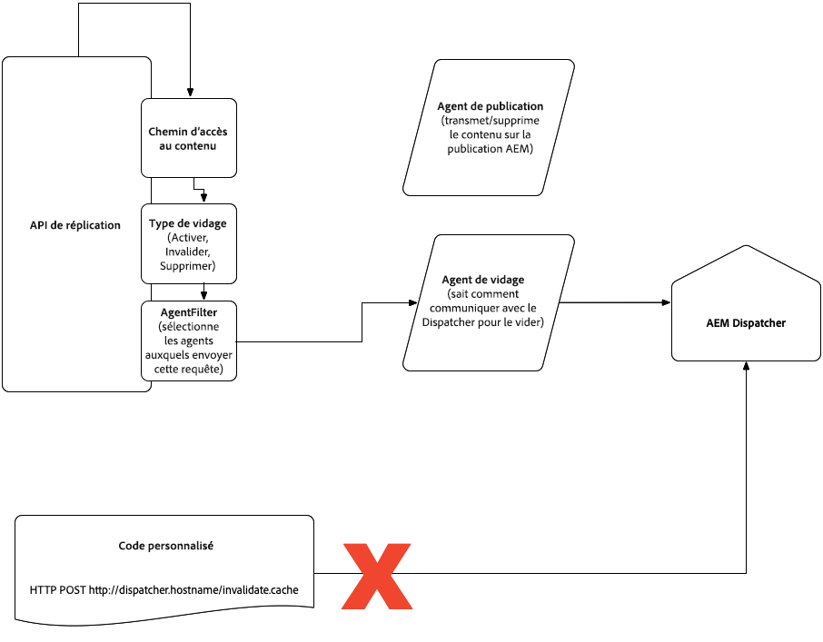

#  de contenu dans AEM en tant que service Cloud {#content-delivery}

Le de contenu du service de publication comprend :

* CDN (généralement géré par Adobe)
* Répartiteur AEM
* Publication AEM

Le flux de données est le suivant :

1. L’URL est ajoutée dans le navigateur.
1. Requête effectuée sur le réseau de diffusion de contenu mappé à ce domaine dans le DNS
1. Si le contenu est entièrement mis en cache sur le réseau de diffusion de contenu, celui-ci l’affiche dans le navigateur.
1. Si le contenu n’est pas entièrement mis en cache, le réseau de diffusion de contenu appelle Dispatcher (par proxy inverse).
1. Si le contenu est entièrement mis en cache sur Dispatcher, celui-ci l’affiche sur le réseau de diffusion de contenu.
1. Si le contenu n’est pas entièrement mis en cache, Dispatcher appelle la publication AEM (par proxy inverse).
1. Le contenu est rendu par le navigateur, qui peut également le mettre en cache, selon les en-têtes

Le type de contenu HTML/texte est défini pour expirer après 300 s (5 minutes) au niveau de la couche du répartiteur, seuil que le cache du répartiteur et le CDN respectent tous deux. Lors des redéploiements du service de publication, le cache du répartiteur est effacé puis réchauffé avant que les nouveaux noeuds de publication n’acceptent le trafic.

Les sections ci-dessous fournissent des informations plus détaillées sur les  de contenu, notamment la configuration CDN et la mise en cache du répartiteur.

Des informations sur la réplication du service d’auteur au service de publication sont disponibles [ici](/help/operations/replication.md).

>[!NOTE]
>Le trafic passe par un serveur Web Apache, qui prend en charge les modules, y compris le répartiteur. Le répartiteur est principalement utilisé comme cache pour limiter le traitement sur les noeuds de publication afin d’améliorer les performances.

## Réseau de diffusion de contenu {#cdn}

AEM   trois options :

1. Adobe Managed CDN - CDN prêt à l’emploi d’AEM. Il s’agit de l’option recommandée car elle est complètement intégrée.
1. Le CDN du client pointe vers le CDN géré Adobe - le client pointe son propre CDN vers le CDN prêt à l’emploi d’AEM. Si la première option n’est pas viable, il s’agit de l’option préférée suivante puisqu’elle exploite toujours l’intégration d’AEM avec son CDN par défaut. Les clients seront toujours responsables de la gestion de leur propre CDN.
1. CDN géré par le client - Le client apporte son propre CDN et est entièrement responsable de sa gestion.

>[!CAUTION]
>La première option est vivement recommandée. Adobe ne peut pas être tenu responsable du résultat d’une mauvaise configuration si vous choisissez la deuxième option.

Les deuxième et troisième options seront autorisées au cas par cas. Cela implique de répondre à certaines conditions préalables, notamment, mais sans s’y limiter, à l’intégration héritée du client avec son fournisseur CDN, ce qui est difficile à annuler.

### Adobe Managed CDN {#adobe-managed-cdn}

La préparation du de contenu à l’aide du CDN prêt à l’emploi d’Adobe est simple, comme décrit ci-dessous :

1. Vous fournirez le certificat SSL et la clé secrète signés à Adobe en partageant un lien vers un formulaire sécurisé contenant ces informations. Veuillez vous coordonner avec le service clientèle sur ce .
Remarque : Aem as a Cloud Service ne prend pas en charge les certificats DV (Domain Validated).
1. Le service clientèle coordonnera alors avec vous le timing d’un enregistrement DNS CNAME, en pointant son nom de domaine complet vers `adobe-aem.map.fastly.net`.
1. Vous serez averti(e) lorsque les certificats SSL arriveront à expiration afin de pouvoir soumettre à nouveau les nouveaux certificats SSL.

Par défaut, dans le cas d’une configuration CDN gérée par Adobe, tout le trafic public peut se diriger vers le service de publication, tant pour la production que pour la non-production (développement et étape)  . Si vous souhaitez limiter le trafic au service de publication pour un   donné (par exemple, limiter l’évaluation par une plage d’adresses IP), vous devez demander au service clientèle de configurer ces restrictions.

### Le CDN du client pointe vers le CDN géré par Adobe {#point-to-point-CDN}

Pris en charge si vous souhaitez utiliser votre CDN existant, mais ne pouvez pas satisfaire aux exigences d’un CDN géré par le client. Dans ce cas, vous gérez votre propre CDN, mais pointez sur le CDN géré par Adobe.

Veuillez prendre note que vous devez :

1. Vous devez avoir un CDN existant.
1. Vous allez le gérer.
1. Vous devez être en mesure de configurer CDN pour travailler avec Aem en tant que service Cloud. Reportez-vous aux instructions de configuration ci-dessous.
1. Vous avez des experts en ingénierie de CDN qui sont sur appel au cas où des problèmes liés à l&#39;ingénierie se poseraient.
1. Vous devez effectuer et réussir un test de charge avant d’accéder à la production.

Instructions de configuration :

1. Définissez l’ `X-Forwarded-Host` en-tête avec le nom de domaine.
1. Définissez l’en-tête de l’hôte avec le domaine  du, qui est l’entrée CDN d’Adobe. La valeur doit provenir d’Adobe.
1. Envoyez l’en-tête SNI au  . Tout comme l’en-tête Hôte, l’en-tête sni doit être le domaine  .
1. Définissez le `X-Edge-Key`, qui est nécessaire pour acheminer correctement le trafic vers les serveurs AEM. La valeur doit provenir d’Adobe.

### CDN géré par le client {#customer-managed-cdn}

Pris en charge si vous devez utiliser votre CDN existant.  Dans ce cas, vous gérez votre propre CDN, en le pointant vers AEM.

Vous pouvez gérer votre propre réseau de diffusion de contenu, sous les conditions suivantes :

1. Vous disposez d’un réseau de diffusion de contenu existant.
1. Il doit s’agir d’un CDN pris en charge. Actuellement, Akamai est pris en charge. Si votre entreprise souhaite gérer un réseau de diffusion de contenu non pris en charge, contactez le service clientèle.
1. Vous allez le gérer.
1. Vous devez être en mesure de configurer CDN pour travailler avec Aem en tant que service Cloud. Reportez-vous aux instructions de configuration ci-dessous.
1. Vous avez des experts en ingénierie de CDN qui sont sur appel au cas où des problèmes liés à l&#39;ingénierie se poseraient.
1. Vous devez fournir des listes blanches des noeuds CDN à Cloud Manager, comme décrit dans les instructions de configuration.
1. Vous devez effectuer et réussir un test de charge avant d’accéder à la production.

Instructions de configuration :

1. Fournissez la liste blanche du fournisseur de CDN à Adobe en appelant l’API de création/mise à jour de l’ de  avec un de CIDR en liste blanche.
1. Définissez l’ `X-Forwarded-Host` en-tête avec le nom de domaine.
1. Définissez l’en-tête Hôte avec le domaine  , qui est Aem as a Cloud Service Input. La valeur doit provenir d’Adobe.
1. Envoyez l’en-tête SNI au  . L&#39;en-tête SNI doit être le domaine  .
1. Définissez la `X-Edge-Key` valeur requise pour acheminer correctement le trafic vers les serveurs AEM. La valeur doit provenir d’Adobe.

Avant d’accepter le trafic en direct, vous devez vérifier auprès de l’assistance clientèle d’Adobe que le de trafic de bout en bout fonctionne correctement.

### Mise en cache {#caching}

Le processus de mise en cache suit les règles présentées ci-dessous.

### HTML/Texte {#html-text}

* par défaut, mis en cache par le navigateur pendant 5 minutes, en fonction de l’en-tête de contrôle du cache émis par le calque apache. Le CDN respecte également cette valeur.
* peut être remplacé pour tout le contenu HTML/texte en définissant la `EXPIRATION_TIME` variable dans `global.vars` l’utilisation d’AEM en tant qu’outil de répartiteur de SDK de service cloud.

Vous devez vous assurer qu’un fichier sous `src/conf.dispatcher.d/cache` comporte la règle suivante :

```
/0000
{ /glob "*" /type "allow" }
```

* peut être remplacé par des directives apache mod_headers à un niveau plus fin. Par exemple :

```
<LocationMatch "\.(html)$">
        Header set Cache-Control "max-age=200 s-maxage=200"
</LocationMatch>
```

Vous devez vous assurer qu’un fichier sous `src/conf.dispatcher.d/cache` comporte la règle suivante :

```
/0000
{ /glob "*" /type "allow" }
```

* Notez que d’autres méthodes, y compris le projet [](https://adobe-consulting-services.github.io/acs-aem-commons/features/dispatcher-ttl/)dispatcher-ttl AEM ACS Commons, ne remplaceront pas les valeurs.

### Bibliothèques côté client (js, css) {#client-side-libraries}

* en utilisant la structure de bibliothèque côté client d’AEM, le code JavaScript et CSS est généré de manière à ce que les navigateurs puissent le mettre en cache indéfiniment, puisque toute modification se manifeste sous la forme de nouveaux fichiers avec un chemin d’accès unique.  En d’autres termes, du code HTML faisant référence aux bibliothèques clientes sera produit au besoin afin que les clients puissent découvrir un nouveau contenu au fur et à mesure de sa publication. Le contrôle du cache est défini sur &quot;immuable&quot; ou 30 jours pour les navigateurs plus anciens qui ne respectent pas la valeur &quot;immuable&quot;.
* voir la section Bibliothèques côté [client et cohérence](#content-consistency) des versions pour en savoir plus.

### Images {#images}

* non mis en cache

### Autres types de contenu {#other-content}

* aucune mise en cache par défaut
* peut être remplacé par apache `mod_headers`. Par exemple :

```
<LocationMatch "\.(css|js)$">
    Header set Cache-Control "max-age=500 s-maxage=500"
</LocationMatch>
```

*D&#39;autres méthodes de définition des en-têtes de cache peuvent également fonctionner

Avant d’accepter le trafic en direct, les clients doivent vérifier auprès de l’assistance clientèle d’Adobe que le de trafic de bout en bout fonctionne correctement.

## Répartiteur {#disp}

Le trafic passe par un serveur Web Apache, qui prend en charge les modules, y compris le répartiteur. Le répartiteur est principalement utilisé comme cache pour limiter le traitement sur les noeuds de publication afin d’améliorer les performances.

Le contenu de type HTML/texte est défini avec des en-têtes de cache correspondant à une expiration de 300 s (5 minutes).

Le reste de cette section décrit les considérations liées à l’invalidation du cache du répartiteur.

### Invalidation du cache Dispatcher pendant l’activation/la désactivation {#cache-activation-deactivation}

Comme les versions précédentes d’AEM, la publication ou l’annulation de publication des pages effacera le contenu du cache du répartiteur. Si un problème de mise en cache est suspecté, les clients doivent republier les pages en question.

Lorsque l’instance de publication reçoit une nouvelle version d’une page ou d’un fichier de l’auteur, elle utilise l’agent de vidage pour invalider les chemins appropriés sur son répartiteur. The updated path is removed from the dispatcher cache, together with its parents, up to a level (you can configure this with the [statfileslevel](https://docs.adobe.com/content/help/en/experience-manager-dispatcher/using/configuring/dispatcher-configuration.html#invalidating-files-by-folder-level).

### Invalidation explicite du cache Dispatcher {#explicit-invalidation}

En général, il n’est pas nécessaire d’invalider manuellement le contenu dans le répartiteur, mais cela est possible si nécessaire, comme décrit ci-dessous.

Avant AEM en tant que service Cloud, il existait deux manières d’invalider le cache du répartiteur.

1. Appeler l’agent de réplication, en spécifiant l’agent de vidage du répartiteur de publication
2. Appel direct de l’ `invalidate.cache` API (par exemple, `POST /dispatcher/invalidate.cache`)

L’approche `invalidate.cache` ne sera plus prise en charge puisqu’elle ne concerne qu’un nœud Dispatcher spécifique.
AEM en tant que service Cloud fonctionne au niveau du service, et non au niveau du noeud individuel. Par conséquent, les instructions d’invalidation figurant dans la page [Invalidation des pages mises en cache à partir de la page AEM](https://docs.adobe.com/content/help/en/experience-manager-dispatcher/using/configuring/page-invalidate.html) ne sont pas valides pour AEM en tant que service Cloud.
L&#39;agent de purge de réplication doit être utilisé. Vous pouvez le faire à l’aide de l’API de réplication. The Replication API documentation is available [here](https://helpx.adobe.com/experience-manager/6-5/sites/developing/using/reference-materials/javadoc/com/day/cq/replication/Replicator.html) and for an example of flushing the cache, see the [API example page](https://helpx.adobe.com/experience-manager/using/aem64_replication_api.html) specifically the `CustomStep` example issuing a replication action of type ACTIVATE to all available agents. Le point de fin de l’agent de vidage n’est pas configurable, mais il est préconfiguré pour pointer vers le répartiteur, en correspondance avec le service de publication exécutant l’agent de vidage. L&#39;agent de vidage peut généralement être déclenché par  de OSGi ou par  de.

Le diagramme ci-dessous illustre cela.



Si vous pensez que le cache du répartiteur n’est pas effacé, contactez le service à la clientèle qui peut vider le cache du répartiteur si nécessaire.

Le CDN géré par Adobe respecte les TTL et il n’est donc pas nécessaire qu’il soit vidé. Si un problème est suspecté, contactez le service à la clientèle qui peut vider un cache CDN géré par Adobe si nécessaire.

## Bibliothèques côté client et cohérence de version {#content-consistency}

Les pages sont bien sûr composées de code HTML, JavaScript, CSS et d’images. Les clients sont encouragés à tirer parti de la structure des bibliothèques côté client (clientlibs) pour importer des ressources JavaScript et CSS dans des pages HTML, en tenant compte des dépendances entre les bibliothèques JS.

La structure clientlibs fournit une gestion automatique des versions, ce qui signifie que les développeurs peuvent archiver les modifications apportées aux bibliothèques JS dans le contrôle de code source et que la dernière version sera disponible lorsqu’un client poussera sa version. Sans cela, les développeurs devraient modifier manuellement le code HTML avec des références à la nouvelle version de la bibliothèque, ce qui est particulièrement onéreux si de nombreux modèles HTML partagent la même bibliothèque.

Lorsque les nouvelles versions des bibliothèques sont publiées en production, les pages HTML de référence sont mises à jour avec de nouveaux liens vers ces versions de bibliothèques mises à jour. Une fois que le cache du navigateur a expiré pour une page HTML donnée, il n’est plus possible que les anciennes bibliothèques soient chargées à partir du cache du navigateur, car il est désormais garanti que la page actualisée (à partir d’AEM) référencera les nouvelles versions des bibliothèques. En d’autres termes, une page HTML actualisée comprend toutes les dernières versions des bibliothèques.

Il s’agit d’un hachage sérialisé, qui est annexé au lien de la bibliothèque cliente, garantissant ainsi une URL avec version unique pour le navigateur afin de mettre en cache le fichier CSS/JS. Le hachage sérialisé n’est mis à jour que lorsque le contenu de la bibliothèque cliente change. En d’autres termes, si des mises à jour non liées se produisent (c’est-à-dire qu’aucune modification n’est apportée au fichier css/js sous-jacent de la bibliothèque cliente) même avec un nouveau déploiement, la référence reste la même, ce qui évite toute perturbation du cache du navigateur.

### Activation des versions Longcache des bibliothèques côté client - AEM en tant que SDK de service Cloud Quickstart {#enabling-longcache}

La bibliothèque cliente par défaut inclut sur une page HTML l’exemple suivant :

```
<link rel="stylesheet" href="/etc.clientlibs/wkndapp/clientlibs/clientlib-base.css" type="text/css">
```

Lorsque le contrôle de version strict clientlib est activé, une clé de hachage à long terme est ajoutée en tant que sélecteur à la bibliothèque cliente. Par conséquent, la référence clientlib ressemble à ceci :

```
<link rel="stylesheet" href="/etc.clientlibs/wkndapp/clientlibs/clientlib-base.lc-7c8c5d228445ff48ab49a8e3c865c562-lc.css" type="text/css">
```

Le contrôle de version strict de clientlib est activé par défaut dans tous les AEM en tant que de services  Cloud.

Pour activer le contrôle de version strict de clientlib dans le kit SDK Quickstart local, effectuez les actions suivantes :

1. Accédez au gestionnaire de configuration OSGi <host>/system/console/configMgr
1. Recherchez la configuration OSGi pour le Gestionnaire de bibliothèques HTML Granite d’Adobe :
   * Cochez la case pour activer le contrôle de version strict.
   * Dans le champ intitulé Clé de cache côté client à long terme, saisissez la valeur de /.*;hachage
1. Enregistrez les modifications. Notez qu’il n’est pas nécessaire d’enregistrer cette configuration dans le contrôle de code source, car AEM en tant que service Cloud activera automatiquement cette configuration dans les  de développement, d’évaluation et de production .
1. Chaque fois que le contenu de la bibliothèque cliente est modifié, une nouvelle clé de hachage est générée et la référence HTML est mise à jour.
