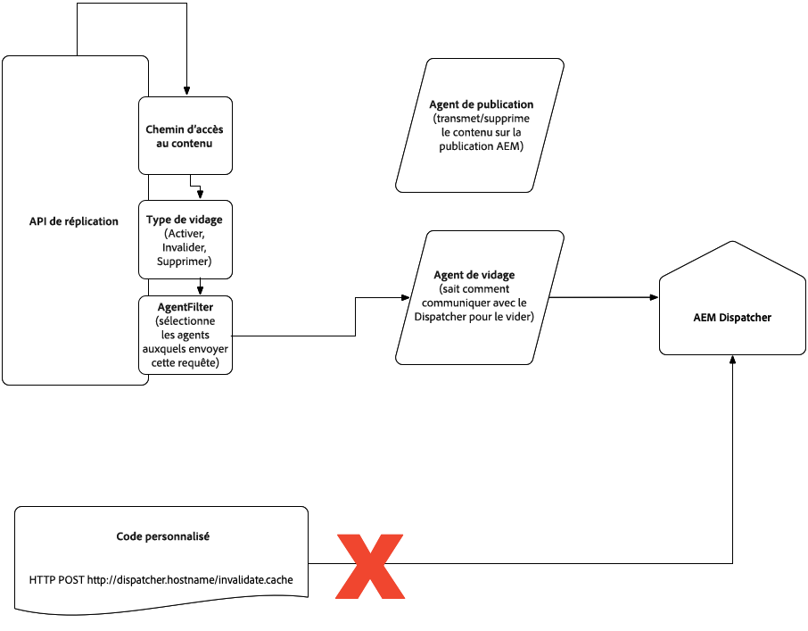

# Répartiteur dans le Cloud {#Dispatcher-in-the-cloud}

## Configuration et test d’Apache et du répartiteur {#apache-and-dispatcher-configuration-and-testing}

Cette section décrit la structure d’AEM en tant que configurations d’Apache et de répartiteur de services Cloud, ainsi que la manière de valider et d’exécuter le service localement avant son déploiement dans les environnements Cloud. Il décrit également le débogage dans les environnements Cloud. Pour plus d’informations sur le répartiteur, consultez la documentation [du répartiteur](https://docs.adobe.com/content/help/en/experience-manager-dispatcher/using/dispatcher.html)AEM.

>[!NOTE]
>Les utilisateurs de Windows devront utiliser Windows 10 Professional ou d&#39;autres distributions prenant en charge Docker. Il s’agit d’un prérequis pour l’exécution et le débogage du répartiteur sur un ordinateur local. Les sections ci-dessous incluent des commandes utilisant les versions Mac ou Linux du SDK, mais le SDK Windows peut être utilisé de la même manière.

## Outils du répartiteur {#dispatcher-sdk}

Les outils du répartiteur font partie du kit SDK global d’AEM en tant que service cloud et fournissent les éléments suivants :

* une structure de fichiers vanille contenant les fichiers de configuration à inclure dans un projet maven pour le répartiteur;
* Outils permettant aux clients de valider localement une configuration de répartiteur ;
* Image du Docker qui affiche le répartiteur localement.

## Téléchargement et extraction des outils {#extracting-the-sdk}

Les outils du répartiteur peuvent être téléchargés depuis un fichier zip sur le portail de distribution [de](https://downloads.experiencecloud.adobe.com/content/software-distribution/en/aemcloud.html) logiciels . Notez que l’accès aux listes de SDK est limité aux environnements avec les services gérés AEM ou AEM en tant qu’environnements de services Cloud. Toute nouvelle configuration disponible dans cette nouvelle version des outils du répartiteur peut être utilisée pour le déploiement dans les environnements Cloud exécutant cette version d’AEM dans le Cloud ou une version ultérieure.

**Pour macOS et Linux**, téléchargez le script shell dans un dossier de votre ordinateur, rendez-le exécutable et exécutez-le. Il extrait automatiquement les fichiers des outils du répartiteur sous le répertoire dans lequel vous l&#39;avez stocké (où `version` est la version des outils du répartiteur).

```bash
$ chmod +x DispatcherSDKv<version>.sh
$ ./DispatcherSDKv<version>.sh
Verifying archive integrity...  100%   All good.
Uncompressing DispatcherSDKv<version>  100% 
```

**Pour Windows**, téléchargez l’archive zip et extrayez-la.

## Structure du fichier {#file-structure}

La structure du sous-dossier du répartiteur du projet est décrite ci-dessous et doit être copiée dans le dossier du répartiteur de projet expert :

```bash
./
├── conf.d
│   ├── available_vhosts
│   │   └── default.vhost
│   ├── dispatcher_vhost.conf
│   ├── enabled_vhosts
│   │   ├── README
│   │   └── default.vhost -> ../available_vhosts/default.vhost
│   └── rewrites
│   │   ├── default_rewrite.rules
│   │   └── rewrite.rules
│   └── variables
|       ├── custom.vars
│       └── global.vars
└── conf.dispatcher.d
    ├── available_farms
    │   └── default.farm
    ├── cache
    │   ├── default_invalidate.any
    │   ├── default_rules.any
    │   └── rules.any
    ├── clientheaders
    │   ├── clientheaders.any
    │   └── default_clientheaders.any
    ├── dispatcher.any
    ├── enabled_farms
    │   ├── README
    │   └── default.farm -> ../available_farms/default.farm
    ├── filters
    │   ├── default_filters.any
    │   └── filters.any
    ├── renders
    │   └── default_renders.any
    └── virtualhosts
        ├── default_virtualhosts.any
        └── virtualhosts.any
```

Vous trouverez ci-dessous une explication des fichiers notables qui peuvent être modifiés :

**Fichiers personnalisables**

Les fichiers suivants sont personnalisables et seront transférés vers votre instance Cloud au moment du déploiement :

* `conf.d/available_vhosts/<CUSTOMER_CHOICE>.vhost`

Vous pouvez avoir un ou plusieurs de ces fichiers. Ils contiennent `<VirtualHost>` des entrées qui correspondent aux noms d’hôtes et permettent à Apache de gérer chaque trafic de domaine avec des règles différentes. Les fichiers sont créés dans le `available_vhosts` répertoire et activés avec un lien symbolique dans le `enabled_vhosts` répertoire. A partir des `.vhost` fichiers, d&#39;autres fichiers tels que les réécritures et les variables seront inclus.

* `conf.d/rewrites/rewrite.rules`

Ce fichier est inclus dans vos `.vhost` fichiers. Il a un ensemble de règles de réécriture pour `mod_rewrite`.

>[!NOTE]
>
>Actuellement, un seul fichier de réécriture doit être utilisé au lieu de fichiers spécifiques au site. Cette taille de fichier doit être inférieure à 1 Mo.

* `conf.d/variables/custom.vars`

Ce fichier est inclus dans vos `.vhost` fichiers. Vous pouvez y placer des définitions pour les variables Apache.

* `conf.d/variables/global.vars`

Ce fichier est inclus dans le `dispatcher_vhost.conf` fichier. Vous pouvez modifier votre répartiteur et réécrire le niveau du journal dans ce fichier.

* `conf.dispatcher.d/available_farms/<CUSTOMER_CHOICE>.farm`

Vous pouvez avoir un ou plusieurs de ces fichiers, qui contiennent des fermes pour correspondre aux noms d’hôtes et permettre au module répartiteur de gérer chaque batterie avec des règles différentes. Les fichiers sont créés dans le `available_farms` répertoire et activés avec un lien symbolique dans le `enabled_farms` répertoire. A partir des `.farm` fichiers, d&#39;autres fichiers tels que les filtres, les règles de cache et d&#39;autres seront inclus.

* `conf.dispatcher.d/cache/rules.any`

Ce fichier est inclus dans vos `.farm` fichiers. Il spécifie les préférences de mise en cache.

* `conf.dispatcher.d/clientheaders/clientheaders.any`

Ce fichier est inclus dans vos `.farm` fichiers. Il spécifie les en-têtes de requête à transférer au serveur principal.

* `conf.dispatcher.d/filters/filters.any`

Ce fichier est inclus dans vos `.farm` fichiers. Il comporte un ensemble de règles qui modifient le trafic qui doit être filtré et ne pas le rendre sur le serveur principal.

* `conf.dispatcher.d/virtualhosts/virtualhosts.any`

Ce fichier est inclus dans vos `.farm` fichiers. Il dispose d’une liste de noms d’hôtes ou de chemins d’URI à mettre en correspondance par correspondance glob. Détermine le serveur principal à utiliser pour diffuser une requête.

Les fichiers ci-dessus font référence aux fichiers de configuration immuables répertoriés ci-dessous. Les modifications apportées aux fichiers immuables ne seront pas traitées par les répartiteurs dans les environnements Cloud.

**Fichiers de configuration non modifiables**

Ces fichiers font partie du cadre de base et font respecter les normes et les meilleures pratiques. Les fichiers sont considérés comme immuables, car la modification ou la suppression locale de ces fichiers n’aura aucun impact sur votre déploiement, car ils ne seront pas transférés vers votre instance Cloud.

Il est recommandé que les fichiers ci-dessus fassent référence aux fichiers immuables répertoriés ci-dessous, suivis de toute instruction ou remplacement supplémentaire. Lorsque la configuration du répartiteur est déployée dans un environnement cloud, la dernière version des fichiers immuables est utilisée, quelle que soit la version utilisée dans le développement local.

* `conf.d/available_vhosts/default.vhost`

Contient un exemple d’hôte virtuel. Pour votre propre hôte virtuel, créez une copie de ce fichier, personnalisez-le, accédez à `conf.d/enabled_vhosts` et créez un lien symbolique vers votre copie personnalisée.

* `conf.d/dispatcher_vhost.conf`

Partie du cadre de base, utilisée pour illustrer la manière dont vos hôtes virtuels et vos variables globales sont inclus.

* `conf.d/rewrites/default_rewrite.rules`

Règles de réécriture par défaut adaptées à un projet standard. Si vous avez besoin de personnalisation, modifiez `rewrite.rules`. Dans votre personnalisation, vous pouvez toujours inclure les règles par défaut en premier, si elles répondent à vos besoins.

* `conf.dispatcher.d/available_farms/default.farm`

Contient un exemple de batterie de répartiteurs. Pour votre propre batterie, créez une copie de ce fichier, personnalisez-le, accédez à `conf.d/enabled_farms` et créez un lien symbolique vers votre copie personnalisée.

* `conf.dispatcher.d/cache/default_invalidate.any`

Une partie de la structure de base est générée au démarrage. Vous devez **inclure** ce fichier dans chaque batterie de serveurs définie, dans la `cache/allowedClients` section.

* `conf.dispatcher.d/cache/default_rules.any`

Règles de cache par défaut adaptées à un projet standard. Si vous avez besoin de personnalisation, modifiez `conf.dispatcher.d/cache/rules.any`. Dans votre personnalisation, vous pouvez toujours inclure les règles par défaut en premier, si elles répondent à vos besoins.

* `conf.dispatcher.d/clientheaders/default_clientheaders.any`

En-têtes de requête par défaut à transférer vers le serveur principal, adapté à un projet standard. Si vous avez besoin de personnalisation, modifiez `clientheaders.any`. Dans votre personnalisation, vous pouvez toujours inclure d’abord les en-têtes de requête par défaut, s’ils répondent à vos besoins.

* `conf.dispatcher.d/dispatcher.any`

Partie du cadre de base, utilisée pour illustrer la manière dont vos fermes de répartiteurs sont incluses.

* `conf.dispatcher.d/filters/default_filters.any`

Filtres par défaut adaptés à un projet standard. Si vous avez besoin de personnalisation, modifiez `filters.any`. Dans votre personnalisation, vous pouvez toujours inclure d’abord les filtres par défaut, s’ils répondent à vos besoins.

* `conf.dispatcher.d/renders/default_renders.any`

Dans le cadre de base, ce fichier est généré au démarrage. Vous devez **inclure** ce fichier dans chaque batterie de serveurs définie, dans la `renders` section.

* `conf.dispatcher.d/virtualhosts/default_virtualhosts.any`

Interpolation d’hôte par défaut adaptée à un projet standard. Si vous avez besoin de personnalisation, modifiez `virtualhosts.any`. Dans votre personnalisation, vous ne devez pas inclure la globalisation des hôtes par défaut, car elle correspond à **chaque** requête entrante.

>[!NOTE]
>L’archétype du maven de service cloud AEM génère la même structure de fichiers de configuration du répartiteur.

Les sections ci-dessous décrivent comment valider localement la configuration afin qu’elle puisse transmettre la grille de qualité associée dans Cloud Manager lors du déploiement d’une version interne.

## Validation locale de la configuration du répartiteur {#local-validation-of-dispatcher-configuration}

L’outil de validation est disponible dans le SDK sous `bin/validator` forme de fichier binaire Mac OS, Linux ou Windows, ce qui permet aux clients d’exécuter la même validation que celle que Cloud Manager effectuera lors de la création et du déploiement d’une version.

Il est appelé comme suit : `validator full [-d folder] [-w whitelist] zip-file | src folder`

L&#39;outil valide la configuration d&#39;Apache et du répartiteur. Il analyse tous les fichiers avec un modèle `conf.d/enabled_vhosts/*.vhost` et vérifie que seules les directives mises en liste blanche sont utilisées. Les directives autorisées dans les fichiers de configuration Apache peuvent être répertoriées en exécutant la commande de liste blanche du validateur :

```
$ validator whitelist
Cloud manager validator 2.0.4
 
Whitelisted directives:
  <Directory>
  ...
  
```

Le tableau ci-dessous présente les modules Apache pris en charge :

| Nom du module | Page de référence |
|---|---|
| `core` | [https://httpd.apache.org/docs/2.4/mod/core.html](https://httpd.apache.org/docs/2.4/mod/core.html) |
| `mod_access_compat` | [https://httpd.apache.org/docs/2.4/mod/mod_access_compat.html](https://httpd.apache.org/docs/2.4/mod/mod_access_compat.html) |
| `mod_alias` | [https://httpd.apache.org/docs/2.4/mod/mod_alias.html](https://httpd.apache.org/docs/2.4/mod/mod_alias.html) |
| `mod_allowmethods` | [https://httpd.apache.org/docs/2.4/mod/mod_allowmethods.html](https://httpd.apache.org/docs/2.4/mod/mod_allowmethods.html) |
| `mod_auth_basic` | [https://httpd.apache.org/docs/2.4/mod/mod_auth_basic.html](https://httpd.apache.org/docs/2.4/mod/mod_auth_basic.html) |
| `mod_authn_core` | [https://httpd.apache.org/docs/2.4/mod/mod_authn_core.html](https://httpd.apache.org/docs/2.4/mod/mod_authn_core.html) |
| `mod_authn_file` | [https://httpd.apache.org/docs/2.4/mod/core.html](https://httpd.apache.org/docs/2.4/mod/mod_authn_file.html) |
| `mod_authz_core` | [https://httpd.apache.org/docs/2.4/mod/core.html](https://httpd.apache.org/docs/2.4/mod/mod_authz_core.html) |
| `mod_authz_groupfile` | [https://httpd.apache.org/docs/2.4/mod/mod_authz_groupfile.html](https://httpd.apache.org/docs/2.4/mod/mod_authz_groupfile.html) |
| `mod_deflate` | [https://httpd.apache.org/docs/2.4/mod/mod_deflate.html](https://httpd.apache.org/docs/2.4/mod/mod_deflate.html) |
| `mod_dir` | [https://httpd.apache.org/docs/2.4/mod/mod_dir.html](https://httpd.apache.org/docs/2.4/mod/mod_dir.html) |
| `mod_env` | [https://httpd.apache.org/docs/2.4/mod/mod_env.html](https://httpd.apache.org/docs/2.4/mod/mod_env.html) |
| `mod_filter` | [https://httpd.apache.org/docs/2.4/mod/mod_filter.html](https://httpd.apache.org/docs/2.4/mod/mod_filter.html) |
| `mod_headers` | [https://httpd.apache.org/docs/2.4/mod/mod_headers.html](https://httpd.apache.org/docs/2.4/mod/mod_headers.html) |
| `mod_mime` | [https://httpd.apache.org/docs/2.4/mod/mod_mime.html](https://httpd.apache.org/docs/2.4/mod/mod_mime.html) |
| `mod_remoteip` | [https://httpd.apache.org/docs/2.4/mod/mod_remoteip.html](https://httpd.apache.org/docs/2.4/mod/mod_remoteip.html) |
| `mod_reqtimeout` | [https://httpd.apache.org/docs/2.4/mod/mod_reqtimeout.html](https://httpd.apache.org/docs/2.4/mod/mod_reqtimeout.html) |
| `mod_rewrite` | [https://httpd.apache.org/docs/2.4/mod/mod_rewrite.html](https://httpd.apache.org/docs/2.4/mod/mod_rewrite.html) |
| `mod_security` | [https://modsecurity.org/](https://modsecurity.org/) |
| `mod_setenvif` | [https://httpd.apache.org/docs/2.4/mod/mod_setenvif.html](https://httpd.apache.org/docs/2.4/mod/mod_setenvif.html) |
| `mod_substitute` | [https://httpd.apache.org/docs/2.4/mod/mod_substitute.html](https://httpd.apache.org/docs/2.4/mod/mod_substitute.html) |
| `mod_userdir` | [https://httpd.apache.org/docs/2.4/mod/mod_userdir.html](https://httpd.apache.org/docs/2.4/mod/mod_userdir.html) |

Les clients ne peuvent pas ajouter de modules arbitraires, mais des modules supplémentaires peuvent être envisagés pour inclusion dans le produit à l’avenir. Les clients peuvent trouver la liste des directives disponibles pour une version de Répartiteur donnée en exécutant la &quot;liste blanche des validateurs&quot; dans le SDK, comme décrit dans la documentation des outils Répartiteur.

La liste blanche contient une liste des directives Apache autorisées dans une configuration client. Si une directive n&#39;est pas mise en liste blanche, l&#39;outil enregistre une erreur et renvoie un code de sortie non nul. Si aucune liste blanche n’est fournie sur la ligne de commande (c’est-à-dire de la manière dont elle doit être appelée), l’outil utilise une liste blanche par défaut que Cloud Manager utilisera pour la validation avant de procéder au déploiement dans les environnements Cloud.

Il analyse également tous les fichiers avec un modèle `conf.dispatcher.d/enabled_farms/*.farm` et vérifie que :

* Il n’existe aucune règle de filtre qui utilise l’opérateur allow via `/glob` (voir [CVE-2016-0957](https://nvd.nist.gov/vuln/detail/CVE-2016-0957) pour plus d’informations).
* Aucune fonction d’administration n’est affichée. Par exemple, l’accès aux chemins tels que `/crx/de or /system/console`.

Lorsqu’il est exécuté sur votre artefact maven ou votre `dispatcher/src` sous-répertoire, il signale les échecs de validation :

```
$ validator full dispatcher/src
Cloud manager validator 1.0.4
2019/06/19 15:41:37 Apache configuration uses non-whitelisted directives:
 conf.d/enabled_vhosts/aem_publish.vhost:46: LogLevel
2019/06/19 15:41:37 Dispatcher configuration validation failed:
 conf.dispatcher.d/enabled_farms/999_ams_publish_farm.any: filter allows access to CRXDE
```

Notez que l&#39;outil de validation ne rapporte que l&#39;utilisation interdite des directives Apache qui n&#39;ont pas été mises sur liste blanche. Il ne signale aucun problème de syntaxe ou de sémantique avec votre configuration Apache, car ces informations ne sont disponibles que pour les modules Apache dans un environnement en cours d&#39;exécution.

Si aucun échec de validation n’est signalé, votre configuration est prête pour le déploiement.

Les techniques de dépannage présentées ci-dessous permettent de déboguer les erreurs de validation courantes qui sont générées par l’outil :

**impossible de localiser un`conf.dispatcher.d`sous-dossier dans l&#39;archive**

Votre archive doit contenir des dossiers `conf.d` et `conf.dispatcher.d`. Notez que vous ne devez **pas** utiliser le préfixe `etc/httpd` dans votre archive.

**impossible de trouver une ferme dans`conf.dispatcher.d/enabled_farms`**

Vos fermes activées doivent se trouver dans le sous-dossier mentionné.

**fichier inclus (...) doit être nommé :...**

Deux sections de la configuration de votre batterie de serveurs **doivent** inclure un fichier spécifique : `/renders` et `/allowedClients` dans la `/cache` section. Les choix doivent se présenter comme suit :

```
/renders {
    $include "../renders/default_renders.any"
}
```

et:

```
/allowedClients {
    $include "../cache/default_invalidate.any"
}
```

**fichier inclus à un emplacement inconnu :...**

La configuration de votre batterie de serveurs comporte quatre sections où vous pouvez inclure votre propre fichier : `/clientheaders`, `filters`, `/rules` dans la section et `/cache` `/virtualhosts`. Les fichiers inclus doivent être nommés comme suit :

| Section | Inclure le nom du fichier |
|------------------|--------------------------------------|
| `/clientheaders` | `../clientheaders/clientheaders.any` |
| `/filters` | `../filters/filters.any` |
| `/rules` | `../cache/rules.any` |
| `/virtualhosts` | `../virtualhosts/virtualhosts.any` |

Vous pouvez également inclure la version **par défaut** de ces fichiers, dont les noms sont précédés du mot `default_`, par ex. `../filters/default_filters.any`.

**include à (...), en dehors de tout emplacement connu :...**

Outre les six sections mentionnées dans les paragraphes ci-dessus, vous n’êtes pas autorisé à utiliser l’ `$include` instruction ; par exemple, les éléments suivants généreraient cette erreur :

```
/invalidate {
    $include "../cache/invalidate.any"
}
```

**les clients/rendus autorisés ne sont pas inclus dans :...**

Cette erreur est générée lorsque vous ne spécifiez pas d’inclusion pour `/renders` et `/allowedClients` dans la `/cache` section. **Voir le** fichier inclus (...) doit être nommé :... pour plus d’informations.

**Le filtre ne doit pas utiliser de modèle glob pour autoriser les requêtes**

Il n’est pas sûr d’autoriser les requêtes avec une règle de `/glob` style, qui est mise en correspondance avec la ligne de requête complète, par exemple.

```
/0100 {
    /type "allow" /glob "GET *.css *"
}
```

Cette instruction est destinée à autoriser les requêtes de `css` fichiers, mais elle permet également aux requêtes de **toute** ressource suivie de la chaîne de requête `?a=.css`. Il est donc interdit d’utiliser de tels filtres (voir aussi CVE-2016-0957).

**fichier inclus (...) ne correspond à aucun fichier connu**

Il existe deux types de fichiers dans la configuration de l’hôte virtuel Apache qui peuvent être spécifiés, tels que : réécrit et variables.
Les fichiers inclus doivent être nommés comme suit :

| Type | Inclure le nom du fichier |
|-----------|---------------------------------|
| Réécrit | `conf.d/rewrites/rewrite.rules` |
| Variables | `conf.d/variables/custom.vars` |

Vous pouvez également inclure la version **par défaut** des règles de réécriture, dont le nom est `conf.d/rewrites/default_rewrite.rules`.
Notez qu’il n’existe pas de version par défaut des fichiers de variables.

**Mise en page de configuration obsolète détectée, activation du mode de compatibilité**

Ce message indique que votre configuration a la mise en page de la version 1 déconseillée, contenant une configuration complète d’Apache et des fichiers avec `ams_` des préfixes. Bien que cette fonctionnalité soit toujours prise en charge pour la rétrocompatibilité, vous devez passer à la nouvelle mise en page.

## Test local de votre configuration Apache et Dispatcher {#testing-apache-and-dispatcher-configuration-locally}

Il est également possible de tester localement votre configuration Apache et Dispatcher. Il nécessite que Docker soit installé localement et que votre configuration réussisse la validation comme décrit ci-dessus.

En utilisant le paramètre &quot;`-d`&quot;, le programme de validation génère un dossier contenant tous les fichiers de configuration nécessaires au répartiteur.

Ensuite, le `docker_run.sh` script peut pointer vers ce dossier, en démarrant le conteneur avec votre configuration.

```
$ validator full -d out src/dispatcher
2019/06/19 16:02:55 No issues found
$ docker_run.sh out docker.for.mac.localhost:4503 8080
Running script /docker_entrypoint.d/10-create-docroots.sh
Running script /docker_entrypoint.d/20-wait-for-backend.sh
Waiting until aemhost is available
aemhost resolves to xx.xx.xx.xx
Running script /docker_entrypoint.d/30-allowed-clients.sh
Starting httpd server
...
```

Le répartiteur démarre alors dans un conteneur avec son serveur principal pointant vers une instance AEM s’exécutant sur votre ordinateur Mac OS local au port 4503.

## Débogage de la configuration d’Apache et du répartiteur {#debugging-apache-and-dispatcher-configuration}

La stratégie suivante peut être utilisée pour augmenter la sortie du journal pour le module répartiteur et voir le résultat de l&#39; `RewriteRule` évaluation dans les environnements locaux et Cloud.

Les niveaux de journalisation de ces modules sont définis par les variables `DISP_LOG_LEVEL` et `REWRITE_LOG_LEVEL`. Ils peuvent être définis dans le fichier `conf.d/variables/global.vars`. Sa partie pertinente est la suivante :

```
# Log level for the dispatcher
#
# Possible values are: Error, Warn, Info, Debug and Trace1
# Default value: Warn
#
# Define DISP_LOG_LEVEL Warn
 
# Log level for mod_rewrite
#
# Possible values are: Error, Warn, Info, Debug and Trace1 - Trace8
# Default value: Warn
#
# To debug your RewriteRules, it is recommended to raise your log
# level to Trace2.
#
# More information can be found at:
# https://httpd.apache.org/docs/current/mod/mod_rewrite.html#logging
#
# Define REWRITE_LOG_LEVEL Warn
```

Lors de l’exécution locale du répartiteur, les journaux sont également directement imprimés sur la sortie du terminal. La plupart du temps, ces journaux doivent être dans DEBUG, ce qui peut être accompli en transmettant le niveau de débogage comme paramètre lors de l&#39;exécution du Docker. Par exemple :

`DISP_LOG_LEVEL=Debug ./bin/docker_run.sh out docker.for.mac.localhost:4503 8080`

Les journaux des environnements cloud seront exposés par le biais du service de journalisation disponible dans Cloud Manager.

## Différentes configurations de répartiteur par environnement {#different-dispatcher-configurations-per-environment}

Actuellement, la même configuration de répartiteur est appliquée à tous AEM en tant qu’environnements de service Cloud. Le runtime comporte une variable d&#39;environnement `ENVIRONMENT_TYPE` qui contient le mode d&#39;exécution actuel (dev, stage ou prod) ainsi qu&#39;une définition. La définition peut être `ENVIRONMENT_DEV`, `ENVIRONMENT_STAGE` ou `ENVIRONMENT_PROD`. Dans la configuration Apache, la variable peut être utilisée directement dans une expression. Vous pouvez également utiliser la définition pour créer une logique :

```
# Simple usage of the environment variable
ServerName ${ENVIRONMENT_TYPE}.company.com
 
# When more logic is required
<IfDefine ENVIRONMENT_STAGE>
  # These statements are for stage
  Define VIRTUALHOST stage.example.com
</IfDefine>
<IfDefine ENVIRONMENT_PROD>
  # These statements are for production
  Define VIRTUALHOST prod.example.com
</IfDefine>
```

Dans la configuration du répartiteur, la même variable d’environnement est disponible. Si davantage de logique est nécessaire, définissez les variables comme illustré dans l’exemple ci-dessus, puis utilisez-les dans la section Configuration du répartiteur :

```
/virtualhosts {
  { "${VIRTUALHOST}" }
}
```

Lors du test local de votre configuration, vous pouvez simuler différents types d’environnement en transmettant directement la variable `DISP_RUN_MODE` au `docker_run.sh` script :

```
$ DISP_RUN_MODE=stage docker_run.sh out docker.for.mac.localhost:4503 8080
```

Le mode d’exécution par défaut lorsque vous ne transmettez pas de valeur pour DISP_RUN_MODE est &quot;dev&quot;.
Pour obtenir la liste complète des options et variables disponibles, exécutez le script `docker_run.sh` sans arguments.

## Affichage de la configuration du répartiteur utilisée par votre conteneur Docker {#viewing-dispatcher-configuration-in-use-by-docker-container}

Avec des configurations spécifiques à l’environnement, il peut s’avérer difficile de déterminer à quoi ressemble la configuration réelle du répartiteur. Après avoir démarré votre conteneur de docker avec `docker_run.sh` celui-ci, vous pouvez le vider comme suit :

* Déterminez l’ID de conteneur du dossier utilisé :

```
$ docker ps
CONTAINER ID       IMAGE
d75fbd23b29        adobe/aem-ethos/dispatcher-publish:...
```

* Exécutez la ligne de commande suivante avec cet ID de conteneur :

```
$ docker exec d75fbd23b29 httpd-test
# Dispatcher configuration: (/etc/httpd/conf.dispatcher.d/dispatcher.any)
/farms {
  /publishfarm {
    /clientheaders {
...
```

## Principales différences entre le répartiteur AMS et AEM en tant que service Cloud {#main-differences-between-ams-dispatcher-configuration-and-aem-as-a-cloud-service}

Comme décrit dans la page de référence ci-dessus, la configuration d’Apache et du répartiteur dans AEM en tant que service Cloud est assez similaire à celle d’AMS. Les principales différences sont les suivantes :

* Dans AEM en tant que service Cloud, certaines directives Apache peuvent ne pas être utilisées (par exemple `Listen` ou `LogLevel`)
* Dans AEM en tant que service Cloud, seules certaines parties de la configuration du répartiteur peuvent être placées dans les fichiers d’inclusion et leur attribution de noms est importante. Par exemple, les règles de filtre que vous souhaitez réutiliser sur différents hôtes doivent être placées dans un fichier appelé `filters/filters.any`. Consultez la page de référence pour en savoir plus.
* Dans AEM en tant que service Cloud, il existe une validation supplémentaire pour interdire les règles de filtrage écrites à l’aide `/glob` de la protection. Puisque `deny *` sera utilisé plutôt que `allow *` (ce qui ne peut pas être utilisé), les clients bénéficieront de l&#39;exécution du répartiteur localement et de la réalisation d&#39;essais et d&#39;erreurs, en examinant les journaux pour savoir exactement quels chemins les filtres du répartiteur bloquent pour pouvoir les ajouter.

## Instructions relatives à la migration de la configuration du répartiteur d’AMS vers AEM en tant que service Cloud

La structure de configuration du répartiteur présente des différences entre les services gérés et AEM en tant que service Cloud. Vous trouverez ci-dessous un guide détaillé sur la migration de la configuration du répartiteur AMS version 2 vers AEM en tant que service Cloud.

## Comment convertir un fichier AMS en AEM en configuration de répartiteur de services Cloud

La section suivante fournit des instructions étape par étape sur la conversion d’une configuration AMS. Il suppose que vous disposez d’une archive avec une structure similaire à celle décrite dans la configuration du répartiteur de [Cloud Manager.](https://docs.adobe.com/content/help/en/experience-manager-cloud-manager/using/getting-started/dispatcher-configurations.html)

### Extraire l’archive et supprimer un préfixe éventuel

Extrayez l’archive dans un dossier et assurez-vous que les sous-dossiers immédiats commencent par `conf`, `conf.d``conf.dispatcher.d` et `conf.modules.d`. S&#39;ils ne le font pas, déplacez-les dans la hiérarchie.

### Supprimer les sous-dossiers et fichiers non utilisés

Supprimez les sous-dossiers `conf` et `conf.modules.d`, ainsi que les fichiers correspondants `conf.d/*.conf`.

### Débarrassez-vous de tous les hôtes virtuels non publiés

Supprimez tout fichier hôte virtuel dans `conf.d/enabled_vhosts` qui a `author`, `unhealthy`, `health`,`lc` ou `flush` son nom. Tous les fichiers d&#39;hôtes virtuels dans `conf.d/available_vhosts` lesquels aucun lien n&#39;est établi peuvent également être supprimés.

### Supprimez ou commentez les sections de l&#39;hôte virtuel qui ne font pas référence au port 80.

Si des sections de vos fichiers d&#39;hôtes virtuels se rapportent exclusivement à d&#39;autres ports que le port 80, par ex.

```
<VirtualHost *:443>
...
</VirtualHost>
```

supprimez-les ou commentez-les. Les instructions de ces sections ne seront pas traitées, mais si vous les conservez, vous pourriez tout de même finir par les modifier sans effet, ce qui est déroutant.

### Vérifier les réécritures

Enter directory `conf.d/rewrites`.

Supprimez tout fichier nommé `base_rewrite.rules` et `xforwarded_forcessl_rewrite.rules` et souvenez-vous de supprimer `Include` les instructions des fichiers hôtes virtuels qui y font référence.

Si `conf.d/rewrites` maintenant contient un seul fichier, il doit être renommé `rewrite.rules` et n&#39;oubliez pas d&#39;adapter également les `Include` instructions se rapportant à ce fichier dans les fichiers hôtes virtuels.

Si le dossier contient toutefois plusieurs fichiers spécifiques à l&#39;hôte virtuel, leur contenu doit être placé dans l&#39; `Include` instruction qui y fait référence dans les fichiers hôtes virtuels.

### Vérifier les variables

Enter directory `conf.d/variables`.

Supprimez tout fichier nommé `ams_default.vars` et n’oubliez pas de supprimer `Include` les instructions des fichiers virtualhost qui y font référence.

Si `conf.d/variables` maintenant contient un seul fichier, il doit être renommé `custom.vars` et n&#39;oubliez pas d&#39;adapter également les `Include` instructions se rapportant à ce fichier dans les fichiers hôtes virtuels.

Si le dossier contient toutefois plusieurs fichiers spécifiques à l&#39;hôte virtuel, leur contenu doit être placé dans l&#39; `Include` instruction qui y fait référence dans les fichiers hôtes virtuels.

### Suppression des listes blanches

Supprimez le dossier `conf.d/whitelists` et `Include` les instructions des fichiers hôtes virtuels faisant référence à un fichier de ce sous-dossier.

### Remplace toute variable qui n’est plus disponible

Dans tous les fichiers hôtes virtuels :

Renommez `PUBLISH_DOCROOT` en `DOCROOT`supprimant les sections faisant référence à des variables nommées `DISP_ID`, `PUBLISH_FORCE_SSL` ou `PUBLISH_WHITELIST_ENABLED`

### Vérifiez votre état en exécutant le programme de validation

Exécutez le programme de validation du répartiteur dans votre répertoire, avec la `httpd` sous-commande :

```
$ validator httpd .
```

Si des erreurs s’affichent au sujet des fichiers d’inclusion manquants, vérifiez si vous les avez correctement renommés.

Si vous voyez des directives Apache qui ne sont pas mises sur liste blanche, supprimez-les.

### Supprimer toutes les fermes non publiées

Supprimez tout fichier de batterie dans `conf.dispatcher.d/enabled_farms` lequel `author`, `unhealthy`, `health`,`lc` ou `flush` figure son nom. Tous les fichiers de batterie dans `conf.dispatcher.d/available_farms` qui ne sont pas liés peuvent également être supprimés.

### Renommer les fichiers de batterie

Toutes les fermes dans `conf.d/enabled_farms` doivent être renommées pour correspondre au modèle `*.farm`. Par exemple, le fichier d’ferme appelé `customerX_farm.any` doit être renommé `customerX.farm`.

### Vérifier le cache

Enter directory `conf.dispatcher.d/cache`.

Supprimez tout fichier préfixe `ams_`.

Si `conf.dispatcher.d/cache` est maintenant vide, copiez le fichier `conf.dispatcher.d/cache/rules.any`de la configuration du répartiteur standard dans ce dossier. La configuration standard du répartiteur se trouve dans le dossier `src` de ce SDK. N&#39;oubliez pas d&#39;adapter également les`$include` instructions faisant référence aux fichiers de `ams_*_cache.any` règles dans les fichiers de la batterie.

Si, au lieu de `conf.dispatcher.d/cache` maintenant, il contient un seul fichier avec le suffixe `_cache.any`, il doit être renommé `rules.any` et n&#39;oubliez pas d&#39;adapter également les `$include` instructions qui font référence à ce fichier dans les fichiers de batterie.

Si le dossier contient toutefois plusieurs fichiers spécifiques à la batterie avec ce modèle, leur contenu doit être copié dans l’ `$include` instruction qui y fait référence dans les fichiers de batterie.

Supprimez tout fichier contenant le suffixe `_invalidate_allowed.any`.

Copiez le fichier `conf.dispatcher.d/cache/default_invalidate_any` de defaultAEM dans la configuration du répartiteur de cloud vers cet emplacement.

Dans chaque fichier de batterie, supprimez tout contenu de la `cache/allowedClients` section et remplacez-le par :

```
$include "../cache/default_invalidate.any"
```

### Vérification des en-têtes client

Enter directory `conf.dispatcher.d/clientheaders`.

Supprimez tout fichier préfixe `ams_`.

Si `conf.dispatcher.d/clientheaders` maintenant contient un seul fichier avec le suffixe `_clientheaders.any`, il doit être renommé `clientheaders.any` et n&#39;oubliez pas d&#39;adapter également les `$include` instructions se rapportant à ce fichier dans les fichiers de la batterie.

Si le dossier contient toutefois plusieurs fichiers spécifiques à la batterie avec ce modèle, leur contenu doit être copié dans l’ `$include` instruction qui y fait référence dans les fichiers de batterie.

Copiez le fichier `conf.dispatcher/clientheaders/default_clientheaders.any` de la configuration du répartiteur de service Cloud par défaut AEM vers cet emplacement.

Dans chaque fichier de batterie, remplacez les instructions clientheader include qui se présentent comme suit :

```
$include "/etc/httpd/conf.dispatcher.d/clientheaders/ams_publish_clientheaders.any"
$include "/etc/httpd/conf.dispatcher.d/clientheaders/ams_common_clientheaders.any"
```

par la déclaration suivante:

```
$include "../clientheaders/default_clientheaders.any"
```

### Vérifier le filtre

Enter directory `conf.dispatcher.d/filters`.

Supprimez tout fichier préfixe `ams_`.

Si `conf.dispatcher.d/filters` maintenant contient un seul fichier, il doit être renommé`filters.any` et n&#39;oubliez pas d&#39;adapter également les `$include` instructions se rapportant à ce fichier dans les fichiers de batterie.

Si le dossier contient toutefois plusieurs fichiers spécifiques à la batterie avec ce modèle, leur contenu doit être copié dans l’ `$include` instruction qui y fait référence dans les fichiers de batterie.

Copiez le fichier `conf.dispatcher/filters/default_filters.any` de la configuration du répartiteur de service Cloud par défaut AEM vers cet emplacement.

Dans chaque fichier de batterie, remplacez les instructions d’inclusion de filtre qui se présentent comme suit :

```
$include "/etc/httpd/conf.dispatcher.d/filters/ams_publish_filters.any"
```

par la déclaration suivante:

```
$include "../filters/default_filters.any"
```

### Vérifier les rendus

Enter directory `conf.dispatcher.d/renders`.

Supprimez tous les fichiers de ce dossier.

Copiez le fichier `conf.dispatcher.d/renders/default_renders.any` de la configuration du répartiteur de service Cloud par défaut AEM vers cet emplacement.

Dans chaque fichier de batterie, supprimez tout contenu de la `renders` section et remplacez-le par :

```
$include "../renders/default_renders.any"
```

### Vérification des hôtes virtuels

Renommez le répertoire `conf.dispatcher.d/vhosts` en `conf.dispatcher.d/virtualhosts` puis saisissez-le.

Supprimez tout fichier préfixe `ams_`.

Si `conf.dispatcher.d/virtualhosts` maintenant contient un seul fichier, il doit être renommé`virtualhosts.any` et n&#39;oubliez pas d&#39;adapter également les `$include` instructions se rapportant à ce fichier dans les fichiers de batterie.

Si le dossier contient toutefois plusieurs fichiers spécifiques à la batterie avec ce modèle, leur contenu doit être copié dans l’ `$include` instruction qui y fait référence dans les fichiers de batterie.

Copiez le fichier `conf.dispatcher/virtualhosts/default_virtualhosts.any` de la configuration du répartiteur de service Cloud par défaut AEM vers cet emplacement.

Dans chaque fichier de batterie, remplacez les instructions d’inclusion de filtre qui se présentent comme suit :

```
$include "/etc/httpd/conf.dispatcher.d/vhosts/ams_publish_vhosts.any"
```

par la déclaration suivante:

```
$include "../virtualhosts/default_virtualhosts.any"
```

### Vérifiez votre état en exécutant le programme de validation

Exécutez AEM en tant que validateur du répartiteur de services Cloud dans votre répertoire, avec la `dispatcher` sous-commande :

```
$ validator dispatcher .
```

Si des erreurs s’affichent au sujet des fichiers d’inclusion manquants, vérifiez si vous les avez correctement renommés.

Si des erreurs s’affichent concernant une variable non définie `PUBLISH_DOCROOT`, renommez-la `DOCROOT`.

Pour toute autre erreur, consultez la section Dépannage de la documentation de l’outil de validation.

### Testez votre configuration avec un déploiement local (installation du Docker requise)

En utilisant le script `docker_run.sh` dans AEM en tant qu’outils du répartiteur de services Cloud, vous pouvez tester que votre configuration ne contient aucune autre erreur qui s’afficherait uniquement dans le déploiement :

### Étape 1 : Générer des informations de déploiement avec le validateur

```
validator full -d out .
```

Ceci valide la configuration complète et génère des informations de déploiement dans `out`

### Étape 2 : Démarrez le répartiteur dans une image de dossier avec ces informations de déploiement

Avec votre serveur de publication AEM s’exécutant sur votre ordinateur macOS, en écoutant sur le port 4503, vous pouvez lancer le répartiteur devant ce serveur comme suit :

```
$ docker_run.sh out docker.for.mac.localhost:4503 8080
```

Cela démarrera le conteneur et exposera Apache sur le port local 8080.

### Utiliser votre nouvelle configuration de répartiteur

Félicitations ! Si le programme de validation ne signale plus aucun problème et que le conteneur de docker démarre sans erreur ni avertissement, vous êtes prêt à déplacer votre configuration vers un `dispatcher/src` sous-répertoire de votre référentiel git.

**Les clients qui utilisent la version 1 de la configuration du répartiteur AMS doivent contacter le service clientèle pour les aider à migrer de la version 1 à la version 2 afin que les instructions ci-dessus puissent être suivies.**

## Répartiteur et CDN {#dispatcher-cdn}

La diffusion du contenu du service de publication comprend :

* CDN (généralement géré par Adobe)
* Répartiteur AEM
* Publication AEM

Le flux de données est le suivant :

1. L’URL est ajoutée dans le navigateur.
1. Demande effectuée sur le CDN mappée dans le DNS à ce domaine
1. Si le contenu est entièrement mis en cache sur le CDN, le CDN l’affiche dans le navigateur.
1. Si le contenu n’est pas entièrement mis en cache, le CDN appelle (proxy inverse) le répartiteur.
1. Si le contenu est entièrement mis en cache sur le répartiteur, le répartiteur le sert sur le CDN
1. Si le contenu n’est pas entièrement mis en cache, le répartiteur appelle (proxy inverse) la publication AEM.
1. Le contenu est rendu par le navigateur, qui peut également le mettre en cache, selon les en-têtes

La plupart du contenu est défini pour expirer au bout de cinq minutes, un seuil que respectent le cache du répartiteur et le CDN. Lors des redéploiements du service de publication, le cache du répartiteur est effacé puis réchauffé avant que les nouveaux noeuds de publication n’acceptent le trafic.

Les sections ci-dessous fournissent des informations plus détaillées sur la diffusion de contenu, notamment la configuration CDN et la mise en cache du répartiteur.

Des informations sur la réplication du service d’auteur au service de publication sont disponibles [ici](/help/operations/replication.md).

>[!NOTE]
>Le trafic passe par un serveur Web Apache, qui prend en charge les modules, y compris le répartiteur. Le répartiteur est principalement utilisé comme cache pour limiter le traitement sur les noeuds de publication afin d’améliorer les performances.

### CDN {#cdn}

AEM offre trois options :

1. Adobe Managed CDN - CDN prêt à l’emploi d’AEM. Il s’agit de l’option recommandée car elle est complètement intégrée.
1. CDN géré par le client - Le client apporte son propre CDN et est entièrement responsable de sa gestion.
1. Pointez sur le CDN géré par Adobe : le client pointe un CDN vers le CDN prêt à l’emploi d’AEM.

>[!CAUTION]
>La première option est vivement recommandée. Adobe ne peut pas être tenu responsable du résultat d’une mauvaise configuration si vous choisissez la deuxième option.

Les deuxième et troisième options seront autorisées au cas par cas. Cela implique de répondre à certaines conditions préalables, notamment, mais sans s’y limiter, à l’intégration héritée du client avec son fournisseur CDN, ce qui est difficile à annuler.

#### Adobe Managed CDN {#adobe-managed-cdn}

La préparation de la diffusion de contenu à l’aide du CDN prêt à l’emploi d’Adobe est simple, comme décrit ci-dessous :

1. Vous fournirez le certificat SSL et la clé secrète signés à Adobe en partageant un lien vers un formulaire sécurisé contenant ces informations. Coordonnez cette tâche avec le service clientèle.
Remarque : Aem as a Cloud Service ne prend pas en charge les certificats DV (Domain Validated).
1. Le service clientèle coordonnera alors avec vous le timing d’un enregistrement DNS CNAME, en pointant son nom de domaine complet vers `adobe-aem.map.fastly.net`.
1. Vous serez averti(e) lorsque les certificats SSL arriveront à expiration afin de pouvoir soumettre à nouveau les nouveaux certificats SSL.

Par défaut, dans le cas d’une configuration CDN gérée par Adobe, tout le trafic public peut se diriger vers le service de publication, tant pour les environnements de production que pour les environnements de non production (développement et étape). Si vous souhaitez limiter le trafic au service de publication pour un environnement donné (par exemple, en limitant l’évaluation par une plage d’adresses IP), vous devez travailler avec le service à la clientèle pour configurer ces restrictions.

#### CDN géré par le client {#customer-managed-cdn}

Vous pouvez gérer votre propre CDN, à condition que :

1. Vous disposez d’un CDN existant.
1. Il doit s’agir d’un CDN pris en charge. Actuellement, Akamai est pris en charge. Si votre entreprise souhaite gérer un réseau de diffusion de contenu non pris en charge, contactez le service clientèle.
1. Vous allez le gérer.
1. Vous devez être en mesure de configurer CDN pour travailler avec Aem en tant que service Cloud. Reportez-vous aux instructions de configuration ci-dessous.
1. Vous avez des experts en ingénierie de CDN qui sont sur appel au cas où des problèmes liés à l&#39;ingénierie se poseraient.
1. Vous devez fournir des listes blanches des noeuds CDN à Cloud Manager, comme décrit dans les instructions de configuration.
1. Vous devez effectuer et réussir un test de charge avant d’accéder à la production.

Instructions de configuration :

1. Fournissez la liste blanche du fournisseur de CDN à Adobe en appelant l’API de création/mise à jour d’environnement avec une liste de CIDR en liste blanche.
1. Définissez l’ `X-Forwarded-Host` en-tête avec le nom de domaine.
1. Définissez l’en-tête Host avec le domaine d’origine, qui est Aem as a Cloud Service Input. La valeur doit provenir d’Adobe.
1. Envoyez l’en-tête SNI à l’origine. L’en-tête sni doit être le domaine d’origine.
1. Définissez la `X-Edge-Key` valeur requise pour acheminer correctement le trafic vers les serveurs AEM. La valeur doit provenir d’Adobe.

Avant d’accepter le trafic en direct, vous devez vérifier auprès du service à la clientèle d’Adobe que le routage du trafic de bout en bout fonctionne correctement.

#### Pointer vers Adobe Managed CDN {#point-to-point-CDN}

Pris en charge si vous souhaitez utiliser votre CDN existant, mais ne pouvez pas satisfaire aux exigences d’un CDN géré par le client. Dans ce cas, vous gérez votre propre CDN, mais pointez sur le CDN géré par Adobe.

Les clients doivent effectuer et réussir un test de charge avant d’accéder à la production.

Instructions de configuration :

1. Définissez l’ `X-Forwarded-Host` en-tête avec le nom de domaine.
1. Définissez l’en-tête de l’hôte avec le domaine d’origine, qui est l’entrée CDN d’Adobe. La valeur doit provenir d’Adobe.
1. Envoyez l’en-tête SNI à l’origine. Comme l’en-tête Host, l’en-tête sni doit être le domaine d’origine.
1. Définissez le `X-Edge-Key`, qui est nécessaire pour acheminer correctement le trafic vers les serveurs AEM. La valeur doit provenir d’Adobe.

#### Invalidation du cache CDN {#CDN-cache-invalidation}

L’invalidation du cache suit les règles suivantes :

* En général, le contenu HTML est mis en cache dans le CDN pendant 5 minutes, en fonction de l’en-tête de contrôle du cache émis par le répartiteur.
* Les bibliothèques clientes (JavaScript et CSS) sont mises en cache indéfiniment à l’aide du paramètre de contrôle du cache défini sur immutable ou sur 30 jours pour les navigateurs plus anciens qui ne respectent pas la valeur immuable. Notez que les bibliothèques client sont servies sur un chemin unique qui change si les bibliothèques client changent. En d’autres termes, du code HTML faisant référence aux bibliothèques clientes sera produit au besoin afin que vous puissiez découvrir un nouveau contenu au fur et à mesure de sa publication.
* Par défaut, les images ne sont pas mises en cache.

Avant d’accepter le trafic en direct, les clients doivent vérifier auprès de l’assistance clientèle d’Adobe que le routage de bout en bout fonctionne correctement.

## Invalidation explicite du cache du répartiteur {#explicit-invalidation}

Comme indiqué précédemment, le trafic passe par un serveur Web Apache, qui prend en charge les modules, y compris le répartiteur. Le répartiteur est principalement utilisé comme cache pour limiter le traitement sur les noeuds de publication afin d’améliorer les performances.

En général, il n’est pas nécessaire d’invalider manuellement le contenu dans le répartiteur, mais cela est possible si nécessaire, comme décrit ci-dessous.

Avant AEM en tant que service Cloud, il existait deux manières d’invalider le cache du répartiteur.

1. Appeler l’agent de réplication, en spécifiant l’agent de vidage du répartiteur de publication
2. Appel direct de l’ `invalidate.cache` API (par exemple, POST /dispatcher/invalidate.cache)

L’ `invalidate.cache` approche ne sera plus prise en charge puisqu’elle ne concerne qu’un noeud de répartiteur spécifique.
AEM en tant que service Cloud fonctionne au niveau du service, et non au niveau du noeud individuel. Par conséquent, les instructions d’invalidation figurant dans la documentation d’aide [du](https://docs.adobe.com/content/help/en/experience-manager-dispatcher/using/dispatcher.html) répartiteur ne sont plus exactes.
L&#39;agent de vidage de réplication doit être utilisé. Vous pouvez le faire à l&#39;aide de l&#39;API de réplication. La documentation de l&#39;API de réplication est disponible [ici](https://helpx.adobe.com/experience-manager/6-5/sites/developing/using/reference-materials/javadoc/com/day/cq/replication/Replicator.html) et pour un exemple de vidage du cache, reportez-vous à l&#39;exemple de page [de l&#39;](https://helpx.adobe.com/experience-manager/using/aem64_replication_api.html) API en particulier à l&#39; `CustomStep` exemple d&#39;émission d&#39;une action de réplication de type ACTIVATE pour tous les agents disponibles. Le point de fin de l’agent de vidage n’est pas configurable, mais il est préconfiguré pour pointer vers le répartiteur, en correspondance avec le service de publication exécutant l’agent de vidage. L&#39;agent de vidage peut généralement être déclenché par des événements OSGi ou des flux de travail.

Le diagramme ci-dessous illustre cela.



Si vous pensez que le cache du répartiteur n’est pas effacé, contactez le service à la clientèle qui peut vider le cache du répartiteur si nécessaire.

Le CDN géré par Adobe respecte les TTL et il n’est donc pas nécessaire qu’il soit vidé. Si un problème est suspecté, contactez le service à la clientèle qui peut vider un cache CDN géré par Adobe si nécessaire.

### Invalidation du cache du répartiteur pendant l’activation/la désactivation {#cache-activation-deactivation}

Comme les versions précédentes d’AEM, la publication ou l’annulation de publication des pages effacera le contenu du cache du répartiteur. Si un problème de mise en cache est suspecté, les clients doivent republier les pages en question.

Lorsque l’instance de publication reçoit une nouvelle version d’une page ou d’un fichier de l’auteur, elle utilise l’agent de vidage pour invalider les chemins appropriés sur son répartiteur. Le chemin d’accès mis à jour est supprimé du cache du répartiteur, ainsi que de ses parents, jusqu’à un niveau (vous pouvez le configurer avec le niveau [statfileslevel](https://docs.adobe.com/content/help/en/experience-manager-dispatcher/using/configuring/dispatcher-configuration.html#invalidating-files-by-folder-level)).

### Actualité du contenu et cohérence de la version {#content-consistency}

* Les pages sont composées de code HTML, JavaScript, CSS et d’images.
* Vous êtes invité à tirer parti de la structure clientlibs pour importer des ressources JavaScript et CSS dans des pages HTML, en tenant compte des dépendances entre les bibliothèques JS.
* La gestion automatique des versions est fournie, ce qui signifie que les développeurs peuvent archiver les modifications apportées aux bibliothèques JS dans le contrôle de code source. La dernière version sera alors disponible lorsqu’une version est publiée. Sans cela, les développeurs devraient modifier manuellement le code HTML avec des références à la nouvelle version de la bibliothèque, ce qui est particulièrement onéreux si de nombreux modèles HTML partagent la même bibliothèque.
* Lorsque les nouvelles versions des bibliothèques sont publiées en production, les pages HTML de référence sont mises à jour avec de nouveaux liens vers ces versions de bibliothèque mises à jour. Une fois que le cache du navigateur a expiré pour une page HTML donnée, il n’est plus possible que les anciennes bibliothèques soient chargées à partir du cache du navigateur, car la page actualisée (à partir d’AEM) est désormais garantie de référencer les nouvelles versions des bibliothèques. En d’autres termes, une page HTML actualisée comprend toutes les dernières versions de la bibliothèque.
