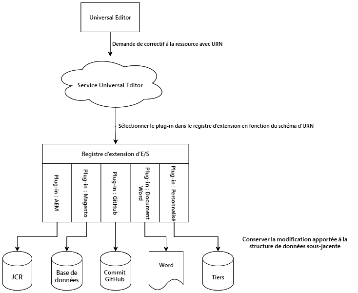
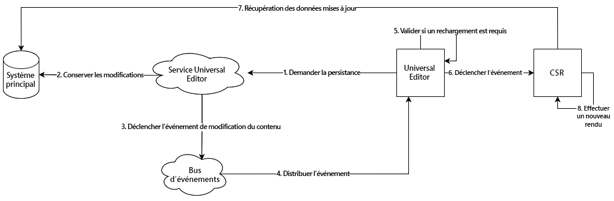

# Architecture de l’éditeur universel {#architecture}

Découvrez l’architecture de l’éditeur universel et le flux de données entre ses services et couches.

## Blocs de création d’architecture {#building-blocks}

L’éditeur universel est constitué de quatre blocs de création essentiels qui interagissent pour permettre aux personnes en charge de la création de contenu de modifier n’importe quel aspect de tout contenu dans n’importe quelle mise en œuvre afin de fournir des expériences exceptionnelles, d’augmenter la vitesse du contenu et d’offrir une expérience de développement à la pointe de la technologie.

1. [Éditeurs](#editors)
1. [Application distante](#remote-app)
1. [Couche API](#api-layer)
1. [Couche de persistance](#persistence-layer)

Ce document décrit tous les blocs de création et la manière dont ils échangent des données.

>[!TIP]
>
>Pour voir l’éditeur universel et son architecture en action, reportez-vous à [Prise en main de l’éditeur universel dans AEM](getting-started.md). Vous apprendrez à accéder à l’éditeur universel et à commencer à instrumenter votre première application AEM pour l’utiliser.

### Éditeurs {#editors}

* **Éditeur universel** – L’éditeur universel utilise un DOM instrumenté pour permettre la modification statique du contenu. Consultez [Attributs et types](attributes-types.md) pour plus d’informations sur les métadonnées nécessaires. Consultez le document [Prise en main de l’éditeur universel dans AEM](getting-started.md) pour découvrir un exemple de l’instrumentation dans AEM.
* **Rail des propriétés** - Certaines propriétés des composants ne peuvent pas être modifiées en contexte ; par exemple, l’heure de rotation d’un carrousel ou quel onglet accordéon doit toujours être ouvert ou fermé. Pour activer la modification de ces informations de composant, utilisez l’éditeur basé sur les formulaires qui apparaît dans le rail latéral de l’éditeur.

### Application distante {#remote-app}

Pour rendre une application modifiable en contexte dans l’éditeur universel, le DOM doit être instrumenté. L’application distante doit effectuer le rendu de certains attributs dans le DOM. Consultez [Attributs et types](attributes-types.md) pour plus d’informations sur les métadonnées nécessaires. Consultez le document [Prise en main de l’éditeur universel dans AEM](getting-started.md) pour découvrir un exemple de l’instrumentation dans AEM.

L’éditeur universel s’efforce d’obtenir un SDK minimal. Par conséquent, l’instrumentation relève de la mise en œuvre de l’application distante.

### Couche API {#api-layer}

* **Données de contenu** – Pour l’éditeur universel, les systèmes source des données de contenu et la manière dont elles sont utilisées n’ont pas d’importance. Il est uniquement important de définir et de fournir les attributs requis à l’aide de données modifiables en contexte.
* **Données persistantes** – Il existe un identifiant d’URL pour chaque donnée modifiable. Cette URL est utilisée pour acheminer la persistance vers le système et la ressource appropriés.

### Couche de persistance {#persistence-layer}

* **Modèle de fragment de contenu** – Pour prendre en charge le rail de modification des propriétés de fragment de contenu, l’éditeur de fragment de contenu et les éditeurs basés sur des formulaires, des modèles par composant et fragment de contenu sont requis.
* **Contenu** - Le contenu peut être stocké n’importe où, par exemple dans AEM, Magento, etc.

## Le service Éditeur universel et Backend System Dispatch {#service}

L’éditeur universel distribue toutes les modifications de contenu à un service centralisé appelé Service Éditeur universel. Ce service, exécuté sur Adobe I/O Runtime, charge les plug-ins disponibles dans le registre des extensions en fonction de l’URL fournie. Le plug-in est chargé de communiquer avec le backend et de renvoyer une réponse unifiée.

## Rendu des pipelines {#rendering-pipelines}

### Rendu côté serveur {#server-side}

### Génération statique du site {#static-generation}

### Rendu côté client {#client-side}

## Ressources supplémentaires {#additional-resources}

Pour en savoir plus sur l’éditeur universel, consultez ces documents.

* [Présentation de l’éditeur universel](introduction.md) - Découvrez comment l’éditeur universel permet de modifier n’importe quel aspect d’un contenu dans n’importe quelle implémentation afin de fournir des expériences exceptionnelles, d’augmenter la vitesse du contenu et d’offrir une expérience de développement à la pointe de la technologie.
* [Création de contenu avec l’éditeur universel](authoring.md) - Découvrez à quel point il est facile et intuitif pour les créateurs et les créatrices de contenu de créer du contenu à l’aide de l’éditeur universel.
* [Publication de contenu avec l’éditeur universel](publishing.md) - Découvrez comment l’éditeur universel publie du contenu et comment vos applications peuvent gérer le contenu publié.
* [Prise en main de l’éditeur universel dans AEM](getting-started.md) – Découvrez comment accéder à l’éditeur universel et comment commencer à instrumenter votre première application AEM pour l’utiliser.
* [Attributs et types](attributes-types.md) – Découvrez les attributs et les types de données requis par l’éditeur universel.
* [Authentification de l’éditeur universel](authentication.md) - Découvrez comment l’éditeur universel s’authentifie.
