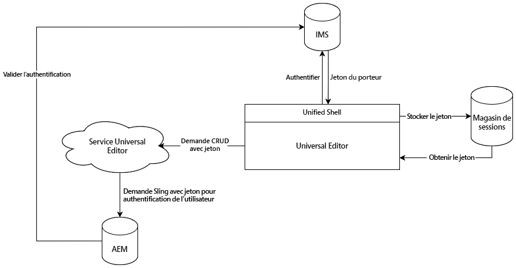

# Authentification de l’éditeur universel {#authentication}

Découvrez comment l’éditeur universel s’authentifie.

## Options {#options}

L’éditeur universel utilise l’authentification IMS (Identity Management System) d’Adobe, fournie par Unified Shell.

Toutes les applications/pages distantes sont chargées de l’authentification sur les systèmes principaux requis. Le service d’éditeur universel a besoin de cette authentification aux systèmes afin d’effectuer des opérations CRUD, car il s’agit d’un service autonome.

## Flux standard {#standard-flow}

Il s’agit de la solution pour AEM as a Cloud Service et AMS utilisant IMS pour utiliser l’éditeur universel.

Pour utiliser l’éditeur universel, il est nécessaire d’être connecté à Unified Shell qui s’authentifie auprès d’IMS. Le jeton IMS fourni est stocké dans le magasin de sessions des utilisateurs et des utilisatrices.

Chaque fois qu’une opération CRUD est effectuée, un appel est envoyé au service d’éditeur universel avec le jeton porteur IMS dans l’en-tête HTTP. Le service d’éditeur universel utilise ensuite le jeton porteur pour authentifier la requête sur le système principal AEM afin d’exécuter des opérations au nom de l’utilisateur ou de l’utilisatrice.

Ce diagramme et cet article décrivent l’authentification interne de l’éditeur universel lui-même.

{{ue-headless-auth}}
