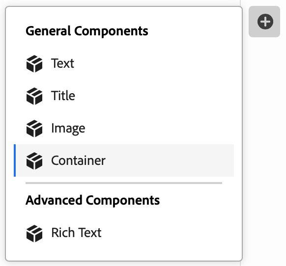

# Création de contenu avec l’éditeur universel {#authoring}

Découvrez à quel point il est facile et intuitif pour les personnes en charge de la création de créer du contenu à l’aide de l’éditeur universel.

## Présentation {#introduction}

L’éditeur universel permet de modifier n’importe quel aspect de contenu dans n’importe quelle mise en œuvre pour que vous puissiez fournir des expériences exceptionnelles, d’augmenter la vitesse du contenu et d’offrir une expérience de développement à la pointe de la technologie.

Pour ce faire, l’éditeur universel offre aux auteurs de contenu une interface utilisateur intuitive qui nécessite une formation minimale pour simplement pouvoir intervenir et commencer à modifier le contenu. Ce document décrit l’expérience de création d’Universal Editor.

>[!TIP]
>
>Pour une présentation plus détaillée de l’éditeur universel, consultez le document [Présentation de l’éditeur universel.](introduction.md)

>[!NOTE]
>
>L’éditeur universel est encore en cours de développement. Actuellement, il ne peut pas modifier tous les types de contenu.

## Préparer l’application {#prepare-app}

Pour créer du contenu pour une application à l’aide de l’éditeur universel, l’application doit être instrumentée par un développeur ou une développeuse afin de prendre en charge l’éditeur.

>[!TIP]
>
>Consultez [Prise en main de l’éditeur universel dans AEM](getting-started.md) pour obtenir un exemple de configuration d’une application AEM pour qu’elle fonctionne avec l’éditeur universel.

## Se connecter {#sign-in}

Une fois que l’application est instrumentée pour fonctionner avec l’éditeur universel, connectez-vous à l’éditeur universel. Vous avez besoin d’une Adobe ID pour vous connecter et [ont accès à l’éditeur universel.](getting-started.md#request-access)

Une fois connecté, saisissez l’URL de la page à modifier dans le [la barre d’emplacement.](#location-bar) pour pouvoir commencer à modifier du contenu, par exemple [contenu texte](#text-mode) ou [contenu multimédia.](#media-mode)

## Présentation de l’interface utilisateur {#ui}

L’interface utilisateur est divisée en cinq zones principales.

* [En-tête Experience Cloud](#experience-cloud-header)
* [En-tête de l’éditeur universel](#universal-editor-header)
* [Le rail de mode](#mode-rail)
* [L’éditeur](#editor)
* [Rail Propriétés](#properties-rail)

### En-tête Experience Cloud {#experience-cloud-header}

L’en-tête Experience Cloud est toujours présent en haut de l’écran. Il s’agit d’une ancre de lien qui vous indique où vous vous trouvez dans Experience Cloud et vous aide à accéder à d’autres applications Experience Cloud.

#### Experience Manager {#experience-manager}

Sélectionnez le lien Adobe Experience Cloud à gauche de l’en-tête pour accéder à la racine de votre solution Experience Manager et aux outils tels que [Cloud Manager,](/help/onboarding/cloud-manager-introduction.md) [Cloud Acceleration Manager](/help/journey-migration/cloud-acceleration-manager/introduction/overview-cam.md) et [Distribution logicielle.](https://experienceleague.adobe.com/docs/experience-cloud/software-distribution/home.html?lang=fr)

#### Organisation {#organization}

L’organisation dans laquelle vous êtes actuellement connecté s’affiche. Appuyez ou cliquez sur pour passer à une autre organisation si votre Adobe ID est associé à plusieurs d’entre elles.

#### Solutions {#solutions}

Appuyez ou cliquez sur le sélecteur de solutions pour accéder rapidement à d’autres solutions Experience Cloud.

#### Aide {#help}

L’icône d’aide permet d’accéder rapidement aux ressources d’apprentissage et d’assistance.

#### Notifications {#notifications}

Cette icône comporte un badge indiquant le nombre d’éléments incomplets actuellement attribués. [notifications.](/help/implementing/cloud-manager/notifications.md)

#### Propriétés de l’utilisateur ou de l’utilisatrice {#user-properties}

Appuyez ou cliquez sur l’icône représentant votre utilisateur ou votre utilisatrice pour accéder à vos paramètres utilisateur. Si vous n’avez configuré aucune image d’utilisateur ou d’utilisatrice, une icône est attribuée de manière aléatoire.

### En-tête de l’éditeur universel {#universal-editor-header}

L’en-tête de l’éditeur universel est toujours présent en haut de l’écran, juste en dessous de [l’en-tête Experience Cloud.](#experience-cloud-header) Il vous permet d’accéder rapidement à une autre page à modifier et de publier la page active.

#### Bouton Accueil {#home-button}

Le bouton d’accueil vous renvoie à la page de début de l’éditeur universel.

Sur la page de début, vous pouvez saisir l’URL du site à modifier à l’aide de l’éditeur universel.

>[!NOTE]
>
>Toute page que vous souhaitez modifier à l’aide de l’éditeur universel doit être [instrumentée pour prendre en charge l’éditeur universel.](getting-started.md)

#### Barre d’emplacement {#location-bar}

La barre d’emplacement affiche l’adresse de la page que vous modifiez. Appuyez ou cliquez pour saisir l’adresse d’une autre page à modifier.

>[!TIP]
>
>Utiliser le raccourci clavier `L` pour ouvrir la barre d’adresse.

>[!NOTE]
>
>Toute page que vous souhaitez modifier à l’aide de l’éditeur universel doit être [instrumentée pour prendre en charge l’éditeur universel.](getting-started.md)

#### Paramètres d’en-tête d’authentification {#authentication-settings}

Appuyez ou cliquez sur l’icône des paramètres d’en-tête d’authentification si vous devez définir un secret d’authentification.

#### Paramètres de l&#39;émulateur {#emulator}

Appuyez ou cliquez sur l’icône d’émulation pour définir la manière dont l’éditeur universel effectue le rendu de la page.

Appuyez ou cliquez sur l’icône d’émulation pour afficher les options.

Par défaut, l’éditeur s’ouvre dans la mise en page pour ordinateur où la hauteur et la largeur sont automatiquement définies par le navigateur.

Vous pouvez également choisir d’émuler un appareil mobile et dans l’éditeur universel :

* Définir son orientation
* Définir la largeur et la hauteur
* Modification de l’orientation

#### Ouvrir l’aperçu de l’application {#open-app-preview}

Appuyez ou cliquez sur l’icône d’aperçu de l’application ouverte pour ouvrir la page que vous êtes en train de modifier dans son propre onglet de navigateur, sans l’éditeur pour prévisualiser votre contenu.

>[!TIP]
>
>Utiliser la touche chaude `O` (lettre O) pour ouvrir l’aperçu de l’application.

#### Publier {#publish}

Appuyez ou cliquez sur le bouton Publier pour pouvoir publier en direct les modifications apportées au contenu pour que vos lecteurs et lectrices puissent les utiliser.

>[!TIP]
>
>Voir le document [Publication de contenu avec l’éditeur universel](publishing.md) pour plus d’informations sur la publication avec Universal Editor.

### Rail de mode {#rail}

Le rail de mode se trouve juste sous le bouton d’accueil et est toujours présent le long du côté gauche de l’éditeur. Il permet de basculer facilement l’éditeur entre différents modes d’utilisation.

#### Mode Aperçu {#preview-mode}

En mode Aperçu, la page rendue dans l’éditeur est telle qu’elle apparaîtrait sur votre service publié. Cela permet à la personne en charge de la création de contenu de parcourir le contenu en cliquant sur des liens, etc.

>[!TIP]
>
>Utilisez la touche de raccourci `P` pour passer en mode Aperçu.

#### Mode Composants {#component-mode}

En mode Composants, l’auteur du contenu peut sélectionner les composants à modifier, notamment :

* [Modification de texte brut](#editing-content) en place.
* [Modification de texte enrichi](#editing-rich-text) en place avec des options de mise en forme supplémentaires affichées dans le rail des propriétés.
* [Modification du contenu multimédia](#editing-media)
* [Modification de fragments de contenu](#edit-content-fragment)

Lorsque vous sélectionnez un composant, les détails de son contenu s’affichent dans le [rail de propriétés.](#properties-rail) Selon le type de contenu, vous pouvez modifier le contenu statique ou dans le rail de propriétés.

>[!TIP]
>
>Utiliser la touche chaude `C` pour passer en mode composants.

### L’éditeur {#editor}

L’éditeur occupe la majeure partie de la fenêtre et est l’endroit où la page indiquée dans [la barre d’emplacement ;](#location-bar) est rendue.

* Si l’éditeur se trouve dans [mode Composants,](#component-mode) le contenu sera modifiable, mais vous ne pouvez pas suivre les liens.
* Si l’éditeur se trouve dans [mode aperçu,](#preview-mode) le contenu sera navigable et vous pouvez suivre les liens, mais vous ne pouvez pas le modifier.

### Rail des propriétés {#properties-rail}

Le rail des propriétés est toujours présent le long du côté droit de l’éditeur. En fonction de son mode, il peut afficher les détails d’un composant sélectionné dans le contenu ou la hiérarchie du contenu de la page.

#### Mode Propriétés {#properties-mode}

En mode Propriétés, le rail affiche les propriétés du composant actuellement sélectionné dans l’éditeur. Il s’agit du mode par défaut du rail des propriétés lorsqu’une page est chargée.

Selon le type de composant sélectionné, les détails peuvent être affichés et modifiés dans le rail des propriétés.

Notez que tous les composants ne comportent pas de détails qui peuvent être affichés et/ou modifiés.

>[!TIP]
>
>Utiliser la touche chaude `D` pour passer en mode propriétés.

#### Mode Arborescence de contenu {#content-tree-mode}

En mode Arborescence de contenu, le rail affiche la hiérarchie du contenu de la page.

Lors de la sélection d’un élément dans l’arborescence de contenu, l’éditeur fait défiler le contenu jusqu’à ce qu’il le sélectionne.

>[!TIP]
>
>Utiliser la touche chaude `F` pour passer en mode arborescence de contenu.

##### Modifier {#edit}

Dans [mode Composants,](#component-mode) les options de modification du composant sélectionné s’affichent dans le rail des propriétés. Dans le rail des propriétés, vous pouvez modifier le composant sélectionné. Si le composant sélectionné est un fragment de contenu, vous pouvez également appuyer ou cliquer sur le bouton Modifier.

Appuyez ou cliquez sur le bouton Modifier pour ouvrir la [Éditeur de fragment de contenu](/help/assets/content-fragments/content-fragments-managing.md#opening-the-fragment-editor) dans un nouvel onglet. Cela vous permet d’accéder à toute la puissance de l’éditeur de fragments de contenu pour modifier le fragment de contenu associé.

Selon les besoins de votre workflow, vous pouvez modifier le fragment de contenu dans l’éditeur universel ou directement dans l’éditeur de fragment de contenu.

>[!TIP]
>
>Utiliser la touche chaude `E` pour modifier un composant sélectionné.

##### Ajouter {#add}

Si vous sélectionnez un composant de conteneur dans l’arborescence de contenu ou dans l’éditeur, l’option d’ajout s’affiche sur le rail des propriétés.

Appuyez ou cliquez sur le bouton d’ajout pour ouvrir un menu déroulant des composants disponibles pour [ajoutez au conteneur sélectionné.](#adding-components)

>[!TIP]
>
>Utiliser la touche chaude `A` pour ajouter un composant à un composant de conteneur sélectionné.

##### Supprimer {#delete}

Si vous sélectionnez un composant dans un composant de conteneur dans l’arborescence de contenu ou dans l’éditeur, l’option de suppression s’affiche sur le rail des propriétés.

Appuyez ou cliquez sur le bouton de suppression [supprime le composant.](#deleting-components)

>[!TIP]
>
>Utiliser la touche chaude `Shift+Backspace` pour supprimer un composant sélectionné d’un conteneur.

## Modification du contenu {#editing-content}

La modification du contenu est simple et intuitive. Dans [mode Composants](#component-mode), lorsque vous placez le pointeur de la souris sur le contenu de l’éditeur, le contenu modifiable est mis en surbrillance avec une zone bleue.

>[!TIP]
>
>Notez qu’en mode Composants, appuyer ou cliquer sur le contenu le sélectionne pour le modifier. Si vous souhaitez parcourir votre contenu en suivant les liens, passez en [mode Aperçu.](#preview-mode)

Selon le contenu que vous sélectionnez, vous pouvez avoir différentes options de modification statique et des informations et options supplémentaires pour le contenu dans la variable [rail de propriétés.](#properties-rail)

### Modification de texte brut {#edit-plain-text}

Si vous êtes dans [mode Composants](#component-mode) et sélectionnez un composant de texte brut, vous pouvez modifier le texte en place en double-cliquant ou en appuyant deux fois sur le composant.

Appuyez sur Entrée/Retour ou appuyez ou cliquez en dehors de la zone de texte pour enregistrer vos modifications.

Lorsque vous appuyez ou cliquez pour sélectionner le composant de texte, ses détails s’affichent dans le rail des propriétés. Vous pouvez également modifier le texte dans le rail.

De plus, des détails sur votre texte sont disponibles dans le rail de propriétés. Les modifications sont automatiquement enregistrées lorsque le focus quitte le champ modifié dans le rail des propriétés.

### Modification de texte enrichi {#edit-rich-text}

Si vous êtes dans [mode Composants](#component-mode) et sélectionnez un composant de texte enrichi, vous pouvez modifier le texte en place en double-cliquant ou en appuyant deux fois sur le composant.

Appuyez sur Entrée/Retour ou appuyez ou cliquez en dehors de la zone de texte pour enregistrer vos modifications.

En outre, les options de mise en forme et les détails de votre texte sont disponibles dans le rail des propriétés. Les modifications sont automatiquement enregistrées lorsque le focus quitte le champ modifié dans le rail des propriétés.

### Modification du média {#edit-media}

Si vous êtes dans [mode Composants](#component-mode) et si vous sélectionnez une image, vous pouvez afficher ses détails dans le rail de propriétés.

Appuyez ou cliquez sur le bouton **Remplacer** en dessous de l’aperçu de l’image sélectionnée dans le rail de propriétés pour remplacer l’image par une autre de votre bibliothèque de ressources.

1. La variable [sélecteur de ressources](/help/assets/asset-selector.md#using-asset-selector) s’ouvre pour vous permettre de sélectionner une ressource.
1. Appuyez ou cliquez sur pour sélectionner une nouvelle ressource.
1. Appuyez ou cliquez sur **Sélectionner** pour revenir au rail des propriétés où la ressource a été remplacée.

Les modifications sont automatiquement enregistrées dans votre contenu.

>[!TIP]
>
>Utiliser la touche chaude `R` pour ouvrir le sélecteur de ressources afin de remplacer l’image sélectionnée.

### Modification de fragments de contenu {#edit-content-fragment}

Si vous êtes dans [mode Composants](#component-mode) et vous sélectionnez une [Fragment de contenu,](/help/sites-cloud/administering/content-fragments/overview.md) vous pouvez modifier ses détails dans le rail des propriétés.

Les champs définis dans le modèle de contenu du fragment de contenu sélectionné sont affichés et modifiables dans le rail des propriétés.

Si vous sélectionnez un champ lié à un fragment de contenu, celui-ci se charge dans le rail des composants et le champ est automatiquement défilé vers .

Les modifications sont automatiquement enregistrées lorsque le focus quitte le champ modifié dans le rail des propriétés.

Si vous souhaitez modifier votre fragment de contenu dans le [Éditeur de fragment de contenu](/help/sites-cloud/administering/content-fragments/authoring.md) cliquez sur [bouton d’édition](#edit) dans le rail de mode.

Selon les besoins de votre workflow, vous pouvez modifier le fragment de contenu dans l’éditeur universel ou directement dans l’éditeur de fragment de contenu.

### Ajout de composants aux conteneurs {#adding-components}

1. Sélectionnez un composant de conteneur dans l’arborescence de contenu ou dans l’éditeur.
1. Appuyez ou cliquez ensuite sur l’icône d’ajout dans le rail des propriétés.

   

Le composant est inséré dans le conteneur et peut être modifié dans l’éditeur.

>[!TIP]
>
>Utiliser la touche chaude `A` pour ajouter un composant au conteneur sélectionné.

### Suppression de composants des conteneurs {#deleting-components}

1. Sélectionnez un composant de conteneur dans l’arborescence de contenu ou dans l’éditeur.
1. Appuyez ou cliquez sur l’icône chevron du conteneur pour développer son contenu dans l’arborescence de contenu.
1. Sélectionnez ensuite, dans l’arborescence de contenu, un composant dans le conteneur.
1. Appuyez ou cliquez sur l’icône de suppression dans le rail des propriétés.

   

Le composant sélectionné a été supprimé.

>[!TIP]
>
>Utiliser la touche chaude `Shift+Backspace` pour supprimer le composant sélectionné de son conteneur.

### Réorganisation des composants dans les conteneurs {#reordering-components}

1. Sélectionnez un composant de conteneur dans l’arborescence de contenu ou dans l’éditeur.
1. Si ce n’est pas déjà fait dans [le mode arborescence de contenu,](#content-tree-mode) passez-y.
1. Appuyez ou cliquez sur l’icône chevron du conteneur pour développer son contenu dans l’arborescence de contenu.
1. Faites glisser les icônes de poignée en regard des composants dans le conteneur pour afficher que vous puissiez les réorganiser. Faites glisser les composants pour les réorganiser dans le conteneur.

   

1. Le composant déplacé devient gris dans l’arborescence du composant, tandis que votre point d’insertion est représenté par une ligne bleue. Libérez le composant pour le placer à son nouvel emplacement.

Les composants sont réorganisés dans l’arborescence de contenu et dans l’éditeur.

## Prévisualisation du contenu {#previewing-content}

Une fois le contenu modifié, vous aimez généralement le parcourir pour voir à quoi il ressemble dans le contenu d’autres pages. En [mode Aperçu](#preview-mode), vous pouvez cliquer sur les liens pour parcourir votre contenu comme le ferait un lecteur ou une lectrice. Le contenu est rendu dans l’éditeur tel qu’il serait publié.

Notez qu’en mode Aperçu, le fait d’appuyer ou de cliquer sur le contenu fait réagir ce dernier comme il le ferait avec un lecteur ou une lectrice du contenu. Si vous souhaitez sélectionner le contenu à modifier, passez à [mode Composants .](#component-mode)

## Ressources supplémentaires {#additional-resources}

Pour en savoir plus sur l’éditeur universel, consultez ces documents.

* [Présentation de l’éditeur universel](introduction.md) - Découvrez comment l’éditeur universel permet de modifier n’importe quel aspect d’un contenu dans n’importe quelle implémentation afin de fournir des expériences exceptionnelles, d’augmenter la vitesse du contenu et d’offrir une expérience de développement à la pointe de la technologie.
* [Publication de contenu avec l’éditeur universel](publishing.md) - Découvrez comment l’éditeur universel publie du contenu et comment vos applications peuvent gérer le contenu publié.
* [Prise en main de l’éditeur universel dans AEM](getting-started.md) - Découvrez comment accéder à l’éditeur universel et comment commencer à instrumenter votre première application AEM pour l’utiliser.
* [Architecture de l’éditeur universel](architecture.md) - Découvrez l’architecture de l’éditeur universel et le flux de données entre ses services et calques.
* [Attributs et types](attributes-types.md) - Découvrez les attributs et les types de données requis par l’éditeur universel.
* [Authentification de l’éditeur universel](authentication.md) - Découvrez comment l’éditeur universel s’authentifie.
