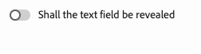

# Personnalisation de l’éditeur universel {#customizing}

Découvrez les différentes options de personnalisation de l’éditeur universel pour prendre en charge les besoins des créateurs et créatrices de contenu.

>[!TIP]
>
>L’éditeur universel offre également de nombreux [points d’extension](/help/implementing/universal-editor/extending.md) qui vous permettent d’étendre ses fonctionnalités afin de répondre aux besoins de votre projet.

## Utilisation des balises de configuration Meta {#meta-tags}

Certains workflows de création peuvent nécessiter l’utilisation de certaines fonctionnalités de l’éditeur universel et pas d’autres. Pour prendre en charge ces différents cas de figure, des balises méta sont disponibles pour configurer ou désactiver certaines fonctionnalités ou boutons de l’éditeur.

### Désactivation des fonctionnalités {#disable-features}

Utilisez cette balise dans la section `<head>` de la page pour désactiver une ou plusieurs fonctionnalités :

```html
<meta name="urn:adobe:aue:config:disable" content="..." />
```

Si vous souhaitez désactiver plusieurs fonctionnalités, fournissez une liste de valeurs séparées par des virgules.

Vous trouverez ci-dessous les valeurs prises en charge pour `content`, c’est-à-dire les fonctionnalités qui peuvent être désactivées avec les balises meta.

| Valeur du contenu | Description |
|---|---|
| `publish` | Désactivez toutes les fonctionnalités [publication](/help/sites-cloud/authoring/universal-editor/publishing.md), c’est-à-dire les boutons [publier](/help/sites-cloud/authoring/universal-editor/navigation.md#publish) et [dépublier](/help/sites-cloud/authoring/universal-editor/navigation.md#ellipsis). |
| `publish-live` | Désactivation de la [publication](/help/sites-cloud/authoring/universal-editor/publishing.md) en direct |
| `publish-preview` | Désactiver la prévisualisation de la publication (si le [service de prévisualisation](/help/sites-cloud/authoring/sites-console/previewing-content.md) est disponible) |
| `unpublish` | Désactivez le bouton [dépublier](/help/sites-cloud/authoring/universal-editor/publishing.md#unpublishing-content) |
| `copy` | Désactive les boutons [copier-coller](/help/sites-cloud/authoring/universal-editor/authoring.md#copy-paste) |
| `duplicate` | Désactive le bouton [dupliquer](/help/sites-cloud/authoring/universal-editor/navigation.md#duplicate) |
| `header-open-page` | Désactive le bouton [ouvrir la page](/help/sites-cloud/authoring/universal-editor/navigation.md#open-page) |
| `aem-dev-login` | Désactive le bouton [connexion développeur](/help/sites-cloud/authoring/universal-editor/navigation.md#local-developer-login) |

### Définition du mode Éditeur {#defining-mode}

Vous pouvez forcer l’éditeur universel à s’ouvrir dans un mode particulier. Utilisez cette balise dans la section `<head>` de la page pour forcer le mode d’éditeur :

```html
<meta name="urn:adobe:aue:config:mode" content="..." />
```

Vous trouverez ci-dessous les valeurs prises en charge pour `content`, c’est-à-dire les fonctionnalités qui peuvent être désactivées avec les balises meta.

| Valeur du contenu | Description |
|---|---|
| `preview` | L’éditeur s’ouvre en [mode Aperçu](/help/sites-cloud/authoring/universal-editor/navigation.md#preview-mode). L’icône **Aperçu** est masquée et l’utilisateur ne peut pas revenir en mode d’édition. |
| `readonly` | L’éditeur s’ouvre en mode lecture seule. Le bouton [**Propriétés** et le panneau](/help/sites-cloud/authoring/universal-editor/navigation.md#properties-rail) sont masqués. Les détails sont disponibles dans l’arborescence de contenu, mais aucune modification ne peut être apportée. |

Lors de la définition de modes à l’aide de balises META, les modes ne peuvent pas être remplacés.

### URL d’aperçu personnalisée {#custom-preview-urls}

Vous pouvez spécifier une URL d’aperçu personnalisée par le biais d’une méta configuration `urn:adobe:aue:config:preview`, qui s’ouvre en cliquant sur le bouton **Ouvrir la page** dans la [barre d’outils supérieure droite de l’éditeur](/help/sites-cloud/authoring/universal-editor/navigation.md#universal-editor-toolbar).

Pour ce faire, il vous suffit d’inclure l’URL d’aperçu souhaitée dans une balise meta de l’application instrumentée, comme dans l’exemple suivant.

```html
<meta name="urn:adobe:aue:config:preview" content="https://wknd.site"/>
```

### Modification de votre point d’entrée {#custom-endpoint}

Si vous préférez ne pas utiliser le service d’éditeur universel, qui est hébergé par Adobe, mais votre propre version hébergée, vous pouvez le définir dans une balise meta. Pour plus d’informations, consultez le document [Prise en main de l’éditeur universel dans AEM](/help/implementing/universal-editor/getting-started.md##configuration-settings).

## Filtrage des composants {#filtering-components}

Vous pouvez restreindre les composants autorisés par conteneur dans l’éditeur universel à l’aide de filtres de composant. Pour plus d’informations, consultez le document [Filtrage des composants](/help/implementing/universal-editor/filtering.md).

## Affichage et masquage conditionnel des composants dans le panneau Propriétés {#conditionally-hide}

Bien que les créateurs et créatrices puissent généralement avoir accès à un ou plusieurs composants, cela ni signifie pas que ces derniers sont toujours pertinents. Dans ce cas, vous pouvez masquer des composants dans le panneau Propriétés en ajoutant un attribut `condition` aux [champs du modèle de composant](/help/implementing/universal-editor/field-types.md#fields).

Les conditions peuvent être définies à l’aide du [schéma JsonLogic](https://jsonlogic.com/). Si la condition est true, le champ s’affiche. Si la condition est false, le champ est masqué.

>[!BEGINTABS]

>[!TAB Modèle type]

```json
 {
    "id": "conditionally-revealed-component",
    "fields": [
      {
        "component": "boolean",
        "label": "Shall the text field be revealed?",
        "name": "reveal",
        "valueType": "boolean"
      },
      {
        "component": "text-input",
        "label": "Hidden text field",
        "name": "hidden-text",
        "valueType": "string",
        "condition": { "===": [{"var" : "reveal"}, true] }
      }
    ]
 }
```

>[!TAB Condition false]



>[!TAB Condition true]


>[!ENDTABS]

### Limitation : Conditions Dans Les Conteneurs À Champs Multiples {#conditions-multi-field-limitation}

La condition `var` la résolution est absolue et non relative à la ligne active. Un `var` doit être un `fieldName` de niveau racine ou, pour les champs à l’intérieur d’un conteneur, un préfixe avec le nom du conteneur tel que `containerName|fieldName`.

La même approche ne fonctionne pas pour les conteneurs multiples (lignes répétables). Le contenu des lignes est indexé au moment de l’exécution comme `containerName/0|fieldName`, `containerName/1|fieldName`, etc., mais cet index n’est pas connu lors de la création de la condition et il se déplace à mesure que des lignes sont ajoutées, supprimées ou réorganisées. Par conséquent, il n’existe aucun moyen pour un auteur de cibler un champ spécifique dans la même ligne. Par conséquent, les conditions à l’intérieur de plusieurs conteneurs ne sont pas prises en charge.
