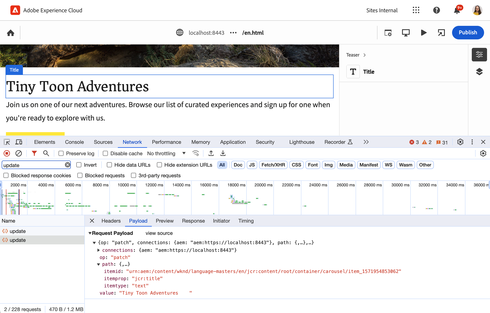

# Présentation de l’éditeur universel pour les développeurs et développeuses AEM {#developer-overview}

Si vous êtes un développeur ou une développeuse AEM intéressé(e) par le fonctionnement de l’éditeur universel et par la manière de l’utiliser dans votre projet, ce document vous donne une introduction complète en vous guidant tout au long de l’instrumentation du projet WKND pour travailler avec l’éditeur universel.

## Objectif {#purpose}

Ce document constitue une introduction destinée aux développeurs et développeuses sur le fonctionnement de l’éditeur universel et sur la manière d’instrumenter votre application pour l’utiliser.

Pour ce faire, elle prend un exemple standard que la plupart des développeurs et développeuses d’AEM connaissent, les composants principaux et le site WKND, et instrumente quelques exemples de composants pour qu’ils soient modifiables à l’aide de l’éditeur universel.

>[!TIP]
>
>Ce document fournit des étapes supplémentaires pour illustrer le fonctionnement de l’éditeur universel et vise à approfondir la compréhension de l’éditeur par le développeur. Il ne prend donc pas la route la plus directe pour instrumenter une application, mais la plus représentative de l’éditeur universel et de son fonctionnement.
>
>Si vous souhaitez être opérationnel le plus rapidement possible, reportez-vous au document [Prise en main de l’éditeur universel dans AEM](/help/implementing/universal-editor/getting-started.md).

## Prérequis {#prerequisites}

Pour suivre cette présentation, vous avez besoin des éléments suivants disponibles.

* [Une instance de développement local d’AEM as a Cloud Service](https://experienceleague.adobe.com/docs/experience-cloud/software-distribution/home.html?lang=fr)
   * Votre instance de développement locale doit être [configurée avec HTTPS à des fins de développement sur `localhost`](https://experienceleague.adobe.com/docs/experience-manager-learn/foundation/security/use-the-ssl-wizard.html?lang=fr).
   * [Le site de démonstration WKND doit être installé](https://github.com/adobe/aem-guides-wknd).
* [Accès à l’éditeur universel](/help/implementing/universal-editor/getting-started.md#onboarding).
* [service d’éditeur universel local](/help/implementing/universal-editor/local-dev.md) exécuté à des fins de développement.
   * Veillez à demander à votre navigateur d’[accepter le certificat auto-signé des services locaux](/help/implementing/universal-editor/local-dev.md#editing).

Outre une connaissance générale du développement web, ce document suppose une connaissance de base du développement AEM. Si vous n’avez pas d’expérience en développement AEM, pensez à consulter [le tutoriel WKND avant de continuer](/help/implementing/developing/introduction/develop-wknd-tutorial.md).

## Démarrer AEM et se connecter à l’éditeur universel {#sign-in}

Si ce n’est pas déjà fait, votre instance de développement AEM locale doit s’exécuter avec WKND installé et le protocole HTTPS activé, comme [décrit dans les conditions préalables](#prerequisites). Cette présentation suppose que votre instance est en cours d’exécution à l’adresse `https://localhost:8443`.

1. Ouvrez le gabarit de langue anglaise WKND principal dans l’éditeur AEM.

   ```text
   https://localhost:8443/editor.html/content/wknd/language-masters/en.html
   ```

1. Dans le menu **Informations sur la page** de l’éditeur, sélectionnez **Afficher comme publié**. La même page s’ouvre alors dans un nouvel onglet avec l’éditeur AEM désactivé.

   ```text
   https://localhost:8443/content/wknd/language-masters/en.html?wcmmode=disabled
   ```

1. Copiez ce lien.

1. Connectez-vous à présent à l’éditeur universel.

   ```text
   https://experience.adobe.com/#/aem/editor
   ```

1. Collez le lien du contenu WKND que vous avez copié précédemment dans le champ **URL du site** de l’éditeur universel, puis cliquez sur **Ouvrir**.

   

## L’éditeur universel tente de charger le contenu {#sameorigin}

L’éditeur universel charge le contenu à modifier dans une image. Les paramètres par défaut AEM pour les options X-Frame empêchent cela, qui peut clairement être vu dans le navigateur comme une erreur et détaillé dans la sortie de la console lors de la tentative de chargement de votre copie locale de WKND.


L’option X-Frame empêche `sameorigin` le rendu des pages AEM dans un cadre. Vous devez supprimer cet en-tête pour permettre le chargement des pages dans l’éditeur universel.

1. Ouvrez Configuration Manager.

   ```text
   https://localhost:8443/system/console/configMgr
   ```

1. Modification de la configuration OSGi `org.apache.sling.engine.impl.SlingMainServlet`

   

1. Supprimez la `X-Frame-Options=SAMEORIGIN` de propriété de la propriété **En-têtes de réponse supplémentaires**.

1. Enregistrez les modifications.

Désormais, si vous rechargez l’éditeur universel, votre page AEM se charge.

>[!TIP]
>
>* Consultez le document [Prise en main de l’éditeur universel dans AEM](/help/implementing/universal-editor/getting-started.md#sameorigin) pour plus d’informations sur cette configuration OSGi.
>* Consultez le document [Configuration d’OSGi pour Adobe Experience Manager as a Cloud Service](/help/implementing/deploying/configuring-osgi.md) pour plus d’informations sur OSGi dans AEM.

## Gestion des cookies du même site {#samesite-cookies}

Lorsque l’éditeur universel charge votre page, il charge la page de connexion AEM afin de s’assurer que vous êtes authentifié(e) pour apporter des modifications.

Cependant, vous ne pouvez pas vous connecter. En affichant la console du navigateur, vous pouvez constater que le navigateur a bloqué l’entrée sur le cadre


Le cookie du jeton de connexion est envoyé à AEM en tant que domaine tiers. Par conséquent, les cookies du même site doivent être autorisés dans AEM.

1. Ouvrez Configuration Manager.

   ```text
   https://localhost:8443/system/console/configMgr
   ```

1. Modification de la configuration OSGi `com.day.crx.security.token.impl.impl.TokenAuthenticationHandler`

   

1. Modifiez la propriété **Attribut SameSite pour le cookie du jeton de connexion** en `None`.

1. Enregistrez les modifications.

Désormais, si vous rechargez l’éditeur universel, vous pouvez vous connecter à AEM et votre page cible se charge.

>[!TIP]
>
>* Consultez le document [Prise en main de l’éditeur universel dans AEM](/help/implementing/universal-editor/getting-started.md#samesite-cookies) pour plus d’informations sur cette configuration OSGi.
>* Consultez le document [Configuration d’OSGi pour Adobe Experience Manager as a Cloud Service](/help/implementing/deploying/configuring-osgi.md) pour plus d’informations sur OSGi dans AEM.

## L’éditeur universel se connecte à la trame distante. {#ue-connect-remote-frame}

Une fois la page chargée dans l’éditeur universel et que vous êtes connecté à AEM, l’éditeur universel tente de se connecter à la trame distante. Cette opération s’effectue via une bibliothèque JavaScript qui doit être chargée dans le cadre distant. En l’absence de bibliothèque JavaScript, la page génère une erreur de délai d’expiration dans la console.


Vous devez ajouter la bibliothèque JavaScript nécessaire au composant de page de l’application WKND.

1. Ouvrez CRXDE Lite.

   ```text
   https://localhost:8443/crx/de
   ```

1. Sous `/apps/wknd/components/page`, modifiez le `customheaderlibs.html` de fichier.

   

1. Ajoutez la bibliothèque JavaScript à la fin du fichier .

   ```html
   <script src="https://universal-editor-service.adobe.io/cors.js" async></script>
   ```

1. Cliquez sur **Enregistrer tout** puis rechargez l’éditeur universel.

La page se charge désormais avec la bibliothèque JavaScript appropriée pour permettre à l’éditeur universel de se connecter à votre page et l’erreur de temporisation n’apparaît plus dans la console.

>[!TIP]
>
>* La bibliothèque peut être chargée dans l’en-tête ou le pied de page.

>[!NOTE]
>
>La méthode précédemment recommandée pour inclure la bibliothèque JavaScript, `<script src="https://universal-editor-service.experiencecloud.live/corslib/LATEST"></script>` ou via npmjs.com n’est plus recommandée, car le package a été abandonné.
>
>Si une application utilise toujours le package obsolète, l’éditeur universel affiche un avertissement dans l’interface utilisateur indiquant qu’un package obsolète est détecté.

## Définition d’une connexion pour conserver les modifications {#connection}

La page WKND se charge désormais correctement dans l’éditeur universel et la bibliothèque JavaScript se charge pour connecter l’éditeur à l’application.

Cependant, vous avez probablement remarqué que vous ne pouvez pas interagir avec la page dans l’éditeur universel. L’éditeur universel ne peut pas modifier votre page. Pour que l’éditeur universel puisse modifier votre contenu, vous devez définir une connexion afin qu’il sache où écrire le contenu. Pour le développement local, vous devez écrire à votre instance de développement AEM locale à l’adresse `https://localhost:8443`.

1. Ouvrez CRXDE Lite.

   ```text
   https://localhost:8443/crx/de
   ```

1. Sous `/apps/wknd/components/page`, modifiez le `customheaderlibs.html` de fichier.

   

1. Ajoutez les métadonnées nécessaires à la connexion à votre instance AEM locale à la fin du fichier .

   ```html
   <meta name="urn:adobe:aue:system:aem" content="aem:https://localhost:8443">
   ```

   * La dernière version de la bibliothèque est toujours recommandée. Si vous avez besoin d’une version antérieure, consultez le document [Prise en main de l’éditeur universel dans AEM](/help/implementing/universal-editor/getting-started.md#alternative).

1. Ajoutez les métadonnées nécessaires à la connexion à votre service d’éditeur universel local à la fin du fichier .

   ```html
   <meta name="urn:adobe:aue:config:service" content="https://localhost:8000">
   ```

1. Cliquez sur **Enregistrer tout** puis rechargez l’éditeur universel.

Désormais, l’éditeur universel peut non seulement charger votre contenu à partir de votre instance de développement AEM locale, mais il sait également où conserver les modifications que vous apportez à l’aide de votre service d’éditeur universel local. Il s’agit de la première étape pour instrumenter votre application pour qu’elle soit modifiable avec l’éditeur universel.

>[!TIP]
>
>* Consultez le document [Prise en main de l’éditeur universel dans AEM](/help/implementing/universal-editor/getting-started.md#connection) pour plus d’informations sur les métadonnées de connexion.
>* Consultez le document [Architecture de l’éditeur universel](/help/implementing/universal-editor/architecture.md#service) pour plus d’informations sur la structure de l’éditeur universel.
>* Consultez le document [Développement AEM local avec l’éditeur universel](/help/implementing/universal-editor/local-dev.md) pour plus d’informations sur la connexion à une version auto-hébergée de l’éditeur universel.

## Instrumentation des composants {#instrumenting-components}

Cependant, vous remarquerez probablement que vous ne pouvez toujours pas faire grand-chose avec l’éditeur universel. Si vous tentez de cliquer sur le teaser en haut de la page WKND dans l’éditeur universel, vous ne pouvez pas le sélectionner (ni rien d’autre sur la page).

Vos composants doivent également être instrumentés pour être modifiables avec l’éditeur universel. Pour ce faire, vous devez modifier le composant Teaser . Par conséquent, vous devez superposer les composants principaux, car ceux-ci se trouvent sous `/libs`, ce qui est immuable.

1. Ouvrez CRXDE Lite.

   ```text
   https://localhost:8443/crx/de
   ```

1. Sélectionnez l’`/libs/core/wcm/components` de nœud et cliquez sur **Nœud de recouvrement** dans la barre d’outils.

1. Lorsque `/apps/` est sélectionné comme **emplacement de recouvrement**, cliquez sur **OK**.

   

1. Sélectionnez le nœud `teaser` sous `/libs/core/wcm/components` et cliquez sur **Copier** dans la barre d’outils.

1. Sélectionnez le nœud recouvert à l’emplacement `/apps/core/wcm/components` et cliquez sur **Coller** dans la barre d’outils.

1. Double-cliquez sur le fichier `/apps/core/wcm/components/teaser/v2/teaser/teaser.html` pour le modifier.

   

1. À la fin de la première `div`, à peu près à la ligne 26, ajouter les détails de l&#39;instrumentation du composant.

   ```text
   data-aue-resource="urn:aem:${resource.path}"
   data-aue-type="component"
   data-aue-label="Teaser"
   ```

1. Cliquez sur **Enregistrer tout** dans la barre d’outils, puis rechargez l’éditeur universel.

1. Dans l’éditeur universel, cliquez sur le composant Teaser en haut de la page et constatez que vous pouvez maintenant le sélectionner.

1. Si vous cliquez sur l’icône **Arborescence de contenu** dans le panneau Propriétés de l’éditeur universel, vous pouvez constater que l’éditeur a reconnu tous les teasers de la page maintenant que vous l’avez instrumenté. Le teaser que vous avez sélectionné est celui mis en surbrillance.

   

>[!TIP]
>
>Consultez le document [Utilisation de Sling Resource Merger dans Adobe Experience Manager as a Cloud Service](/help/implementing/developing/introduction/sling-resource-merger.md) pour plus d’informations sur le recouvrement de nœuds.

## Sous-composants d’instrument du teaser {#subcomponents}

Vous pouvez désormais sélectionner le teaser, mais ne le modifiez pas pour autant. En effet, le teaser est un composite de différents composants, tels que les composants image et titre. Vous devez instrumenter ces sous-composants afin de les modifier.

1. Ouvrez CRXDE Lite.

   ```text
   https://localhost:8443/crx/de
   ```

1. Sélectionnez le `/apps/core/wcm/components/teaser/v2/teaser/` de nœud et double-cliquez sur le fichier `title.html`.

   

1. Insérez les propriétés suivantes à la fin de la balise `h2` (près de la ligne 17).

   ```text
   data-aue-prop="jcr:title"
   data-aue-type="text"
   data-aue-label="Title"
   ```

1. Cliquez sur **Enregistrer tout** dans la barre d’outils, puis rechargez l’éditeur universel.

1. Cliquez sur le titre du même composant de teaser dans la partie supérieure de la page et constatez que vous pouvez maintenant le sélectionner. L’arborescence de contenu affiche également le titre dans le cadre du composant teaser sélectionné.

   

Vous pouvez maintenant modifier le titre du composant Teaser.

## Qu&#39;est-ce que cela signifie ? {#what-does-it-mean}

Maintenant que vous pouvez modifier le titre du teaser, prenons un moment pour passer en revue ce que vous avez accompli et comment.

Vous avez identifié le composant Teaser dans l’éditeur universel en l’instrumentant.

* `data-aue-resource` identifie la ressource en cours de modification dans AEM.
* `data-aue-type` définit que les éléments doivent être traités comme un composant de page (par opposition à un conteneur, par exemple).
* `data-aue-label` affiche un libellé convivial dans l’interface utilisateur pour le teaser sélectionné.

Vous avez également instrumenté le composant de titre dans le composant de teaser.

* `data-aue-prop` est l’attribut JCR qui est écrit.
* `data-aue-type` comment l’attribut doit être modifié. Dans ce cas, utilisez l’éditeur de texte, car il s’agit d’un titre (par opposition à l’éditeur de texte enrichi).

## Définir des en-têtes d’authentification {#auth-header}

Vous pouvez désormais modifier le titre du teaser en ligne et les modifications sont conservées dans le navigateur.


Cependant, si vous rechargez le navigateur, le titre précédent est rechargé. En effet, bien que l’éditeur universel sache comment se connecter à votre instance AEM, il ne peut pas encore s’authentifier sur votre instance AEM pour écrire les modifications dans le JCR.

Si vous affichez l’onglet réseau des outils de développement du navigateur et recherchez `update`, vous pouvez voir qu’il rencontre une erreur 401 lorsque vous essayez de modifier le titre.


Lors de l’utilisation de l’éditeur universel pour modifier votre contenu AEM de production, l’éditeur universel utilise le même jeton IMS que celui que vous avez utilisé pour vous connecter à l’éditeur afin de vous authentifier auprès d’AEM et de faciliter ainsi votre réécriture dans le JCR.

Lorsque vous effectuez un développement local, vous ne pouvez pas utiliser le fournisseur d’identité AEM, car les jetons IMS ne sont transmis qu’aux domaines détenus par l’Adobe. Vous devez fournir manuellement un moyen de vous authentifier en définissant explicitement un en-tête d’authentification.

1. Dans l’interface de l’éditeur universel, cliquez sur l’icône **En-têtes d’authentification** dans la barre d’outils.

1. Copiez l’en-tête d’authentification nécessaire pour vous authentifier sur votre instance AEM locale et cliquez sur **Enregistrer**.

   

1. Rechargez l’éditeur universel et modifiez maintenant le titre du teaser.

Aucune erreur n’est plus signalée dans la console du navigateur et les modifications sont conservées dans votre instance de développement AEM locale.

Si vous analysez le trafic dans les outils de développement du navigateur et recherchez les événements `update`, vous pouvez voir les détails de la mise à jour.



```json
{
  "connections": [
    {
      "name": "aem",
      "protocol": "aem",
      "uri": "https://localhost:8443"
    }
  ],
  "target": {
    "resource": "urn:aem:/content/wknd/language-masters/en/jcr:content/root/container/carousel/item_1571954853062",
    "type": "text",
    "prop": "jcr:title"
  },
  "value": "Tiny Toon Adventures"
}
```

* `connections` est la connexion à votre instance AEM locale
* `target` est le nœud et les propriétés exacts qui sont mis à jour dans le JCR
* `value` est la mise à jour que vous avez effectuée.

Vous pouvez voir la modification conservée dans le JCR.


>[!TIP]
>
>De nombreux outils sont disponibles en ligne pour générer les en-têtes d’authentification nécessaires à vos besoins de test et de développement.
>
>L’exemple d’en-tête d’authentification de base `Basic YWRtaW46YWRtaW4=` concerne la combinaison utilisateur/mot de passe de `admin:admin`, comme c’est le cas pour le développement AEM local.

## Instrumentation de l’application pour le panneau Propriétés {#properties-rail}

Vous disposez désormais d’une application instrumentée pour être modifiable à l’aide de l’éditeur universel !

La modification se limite actuellement à la modification en ligne du titre du teaser. Cependant, il existe des cas où la modification statique n’est pas suffisante. Le texte, tel que le titre du teaser, peut être modifié à l’endroit où il se trouve à l’aide de la touche clavier. Toutefois, les éléments plus complexes doivent pouvoir s’afficher et permettre la modification des données structurées indépendamment de la manière dont elles sont rendues dans le navigateur. C’est à cela que sert le panneau Propriétés.

Pour mettre à jour votre application afin d’utiliser le panneau Propriétés pour la modification, revenez au fichier d’en-tête du composant Page de votre application. C’est là que vous avez déjà établi les connexions à votre instance de développement AEM locale et à votre service d’éditeur universel local. Ici, vous devez définir les composants modifiables dans l’application et leurs modèles de données.

1. Ouvrez CRXDE Lite.

   ```text
   https://localhost:8443/crx/de
   ```

1. Sous `/apps/wknd/components/page`, modifiez le `customheaderlibs.html` de fichier.

   

1. À la fin du fichier , ajoutez le script nécessaire pour définir les composants.

   ```html
   <script type="application/vnd.adobe.aue.component+json">
   {
     "groups": [
       {
         "title": "General Components",
         "id": "general",
         "components": [
           {
             "title": "Teaser",
             "id": "teaser",
             "plugins": {
               "aem": {
                 "page": {
                   "resourceType": "wknd/components/teaser"
                 }
               }
             }
           },
           {
             "title": "Title",
             "id": "title",
             "plugins": {
               "aem": {
                 "page": {
                   "resourceType": "wknd/components/title"
                 }
               }
             }
           }
         ]
       }
     ]
   }
   </script>
   ```

1. En dessous, à la fin du fichier, ajoutez le script nécessaire pour définir le modèle.

   ```html
   <script type="application/vnd.adobe.aue.model+json">
   [
     {
       "id": "teaser",
       "fields": [
         {
           "component": "text-input",
           "name": "jcr:title",
           "label": "Title",
           "valueType": "string"
         },
         {
           "component": "text-area",
           "name": "jcr:description",
           "label": "Description",
           "valueType": "string"
         }
       ]
     },
     {
       "id": "title",
       "fields": [
         {
           "component": "select",
           "name": "type",
           "value": "h1",
           "label": "Type",
           "valueType": "string",
           "options": [
             { "name": "h1", "value": "h1" },
             { "name": "h2", "value": "h2" },
             { "name": "h3", "value": "h3" },
             { "name": "h4", "value": "h4" },
             { "name": "h5", "value": "h5" },
             { "name": "h6", "value": "h6" }
           ]
         }
       ]
     }
   ]
   </script>
   ```

1. Cliquez sur **Enregistrer tout** dans la barre d’outils.

## Qu&#39;est-ce que cela signifie ? {#what-does-it-mean-2}

Pour être modifiables à l’aide du panneau Propriétés, les composants doivent être affectés à `groups`, de sorte que chaque définition commence par une liste de groupes contenant les composants.

* `title` est le nom du groupe.
* `id` est l’identifiant unique du groupe. Dans ce cas, il s’agit des composants généraux qui composent le contenu de la page par opposition aux composants avancés de la mise en page, par exemple.

Chaque groupe comporte ensuite un tableau de `components`.

* `title` est le nom du composant.
* `id` est l’identifiant unique du composant, dans ce cas un teaser.

Chaque composant possède ensuite une définition de module externe qui définit la manière dont le composant est mappé à AEM.

* `aem` est le module externe qui gère la modification. Cela peut être considéré comme le service qui traite le composant.
* `page` définit le type de composant. Dans ce cas, il s’agit d’un composant de page standard.
* `resourceType` correspond au mappage avec le composant AEM réel.

Chaque composant doit ensuite être mappé à un `model` pour définir les champs modifiables individuels.

* `id` est l’identifiant unique du modèle, qui doit correspondre à l’identifiant du composant.
* `fields` est un tableau des champs individuels.
* `component` est le type de saisie tel que le texte ou la zone de texte.
* `name` est le nom du champ dans le JCR auquel le champ est mappé.
* `label` la description du champ qui s’affiche dans l’interface utilisateur de l’éditeur.
* `valueType` est le type de données.

## Instrumentation du composant pour le panneau Propriétés {#properties-rail-component}

Vous devez également définir au niveau du composant quel modèle le composant doit utiliser.

1. Ouvrez CRXDE Lite.

   ```text
   https://localhost:8443/crx/de
   ```

1. Double-cliquez sur le fichier `/apps/core/wcm/components/teaser/v2/teaser/teaser.html` pour le modifier.

   

1. À la fin de la première `div`, à peu près à la ligne 32, après les propriétés que vous avez ajoutées précédemment, ajoutez les détails de l’instrumentation pour le modèle que le composant teaser utilisera.

   ```text
   data-aue-model="teaser"
   ```

1. Cliquez sur **Enregistrer tout** dans la barre d’outils, puis rechargez l’éditeur universel.

Vous êtes maintenant prêt à tester le panneau des propriétés instrumenté pour votre composant.

1. Dans l’éditeur universel, cliquez sur le titre du teaser pour le modifier à nouveau.

1. Cliquez sur le panneau Propriétés pour afficher l’onglet Propriétés et voir les champs que vous venez d’instrumenter.

   

Vous pouvez désormais modifier le titre du teaser, soit en ligne comme vous l’avez fait auparavant, soit dans le panneau des propriétés. Dans les deux cas, les modifications sont conservées dans votre instance de développement AEM locale.

## Ajout de champs supplémentaires au panneau Propriétés {#add-fields}

En utilisant la structure de base du modèle de données pour le composant que vous avez déjà implémenté, vous pouvez ajouter des champs supplémentaires, en suivant le même modèle.

Par exemple, vous pouvez ajouter un champ pour ajuster la mise en forme du composant.

1. Ouvrez CRXDE Lite.

   ```text
   https://localhost:8443/crx/de
   ```

1. Sous `/apps/wknd/components/page`, modifiez le `customheaderlibs.html` de fichier.

   

1. Dans le script de définition de modèle, ajoutez un élément supplémentaire au tableau de `fields` pour le champ de style. N’oubliez pas d’ajouter une virgule après le dernier champ avant d’insérer le nouveau.

   ```json
   {
      "component": "select",
      "name": "cq:styleIds",
      "label": "Style",
      "valueType": "string",
        "multi": true,
      "options": [
        {"name": "hero", "value":"1555543212672"},
        {"name": "card", "value":"1605057868937"}
      ]
   }
   ```

1. Cliquez sur **Enregistrer tout** dans la barre d’outils, puis rechargez l’éditeur universel.

1. Cliquez sur le titre du teaser pour le modifier à nouveau.

1. Cliquez sur le panneau Propriétés et vérifiez qu’il existe un nouveau champ pour ajuster le style du composant.

   

Tout champ du JCR pour le composant peut être exposé dans l’éditeur universel de cette manière.

## Résumé {#summary}

Félicitations. Vous pouvez désormais instrumenter vos propres applications AEM pour travailler avec l’éditeur universel.

Lorsque vous commencez à instrumenter votre propre application, gardez à l’esprit les étapes de base que vous avez effectuées dans cet exemple.

1. [Vous configurez votre environnement de développement](#prerequisites).
   * AEM s’exécutant localement sur HTTPS avec WKND installé.
   * Service Éditeur universel s’exécutant localement sur HTTPS
1. Vous avez mis à jour les paramètres OSGi d’AEM pour permettre le chargement à distance de son contenu.
   * [`org.apache.sling.engine.impl.SlingMainServlet`](#sameorigin)
   * [`com.day.crx.security.token.impl.impl.TokenAuthenticationHandler`](#samesite-cookies)
1. [Vous avez ajouté la bibliothèque `universal-editor-embedded.js` au fichier `customheaderlibs.html` du composant Page de l’application](#ue-connect-remote-frame).
1. [Vous avez défini une connexion pour conserver les modifications dans le fichier `customheaderlibs.html` du composant Page de l’application](#connection).
   * Vous avez défini une connexion à l’instance de développement AEM locale.
   * Vous avez également défini une connexion au service d’éditeur universel local.
1. [Vous avez instrumenté le composant Teaser](#instrumenting-components).
1. [Vous avez instrumenté les sous-composants du teaser](#subcomponents).
1. [Vous avez défini un en-tête d’authentification personnalisé afin de pouvoir enregistrer les modifications à l’aide de votre service d’éditeur universel local](#auth-header).
1. [Vous avez instrumenté l’application pour utiliser le panneau Propriétés](#properties-rail).
1. [Vous avez instrumenté le composant Teaser pour utiliser le panneau Propriétés](#properties-rail-component).

Vous pouvez suivre les mêmes étapes pour instrumenter votre propre application en vue de l’utiliser avec l’éditeur universel. Toutes les propriétés du JCR peuvent être exposées à l’éditeur universel.

## Ressources supplémentaires {#additional-resources}

Consultez les documents suivants pour plus d’informations et de détails sur les fonctionnalités de l’éditeur universel.

* Si vous souhaitez être opérationnel le plus rapidement possible, reportez-vous au document [Prise en main de l’éditeur universel dans AEM](/help/implementing/universal-editor/getting-started.md).
* Consultez le document [Prise en main de l’éditeur universel dans AEM](/help/implementing/universal-editor/getting-started.md#sameorigin) pour plus d’informations sur les configurations OSGi nécessaires.
* Consultez le document [Prise en main de l’éditeur universel dans AEM](/help/implementing/universal-editor/getting-started.md#connection) pour plus d’informations sur les métadonnées de connexion.
* Consultez le document [Architecture de l’éditeur universel](/help/implementing/universal-editor/architecture.md#service) pour plus d’informations sur la structure de l’éditeur universel.
* Consultez le document [Développement AEM local avec l’éditeur universel](/help/implementing/universal-editor/local-dev.md) pour plus d’informations sur la connexion à une version auto-hébergée de l’éditeur universel.
* Consultez le document [Utilisation de Sling Resource Merger dans Adobe Experience Manager as a Cloud Service](/help/implementing/developing/introduction/sling-resource-merger.md) pour plus d’informations sur le recouvrement de nœuds.

