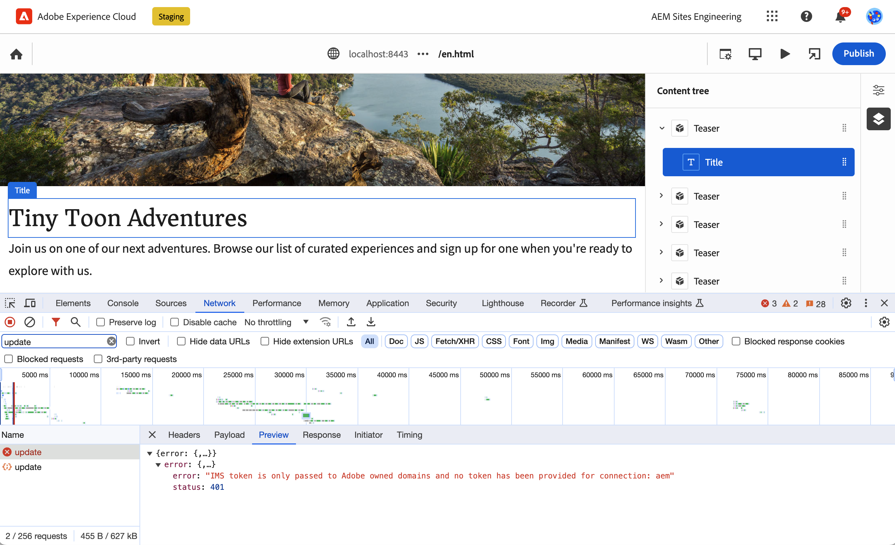

# Présentation d’Universal Editor pour AEM Developers {#developer-overview}

Si vous êtes un développeur AEM intéressé par le fonctionnement d’Universal Editor et son utilisation dans votre projet, ce document vous présente de bout en bout l’utilisation du projet WKND pour travailler avec Universal Editor.

## Objectif {#purpose}

Ce document présente le fonctionnement d’Universal Editor et explique comment utiliser votre application pour l’utiliser.

Pour ce faire, il utilise un exemple standard que la plupart des développeurs AEM connaissent, les composants principaux et le site WKND, et il utilise quelques exemples de composants à modifier à l’aide de l’éditeur universel.

>[!TIP]
>
>Ce document prend des mesures supplémentaires pour illustrer le fonctionnement d’Universal Editor et a pour but d’approfondir la compréhension de l’éditeur par le développeur. Il ne prend donc pas la route la plus directe pour instrumenter une application, mais la plus représentative de l’éditeur universel et de son fonctionnement.
>
>Si vous souhaitez être opérationnel aussi rapidement que possible, consultez le document [Prise en main d’Universal Editor dans AEM](/help/implementing/universal-editor/getting-started.md) .

## Conditions préalables {#prerequisites}

Pour suivre cette présentation, vous devez disposer des éléments suivants.

* [Une instance de développement local d’AEM as a Cloud Service](https://experienceleague.adobe.com/docs/experience-cloud/software-distribution/home.html?lang=fr)
   * Votre instance de développement local doit être [ configurée avec HTTPS à des fins de développement sur `localhost`.](https://experienceleague.adobe.com/docs/experience-manager-learn/foundation/security/use-the-ssl-wizard.html?lang=fr)
   * [Le site de démonstration WKND doit être installé.](https://github.com/adobe/aem-guides-wknd)
* [Accès à l’éditeur universel](/help/implementing/universal-editor/getting-started.md#onboarding)
* [Un service d’éditeur universel local](/help/implementing/universal-editor/local-dev.md) s’exécutant à des fins de développement
   * Veillez à diriger votre navigateur vers [ pour accepter le certificat autosigné des services locaux.](/help/implementing/universal-editor/local-dev.md#editing)

Outre une connaissance générale du développement web, ce document suppose une connaissance élémentaire du développement AEM. Si vous n’avez pas l’expérience du développement AEM, pensez à passer en revue [le tutoriel WKND avant de continuer.](/help/implementing/developing/introduction/develop-wknd-tutorial.md)

## Démarrage d’AEM et connexion à l’éditeur universel {#sign-in}

Si ce n’est déjà fait, votre instance de développement d’AEM locale doit être en cours d’exécution avec WKND installé et HTTPS activé en tant que [, comme indiqué dans les conditions préalables.](#prerequisites) Cet aperçu suppose que votre instance s’exécute à `https://localhost:8443`.

1. Ouvrez le gabarit de langue anglaise WKND principal dans l’éditeur d’AEM.

   ```text
   https://localhost:8443/editor.html/content/wknd/language-masters/en.html
   ```

1. Dans le menu **Informations sur la page** de l’éditeur, sélectionnez **Afficher comme publié(e)**. Cette opération ouvre la même page dans un nouvel onglet, l’éditeur d’AEM étant désactivé.

   ```text
   https://localhost:8443/content/wknd/language-masters/en.html?wcmmode=disabled
   ```

1. Copiez ce lien.

1. Connectez-vous à l’éditeur universel.

   ```text
   https://experience.adobe.com/#/aem/editor
   ```

1. Collez le lien que vous avez copié précédemment du contenu WKND dans le champ **URL du site** de l’éditeur universel et cliquez sur **Ouvrir**.

   

## Universal Editor tente de charger le contenu {#sameorigin}

L’éditeur universel charge le contenu à modifier dans un cadre. AEM paramètres par défaut des options X-Frame l’empêchent, ce qui peut être clairement affiché dans le navigateur comme une erreur et présenté dans la sortie de console lors de la tentative de chargement de votre copie locale de WKND.


L’option X-Frame `sameorigin` empêche le rendu AEM pages dans un cadre. Vous devez supprimer cet en-tête pour permettre le chargement des pages dans Universal Editor.

1. Ouvrez Configuration Manager.

   ```text
   https://localhost:8443/system/console/configMgr
   ```

1. Modification de la configuration OSGi `org.apache.sling.engine.impl.SlingMainServlet`

   

1. Supprimez la propriété `X-Frame-Options=SAMEORIGIN` de la propriété **En-têtes de réponse supplémentaires**.

1. Enregistrez les modifications.

Maintenant, si vous rechargez l’éditeur universel, vous voyez que votre page AEM se charge.

>[!TIP]
>
>* Pour plus d’informations sur cette configuration OSGi, consultez le document [Prise en main d’Universal Editor dans AEM](/help/implementing/universal-editor/getting-started.md#sameorigin) .
>* Consultez le document [Configuration d’OSGi pour Adobe Experience Manager as a Cloud Service](/help/implementing/deploying/configuring-osgi.md) pour plus d’informations sur OSGi dans AEM.

## Gestion des cookies du même site {#samesite-cookies}

Lorsque l’éditeur universel charge votre page, il se charge sur la page de connexion AEM pour s’assurer que vous êtes authentifié pour apporter des modifications.

Cependant, vous ne pouvez pas vous connecter. En affichant la console du navigateur, vous pouvez voir que le navigateur a bloqué l’entrée sur le cadre.


Le cookie de jeton de connexion est envoyé à AEM en tant que domaine tiers. Par conséquent, les cookies du même site doivent être autorisés dans AEM.

1. Ouvrez Configuration Manager.

   ```text
   https://localhost:8443/system/console/configMgr
   ```

1. Modification de la configuration OSGi `com.day.crx.security.token.impl.impl.TokenAuthenticationHandler`

   

1. Remplacez la propriété **Attribut SameSite pour le cookie de jeton de connexion** par `None`.

1. Enregistrez les modifications.

Maintenant, si vous rechargez l’éditeur universel, vous pouvez vous connecter à AEM et votre page cible se charge.

>[!TIP]
>
>* Pour plus d’informations sur cette configuration OSGi, consultez le document [Prise en main d’Universal Editor dans AEM](/help/implementing/universal-editor/getting-started.md#samesite-cookies) .
>* Consultez le document [Configuration d’OSGi pour Adobe Experience Manager as a Cloud Service](/help/implementing/deploying/configuring-osgi.md) pour plus d’informations sur OSGi dans AEM.

## Universal Editor se connecte à l’image distante {#ue-connect-remote-frame}

Une fois la page chargée dans l’éditeur universel et que vous vous êtes connecté à AEM, l’éditeur universel tente de se connecter à l’image distante. Cette opération s’effectue via une bibliothèque JavaScript qui doit être chargée dans l’image distante. Si la bibliothèque JavaScript n’est pas présente, la page crée finalement une erreur de délai d’expiration dans la console.


Vous devez ajouter la bibliothèque JavaScript nécessaire au composant de page de l’application WKND.

1. Ouvrez CRXDE Lite.

   ```text
   https://localhost:8443/crx/de
   ```

1. Sous `/apps/wknd/components/page`, modifiez le fichier `customheaderlibs.html`.

   

1. Ajoutez la bibliothèque JavaScript à la fin du fichier.

   ```html
   <script src="https://universal-editor-service.experiencecloud.live/corslib/LATEST"></script>
   ```

1. Cliquez sur **Enregistrer tout**, puis rechargez l’éditeur universel.

La page se charge désormais avec la bibliothèque JavaScript appropriée pour permettre à l’éditeur universel de se connecter à votre page et l’erreur de délai d’expiration n’apparaît plus dans la console.

>[!TIP]
>
>* La bibliothèque peut être chargée dans l’en-tête ou dans le pied de page.
>* La bibliothèque `universal-editor-embedded.js` [ est disponible sur NPM](https://www.npmjs.com/package/@adobe/universal-editor-cors) et vous pouvez l’héberger vous-même si cela est nécessaire ou le placer directement dans votre application.

## Définition d’une connexion pour la persistance des modifications {#connection}

La page WKND se charge désormais correctement dans l’éditeur universel et la bibliothèque JavaScript se charge pour connecter l’éditeur à votre application.

Cependant, vous avez probablement remarqué que vous ne pouvez pas interagir avec la page dans l’éditeur universel. L’éditeur universel ne peut pas modifier votre page. Pour que l’éditeur universel puisse modifier votre contenu, vous devez définir une connexion afin qu’il sache où écrire le contenu. Pour le développement local, vous devez écrire à votre instance de développement d’AEM locale à l’adresse `https://localhost:8443`.

1. Ouvrez CRXDE Lite.

   ```text
   https://localhost:8443/crx/de
   ```

1. Sous `/apps/wknd/components/page`, modifiez le fichier `customheaderlibs.html`.

   

1. Ajoutez les métadonnées nécessaires pour la connexion à votre instance d’AEM locale à la fin du fichier.

   ```html
   <meta name="urn:adobe:aue:system:aem" content="aem:https://localhost:8443">
   ```

   * La dernière version de la bibliothèque est toujours recommandée. Si vous avez besoin d&#39;une version antérieure, consultez le document [Prise en main d&#39;Universal Editor dans AEM.](/help/implementing/universal-editor/getting-started.md#alternative)

1. Ajoutez les métadonnées nécessaires pour la connexion à votre service Universal Editor local à la fin du fichier.

   ```html
   <meta name="urn:adobe:aue:config:service" content="https://localhost:8000">
   ```

1. Cliquez sur **Enregistrer tout**, puis rechargez l’éditeur universel.

Désormais, l’éditeur universel peut non seulement charger votre contenu avec succès à partir de votre instance de développement d’AEM locale, mais il sait également où conserver les modifications que vous apportez à l’aide de votre service Universal Editor local. Il s’agit de la première étape de l’instrumentalisation de votre application afin qu’elle puisse être modifiée avec l’éditeur universel.

>[!TIP]
>
>* Pour plus d’informations sur les métadonnées de connexion, voir le document [Prise en main de l’éditeur universel dans AEM](/help/implementing/universal-editor/getting-started.md#connection) .
>* Pour plus d’informations sur la structure d’Universal Editor, consultez le document [Universal Editor Architecture](/help/implementing/universal-editor/architecture.md#service) .
>* Pour plus d’informations sur la connexion à une version auto-hébergée de l’éditeur universel, reportez-vous au document [Développement d’AEM local avec l’éditeur universel](/help/implementing/universal-editor/local-dev.md) .

## Instrumentation des composants {#instrumenting-components}

Cependant, vous remarquerez probablement que vous ne pouvez pas faire grand chose avec l’éditeur universel. Si vous tentez de cliquer sur le teaser dans la partie supérieure de la page WKND dans Universal Editor, vous ne pouvez pas le sélectionner réellement (ni rien d’autre sur la page).

Vos composants doivent également être instrumentés pour être modifiables avec l’éditeur universel. Pour ce faire, vous devez modifier le composant de teaser. Par conséquent, vous devez superposer les composants principaux, car les composants principaux sont sous `/libs`, ce qui est inaltérable.

1. Ouvrez CRXDE Lite.

   ```text
   https://localhost:8443/crx/de
   ```

1. Sélectionnez le noeud `/libs/core/wcm/components` et cliquez sur **Noeud de recouvrement** dans la barre d’outils.

1. `/apps/` étant sélectionné comme **Emplacement de recouvrement**, cliquez sur **OK**.

   

1. Sélectionnez le noeud `teaser` sous `/libs/core/wcm/components` et cliquez sur **Copier** dans la barre d’outils.

1. Sélectionnez le noeud superposé à l’emplacement `/apps/core/wcm/components` et cliquez sur **Coller** dans la barre d’outils.

1. Double-cliquez sur le fichier `/apps/core/wcm/components/teaser/v2/teaser/teaser.html` pour le modifier.

   

1. À la fin du premier `div` à environ la ligne 26, ajoutez les détails de l’instrumentation pour le composant.

   ```text
   data-aue-resource="urn:aem:${resource.path}"
   data-aue-type="component"
   data-aue-label="Teaser"
   ```

1. Cliquez sur **Enregistrer tout** dans la barre d’outils et rechargez Universal Editor.

1. Dans l’éditeur universel, cliquez sur le composant de teaser en haut de la page et vérifiez que vous pouvez le sélectionner.

1. Si vous cliquez sur l’icône **Arborescence de contenu** dans le panneau des propriétés de l’éditeur universel, vous pouvez constater que l’éditeur a reconnu tous les teasers sur la page maintenant que vous l’avez instrumenté. Le teaser sélectionné est celui en surbrillance.

   

>[!TIP]
>
>Consultez le document [Utilisation de Sling Resource Merger dans Adobe Experience Manager as a Cloud Service](/help/implementing/developing/introduction/sling-resource-merger.md) pour plus d’informations sur la superposition de noeuds.

## Sous-composants aux instruments du teaser {#subcomponents}

Vous pouvez maintenant sélectionner le teaser, mais pas le modifier. En effet, le teaser est un composite de différents composants, tels que le composant image et titre. Vous devez instrumenter ces sous-composants pour pouvoir les éditer.

1. Ouvrez CRXDE Lite.

   ```text
   https://localhost:8443/crx/de
   ```

1. Sélectionnez le noeud `/apps/core/wcm/components/teaser/v2/teaser/` et double-cliquez sur le fichier `title.html`.

   

1. Insérez les propriétés suivantes à la fin de la balise `h2` (près de la ligne 17).

   ```text
   data-aue-prop="jcr:title"
   data-aue-type="text"
   data-aue-label="Title"
   ```

1. Cliquez sur **Enregistrer tout** dans la barre d’outils et rechargez Universal Editor.

1. Cliquez sur le titre du même composant de teaser en haut de la page et vérifiez que vous pouvez le sélectionner. L’arborescence de contenu affiche également le titre dans le cadre du composant de teaser sélectionné.

   

Vous pouvez maintenant modifier le titre du composant de teaser !

## Qu&#39;est-ce que tout cela signifie ? {#what-does-it-mean}

Maintenant que vous pouvez modifier le titre du teaser, prenons un moment pour passer en revue ce que vous avez accompli et comment.

Vous avez identifié le composant de teaser dans l’éditeur universel en l’instrumentant.

* `data-aue-resource` identifie la ressource dans AEM en cours de modification.
* `data-aue-type` définit que les éléments doivent être traités comme un composant de page (par opposition à un conteneur, par exemple).
* `data-aue-label` affiche un libellé convivial dans l’interface utilisateur pour le teaser sélectionné.

Vous avez également instrumenté le composant Titre dans le composant Teaser.

* `data-aue-prop` est l’attribut JCR qui est écrit.
* `data-aue-type` est la manière dont l’attribut doit être modifié. Dans ce cas, avec l’éditeur de texte, puisqu’il s’agit d’un titre (par opposition à l’éditeur de texte enrichi).

## Définition des en-têtes d’authentification {#auth-header}

Vous pouvez maintenant modifier le titre du teaser en ligne et les modifications sont conservées dans le navigateur.


Toutefois, si vous rechargez le navigateur, le titre précédent est rechargé. En effet, bien que l’éditeur universel sache comment se connecter à votre instance AEM, il ne peut pas encore s’authentifier auprès de votre instance AEM pour écrire les modifications dans le JCR.

Si vous affichez l’onglet réseau des outils de développement du navigateur et recherchez `update`, vous pouvez constater qu’une erreur 401 s’affiche lorsque vous essayez de modifier le titre.



Lors de l’utilisation d’Universal Editor pour modifier votre contenu d’AEM de production, l’éditeur universel utilise le même jeton IMS que celui utilisé pour se connecter à l’éditeur pour s’authentifier auprès d’AEM afin de faciliter l’écriture dans le JCR.

Lorsque vous développez localement, vous ne pouvez pas utiliser le fournisseur d’identité d’AEM, car les jetons IMS ne sont transmis qu’aux domaines détenus par l’Adobe. Vous devez fournir manuellement un moyen de vous authentifier en définissant explicitement un en-tête d’authentification.

1. Dans l’interface d’Universal Editor, cliquez sur l’icône **Authentication Headers** dans la barre d’outils.

1. Copiez l’en-tête d’authentification nécessaire pour vous authentifier sur votre instance d’AEM locale et cliquez sur **Enregistrer**.

   

1. Rechargez Universal Editor et modifiez maintenant le titre du teaser.

Plus aucune erreur n’est signalée dans la console du navigateur et les modifications sont conservées dans votre instance de développement d’AEM locale.

Si vous analysez le trafic dans les outils de développement du navigateur et recherchez les événements `update`, vous pouvez voir le détail de la mise à jour.


```json
{
  "connections": [
    {
      "name": "aem",
      "protocol": "aem",
      "uri": "https://localhost:8443"
    }
  ],
  "target": {
    "resource": "urn:aem:/content/wknd/language-masters/en/jcr:content/root/container/carousel/item_1571954853062",
    "type": "text",
    "prop": "jcr:title"
  },
  "value": "Tiny Toon Adventures"
}
```

* `connections` est la connexion à votre instance AEM locale
* `target` est le noeud et les propriétés exacts mis à jour dans le JCR.
* `value` est la mise à jour que vous avez effectuée.

Vous pouvez voir la modification conservée dans le JCR.


>[!TIP]
>
>De nombreux outils sont disponibles en ligne pour générer les en-têtes d’authentification nécessaires à vos fins de test et de développement.
>
>L’exemple d’en-tête d’authentification de base `Basic YWRtaW46YWRtaW4=` est destiné à la combinaison utilisateur/mot de passe de `admin:admin`, comme c’est le cas pour le développement d’AEM locales.

## instrumentalisation de l’application pour le panneau Propriétés {#properties-rail}

Vous disposez désormais d’une application dont la modification est instrumentée à l’aide d’Universal Editor.

La modification se limite actuellement à la modification en ligne du titre du teaser. Cependant, dans certains cas, la modification statique n’est pas suffisante. Le texte tel que le titre du teaser peut être modifié à l’emplacement où il est avec la saisie du clavier. Toutefois, les éléments plus complexes doivent pouvoir afficher et autoriser la modification de données structurées indépendamment de leur rendu dans le navigateur. Voici à quoi sert le panneau des propriétés.

Pour mettre à jour votre application afin d’utiliser le panneau des propriétés à modifier, revenez au fichier d’en-tête du composant de page de votre application. C’est là que vous avez déjà établi les connexions à votre instance de développement AEM locale et à votre service Universal Editor local. Vous devez définir ici les composants modifiables dans l’application et leurs modèles de données.

1. Ouvrez CRXDE Lite.

   ```text
   https://localhost:8443/crx/de
   ```

1. Sous `/apps/wknd/components/page`, modifiez le fichier `customheaderlibs.html`.

   

1. À la fin du fichier, ajoutez le script nécessaire pour définir les composants.

   ```html
   <script type="application/vnd.adobe.aue.component+json">
   {
     "groups": [
       {
         "title": "General Components",
         "id": "general",
         "components": [
           {
             "title": "Teaser",
             "id": "teaser",
             "plugins": {
               "aem": {
                 "page": {
                   "resourceType": "wknd/components/teaser"
                 }
               }
             }
           },
           {
             "title": "Title",
             "id": "title",
             "plugins": {
               "aem": {
                 "page": {
                   "resourceType": "wknd/components/title"
                 }
               }
             }
           }
         ]
       }
     ]
   }
   </script>
   ```

1. En dessous, à la fin du fichier, ajoutez le script nécessaire pour définir le modèle.

   ```html
   <script type="application/vnd.adobe.aue.model+json">
   [
     {
       "id": "teaser",
       "fields": [
         {
           "component": "text-input",
           "name": "jcr:title",
           "label": "Title",
           "valueType": "string"
         },
         {
           "component": "text-area",
           "name": "jcr:description",
           "label": "Description",
           "valueType": "string"
         }
       ]
     },
     {
       "id": "title",
       "fields": [
         {
           "component": "select",
           "name": "type",
           "value": "h1",
           "label": "Type",
           "valueType": "string",
           "options": [
             { "name": "h1", "value": "h1" },
             { "name": "h2", "value": "h2" },
             { "name": "h3", "value": "h3" },
             { "name": "h4", "value": "h4" },
             { "name": "h5", "value": "h5" },
             { "name": "h6", "value": "h6" }
           ]
         }
       ]
     }
   ]
   </script>
   ```

1. Cliquez sur **Enregistrer tout** dans la barre d’outils.

## Qu&#39;est-ce que tout cela signifie ? {#what-does-it-mean-2}

Pour être modifiable à l’aide du panneau des propriétés, les composants doivent être affectés à `groups`, de sorte que chaque définition commence par une liste de groupes contenant les composants.

* `title` est le nom du groupe.
* `id` est l’identifiant unique du groupe, dans ce cas des composants généraux qui composent le contenu de la page par opposition aux composants avancés pour la mise en page, par exemple.

Chaque groupe possède ensuite un tableau de `components`.

* `title` est le nom du composant.
* `id` est l’identifiant unique du composant, dans ce cas un teaser.

Chaque composant possède ensuite une définition de module externe qui définit la manière dont le composant est mappé à AEM.

* `aem` est le module externe qui gère la modification. Cela peut être considéré comme le service qui traite le composant.
* `page` définit le type de composant, dans ce cas un composant de page standard.
* `resourceType` est le mappage au composant d’AEM réel.

Chaque composant doit ensuite être mappé à un `model` pour définir les champs modifiables individuels.

* `id` est l’identifiant unique du modèle, qui doit correspondre à l’identifiant du composant.
* `fields` est un tableau des champs individuels.
* `component` est le type d’entrée tel que texte ou zone de texte.
* `name` est le nom du champ dans le JCR auquel le champ est mappé.
* `label` est la description du champ qui apparaît dans l’interface utilisateur de l’éditeur.
* `valueType` est le type de données.

## instrumentalisation du composant pour le panneau Propriétés {#properties-rail-component}

Vous devez également définir au niveau du composant, le modèle que le composant doit utiliser.

1. Ouvrez CRXDE Lite.

   ```text
   https://localhost:8443/crx/de
   ```

1. Double-cliquez sur le fichier `/apps/core/wcm/components/teaser/v2/teaser/teaser.html` pour le modifier.

   

1. À la fin du premier `div` à environ la ligne 32, après les propriétés que vous avez ajoutées précédemment, ajoutez les détails de l’instrumentation du modèle que le composant de teaser utilisera.

   ```text
   data-aue-model="teaser"
   ```

1. Cliquez sur **Enregistrer tout** dans la barre d’outils et rechargez Universal Editor.

Vous êtes maintenant prêt à tester le panneau des propriétés composé pour votre composant.

1. Dans Universal Editor, cliquez sur le titre du teaser pour le modifier à nouveau.

1. Cliquez sur le panneau Propriétés pour afficher l’onglet Propriétés et afficher les champs que vous venez d’instrumenter.

   

Vous pouvez maintenant modifier le titre du teaser en ligne comme vous l’aviez fait auparavant ou dans le panneau des propriétés. Dans les deux cas, les modifications sont conservées dans votre instance de développement d’AEM locale.

## Ajouter des champs supplémentaires au panneau Propriétés {#add-fields}

En utilisant la structure de base du modèle de données pour le composant que vous avez déjà mis en oeuvre, vous pouvez ajouter des champs supplémentaires, suivant le même modèle.

Par exemple, vous pouvez ajouter un champ pour ajuster la mise en forme du composant.

1. Ouvrez CRXDE Lite.

   ```text
   https://localhost:8443/crx/de
   ```

1. Sous `/apps/wknd/components/page`, modifiez le fichier `customheaderlibs.html`.

   

1. Dans le script de définition de modèle, ajoutez un élément supplémentaire au tableau `fields` pour le champ de style. N’oubliez pas d’ajouter une virgule après le dernier champ avant d’insérer le nouveau champ.

   ```json
   {
      "component": "select",
      "name": "cq:styleIds",
      "label": "Style",
      "valueType": "string",
        "multi": true,
      "options": [
        {"name": "hero", "value":"1555543212672"},
        {"name": "card", "value":"1605057868937"}
      ]
   }
   ```

1. Cliquez sur **Enregistrer tout** dans la barre d’outils et rechargez Universal Editor.

1. Cliquez sur le titre du teaser pour le modifier à nouveau.

1. Cliquez sur le panneau Propriétés et vérifiez qu’il existe un nouveau champ pour ajuster le style du composant.

   

N’importe quel champ du JCR pour le composant peut être exposé dans l’éditeur universel de cette manière.

## Résumé {#summary}

Félicitations. Vous pouvez désormais utiliser vos propres applications AEM pour travailler avec Universal Editor.

Lorsque vous commencez à instrumenter votre propre application, gardez à l’esprit les étapes de base que vous avez effectuées dans cet exemple.

1. [Configurez votre environnement de développement.](#prerequisites)
   * AEM s’exécutant localement sur HTTPS avec WKND installé
   * Service d’éditeur universel s’exécutant localement sur HTTPS
1. Vous avez mis à jour AEM les paramètres OSGi pour permettre le chargement de son contenu à distance.
   * [`org.apache.sling.engine.impl.SlingMainServlet`](#sameorigin)
   * [`com.day.crx.security.token.impl.impl.Token.AuthenticationHandler`](#samesite-cookies)
1. [Vous avez ajouté la variable ](#ue-connect-remote-frame)
1. [Vous avez défini une connexion pour conserver les modifications dans la variable ](#connection)
   * Vous avez défini une connexion à l’instance de développement d’AEM locale.
   * Vous avez également défini une connexion au service local Universal Editor.
1. [Vous avez instrumenté le composant de teaser.](#instrumenting-components)
1. [Vous avez instrumenté les sous-composants du teaser.](#subcomponents)
1. [Vous avez défini un en-tête d’authentification personnalisé afin que vous puissiez enregistrer les modifications à l’aide de votre service Universal Editor local.](#auth-header)
1. [Vous avez instrumenté l’application pour utiliser le panneau des propriétés.](#properties-rail)
1. [Vous avez instrumenté le composant de teaser pour utiliser le panneau des propriétés.](#properties-rail-component)

Vous pouvez suivre les mêmes étapes pour instrumenter votre propre application en vue de l’utiliser avec Universal Editor. Toutes les propriétés du JCR peuvent être exposées à l’éditeur universel.

## Ressources supplémentaires {#additional-resources}

Consultez les documents suivants pour plus d’informations et de détails sur les fonctionnalités d’Universal Editor.

* Si vous souhaitez être opérationnel aussi rapidement que possible, consultez le document [Prise en main d’Universal Editor dans AEM](/help/implementing/universal-editor/getting-started.md) .
* Pour plus d’informations sur les configurations OSGi nécessaires, consultez le document [Prise en main d’Universal Editor dans AEM](/help/implementing/universal-editor/getting-started.md#sameorigin) .
* Pour plus d’informations sur les métadonnées de connexion, voir le document [Prise en main de l’éditeur universel dans AEM](/help/implementing/universal-editor/getting-started.md#connection) .
* Pour plus d’informations sur la structure d’Universal Editor, consultez le document [Universal Editor Architecture](/help/implementing/universal-editor/architecture.md#service) .
* Pour plus d’informations sur la connexion à une version auto-hébergée de l’éditeur universel, reportez-vous au document [Développement d’AEM local avec l’éditeur universel](/help/implementing/universal-editor/local-dev.md) .
* Consultez le document [Utilisation de Sling Resource Merger dans Adobe Experience Manager as a Cloud Service](/help/implementing/developing/introduction/sling-resource-merger.md) pour plus d’informations sur la superposition de noeuds.

