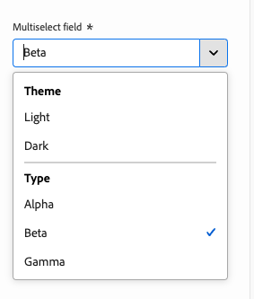
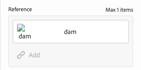
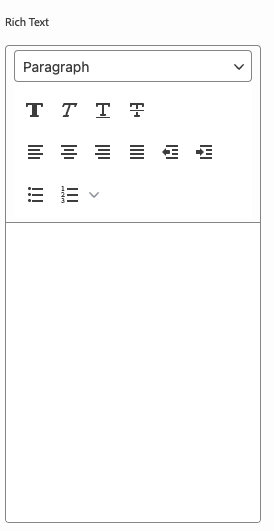

# Définitions de modèles, champs et types de composants {#field-types}

Découvrez les champs et les types de composants que l’éditeur universel peut modifier dans le panneau Propriétés avec des exemples. Découvrez comment vous pouvez instrumenter votre propre application en créant une définition de modèle et en la liant au composant.

## Vue d’ensemble {#overview}

Lorsque vous adaptez vos propres applications pour les utiliser avec l’éditeur universel, vous devez instrumenter les composants et définir les champs et les types de composants qu’ils peuvent manipuler dans le panneau des propriétés de l’éditeur. Pour ce faire, créez un modèle et liez-le à partir du composant.

Ce document présente la définition d’un modèle, ainsi que les champs et les types de composants disponibles, avec des exemples de configuration.

>[!TIP]
>
>Si vous ne savez pas comment utiliser votre application pour l’éditeur universel, consultez le document [Présentation de l’éditeur universel pour AEM développeurs.](/help/implementing/universal-editor/developer-overview.md)

## Structure de la définition de modèle {#model-structure}

Pour configurer un composant via le panneau des propriétés de l’éditeur universel, une définition de modèle doit exister et être liée au composant.

La définition de modèle est une structure JSON, commençant par un tableau de modèles.

```json
[
  {
    "id": "model-id",        // must be unique
    "fields": []             // array of fields which shall be rendered in the properties panel
  }
]
```

Pour plus d’informations sur la définition de votre tableau `fields`, reportez-vous à la section **[Fields](#fields)** de ce document.

Pour utiliser la définition de modèle avec un composant, l’attribut `data-aue-model` peut être utilisé.

```html
<div data-aue-resource="urn:datasource:/content/path" data-aue-type="component"  data-aue-model="model-id">Click me</div>
```

## Chargement d’une définition de modèle {#loading-model}

Une fois créé, un modèle peut être référencé en tant que fichier externe.

```html
<script type="application/vnd.adobe.aue.model+json" src="<url-of-model-definition>"></script>
```

Vous pouvez également définir le modèle intégré.

```html
<script type="application/vnd.adobe.aue.model+json">
  { ... model definition ... }
</script>
```

## Champs {#fields}

Un objet de champ possède la définition de type suivante.

| Configuration | Type de valeur | Description | Requis |
|---|---|---|---|
| `component` | `ComponentType` | Rendu du composant | Oui |
| `name` | `string` | Propriété où les données doivent être conservées | Oui |
| `label` | `FieldLabel` | Libellé du champ | Oui |
| `description` | `FieldDescription` | Description du champ | Non |
| `placeholder` | `string` | Espace réservé pour le champ | Non |
| `value` | `FieldValue` | Valeur par défaut | Non |
| `valueType` | `ValueType` | Validation standard, peut être `string`, `string[]`, `number`, `date`, `boolean` | Non |
| `required` | `boolean` | Le champ est-il obligatoire ? | Non |
| `readOnly` | `boolean` | Le champ est-il en lecture seule ? | Non |
| `hidden` | `boolean` | Le champ est-il masqué par défaut ? | Non |
| `condition` | `RulesLogic` | Règle pour afficher ou masquer le champ en fonction d’une [condition](/help/implementing/universal-editor/customizing.md#conditionally-hide) | Non |
| `multi` | `boolean` | Le champ est-il un champ multiple ? | Non |
| `validation` | `ValidationType` | Règle ou règles de validation du champ | Non |
| `raw` | `unknown` | Données brutes pouvant être utilisées par le composant | Non |

### Types de composants {#component-types}

Vous trouverez ci-dessous les types de composants que vous pouvez utiliser pour les champs de rendu.

| Description | Type de composant |
|---|---|
| [AEM balise](#aem-tag) | `aem-tag` |
| [AEM Contenu](#aem-content) | `aem-content` |
| [Booléen](#boolean) | `boolean` |
| [Groupe de cases à cocher](#checkbox-group) | `checkbox-group` |
| [Conteneur](#container) | `container` |
| [Fragment de contenu](#content-fragment) | `aem-content-fragment` |
| [Date Time](#date-time) | `date-time` |
| [Fragment d’expérience](#experience-fragment) | `aem-experience-fragment` |
| [Multiselect](#multiselect) | `multiselect` |
| [Nombre](#number) | `number` |
| [Groupe de cases d’option](#radio-group) | `radio-group` |
| [Référence](#reference) | `reference` |
| [Texte enrichi](#rich-text) | `richtext` |
| [Select](#select) | `select` |
| [Onglet](#tab) | `tab` |
| [Texte](#text) | `text` |

#### AEM balise {#aem-tag}

Un type de composant de balise AEM active un sélecteur de balise AEM, qui peut être utilisé pour joindre des balises au composant.

>[!BEGINTABS]

>[!TAB Sample]

```json
{
  "id": "aem-tag-picker",
  "fields": [
    {
      "component": "aem-tag",
      "label": "AEM Tag Picker",
      "name": "cq:tags",
      "valueType": "string"
    }
  ]
}
```

>[!TAB Capture d’écran]


>[!ENDTABS]

#### Contenu AEM {#aem-content}

Un type de composant de contenu AEM active un sélecteur de contenu AEM, qui peut être utilisé pour sélectionner n’importe quelle ressource AEM. Contrairement au [composant de référence,](#reference) qui ne peut sélectionner que des ressources, le composant de contenu AEM peut référencer n’importe quel contenu AEM. Il offre un type de validation supplémentaire.

| Type de validation | Type de valeur | Description | Requis |
|---|---|---|---|
| `rootPath` | `string` | Chemin d’accès que le sélecteur de contenu ouvre pour que l’utilisateur puisse sélectionner AEM contenu, en limitant la sélection à ce répertoire et à ces sous-répertoires. | Non |

>[!BEGINTABS]

>[!TAB Sample]

```json
{
  "id": "aem-content-picker",
  "fields": [
    {
      "component": "aem-content",
      "name": "reference",
      "value": "",
      "label": "AEM Content Picker",
      "valueType": "string"
    }
  ]
}
```

>[!TAB Capture d’écran]


>[!ENDTABS]

#### Booléen {#boolean}

Un type de composant booléen stocke une simple valeur true/false rendue en tant que basculement. Il offre un type de validation supplémentaire.

| Type de validation | Type de valeur | Description | Requis |
|---|---|---|---|
| `customErrorMsg` | `string` | Message qui s&#39;affiche si la valeur saisie n&#39;est pas une valeur booléenne | Non |

>[!BEGINTABS]

>[!TAB Exemple 1]

```json
{
  "id": "boolean",
  "fields": [
    {
      "component": "boolean",
      "label": "Boolean",
      "name": "boolean",
      "valueType": "boolean"
    }
  ]
}
```

>[!TAB Exemple 2]

```json
{
  "id": "another-boolean",
  "fields": [
    {
      "component": "boolean",
      "label": "Boolean",
      "name": "boolean",
      "valueType": "boolean",
      "validation": {
        "customErrorMsg": "Think, McFly. Think!"
      }
    }
  ]
}
```

>[!TAB Capture d’écran]


>[!ENDTABS]

#### Groupe de cases à cocher {#checkbox-group}

Tout comme une valeur booléenne, un type de composant de groupe de cases à cocher permet de sélectionner plusieurs éléments true/false, rendus sous la forme de plusieurs cases à cocher.

>[!BEGINTABS]

>[!TAB Sample]

```json
{
  "id": "checkbox-group",
  "fields": [
    {
      "component": "checkbox-group",
      "label": "Checkbox Group",
      "name": "checkbox",
      "valueType": "string[]",
      "options": [
        { "name": "Option 1", "value": "option1" },
        { "name": "Option 2", "value": "option2" }
      ]
    }
  ]
}
```

>[!TAB Capture d’écran]


>[!ENDTABS]

#### Conteneur {#container}

Un type de composant de conteneur permet le regroupement de composants. Il propose une configuration supplémentaire.

| Configuration | Type de valeur | Description | Requis |
|---|---|---|---|
| `collapsible` | `boolean` | Le conteneur est-il réductible ? | Non |

>[!BEGINTABS]

>[!TAB Sample]

```json
 {
  "id": "container",
  "fields": [
    {
      "component": "container",
      "label": "Container",
      "name": "container",
      "valueType": "string",
      "collapsible": true,
      "fields": [
        {
          "component": "text-input",
          "label": "Simple Text 1",
          "name": "text",
          "valueType": "string"
        },
        {
          "component": "text-input",
          "label": "Simple Text 2",
          "name": "text2",
          "valueType": "string"
        }
      ]
    }
  ]
}
```

>[!TAB Capture d’écran]


>[!ENDTABS]

#### Fragment de contenu {#content-fragment}

Le sélecteur de fragment de contenu peut être utilisé pour sélectionner un [fragment de contenu](/help/sites-cloud/authoring/fragments/content-fragments.md) et ses variations (si nécessaire). Il offre une configuration et une validation supplémentaires.

| Configuration | Type de valeur | Description | Requis |
|---|---|---|---|
| `variationName` | `string` | Nom de variable pour stocker la variation sélectionnée. Si non défini, aucun sélecteur de variation n’est affiché. | Non |

| Type de validation | Type de valeur | Description | Requis |
|---|---|---|---|
| `rootPath` | `string` | Chemin d’accès que le sélecteur de contenu ouvre pour que l’utilisateur puisse sélectionner le fragment de contenu, en limitant la sélection à ce répertoire et à ces sous-répertoires. | Non |

>[!NOTE]
>
>L’éditeur universel [ valide les champs de fragment de contenu en fonction de leurs modèles ](/help/assets/content-fragments/content-fragments-models.md#validation), ce qui vous permet d’appliquer des règles d’intégrité des données telles que des modèles d’expression régulière et des contraintes d’unicité.
>
>Cela garantit que votre contenu répond aux besoins spécifiques de l’entreprise avant d’être publié.

>[!BEGINTABS]

>[!TAB Exemple 1]

```json
[
  {
    "id": "aem-content-fragment",
    "fields": [
      {
        "component": "aem-content-fragment",
        "name": "picker",
        "label": "Content Fragment Picker",
        "valueType": "string",
        "variationName": "contentFragmentVariation"
      }
    ]
  }
]
```

>[!TAB Capture d’écran]


>[!ENDTABS]

#### Heure de date {#date-time}

Un type de composant de date et d’heure permet de spécifier une date, une heure ou une combinaison de celles-ci. Il propose des configurations supplémentaires.

| Configuration | Type de valeur | Description | Requis |
|---|---|---|---|
| `displayFormat` | `string` | Format avec lequel afficher la chaîne de date | Oui |
| `valueFormat` | `string` | Format dans lequel stocker la chaîne de date | Oui |

Il propose également un type de validation supplémentaire.

| Type de validation | Type de valeur | Description | Requis |
|---|---|---|---|
| `customErrorMsg` | `string` | Message qui s’affiche si `valueFormat` n’est pas satisfait | Non |

>[!BEGINTABS]

>[!TAB Exemple 1]

```json
{
  "id": "date-time",
  "fields": [
    {
      "component": "date-time",
      "label": "Date & Time",
      "name": "date",
      "valueType": "date"
    }
  ]
}
```

>[!TAB Exemple 2]

```json
{
  "id": "another-date-time",
  "fields": [
    {
      "component": "date-time",
       "valueType": "date-time",
      "name": "field1",
      "label": "Date Time",
      "description": "This is a date time field that stores both date and time.",
      "required": true,
      "placeholder": "YYYY-MM-DD HH:mm:ss",
      "displayFormat": null,
      "valueFormat": null,
      "validation": {
        "customErrorMsg": "Marty! You have to come back with me!"
      }
    },
    {
      "component": "date-time",
      "valueType": "date",
      "name": "field2",
      "label": "Another Date Time",
      "description": "This is another date time field that only stores the date.",
      "required": true,
      "placeholder": "YYYY-MM-DD",
      "displayFormat": null,
      "valueFormat": null,
      "validation": {
        "customErrorMsg": "Back to the future!"
      }
    },
    {
      "component": "date-time",
      "valueType": "time",
      "name": "field3",
      "label": "Yet Another Date Time",
      "description": "This is another date time field that only stores the time.",
      "required": true,
      "placeholder": "HH:mm:ss",
      "displayFormat": null,
      "valueFormat": null,
      "validation": {
        "customErrorMsg": "Great Scott!"
      }
    }
  ]
}
```

>[!TAB Capture d’écran]


>[!ENDTABS]

#### Fragment d’expérience {#experience-fragment}

Le sélecteur de fragment d’expérience peut être utilisé pour sélectionner un [fragment d’expérience](/help/sites-cloud/authoring/fragments/experience-fragments.md) et ses variations (si nécessaire). Il offre une configuration et une validation supplémentaires.

| Configuration | Type de valeur | Description | Requis |
|---|---|---|---|
| `variationName` | `string` | Nom de variable pour stocker la variation sélectionnée. Si non défini, aucun sélecteur de variation n’est affiché. | Non |

| Type de validation | Type de valeur | Description | Requis |
|---|---|---|---|
| `rootPath` | `string` | Chemin d’accès que le sélecteur de contenu ouvre pour que l’utilisateur puisse sélectionner le fragment d’expérience, en limitant la sélection à ce répertoire et à ces sous-répertoires. | Non |

>[!BEGINTABS]

>[!TAB Exemple 1]

```json
[
  {
    "id": "aem-experience-fragment",
    "fields": [
      {
        "component": "aem-experience-fragment",
        "name": "picker",
        "label": "Experience Fragment Picker",
        "valueType": "string",
        "variationName": "experienceFragmentVariation"
      }
    ]
  }
]
```

>[!TAB Capture d’écran]


>[!ENDTABS]


#### Multisélection {#multiselect}

Un type de composant à sélection multiple présente plusieurs éléments à sélectionner dans une liste déroulante, notamment la possibilité de regrouper les éléments sélectionnables.

>[!BEGINTABS]

>[!TAB Exemple 1]

```json
{
  "id": "multiselect",
  "fields": [
    {
      "component": "multiselect",
      "name": "multiselect",
      "label": "Multi Select",
      "valueType": "string",
      "options": [
        { "name": "Option 1", "value": "option1" },
        { "name": "Option 2", "value": "option2" }
      ]
    }
  ]
}
```

>[!TAB Exemple 2]

```json
{
  "id": "multiselect-grouped",
  "fields": [
    {
      "component": "multiselect",
      "name": "property",
      "label": "Multiselect field",
      "valueType": "string",
      "required": true,
      "maxSize": 2,
      "options": [
        {
          "name": "Theme",
          "children": [
            { "name": "Light", "value": "light" },
            { "name": "Dark",  "value": "dark" }
          ]
        },
        {
          "name": "Type",
          "children": [
            { "name": "Alpha", "value": "alpha" },
            { "name": "Beta", "value": "beta" },
            { "name": "Gamma", "value": "gamma" }
          ]
        }
      ]
    }
  ]
}
```

>[!TAB Captures d’écran]




>[!ENDTABS]

#### Nombre {#number}

Un type de composant numérique permet la saisie d’un nombre. Il offre des types de validation supplémentaires.

| Type de validation | Type de valeur | Description | Requis |
|---|---|---|---|
| `numberMin` | `number` | Nombre minimum autorisé | Non |
| `numberMax` | `number` | Nombre maximal autorisé | Non |
| `customErrorMsg` | `string` | Message qui s’affichera si `numberMin` ou `numberMax` n’est pas satisfait | Non |

>[!BEGINTABS]

>[!TAB Exemple 1]

```json
{
  "id": "number",
  "fields": [
    {
      "component": "number",
      "name": "number",
      "label": "Number",
      "valueType": "number",
      "value": 0
    }
  ]
}
```

>[!TAB Exemple 2]

```json
{
  "id": "another-number",
  "fields": [
   {
      "component": "number",
      "valueType": "number",
      "name": "field1",
      "label": "Number Field",
      "description": "This is a number field.",
      "required": true,
      "placeholder": null,
      "validation": {
        "numberMin": 0,
        "numberMax": 88,
        "customErrorMsg": "You also need 1.21 gigawatts."
      }
    }
  ]
}
```

>[!TAB Capture d’écran]


>[!ENDTABS]

#### Groupe de cases d’option {#radio-group}

Un type de composant de groupe de cases d’option permet une sélection mutuellement exclusive de plusieurs options rendues sous la forme d’un groupe semblable à un groupe de cases à cocher.

>[!BEGINTABS]

>[!TAB Sample]

```json
{
  "id": "radio-group",
  "fields": [
    {
      "component": "radio-group",
      "label": "Radio Group",
      "name": "radio",
      "valueType": "string",
      "options": [
        { "name": "Option 1", "value": "option1" },
        { "name": "Option 2", "value": "option2" }
      ]
    }
  ]
}
```

>[!TAB Capture d’écran]


>[!ENDTABS]

#### Référence {#reference}

Un type de composant de référence active un sélecteur de ressources AEM qui peut être utilisé pour sélectionner n’importe quelle ressource AEM à référencer. Contrairement au [composant de contenu AEM,](#aem-content) qui peut sélectionner n’importe quelle ressource AEM, le composant de référence ne peut référencer que des ressources. Il offre un type de validation supplémentaire.

Un type de composant de référence permet une référence à un autre objet de données de l’objet actif.

>[!BEGINTABS]

>[!TAB Sample]

```json
{
  "id": "reference",
  "fields": [
    {
      "component": "reference",
      "label": "Reference",
      "name": "reference",
      "valueType": "string"
    }
  ]
}
```

>[!TAB Capture d’écran]



>[!ENDTABS]

#### Texte enrichi {#rich-text}

Le texte enrichi permet une saisie de texte enrichi multiligne. Il offre des types de validation supplémentaires.

| Type de validation | Type de valeur | Description | Requis |
|---|---|---|---|
| `maxSize` | `number` | Nombre maximal de caractères autorisés | Non |
| `customErrorMsg` | `string` | Message qui s’affiche si `maxSize` est dépassé | Non |

>[!BEGINTABS]

>[!TAB Exemple 1]

```json
{
  "id": "richtext",
  "fields": [
    {
      "component": "richtext",
      "name": "rte",
      "label": "Rich Text",
      "valueType": "string"
    }
  ]
}
```

>[!TAB Exemple 2]

```json
{
  "id": "another-richtext",
  "fields": [
    {
      "component": "richtext",
      "name": "rte",
      "label": "Rich Text",
      "valueType": "string",
      "validation": {
        "maxSize": 1000,
        "customErrorMsg": "That's about as funny as a screen door on a battleship."
      }
    }
  ]
}
```

>[!TAB Capture d’écran]



>[!ENDTABS]

#### Sélectionner {#select}

Un type de composant sélectionné permet de sélectionner une seule option dans une liste d’options prédéfinies d’un menu déroulant.

>[!BEGINTABS]

>[!TAB Sample]

```json
{
  "id": "select",
  "fields": [
    {
      "component": "select",
      "label": "Select",
      "name": "select",
      "valueType": "string",
      "options": [
        { "name": "Option 1", "value": "option1" },
        { "name": "Option 2", "value": "option2" }
      ]
    }
  ]
}
```

>[!TAB Capture d’écran]


>[!ENDTABS]

#### Tabulation {#tab}

Un type de composant Onglets vous permet de regrouper d’autres champs de saisie sur plusieurs onglets afin d’améliorer l’organisation de la mise en page pour les auteurs.

Une définition `tab` peut être considérée comme un séparateur dans le tableau de `fields`. Tout ce qui suit un `tab` est placé sur cet onglet jusqu’à ce qu’un nouvel `tab` soit rencontré, où les éléments suivants seront placés sur le nouvel onglet.

Si vous souhaitez que les éléments apparaissent au-dessus de tous les onglets, ils doivent être définis avant les onglets.

>[!BEGINTABS]

>[!TAB Sample]

```json
{
  "id": "tab",
  "fields": [
    {
      "component": "tab",
      "label": "Tab 1",
      "name": "tab1"
    },
    {
      "component": "text-input",
      "label": "Text 1",
      "name": "text1",
      "valueType": "string"
    },
    {
      "component": "tab",
      "label": "Tab 2",
      "name": "tab2"
    },
    {
      "component": "text-input",
      "label": "Text 2",
      "name": "text2",
      "valueType": "string"
    }
  ]
}
```

>[!TAB Capture d’écran]


>[!ENDTABS]

#### Texte {#text}

Le texte permet une seule ligne de saisie de texte.  Elle comprend des types de validation supplémentaires.

| Type de validation | Type de valeur | Description | Requis |
|---|---|---|---|
| `minLength` | `number` | Nombre minimum de caractères autorisés | Non |
| `maxLength` | `number` | Nombre maximal de caractères autorisés | Non |
| `regExp` | `string` | Expression régulière à laquelle le texte d’entrée doit correspondre | Non |
| `customErrorMsg` | `string` | Message qui s’affichera si `minLength`, `maxLength` et/ou `regExp` sont enfreints | Non |

>[!BEGINTABS]

>[!TAB Exemple 1]

```json
{
  "id": "simpletext",
  "fields": [
    {
      "component": "text",
      "name": "text",
      "label": "Simple Text",
      "valueType": "string"
    }
  ]
}
```

>[!TAB Exemple 2]

```json
{
  "id": "another simpletext",
  "fields": [
    {
      "component": "text",
      "name": "text",
      "label": "Simple Text",
      "valueType": "string",
      "description": "This is a text input with validation.",
      "required": true,
      "validation": {
        "minLength": 1955,
        "maxLength": 1985,
        "regExp": "^foo:.*",
        "customErrorMsg": "Why don't you make like a tree and get outta here?"
      }
    }
  ]
}
```

>[!TAB Capture d’écran]


>[!ENDTABS]
