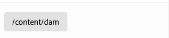
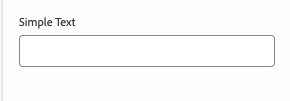

# Définitions de modèles, champs et types de composants {#field-types}

Découvrez les champs et les types de composants que l’éditeur universel peut modifier dans le panneau des propriétés avec des exemples. Découvrez comment instrumenter votre propre application en créant une définition de modèle et en établissant un lien vers le composant .

## Vue d’ensemble {#overview}

Lors de l’adaptation de vos propres applications à utiliser avec l’éditeur universel, vous devez instrumenter les composants et définir les champs et types de composants qu’ils peuvent manipuler dans le panneau Propriétés de l’éditeur. Pour ce faire, créez un modèle et liez-le à partir du composant.

Ce document offre un aperçu d’une définition de modèle et des champs, ainsi que des types de composants disponibles, avec des exemples de configurations.

>[!TIP]
>
>Si vous ne savez pas comment instrumenter votre application pour l’éditeur universel, consultez le document [Présentation de l’éditeur universel pour les développeurs AEM](/help/implementing/universal-editor/developer-overview.md).

## Structure de définition du modèle {#model-structure}

Pour configurer un composant via le panneau Propriétés dans l’éditeur universel, une définition de modèle doit exister et être liée au composant.

La définition du modèle est une structure JSON, commençant par un tableau de modèles .

```json
[
  {
    "id": "model-id",        // must be unique
    "fields": []             // array of fields which shall be rendered in the properties panel
  }
]
```

Voir la section **[Champs](#fields)** de ce document pour plus d’informations sur la définition de votre tableau de `fields`.

Vous pouvez lier un modèle à un composant de deux manières : à l’aide de la [définition de composant](#component-definition) ou [ via l’instrumentation.](#instrumentation)

### Liaison à l’aide de la définition de composant {#component-definition}

Il s’agit de la méthode préférée pour lier le modèle au composant. Cela vous permet de conserver le lien de manière centralisée dans la définition du composant et de faire glisser les composants sur les conteneurs.

Il vous suffit d’inclure la propriété `model` dans l’objet de composant du tableau `components` dans le fichier `component-definition.json`.

Pour plus d’informations, consultez le document [Définition du composant.](/help/implementing/universal-editor/component-definition.md)

### Liaison à l’aide de l’instrumentation {#instrumentation}

Pour utiliser la définition de modèle avec un composant, l’attribut `data-aue-model` peut être utilisé.

```html
<div data-aue-resource="urn:datasource:/content/path" data-aue-type="component"  data-aue-model="model-id">Click me</div>
```

>[!NOTE]
>
>L’éditeur universel vérifie d’abord si un modèle est lié via l’instrumentation et l’utilise avant de vérifier la définition du composant. Cela signifie :
>
>* Les projets qui ont mis en œuvre le lien vers le modèle via l’instrumentation continueront à fonctionner en l’état, sans qu’il soit nécessaire d’apporter des modifications.
>* Si vous définissez le modèle dans la [définition de composant](#component-definition) ainsi que dans l&#39;instrumentation, l&#39;instrumentation sera toujours utilisée.

## Chargement d’une définition de modèle {#loading-model}

Une fois un modèle créé, il peut être référencé en tant que fichier externe.

```html
<script type="application/vnd.adobe.aue.model+json" src="<url-of-model-definition>"></script>
```

Vous pouvez également définir le modèle en ligne.

```html
<script type="application/vnd.adobe.aue.model+json">
  { ... model definition ... }
</script>
```

## Champs {#fields}

Un objet de champ possède la définition de type suivante.

| Configuration | Type de valeur | Description | Requis |
|---|---|---|---|
| `component` | `ComponentType` | Rendu du composant | Oui |
| `name` | `string` | Propriété [ou chemin](#nesting) dans laquelle les données doivent être conservées | Oui |
| `label` | `FieldLabel` | Libellé du champ | Oui |
| `description` | `FieldDescription` | Description du champ | Non |
| `placeholder` | `string` | Espace réservé pour le champ | Non |
| `value` | `FieldValue` | Valeur par défaut | Non |
| `valueType` | `ValueType` | La validation standard peut être `string`, `string[]`, `number`, `date`, `boolean` | Non |
| `required` | `boolean` | Le champ est-il obligatoire ? | Non |
| `readOnly` | `boolean` | Le champ est-il en lecture seule ? | Non |
| `hidden` | `boolean` | Le champ est-il masqué par défaut ? | Non |
| `condition` | `RulesLogic` | Règle d’affichage ou de masquage du champ selon une [condition](/help/implementing/universal-editor/customizing.md#conditionally-hide) | Non |
| `multi` | `boolean` | Le champ est-il un champ multiple <br/>Notez que l’imbrication de conteneurs n’est pas autorisée pour les champs multiples dans le panneau des propriétés | Non |
| `validation` | `ValidationType` | Règle(s) de validation pour le champ | Non |
| `raw` | `unknown` | Données brutes pouvant être utilisées par le composant | Non |

### Nom Champ et imbrication {#nesting}

Le champ `name` peut pointer directement vers une propriété de la ressource active ou, dans le cas des composants dans `cq:Pages`, il peut également utiliser un chemin d’accès vers une propriété imbriquée. Par exemple :

```json
"name": "teaser/image/fileReference"
```

### Types de composant {#component-types}

Vous trouverez ci-dessous les types de composants qui peuvent être utilisés pour le rendu des champs.

| Description | Type de composant |
|---|---|
| [Balise AEM](#aem-tag) | `aem-tag` |
| [Contenu AEM](#aem-content) | `aem-content` |
| [Booléen](#boolean) | `boolean` |
| [Groupe de cases à cocher](#checkbox-group) | `checkbox-group` |
| [Conteneur](#container) | `container` |
| [Fragment de contenu](#content-fragment) | `aem-content-fragment` |
| [Date et heure](#date-time) | `date-time` |
| [Fragment d’expérience](#experience-fragment) | `aem-experience-fragment` |
| [Sélection multiple](#multiselect) | `multiselect` |
| [Nombre](#number) | `number` |
| [Groupe de cases d’option](#radio-group) | `radio-group` |
| [Référence](#reference) | `reference` |
| [Texte enrichi](#rich-text) | `richtext` |
| [ Sélectionner ](#select) | `select` |
| [Tabulation](#tab) | `tab` |
| [Texte](#text) | `text` |

#### AEM Tag {#aem-tag}

Un type de composant de balise AEM active un sélecteur de balises AEM, qui peut être utilisé pour joindre des balises au composant.

>[!BEGINTABS]

>[!TAB Exemple]

```json
{
  "id": "aem-tag-picker",
  "fields": [
    {
      "component": "aem-tag",
      "label": "AEM Tag Picker",
      "name": "cq:tags",
      "valueType": "string"
    }
  ]
}
```

>[!TAB Capture d’écran]


>[!ENDTABS]

>[!TIP]
>
>Consultez le document [Gestion des données de taxonomie](https://www.aem.live/docs/authoring-taxonomy) pour plus d’informations sur l’utilisation de feuilles de calcul afin de gérer les données de taxonomie pour votre projet Edge Delivery Services.

#### Contenu AEM {#aem-content}

Un type de composant de contenu AEM active un sélecteur de contenu AEM, qui peut être utilisé pour sélectionner n’importe quelle ressource AEM. Contrairement au [composant de référence](#reference) qui ne peut sélectionner que des ressources, le composant de contenu AEM peut référencer n’importe quel contenu AEM. Il propose un type de validation supplémentaire.

| Type de validation | Type de valeur | Description | Requis |
|---|---|---|---|
| `rootPath` | `string` | Chemin d’accès que le sélecteur de contenu ouvre pour que l’utilisateur puisse sélectionner le contenu d’AEM, ce qui limite la sélection à ce répertoire et à ses sous-répertoires | Non |

>[!BEGINTABS]

>[!TAB Exemple]

```json
{
  "id": "aem-content-picker",
  "fields": [
    {
      "component": "aem-content",
      "name": "reference",
      "value": "",
      "label": "AEM Content Picker",
      "valueType": "string",
      "validation": {
            "rootPath": "/content/refresh"
        }
    }
  ]
}
```

>[!TAB Capture d’écran]



>[!ENDTABS]

#### Booléen {#boolean}

Un type de composant booléen stocke une valeur true/false simple rendue sous la forme d’un bouton bascule. Il propose un type de validation supplémentaire.

| Type de validation | Type de valeur | Description | Requis |
|---|---|---|---|
| `customErrorMsg` | `string` | Message qui s’affichera si la valeur saisie n’est pas une valeur booléenne | Non |

>[!BEGINTABS]

>[!TAB Exemple 1]

```json
{
  "id": "boolean",
  "fields": [
    {
      "component": "boolean",
      "label": "Boolean",
      "name": "boolean",
      "valueType": "boolean"
    }
  ]
}
```

>[!TAB Exemple 2]

```json
{
  "id": "another-boolean",
  "fields": [
    {
      "component": "boolean",
      "label": "Boolean",
      "name": "boolean",
      "valueType": "boolean",
      "validation": {
        "customErrorMsg": "Think, McFly. Think!"
      }
    }
  ]
}
```

>[!TAB Capture d’écran]


>[!ENDTABS]

#### Groupe de cases à cocher {#checkbox-group}

Semblable à une valeur booléenne, un type de composant de groupe de cases à cocher permet la sélection de plusieurs éléments true/false, rendus sous la forme de plusieurs cases à cocher.

>[!BEGINTABS]

>[!TAB Exemple]

```json
{
  "id": "checkbox-group",
  "fields": [
    {
      "component": "checkbox-group",
      "label": "Checkbox Group",
      "name": "checkbox",
      "valueType": "string[]",
      "options": [
        { "name": "Option 1", "value": "option1" },
        { "name": "Option 2", "value": "option2" }
      ]
    }
  ]
}
```

>[!TAB Capture d’écran]


>[!ENDTABS]

#### Conteneur {#container}

Un type de composant de conteneur permet de regrouper les composants, y compris la prise en charge multichamp. Il propose une configuration supplémentaire. Notez que l’imbrication de conteneurs n’est pas autorisée pour les champs multiples dans le panneau des propriétés

| Configuration | Type de valeur | Description | Requis |
|---|---|---|---|
| `collapsible` | `boolean` | Le conteneur est-il réductible ? | Non |

>[!BEGINTABS]

>[!TAB Exemple]

```json
 {
  "id": "container",
  "fields": [
    {
      "component": "container",
      "label": "Container",
      "name": "container",
      "valueType": "string",
      "collapsible": true,
      "fields": [
        {
          "component": "text-input",
          "label": "Simple Text 1",
          "name": "text",
          "valueType": "string"
        },
        {
          "component": "text-input",
          "label": "Simple Text 2",
          "name": "text2",
          "valueType": "string"
        }
      ]
    }
  ]
}
```

>[!TAB Capture d’écran]


>[!TAB Prise en charge multichamp]

```json
{
  "component": "container",
  "name": "test",
  "label": "Multi Text",
  "multi": true,
  "fields": [
    {
      "component": "reference",
      "name": "image",
      "value": "",
      "label": "Sample Image",
      "valueType": "string"
    },
    {
      "component": "text",
      "name": "alt",
      "value": "",
      "label": "Alt Text",
      "valueType": "string"
    }
  ]
}
```

>[!ENDTABS]


#### Fragment de contenu {#content-fragment}

Le sélecteur de fragment de contenu peut être utilisé pour sélectionner un [fragment de contenu](/help/sites-cloud/authoring/fragments/content-fragments.md) et ses variantes (si nécessaire). Il propose une configuration supplémentaire.

| Configuration | Type de valeur | Description | Requis |
|---|---|---|---|
| `variationName` | `string` | Nom de variable pour stocker la variation sélectionnée. Si elle n’est pas définie, aucun sélecteur de variation ne s’affiche | Non |

Il propose également un type de validation supplémentaire.

| Type de validation | Type de valeur | Description | Requis |
|---|---|---|---|
| `rootPath` | `string` | Chemin d’accès que le sélecteur de contenu ouvre pour que l’utilisateur puisse sélectionner le fragment de contenu, ce qui limite la sélection à ce répertoire et à ses sous-répertoires | Non |

>[!NOTE]
>
>L’éditeur universel [valide les champs de fragment de contenu en fonction de leurs modèles](/help/assets/content-fragments/content-fragments-models.md#validation) ce qui vous permet d’appliquer des règles d’intégrité des données telles que des modèles d’expression régulière et des contraintes d’unicité.
>
>Cela garantit que votre contenu répond aux besoins spécifiques de l’entreprise avant d’être publié.

>[!BEGINTABS]

>[!TAB Exemple 1]

```json
[
  {
    "id": "aem-content-fragment",
    "fields": [
      {
        "component": "aem-content-fragment",
        "name": "picker",
        "label": "Content Fragment Picker",
        "valueType": "string",
        "variationName": "contentFragmentVariation",
        "validation": {
            "rootPath": "/content/refresh"
        }
      }
    ]
  }
]
```

>[!TAB Capture d’écran]


>[!ENDTABS]

#### Date et heure {#date-time}

Un type de composant de date et d’heure permet de spécifier une date, une heure ou une combinaison de celles-ci. Il propose des configurations supplémentaires.

| Configuration | Type de valeur | Description | Requis |
|---|---|---|---|
| `displayFormat` | `string` | Format d’affichage de la chaîne de date | Oui |
| `valueFormat` | `string` | Format de stockage de la chaîne de date | Oui |

Il propose également un type de validation supplémentaire.

| Type de validation | Type de valeur | Description | Requis |
|---|---|---|---|
| `customErrorMsg` | `string` | Message qui s’affichera si `valueFormat` n’est pas satisfait | Non |

>[!BEGINTABS]

>[!TAB Exemple 1]

```json
{
  "id": "date-time",
  "fields": [
    {
      "component": "date-time",
      "label": "Date & Time",
      "name": "date",
      "valueType": "date"
    }
  ]
}
```

>[!TAB Exemple 2]

```json
{
  "id": "another-date-time",
  "fields": [
    {
      "component": "date-time",
       "valueType": "date-time",
      "name": "field1",
      "label": "Date Time",
      "description": "This is a date time field that stores both date and time.",
      "required": true,
      "placeholder": "YYYY-MM-DD HH:mm:ss",
      "displayFormat": null,
      "valueFormat": null,
      "validation": {
        "customErrorMsg": "Marty! You have to come back with me!"
      }
    },
    {
      "component": "date-time",
      "valueType": "date",
      "name": "field2",
      "label": "Another Date Time",
      "description": "This is another date time field that only stores the date.",
      "required": true,
      "placeholder": "YYYY-MM-DD",
      "displayFormat": null,
      "valueFormat": null,
      "validation": {
        "customErrorMsg": "Back to the future!"
      }
    },
    {
      "component": "date-time",
      "valueType": "time",
      "name": "field3",
      "label": "Yet Another Date Time",
      "description": "This is another date time field that only stores the time.",
      "required": true,
      "placeholder": "HH:mm:ss",
      "displayFormat": null,
      "valueFormat": null,
      "validation": {
        "customErrorMsg": "Great Scott!"
      }
    }
  ]
}
```

>[!TAB Capture d’écran]


>[!ENDTABS]

#### Fragment d’expérience {#experience-fragment}

Le sélecteur de fragment d’expérience peut être utilisé pour sélectionner un [fragment d’expérience](/help/sites-cloud/authoring/fragments/experience-fragments.md) et ses variantes (si nécessaire). Il propose une configuration supplémentaire.

| Configuration | Type de valeur | Description | Requis |
|---|---|---|---|
| `variationName` | `string` | Nom de variable pour stocker la variation sélectionnée. Si elle n’est pas définie, aucun sélecteur de variation ne s’affiche | Non |

Il propose également un type de validation supplémentaire.

| Type de validation | Type de valeur | Description | Requis |
|---|---|---|---|
| `rootPath` | `string` | Chemin d’accès que le sélecteur de contenu ouvre pour que l’utilisateur puisse sélectionner le fragment d’expérience, ce qui limite la sélection à ce répertoire et à ses sous-répertoires | Non |

>[!BEGINTABS]

>[!TAB Exemple 1]

```json
[
  {
    "id": "experience-fragment",
    "fields": [
      {
        "component": "aem-experience-fragment",
        "valueType": "string",
        "name": "experience-fragment",
        "label": "experience-fragment",
        "variationName": "experienceFragmentVariation",
        "validation": {
            "rootPath": "/content/refresh"
        }
      }
    ]
  }
]
```

>[!TAB Capture d’écran]


>[!ENDTABS]


#### Sélection multiple {#multiselect}

Un type de composant à sélection multiple présente plusieurs éléments à sélectionner dans une liste déroulante, notamment la possibilité de regrouper les éléments sélectionnables.

>[!BEGINTABS]

>[!TAB Exemple 1]

```json
{
  "id": "multiselect",
  "fields": [
    {
      "component": "multiselect",
      "name": "multiselect",
      "label": "Multi Select",
      "valueType": "string",
      "options": [
        { "name": "Option 1", "value": "option1" },
        { "name": "Option 2", "value": "option2" }
      ]
    }
  ]
}
```

>[!TAB Exemple 2]

```json
{
  "id": "multiselect-grouped",
  "fields": [
    {
      "component": "multiselect",
      "name": "property",
      "label": "Multiselect field",
      "valueType": "string",
      "required": true,
      "maxSize": 2,
      "options": [
        {
          "name": "Theme",
          "children": [
            { "name": "Light", "value": "light" },
            { "name": "Dark",  "value": "dark" }
          ]
        },
        {
          "name": "Type",
          "children": [
            { "name": "Alpha", "value": "alpha" },
            { "name": "Beta", "value": "beta" },
            { "name": "Gamma", "value": "gamma" }
          ]
        }
      ]
    }
  ]
}
```

>[!TAB Captures d’écran]


>[!ENDTABS]

#### Nombre {#number}

Un type de composant numérique permet la saisie d’un nombre. Il propose d’autres types de validation.

| Type de validation | Type de valeur | Description | Requis |
|---|---|---|---|
| `numberMin` | `number` | Nombre minimum autorisé | Non |
| `numberMax` | `number` | Nombre maximum autorisé | Non |
| `customErrorMsg` | `string` | Message qui s’affichera si `numberMin` ou `numberMax` n’est pas atteint | Non |

>[!BEGINTABS]

>[!TAB Exemple 1]

```json
{
  "id": "number",
  "fields": [
    {
      "component": "number",
      "name": "number",
      "label": "Number",
      "valueType": "number",
      "value": 0
    }
  ]
}
```

>[!TAB Exemple 2]

```json
{
  "id": "another-number",
  "fields": [
   {
      "component": "number",
      "valueType": "number",
      "name": "field1",
      "label": "Number Field",
      "description": "This is a number field.",
      "required": true,
      "placeholder": null,
      "validation": {
        "numberMin": 0,
        "numberMax": 88,
        "customErrorMsg": "You also need 1.21 gigawatts."
      }
    }
  ]
}
```

>[!TAB Capture d’écran]


>[!ENDTABS]

#### Groupe de cases d’option {#radio-group}

Un type de composant de groupe de cases d’option permet une sélection mutuellement exclusive parmi plusieurs options rendues sous la forme d’un groupe similaire à un groupe de cases à cocher.

>[!BEGINTABS]

>[!TAB Exemple]

```json
{
  "id": "radio-group",
  "fields": [
    {
      "component": "radio-group",
      "label": "Radio Group",
      "name": "radio",
      "valueType": "string",
      "options": [
        { "name": "Option 1", "value": "option1" },
        { "name": "Option 2", "value": "option2" }
      ]
    }
  ]
}
```

>[!TAB Capture d’écran]


>[!ENDTABS]

#### Référence {#reference}

Un type de composant de référence active un sélecteur de ressources AEM, qui peut être utilisé pour sélectionner n’importe quelle ressource AEM à référencer. Contrairement au composant de contenu AEM [&#128279;](#aem-content), qui peut sélectionner n’importe quelle ressource AEM, le composant de référence ne peut référencer que des ressources. Il propose un type de validation supplémentaire.

Un type de composant de référence permet de faire référence à un autre objet de données de l’objet actif.

>[!BEGINTABS]

>[!TAB Exemple]

```json
{
  "id": "reference",
  "fields": [
    {
      "component": "reference",
      "label": "Reference",
      "name": "reference",
      "valueType": "string"
    }
  ]
}
```

>[!TAB Capture d’écran]


>[!ENDTABS]

#### Texte enrichi {#rich-text}

Le texte enrichi permet une entrée de texte enrichi multiligne.

>[!BEGINTABS]

>[!TAB Exemple 1]

```json
{
  "id": "richtext",
  "fields": [
    {
      "component": "richtext",
      "name": "rte",
      "label": "Rich Text",
      "valueType": "string"
    }
  ]
}
```

>[!TAB Capture d’écran]


>[!ENDTABS]

#### Sélectionner {#select}

Un type de composant de sélection permet de sélectionner une seule option dans une liste d’options prédéfinies dans un menu déroulant.

>[!BEGINTABS]

>[!TAB Exemple]

```json
{
  "id": "select",
  "fields": [
    {
      "component": "select",
      "label": "Select",
      "name": "select",
      "valueType": "string",
      "options": [
        { "name": "Option 1", "value": "option1" },
        { "name": "Option 2", "value": "option2" }
      ]
    }
  ]
}
```

>[!TAB Capture d’écran]


>[!ENDTABS]

#### Tabulation {#tab}

Un type de composant Onglet permet de regrouper d’autres champs de saisie sur plusieurs onglets afin d’améliorer l’organisation de la disposition pour les auteurs.

Une définition de `tab` peut être considérée comme un séparateur dans le tableau des `fields`. Tout ce qui suit un `tab` sera placé sur cet onglet jusqu’à ce qu’un nouvel `tab` soit rencontré, après quoi les éléments suivants seront placés sur le nouvel onglet.

Si vous souhaitez que des éléments apparaissent au-dessus de tous les onglets, ils doivent être définis avant tout onglet.

>[!BEGINTABS]

>[!TAB Exemple]

```json
{
  "id": "tab",
  "fields": [
    {
      "component": "tab",
      "label": "Tab 1",
      "name": "tab1"
    },
    {
      "component": "text-input",
      "label": "Text 1",
      "name": "text1",
      "valueType": "string"
    },
    {
      "component": "tab",
      "label": "Tab 2",
      "name": "tab2"
    },
    {
      "component": "text-input",
      "label": "Text 2",
      "name": "text2",
      "valueType": "string"
    }
  ]
}
```

>[!TAB Capture d’écran]


>[!ENDTABS]

#### Texte {#text}

Le texte permet une seule ligne de saisie de texte.  Elle inclut des types de validation supplémentaires.

| Type de validation | Type de valeur | Description | Requis |
|---|---|---|---|
| `minLength` | `number` | Nombre minimum de caractères autorisés | Non |
| `maxLength` | `number` | Nombre maximal de caractères autorisés | Non |
| `regExp` | `string` | Expression régulière à laquelle le texte saisi doit correspondre | Non |
| `customErrorMsg` | `string` | Message qui s’affiche en cas de violation des règles `minLength`, `maxLength` et/ou `regExp` | Non |

>[!BEGINTABS]

>[!TAB Exemple 1]

```json
{
  "id": "simpletext",
  "fields": [
    {
      "component": "text",
      "name": "text",
      "label": "Simple Text",
      "valueType": "string"
    }
  ]
}
```

>[!TAB Exemple 2]

```json
{
  "id": "another simpletext",
  "fields": [
    {
      "component": "text",
      "name": "text",
      "label": "Simple Text",
      "valueType": "string",
      "valueFormat": "regexp",
      "description": "This is a text input with validation.",
      "required": true,
      "validation": {
        "minLength": 1955,
        "maxLength": 1985,
        "regExp": "^foo:.*",
        "customErrorMsg": "Why don't you make like a tree and get outta here?"
      }
    }
  ]
}
```

>[!TAB Capture d’écran]



>[!ENDTABS]
