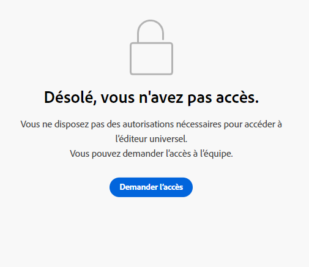

# Prise en main de l’éditeur universel dans AEM {#getting-started}

Découvrez comment accéder à l’éditeur universel et comment commencer à instrumenter votre première application AEM pour l’utiliser.

>[!TIP]
>
>Si vous préférez plonger directement dans un exemple, vous pouvez consulter la section [Exemple d’application de l’éditeur universel sur GitHub.](https://github.com/adobe/universal-editor-sample-editable-app)

## Étapes d’intégration {#onboarding}

Bien que l’éditeur universel puisse modifier du contenu à partir de n’importe quelle source, ce document utilise une application AEM comme exemple.

Il existe plusieurs étapes pour intégrer votre application AEM et l’instrumenter pour utiliser l’éditeur universel.

1. [Demandez l’accès à l’éditeur universel.](#request-access)
1. [Incluez la bibliothèque principale de l’éditeur universel.](#core-library)
1. [Ajoutez la configuration OSGi nécessaire.](#osgi-configurations)
1. [Instrumentez la page.](#instrument-page)

Ce document vous guidera tout au fil de ces étapes.

## Demande d’accès à l’éditeur universel {#request-access}

Vous devez d’abord demander l’accès à l’éditeur universel. Accédez à [https://experience.adobe.com?lang=fr/#/aem/editor](https://experience.adobe.com/#/aem/editor), connectez-vous et vérifiez si vous avez accès à l’éditeur universel.

Si vous n’y avez pas accès, vous pouvez le demander via un formulaire lié sur la même page.



Cliquez sur **Demande d’accès** et remplissez le formulaire selon les instructions pour demander l’accès. Un représentant ou une représentante Adobe examinera votre demande et vous contactera pour discuter de votre cas d’utilisation.

## Inclure la bibliothèque principale de l’éditeur universel {#core-library}

Avant que votre application puisse être instrumentée pour être utilisée avec l’éditeur universel, elle doit inclure la dépendance suivante.

```javascript
@adobe/universal-editor-cors
```

Pour activer l’instrumentation, l’importation suivante doit être ajoutée à votre `index.js`.

```javascript
import "@adobe/universal-editor-cors";
```

### Alternative pour les applications autres que React {#alternative}

Si vous ne mettez pas en œuvre d’application React ou que avez besoin d’un rendu côté serveur, une autre méthode consiste à inclure les éléments suivants dans le corps du document.

```html
<script src="https://cdn.jsdelivr.net/gh/adobe/universal-editor-cors/dist/universal-editor-embedded.js" async></script>
```

## Ajouter les configurations OSGi nécessaires {#osgi-configurations}

Pour pouvoir modifier du contenu AEM avec votre application à l’aide de l’éditeur universel, les paramètres CORS et des cookies doivent être définis dans AEM.

Les [configurations OSGi suivantes doivent être définies sur l’instance de création AEM.](/help/implementing/deploying/configuring-osgi.md)

* `SameSite Cookies = None` dans `com.day.crx.security.token.impl.impl.TokenAuthenticationHandler`
* Supprimez l’en-tête X-FRAME-OPTIONS: SAMEORIGIN dans `org.apache.sling.engine.impl.SlingMainServlet`

### com.day.crx.security.token.impl.impl.TokenAuthenticationHandler {#samesite-cookies}

Le cookie du jeton de connexion doit être envoyé à AEM en tant que domaine tiers. Par conséquent, le cookie du même site doit être défini explicitement sur `None`.

Cette propriété doit être définie dans la configuration OSGi `com.day.crx.security.token.impl.impl.TokenAuthenticationHandler`.

```xml
<?xml version="1.0" encoding="UTF-8"?>
<jcr:root xmlns:sling="http://sling.apache.org/jcr/sling/1.0"
          xmlns:jcr="http://www.jcp.org/jcr/1.0" jcr:primaryType="sling:OsgiConfig"
          token.samesite.cookie.attr="None" />
```

### org.apache.sling.engine.impl.SlingMainServlet {#sameorigin}

X-Frame-Options: SAMEORIGIN empêche le rendu de pages AEM dans un iframe. La suppression de l’en-tête permet de charger les pages.

Cette propriété doit être définie dans la configuration OSGi `org.apache.sling.engine.impl.SlingMainServlet`.

```xml
<?xml version="1.0" encoding="UTF-8"?>
<jcr:root xmlns:sling="http://sling.apache.org/jcr/sling/1.0"
          xmlns:jcr="http://www.jcp.org/jcr/1.0"
          jcr:primaryType="sling:OsgiConfig"
          sling.additional.response.headers="[X-Content-Type-Options=nosniff]"/>
```

## Instrumenter la page {#instrument-page}

Le service de l’éditeur universel requiert un [nom de ressource uniforme (URN)](https://fr.wikipedia.org/wiki/Uniform_Resource_Name) pour identifier et utiliser le système principal approprié pour le contenu de l’application en cours de modification. Par conséquent, un schéma URN est nécessaire pour mapper le contenu aux ressources de contenu.

Les attributs d’instrumentation ajoutés à la page se composent principalement de [Microdonnées de HTML,](https://developer.mozilla.org/fr/docs/Web/HTML/Microdata) une norme du secteur qui peut également être utilisée pour rendre le HTML plus sémantique, rendre les documents de HTML indexables, etc.

### Création de connexions {#connections}

Les connexions utilisées dans l’application sont stockées sous la forme de balises `<meta>` dans la page `<head>`.

```html
<meta name="urn:adobe:aue:<category>:<referenceName>" content="<protocol>:<url>">
```

* `<category>` - Il s’agit d’une classification de la connexion à deux options.
   * `system` - Pour les points de fin de connexion
   * `config` - Pour [définition des paramètres de configuration facultatifs](#configuration-settings)
* `<referenceName>` : il s’agit d’un nom court réutilisé dans le document pour identifier la connexion. Par exemple, `aemconnection`
* `<protocol>` : indique le plug-in de persistance du service de persistance de l’éditeur universel à utiliser. Par ex. `aem`
* `<url>` : il s’agit de l’URL vers le système où les modifications doivent être conservées. Par ex. `http://localhost:4502`

L’identifiant `urn:adobe:aue:system` représente la connexion à l’éditeur universel d’Adobe.

Les `itemid` utilisent le préfixe `urn` pour raccourcir l’identifiant.

```html
itemid="urn:<referenceName>:<resource>"
```

* `<referenceName>` : il s’agit de la référence nommée mentionnée dans la balise `<meta>`. Par ex. `aemconnection`
* `<resource>` : il s’agit d’un pointeur vers la ressource du système cible. Par ex., un chemin de contenu AEM tel que `/content/page/jcr:content`

>[!TIP]
>
>Consultez le document [Attributs et types](attributes-types.md) pour plus d’informations sur les attributs et les types de données requis par l’éditeur universel.

### Exemple de connexion {#example}

```html
<meta name="urn:adobe:aue:system:<referenceName>" content="<protocol>:<url>">

<html>
<head>
    <meta name="urn:adobe:aue:system:aemconnection" content="aem:https://localhost:4502">
    <meta name="urn:adobe:aue:system:fcsconnection" content="fcs:https://example.franklin.adobe.com/345fcdd">
</head>
<body>
        <aside>
          <ul itemscope itemid="urn:aemconnection:/content/example/list" itemtype="container">
            <li itemscope itemid="urn:aemconnection/content/example/listitem" itemtype="component">
              <p itemprop="name" itemtype="text">Jane Doe</p>
              <p itemprop="title" itemtype="text">Journalist</p>
              
            </li>

...

            <li itemscope itemid="urn:fcsconnection:/documents/mytext" itemtype="component">
              <p itemprop="name" itemtype="text">John Smith</p>
              <p itemid="urn:aemconnection/content/example/another-source" itemprop="title" itemtype="text">Photographer</p>
              
            </li>
          </ul>
        </aside>
</body>
</html>
```

### Paramètres de configuration {#configuration-settings}

Vous pouvez utiliser la variable `config` préfixe dans l’URL de votre connexion pour définir les points d’entrée de service et d’extension si nécessaire.

Si vous ne souhaitez pas utiliser le service Universal Editor, qui est hébergé par Adobe, mais votre propre version hébergée, vous pouvez le définir dans une balise META. Pour remplacer le point d’entrée de service par défaut fourni par Universal Editor, définissez votre propre point d’entrée de service :

* Nom de métadonnées - `urn:adobe:aue:config:service`
* Métadonnées - `content="https://adobe.com"` (exemple)

```html
<meta name="urn:adobe:aue:config:service" content="<url>">
```

Si vous souhaitez uniquement que certaines extensions soient activées pour une page, vous pouvez le définir dans une balise meta . Pour récupérer les extensions, définissez les points de fin d’extension :

* Nom du méta : `urn:adobe:aue:config:extensions`
* Métadonnées : `content="https://adobe.com,https://anotherone.com,https://onemore.com"` (exemple)

```html
<meta name="urn:adobe:aue:config:extensions" content="<url>,<url>,<url>">
```

## Vous pouvez désormais utiliser l’éditeur universel. {#youre-ready}

Votre application est désormais instrumentée pour utiliser l’éditeur universel

Reportez-vous à [Création de contenu avec l’éditeur universel](authoring.md) et découvrez à quel point il est facile et intuitif pour les auteurs et autrices de créer du contenu à l’aide de l’éditeur universel.

## Ressources supplémentaires {#additional-resources}

Pour en savoir plus sur l’éditeur universel, consultez ces documents.

* [Présentation de l’éditeur universel](introduction.md) - Découvrez comment l’éditeur universel permet de modifier n’importe quel aspect d’un contenu dans n’importe quelle implémentation afin de fournir des expériences exceptionnelles, d’augmenter la vitesse du contenu et d’offrir une expérience de développement à la pointe de la technologie.
* [Création de contenu avec l’éditeur universel](authoring.md) - Découvrez à quel point il est facile et intuitif pour les créateurs et les créatrices de contenu de créer du contenu à l’aide de l’éditeur universel.
* [Publication de contenu avec l’éditeur universel](publishing.md) - Découvrez comment l’éditeur universel publie du contenu et comment vos applications peuvent gérer le contenu publié.
* [Architecture de l’éditeur universel](architecture.md) - Découvrez l’architecture de l’éditeur universel et le flux de données entre ses services et calques.
* [Attributs et types](attributes-types.md) - Découvrez les attributs et les types de données requis par l’éditeur universel.
* [Authentification de l’éditeur universel](authentication.md) - Découvrez comment l’éditeur universel s’authentifie.
