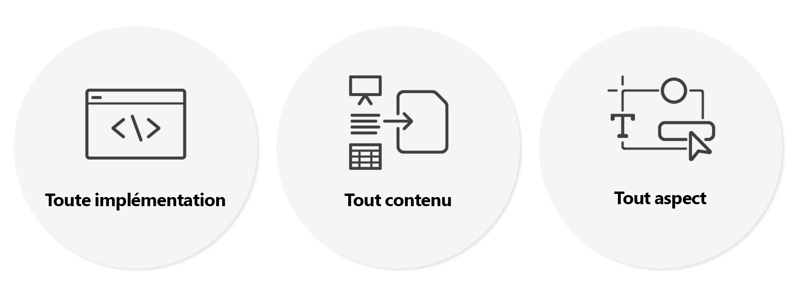

# Présentation de l’éditeur universel {#introduction}

L’éditeur universel est un éditeur visuel polyvalent qui fait partie d’Adobe Experience Manager Sites. Il permet aux auteurs d’effectuer une modification WYSIWYG (ce que vous voyez est ce que vous obtenez) de n’importe quelle expérience couplée ou découplée. Découvrez comment il peut aider les créateurs et les créatrices de contenu à proposer des expériences exceptionnelles et à offrir une liberté inégalée aux développeurs et aux développeuses.

## Arrière-plan {#background}

L’éditeur universel offre une expérience de création contextuelle efficace et intuitive qui nécessite une formation minimale. Grâce à cela, les auteurs peuvent gérer leur contenu directement dans le contexte de l’expérience web, exactement comme il apparaîtra aux visiteurs. En tant que véritable éditeur en tant que service et globalement plus flexible, il a l’intention de remplacer à terme l’éditeur de page.

Les auteurs bénéficient de la flexibilité de l’éditeur universel, car il prend en charge la même modification visuelle cohérente pour toutes les formes de contenu AEM : la modification statique et la composition de mise en page sont possibles de la même manière pour les fragments de contenu et les composants de page. Les deux formes de contenu peuvent même être modifiées lors d’une affichage côte à côte dans une expérience web, sans que les auteurs aient à changer de contexte. Il s’agit d’une amélioration considérable par rapport aux éditeurs précédents d’AEM qui ne prenaient en charge qu’un seul type de contenu.

Les développeurs bénéficient de la polyvalence de l’éditeur universel, car il prend également en charge le véritable découplage de la mise en œuvre. Il permet aux développeurs d’utiliser pratiquement n’importe quel framework ou architecture de leur choix, sans imposer de contraintes de SDK ou de technologie. Cette flexibilité permet même d’instrumenter facilement les applications web existantes pour l’éditeur universel sans avoir à les reconfigurer.

## Vraiment universel {#universal}

L’éditeur universel peut être instrumenté pour n’importe quelle mise en œuvre, pour n’importe quel contenu et pour n’importe quel aspect du contenu.

### N’importe quelle mise en œuvre {#any-implementation}

Comme les expériences peuvent être créées de différentes manières, toute mise en œuvre peut utiliser l’éditeur universel afin que les créateurs et les créatrices puissent effectuer des modifications contextuelles.

Les utilisateurs et les utilisatrices pensent souvent qu’une implémentation découplée limite les créateurs et les créatrices à modifier tout le contenu dans une interface utilisateur de formulaire, mais ce n’est pas le cas avec l’éditeur universel

Les exigences d’une mise en œuvre pour utiliser l’éditeur universel sont très simples et prennent en charge :

* **N’importe quelle architecture** - Rendu côté serveur, rendu côté périphérie, rendu côté client, etc.
* **N’importe quel framework** - AEM Vanilla, ou tout framework tiers comme React, Next.js, Angular, etc.
* **N’importe quel hébergement** - Peut être hébergé localement sur AEM ou sur un domaine distant

### Tout contenu {#any-content}

Un créateur ou une créatrice de contenu doit avoir la même expérience puissante d’édition que celle proposée auparavant par l’éditeur de page d’AEM. Mais l’éditeur universel permet aux créateurs et créatrices de contenu de modifier **tout** contenu visuellement et dans le contexte et prend en charge :

* **Structures de page AEM** - `cq:Components` imbriqués de `cq:Pages`, y compris les fragments d’expérience
* **Fragments de contenu AEM** - Modifiez le contenu des fragments de contenu tels qu’ils apparaissent dans le contexte de l’expérience.
* **Documents** - La démonstration de faisabilité a montré que les documents Word, Excel, Google Docs ou Markdown peuvent également être modifiés de la même manière (travaux en cours).

### N’importe quel aspect {#any-aspect}

Pour un créateur ou une créatrice de contenu, le contenu ne concerne pas seulement les informations contenues, mais aussi leur rendu et leur réception. Le contenu est fourni avec des métadonnées et des règles d’instrumentation supplémentaires, que l’éditeur universel peut comprendre et modifier, notamment :

* **Application de la disposition et du style** - En utilisant un système de style, le professionnel ou la professionnelle du marketing et le créateur ou la créatrice de contenu peuvent appliquer différents styles à leur contenu et créer différentes dispositions pour le contenu, telles que des colonnes, des carrousels, des onglets, des accordéons, etc.

## Valeur {#value}

En découplant l’expérience d’édition de contenu d’un système de diffusion de contenu spécifique, l’éditeur devient véritablement universel et flexible, ce qui permet au créateur ou à la créatrice de contenu de diffuser des expériences exceptionnelles, d’augmenter la vitesse du contenu et de proposer une expérience de développement à la pointe de la technologie.

* **Diffusion d’expériences exceptionnelles** - Afin de permettre aux utilisateurs et aux utilisatrices de créer une expérience attrayante pour les visiteurs et les visiteuses, l’éditeur universel leur permet de créer et de modifier le contenu dans le contexte de l’aperçu. Cela leur permet de créer du contenu adapté à la conception de l’expérience, ce qui constitue un parcours significatif pour les visiteurs et les visiteuses.
* **Augmentation de la vitesse du contenu** - Pour rationaliser le processus de gestion des utilisateurs et des utilisatrices, l’éditeur universel permet de modifier le contenu dans l’aperçu afin de guider les utilisateurs et lesutilisatrices en n’affichant que les options pertinentes pour ce contexte et en rendant le processus indépendant des sources de contenu.
* **Expérience de développement à la pointe de la technologie** - Pour prendre en charge les environnements d’applications hétérogènes réels, l’éditeur universel est complètement découplé et indépendant de la technologie, ce qui permet aux développeurs et aux développeuses d’utiliser leur pile technologique préférée pour mettre en œuvre l’expérience.

## Éditeur universel et éditeur de fragment de contenu {#universal-editor-content-fragment-editor}

À première vue, il peut sembler que l’éditeur universel et l’éditeur de fragment de contenu offrent des fonctionnalités de modification similaires. Toutefois, ces éditeurs proposent des fonctionnalités très différentes et effectuent différents travaux d’un professionnel ou d’une professionnelle du marketing.

### Éditeur de fragment de contenu {#content-fragment-editor}

Un professionnel ou une professionnelle du marketing souhaite créer du contenu sans avoir à se soucier de sa mise en page, de sorte qu’il puisse être réutilisé dans de nombreux contextes d’expérience.

* La tâche sous-jacente à accomplir est de mettre à l’échelle la stratégie de contenu.

### Éditeur universel {#universal-editor}

Un professionnel ou une professionnelle du marketing souhaite créer du contenu adapté à la mise en page d’un contexte donné pour proposer une expérience exceptionnelle.

* La tâche sous-jacente à accomplir est de communiquer de manière convaincante avec les lecteurs.

## Ressources supplémentaires {#additional-resources}

Pour en savoir plus sur l’éditeur universel, consultez ces documents.

* [Création de contenu avec l’éditeur universel](/help/sites-cloud/authoring/universal-editor/authoring.md) - Découvrez à quel point il est facile et intuitif pour les créateurs et les créatrices de contenu de créer du contenu à l’aide de l’éditeur universel.
* [Publication de contenu avec l’éditeur universel](/help/sites-cloud/authoring/universal-editor/publishing.md) - Découvrez comment l’éditeur universel publie du contenu et comment vos applications peuvent gérer le contenu publié.
* [Prise en main de l’éditeur universel dans AEM](getting-started.md) - Découvrez comment accéder à l’éditeur universel et comment commencer à instrumenter votre première application AEM pour l’utiliser.
* [Architecture de l’éditeur universel](architecture.md) - Découvrez l’architecture de l’éditeur universel et le flux de données entre ses services et calques.
* [Attributs et types](attributes-types.md) - Découvrez les attributs et les types de données requis par l’éditeur universel.
* [Authentification de l’éditeur universel](authentication.md) - Découvrez comment l’éditeur universel s’authentifie.

