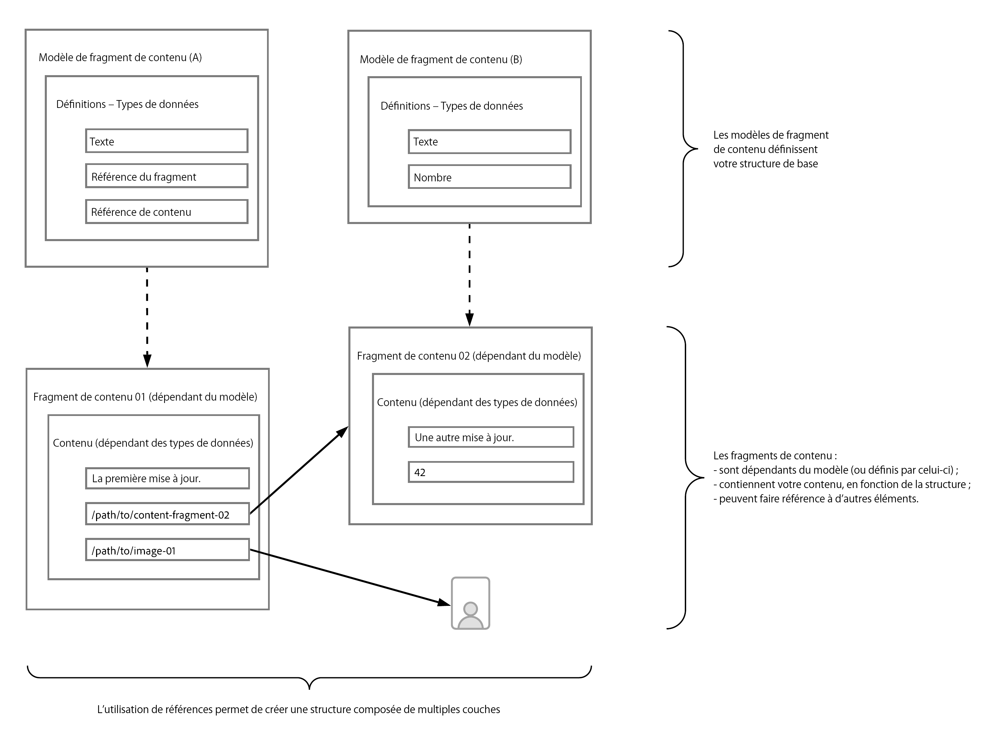

# En savoir plus sur les bases de la modélisation de contenu pour le découplage avec AEM {#content-modeling-headless-basics}

## Un peu d’histoire… {#story-so-far}

Dès le début du [Parcours d’architecture de contenu découplé AEM](overview.md), l’[Introduction](introduction.md) a couvert les concepts de base et la terminologie relatifs à la modélisation du contenu découplé.

Cet article s’appuie sur ces principes afin que vous compreniez comment modéliser votre contenu pour votre projet AEM découplé.

## Objectif {#objective}

* **Audience** : débutant
* **Objectif** : découvrez les concepts de la modélisation de contenu pour un CMS découplé.

## Modélisation de contenu avec des modèles de fragment de contenu {#architect-content-fragment-models}

Contenu (données) La modélisation des données est un ensemble de techniques établies, souvent utilisées lors de bases de données de relations développées. Que signifie la modélisation de contenu pour le découplage AEM ?

### Pourquoi ? {#why}

Pour que votre application puisse demander et recevoir le contenu requis d’AEM de manière cohérente et efficace, ce contenu doit être structuré.

Votre application connaît donc à l’avance la forme de réponse et, donc, comment la traiter. Cette approche est plus simple à traiter que de recevoir du contenu sous forme libre, qui doit être analysé pour déterminer ce qu’il contient et, donc, comment l’utiliser.

### Comment ? {#how}

AEM utilise des fragments de contenu pour fournir les structures nécessaires pour une diffusion en mode découplé de votre contenu vers vos applications.

La structure de votre modèle de contenu possède les caractéristiques suivantes :

* Elle est réalisée par la définition de votre modèle de fragment de contenu,
* Elle est utilisée comme base des fragments de contenu utilisés pour la génération de votre contenu.

>[!NOTE]
>
>Les modèles de fragment de contenu sont également utilisés comme base des schémas GraphQL d’AEM utilisés pour récupérer votre contenu (découvrez-en plus dans le parcours pour les développeurs).

Les demandes de contenu sont effectuées à l’aide de l’API AEM GraphQL, une mise en œuvre personnalisée de l’API GraphQL standard. L’API AEM GraphQL permet aux applications d’effectuer des requêtes (complexes) sur vos fragments de contenu, chaque requête étant conforme à un type de modèle spécifique.

Le contenu renvoyé peut alors être utilisé par vos applications.

## Création de la structure à l’aide de modèles de fragment de contenu {#create-structure-content-fragment-models}

Les modèles de fragment de contenu offrent divers mécanismes qui vous permettent de définir la structure de votre contenu.

Un modèle de fragment de contenu décrit une entité.

>[!NOTE]
>La fonctionnalité de fragment de contenu doit être activée dans l’explorateur de configurations afin que vous puissiez créer des modèles.

>[!TIP]
>
>Le modèle doit être nommé de sorte que l’auteur du contenu sache quel modèle sélectionner lors de la création d’un fragment de contenu.

Dans un modèle :

1. **Types de données** vous permet de définir les attributs individuels.
Par exemple, définissez le champ portant le nom d’un enseignant comme **Texte** et ses années de service comme **Nombre**.
1. Les types de données **Référence de contenu** et **Référence du fragment** permettent de créer des relations avec d’autres contenus dans AEM.
1. Le type de données **Référence du fragment** vous permet de réaliser plusieurs niveaux de structure en imbriquant vos fragments de contenu (en fonction du type de modèle). Ceci est essentiel pour la modélisation de contenu.

Par exemple :

## Types de données {#data-types}

AEM fournit les types de données suivants pour que vous puissiez modéliser votre contenu :

* Une seule ligne de texte
* Plusieurs lignes de texte
* Nombre
* Booléen
* Date et heure
* Énumération
* Balises
* Référence du fragment
* Référence de fragment (UUID)
* Référence de contenu
* Référence de contenu (UUID)
* Objet JSON
* Espace réservé pour tabulation

>[!NOTE]
>
>Pour plus d’informations, reportez-vous à la section Modèles de fragment de contenu – Types de données.

## Références et contenu imbriqué {#references-nested-content}

Deux types de données fournissent des références au contenu en dehors d’un fragment spécifique :

* **Référence de contenu**/**Référence de contenu (UUID)**
Il s’agit d’une référence simple à tout autre contenu de n’importe quel type.
Par exemple, vous pouvez référencer une image à un emplacement spécifié.

* **Référence du fragment**/**Référence du fragment (UUID)**
Cette section fournit des références à d’autres fragments de contenu.
Ce type de référence est utilisé pour créer du contenu imbriqué, présentant les relations nécessaires au modèle de votre contenu.
Le type de données peut être configuré pour permettre aux auteurs de fragments de procéder aux opérations suivantes :
   * Modifier directement le fragment référencé.
   * Créer un fragment de contenu, en fonction du modèle approprié.

>[!NOTE]
>
>Vous pouvez également créer des références ad hoc à l’aide de liens dans des blocs de texte.

>[!NOTE]
>
>Dans l’éditeur, les références UUID spécifient le chemin d’accès à la ressource référencée. En interne, de telles références sont conservées en tant qu’identifiants universels uniques (UUID) qui référencent les ressources.

## Niveaux de structure (fragments imbriqués) {#levels-of-structure-nested-fragments}

Pour la modélisation de contenu, le type de données **Référence de fragment** vous permet de créer plusieurs niveaux de structure et de relations.

Ce référencement vous permet de *connecter* divers modèles de fragment de contenu pour représenter les interrelations. Il permet à l’application découplée de suivre les connexions et d’accéder au contenu si nécessaire.

>[!NOTE]
>
>Cette méthode doit être utilisée avec précaution. Il est recommandé de définir *autant d’imbrication que nécessaire, mais pas plus*.

C’est à ça que servent les références de fragment : elles vous permettent de faire référence à un autre fragment.

Par exemple, les modèles de fragment de contenu suivants peuvent être définis :

* Ville
* Entreprise
* Personne
* Distinctions

Cela semble évident, mais une entreprise compte à la fois un ou une PDG et des employées et employés…Et chaque élément d’entre eux est défini en tant que personne.

Et une personne peut recevoir une distinction (ou peut-être deux).

* Mon entreprise – Société
   * PDG – Personne
   * Employé(s) – Personne
      * Récompense(s) personnelle(s) – Distinction

Voilà pour commencer. En fonction du niveau de complexité, une distinction peut être propre à une entreprise, ou le siège social d’une entreprise peut être situé dans une ville donnée.

En fonction du niveau de complexité, une distinction peut être propre à une entreprise, ou le siège social d’une entreprise peut être situé dans une ville donnée.

## Prochaines étapes {#whats-next}

Maintenant que vous avez appris les principes de base, l’étape suivante consiste à [En savoir plus sur la création de modèles de fragment de contenu dans AEM](model-structure.md). Cette section présente et discute les différentes références disponibles, ainsi que la manière de créer des niveaux de structure à l’aide des références de fragment, un élément clé de la modélisation en mode découplé.

## Ressources supplémentaires {#additional-resources}

* [Modèles de fragment de contenu](/help/sites-cloud/administering/content-fragments/managing-content-fragment-models.md)

   * [Modèles de fragment de contenu – Types de données](/help/sites-cloud/administering/content-fragments/content-fragment-models.md#data-types)

* [Concepts de création](/help/sites-cloud/authoring/author-publish.md)

* [Manipulation de base](/help/sites-cloud/authoring/basic-handling.md) – Cette page est principalement basée sur la console **Sites**, mais de nombreuses ou la plupart des fonctionnalités sont également pertinentes pour la création de **Fragments de contenu** dans la console **Ressources**.

* [Utilisation de fragments de contenu](/help/sites-cloud/administering/content-fragments/overview.md)
