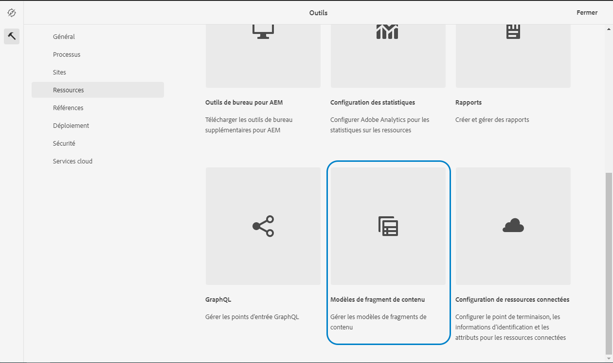

# En savoir plus sur la création de modèles de fragment de contenu dans AEM {#architect-headless-content-fragment-models}

## L&#39;histoire jusqu&#39;à présent {#story-so-far}

Au début du [AEM Parcours de création de contenu sans affichage](overview.md) la valeur [Principes de base de la modélisation de contenu pour sans affichage avec AEM](basics.md) couvrait les concepts de base et la terminologie relatifs à la création pour les sans-tête.

Cet article s’appuie sur ces modèles afin que vous compreniez comment créer vos propres modèles de fragment de contenu pour votre projet AEM sans interface.

## Objectif {#objective}

* **Audience** : débutant
* **Objectif**: les concepts et les mécanismes de modélisation du contenu pour votre CMS sans affichage à l’aide de modèles de fragments de contenu.

<!-- which persona does this? -->
<!-- and who allows the configuration on the folders? -->

<!--
## Enabling Content Fragment Models {#enabling-content-fragment-models}

At the very start you need to enable Content Fragment Models for your site, this is done in the Configuration Browser; under Tools -> General -> Configuration Browser. You can either select to configure the global entry, or create a new configuration. For example:

>[!NOTE]
>
>See Additional Resources - Content Fragments in the Configuration Browser
-->

## Création de modèles de fragment de contenu {#creating-content-fragment-models}

Ensuite, les modèles de fragments de contenu peuvent être créés et la structure définie. Vous pouvez le faire sous Outils -> Ressources -> Modèles de fragment de contenu.

Après avoir sélectionné cette option, vous accédez à l’emplacement de votre modèle et sélectionnez **Créer**. Vous pouvez y saisir différents détails clés.

L’option **Activer le modèle** est activé par défaut. Cela signifie que votre modèle sera disponible pour utilisation (dans la création de fragments de contenu) dès que vous l’aurez enregistré. Vous pouvez la désactiver si vous le souhaitez. Par la suite, vous pourrez activer (ou désactiver) un modèle existant.

Confirmer avec **Créer** et vous pouvez **Ouvrir** votre modèle pour commencer à définir la structure.

## Définition de modèles de fragment de contenu {#defining-content-fragment-models}

Lorsque vous ouvrez un nouveau modèle pour la première fois, vous verrez un grand espace vide à gauche et une longue liste de **Types de données** à droite :

Alors, que faire ?

Vous pouvez faire glisser des instances du **Types de données** sur l’espace gauche - vous définissez déjà votre modèle !

Une fois que vous avez ajouté un type de données, vous devrez définir la variable **Propriétés** pour ce champ. Celles-ci dépendent du type utilisé. Par exemple :

Vous pouvez ajouter autant de champs que nécessaire. Par exemple :

### Vos auteurs de contenu {#your-content-authors}

Les auteurs de contenu ne voient pas les types de données et les propriétés réels que vous avez utilisés pour créer vos modèles. Cela signifie que vous devrez peut-être fournir de l’aide et des informations sur la façon dont ils remplissent des champs spécifiques. Pour obtenir des informations de base, vous pouvez utiliser le libellé du champ et la valeur par défaut, mais il se peut que des cas plus complexes de documentation spécifique au projet doivent être pris en compte.

>[!NOTE]
>
>Voir Ressources supplémentaires – Modèles de fragment de contenu.

## Gestion des modèles de fragment de contenu {#managing-content-fragment-models}

<!-- needs more details -->

La gestion de vos modèles de fragment de contenu implique :

* Activation (ou désactivation) de ces fragments ; ils sont ainsi disponibles pour les auteurs lors de la création de fragments de contenu.
* Suppression : la suppression est toujours nécessaire, mais vous devez savoir supprimer un modèle déjà utilisé pour les fragments de contenu, en particulier les fragments déjà publiés.

## Publication {#publishing}

<!-- needs more details -->

Les modèles de fragment de contenu doivent être publiés avant ou pendant la publication des fragments de contenu dépendants.

>[!NOTE]
>
>Si un auteur tente de publier un fragment de contenu pour lequel le modèle n’a pas encore été publié, une liste de sélection l’indique et le modèle est publié avec le fragment.

Dès qu’un modèle est publié, il est *verrouillé* en mode LECTURE SEULE sur l’auteur. Cela a pour but d’empêcher les modifications qui provoqueraient des erreurs dans les schémas et requêtes GraphQL existants, en particulier dans l’environnement de publication. Il est indiqué dans la console par **Verrouillé**.

Lorsque le modèle est **Verrouillé** (en mode LECTURE SEULE), vous pouvez voir le contenu et la structure des modèles, mais vous ne pouvez pas les modifier directement ; mais vous pouvez gérer **Verrouillé** modèles de la console ou de l’éditeur de modèles.

## Et après ? {#whats-next}

Maintenant que vous en savez plus sur les bases, l’étape suivante consiste à commencer à créer vos propres modèles de fragment de contenu.

## Ressources supplémentaires {#additional-resources}

* [Concepts de création](/help/sites-cloud/authoring/getting-started/concepts.md)

* [Manipulation de base](/help/sites-cloud/authoring/getting-started/basic-handling.md) - cette page est principalement basée sur la variable **Sites** , mais de nombreuses fonctionnalités/la plupart d’entre elles sont également pertinentes pour la navigation et l’exécution d’actions, **Modèles de fragment de contenu** sous le **Ressources** console.

* [Utilisation de fragments de contenu](/help/assets/content-fragments/content-fragments.md)

   * [Modèles de fragment de contenu](/help/assets/content-fragments/content-fragments-models.md)

      * [Définition de votre modèle de fragment de contenu](/help/assets/content-fragments/content-fragments-models.md#defining-your-content-fragment-model)

      * [Activation ou désactivation d’un modèle de fragment de contenu](/help/assets/content-fragments/content-fragments-models.md#enabling-disabling-a-content-fragment-model)

      * [Autorisation de modèles de fragments de contenu dans votre dossier de ressources](/help/assets/content-fragments/content-fragments-models.md#allowing-content-fragment-models-assets-folder)

      * [Suppression d’un modèle de fragment de contenu](/help/assets/content-fragments/content-fragments-models.md#deleting-a-content-fragment-model)

      * [Publication d’un modèle de fragment de contenu](/help/assets/content-fragments/content-fragments-models.md#publishing-a-content-fragment-model)

      * [Annulation de la publication d’un modèle de fragment de contenu](/help/assets/content-fragments/content-fragments-models.md#unpublishing-a-content-fragment-model)

      * [Modèles de fragment de contenu verrouillés (publiés)](/help/assets/content-fragments/content-fragments-models.md#locked-published-content-fragment-models)

* Guides de prise en main

   * [Guide de démarrage rapide sur la création de modèles de fragments de contenu découplés](/help/implementing/developing/headless/getting-started/create-content-model.md)
