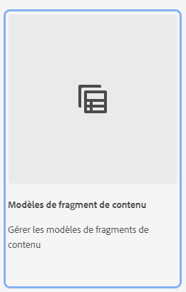

# En savoir plus sur la création de modèles de fragment de contenu dans AEM {#architect-headless-content-fragment-models}

## Un peu d’histoire… {#story-so-far}

Au début du [Parcours de création de contenu découplé AEM](overview.md), la section [Bases de la modélisation de contenu pour le découplage avec AEM](basics.md) présentait les concepts de base et la terminologie relatifs à la création découplée.

Cet article s’appuie sur ces principes afin que vous compreniez comment créer vos propres modèles de fragment de contenu pour votre projet AEM découplé.

## Objectif {#objective}

* **Audience** : débutant
* **Objectif** : les concepts et les mécanismes de la modélisation du contenu pour votre CMS découplé à l’aide de modèles de fragments de contenu.

<!-- which persona does this? -->
<!-- and who allows the configuration on the folders? -->

<!--
## Enabling Content Fragment Models {#enabling-content-fragment-models}

At the very start you need to enable Content Fragment Models for your site, this is done in the Configuration Browser; under Tools > General > Configuration Browser. You can either select to configure the global entry, or create a configuration. For example:

>[!NOTE]
>
>See Additional Resources - Content Fragments in the Configuration Browser
-->

## Création de modèles de fragment de contenu {#creating-content-fragment-models}

Ensuite, les modèles de fragments de contenu peuvent être créés et la structure définie.

1. Dans la console Fragments de contenu, sélectionnez le panneau des modèles de fragment de contenu.

1. Accédez au dossier approprié à votre configuration, ou sous-configuration.

1. Utilisez **Créer** pour ouvrir la boîte de dialogue **Nouveau modèle de fragment de contenu**.

   

1. Compléter les détails

1. Utilisez **Créer** pour enregistrer le modèle vide ou **Créer et ouvrir**.

<!--
Then the Content Fragments Models can be created and the structure defined. This can be done under **Tools** > **General** > **Content Fragment Models**. 

After selecting this you navigate to the location for your model and select **Create**. Here you can enter various key details.

The option **Enable model** is activated by default. This means that your model is available for use (in creating Content Fragments) as soon as you have saved it. You can deactivate this if you want - there are opportunities later to enable (or disable) an existing model.

Confirm with **Create** and you can then **Open** your model to start defining the structure.
-->

## Définition de modèles de fragment de contenu {#defining-content-fragment-models}

Lorsque vous ouvrez un nouveau modèle pour la première fois, vous verrez un grand espace vide à gauche et une longue liste de **Types de données** à droite :

Alors, que faire ?

Vous pouvez faire glisser des instances de **Types de données** dans l’espace gauche, et ainsi commencer à définir votre modèle

Après avoir ajouté un type de données, vous devrez définir les **Propriétés** de ce champ. Ces propriétés dépendent du type utilisé. Par exemple :

Vous pouvez ajouter autant de champs que vous le souhaitez. Par exemple :

### Vos auteurs de contenu {#your-content-authors}

Les auteurs et autrices de contenu ne voient pas les types de données et les propriétés que vous avez utilisés pour créer vos modèles. Cela signifie que vous devrez peut-être fournir de l’aide et des informations sur la façon dont ils doivent remplir des champs spécifiques. Pour fournir des informations de base, vous pouvez utiliser le libellé du champ et la valeur par défaut, mais il se peut qu’une documentation spécifique au projet plus complexe soit nécessaire.

>[!NOTE]
>
>Consultez les Ressources supplémentaires – Modèles de fragment de contenu.

## Gestion des modèles de fragment de contenu {#managing-content-fragment-models}

<!-- needs more details -->

La gestion de vos modèles de fragment de contenu comprend :

* l’activation (ou la désactivation) de ces fragments, ce qui les rend disponibles pour les auteurs lors de la création de fragments de contenu.
* Suppression : la suppression est toujours nécessaire, mais vous devez savoir lorsque vous supprimez un modèle déjà utilisé pour les fragments de contenu, en particulier pour les fragments déjà publiés.

## Publication {#publishing}

<!-- needs more details -->

Les modèles de fragment de contenu doivent être publiés avant ou pendant la publication des fragments de contenu dépendants.

>[!NOTE]
>
>Si un auteur ou une autrice tente de publier un fragment de contenu pour lequel le modèle n’a pas encore été publié, une liste de sélection l’indique, et le modèle est publié avec le fragment.

Dès qu’un modèle est publié, il est *verrouillé* en mode LECTURE SEULE sur l’auteur. Cette fonctionnalité a pour but d’empêcher les modifications qui provoqueraient des erreurs dans les schémas et requêtes GraphQL existants, en particulier dans l’environnement de publication. Ce statut est indiqué dans la console par la mention **Verrouillé**.

Lorsque le modèle est **Verrouillé** (en mode LECTURE SEULE), vous pouvez en voir le contenu et la structure, mais vous ne pouvez pas les modifier directement ; vous pouvez cependant gérer les modèles **Verrouillés** dans la console ou dans l’éditeur de modèles.

## Prochaines étapes {#whats-next}

Maintenant que vous en savez plus sur les bases, l’étape suivante consiste à commencer à créer vos propres modèles de fragment de contenu.

## Ressources supplémentaires {#additional-resources}

* [Concepts de création](/help/sites-cloud/authoring/author-publish.md)

* [Manipulation de base](/help/sites-cloud/authoring/basic-handling.md) : cette page est principalement basée sur la console **Sites**, mais de nombreuses ou la plupart des fonctionnalités sont également pertinentes pour la navigation et l’exécution d’actions sur les **Modèles de fragment de contenu** dans la console **Général**.

* [Utilisation de fragments de contenu](/help/sites-cloud/administering/content-fragments/overview.md)

   * [Modèles de fragment de contenu](/help/sites-cloud/administering/content-fragments/managing-content-fragment-models.md)

      * [Définition de votre modèle de fragment de contenu](/help/sites-cloud/administering/content-fragments/content-fragment-models.md)

      * [Activation ou désactivation d’un modèle de fragment de contenu](/help/sites-cloud/administering/content-fragments/managing-content-fragment-models.md#enabling-disabling-a-content-fragment-model)

      * [Autorisation de modèles de fragments de contenu dans votre dossier de ressources](/help/sites-cloud/administering/content-fragments/managing-content-fragment-models.md#allowing-content-fragment-models-assets-folder)

      * [Suppression d’un modèle de fragment de contenu](/help/sites-cloud/administering/content-fragments/managing-content-fragment-models.md#deleting-a-content-fragment-model)

      * [Publication d’un modèle de fragment de contenu](/help/sites-cloud/administering/content-fragments/managing-content-fragment-models.md#publishing-a-content-fragment-model)

      * [Dépublication d’un modèle de fragment de contenu](/help/sites-cloud/administering/content-fragments/managing-content-fragment-models.md#unpublishing-a-content-fragment-model)

      * [Modèles de fragment de contenu verrouillés](/help/sites-cloud/administering/content-fragments/managing-content-fragment-models.md#locked-content-fragment-models)

* Guides de prise en main

   * [Création d’une configuration découplée de modèles de fragment de contenu](/help/headless/setup/create-content-model.md)
