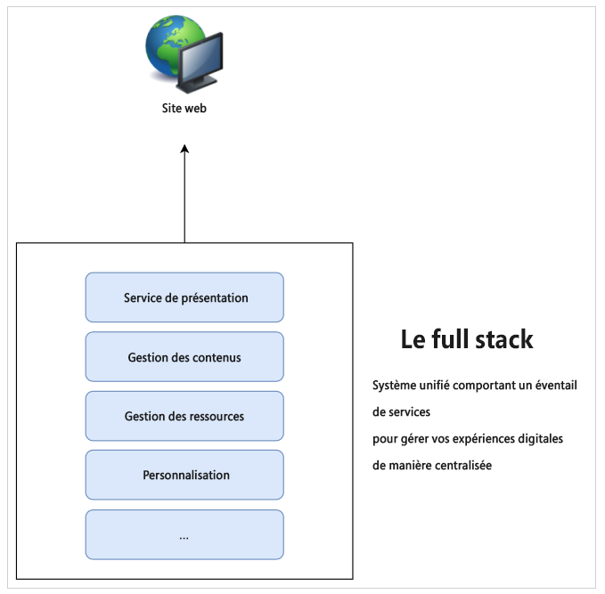
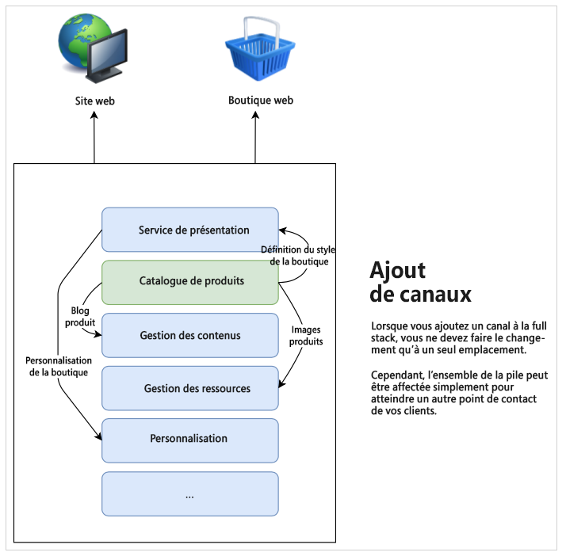
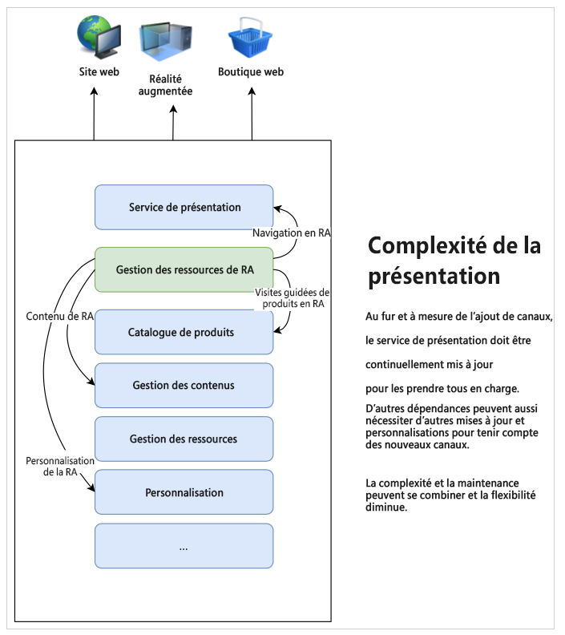
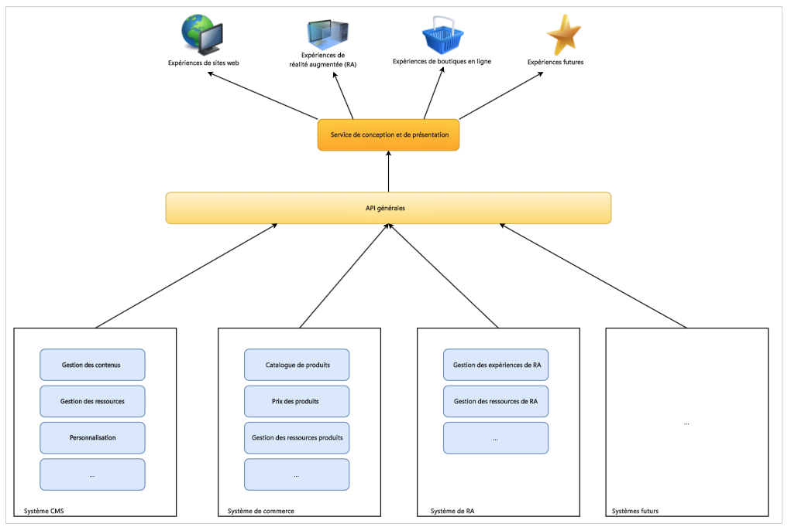

# En savoir plus sur le développement CMS découplé {#learn-about}

Dans cette partie du [parcours de développement AEM Headless](overview.md), découvrez la technologie découplée et pourquoi l’utiliser.

## Objectif {#objective}

Ce document vous aide à comprendre la diffusion de contenu découplé et pourquoi elle doit être utilisée. Après l’avoir lu, vous devriez :

* comprendre les concepts de base et la terminologie de la diffusion de contenus en mode découplé ;
* comprendre pourquoi et quand le mode découplé est nécessaire ;
* savoir de manière plus large comment les concepts de découplage sont utilisés et interagissent.

## Diffusion de contenu full-stack {#full-stack}

Depuis l’émergence des systèmes de gestion de contenu (CMS) à grande échelle et faciles d’utilisation, les organisations les utilisent comme emplacement central pour la gestion des messages, de leur image de marque et de leur communication. L’utilisation d’un CMS comme point central pour administrer les expériences a permis des gains d’efficacité en éliminant la nécessité de dupliquer les tâches dans des systèmes disparates.

Dans un CMS full stack, toutes les fonctionnalités de manipulation de votre contenu se trouvent dans le système. Les fonctionnalités de ce système constituent différents composants de la pile CMS. Une solution full stack présente de nombreux avantages.

* Vous n’avez qu’un seul système à administrer.
* Le contenu est géré de manière centralisée.
* Tous les services du système sont intégrés.
* La création de contenu est transparente.

Ainsi, si vous souhaitez ajouter un nouveau canal ou prendre en charge de nouveaux types d’expériences, vous pouvez insérer un ou plusieurs nouveaux composants dans votre pile et vous n’avez qu’un seul emplacement où apporter les modifications.

La complexité des dépendances au sein de la pile apparaît rapidement, car vous constatez que d’autres éléments peuvent nécessiter des ajustements pour tenir compte des modifications.

## Limites de la diffusion full stack {#limits}

Par nature, l’approche full stack crée un silo où toutes les expériences se retrouvent dans un seul système. Les modifications ou les ajouts à un composant du silo nécessitent d’en modifier d’autres, ce qui peut entraîner des opérations coûteuses et fastidieuses.

C’est particulièrement vrai pour le système de présentation, qui, dans les configurations traditionnelles, est souvent étroitement lié au CMS. Tout nouveau canal entraîne généralement une mise à jour du système de présentation, ce qui peut affecter tous les autres canaux.

Les limites de ce silo naturel peuvent apparaître lorsque vous intervenez davantage pour coordonner les modifications de tous les composants de la pile.

Les utilisateurs attendent un engagement, quels que soient la plateforme ou le point de contact, ce qui nécessite une certaine agilité dans la diffusion de vos expériences. Cette approche multicanal est la référence des expériences digitales et une approche full stack peut, dans certaines circonstances, s’avérer rigide.

## La tête d’un système découplé {#the-head}

La tête de tout système est généralement constituée du moteur de rendu de sortie, généralement sous la forme d’une interface utilisateur graphique ou d’une autre sortie graphique.

Un serveur découplé, par exemple, peut être installé quelque part, dans une baie de salle de serveur, sans moniteur connecté. Pour y accéder, vous devez vous y connecter à distance. Dans ce cas, le moniteur forme la tête s’il se charge du rendu de sortie du serveur. En tant que consommateur du service, vous fournissez votre propre tête (le moniteur) en vous connectant à distance à celui-ci.

Lorsque nous parlons d’un CMS découplé (ou sans tête), il s’agit d’un système de gestion de contenu qui assure la diffusion en continu vers les consommateurs. Cependant, en n’effectuant que la diffusion du **contenu** de manière standardisée, un CMS découplé omet le rendu de sortie final, laissant la **présentation** du contenu au service consommateur.

Les services consommateurs (expériences de réalité augmentée, boutiques Web, expériences mobiles, applications Web progressives (PWA), etc.) récupèrent le contenu du CMS découplé et fournissent leur propre rendu. Ils se chargent de fournir leurs propres têtes à votre contenu.

Omettre la tête (en mode découplé) permet de simplifier le CMS en éliminant sa complexité. Vous pouvez ainsi transférer la responsabilité de rendu du contenu vers les services qui en ont réellement besoin et qui sont souvent mieux adaptés pour cela.

## Découplage {#decoupling}

La diffusion découplée est possible en exposant un ensemble d’interfaces de programmation d’applications (API) robustes et flexibles sur lesquelles toutes vos expériences peuvent s’appuyer. L’API sert de langage commun entre les services, en les liant au niveau du contenu grâce à une diffusion de contenu normalisée, mais en leur permettant de mettre en œuvre leurs propres solutions.

L’absence de tête est un exemple de découplage du contenu et de sa présentation. Dans un sens plus général, il s’agit de découpler les sections frontale (consommateur) et dorsale (gestion de contenu) de votre pile de services. Dans une configuration découplée, le système de présentation (la tête) est découplé de la gestion de contenu (la queue). L’un et l’autre n’interagissent que par le biais d’appels à des API.

Ce découplage signifie que chaque service consommateur (frontal) peut créer son expérience en fonction du même contenu diffusé via les API, ce qui garantit la réutilisation et la cohérence du contenu. Les services de consommation peuvent alors mettre en œuvre leurs propres systèmes de présentation, ce qui permet à la pile de gestion de contenu (système dorsal) de se dimensionner facilement de manière transversale.

## Les fondements technologiques {#technology}

Une approche découplée permet de créer une pile technologique qui peut s’adapter facilement et rapidement aux besoins futurs en matière d’expérience digitale.

Dans le passé, les API pour CMS étaient généralement basées sur REST. L’architecture REST (Representational state transfer) fournit des ressources sous la forme de texte sans état. Ce qui permet de lire et de modifier les ressources moyennant un ensemble d’opérations prédéfini. L’architecture REST a permis une grande interopérabilité entre les services sur le web en assurant une représentation sans état du contenu.

Des API REST robustes restent nécessaires. Toutefois, les requêtes REST peuvent être volumineuses et extrêmement détaillées. Si plusieurs consommateurs effectuent des appels REST pour tous vos canaux, il peut y avoir une incidence sur la diversité des composés et les performances.

La diffusion de contenu en mode découplé s’appuie souvent sur les API GraphQL. GraphQL permet un transfert similaire, sans enregistrement de l’état, mais avec des requêtes plus ciblées, ce qui diminue le nombre total de requêtes requises et améliore les performances. Il est courant de voir les solutions conjuguer REST et GraphQL en choisissant essentiellement le meilleur outil pour la tâche à accomplir.

Quelle que soit l’API choisie, en définissant un système découplé basé sur des API courantes, vous pouvez utiliser le navigateur le plus récent et d’autres technologies web, comme les applications web progressives (PWA). Les API créent une interface standard facilement extensible et adaptable.

En règle générale, le contenu est rendu côté client. Normalement, cela signifie qu’une personne appelle votre contenu sur un appareil mobile, que votre CMS le diffuse, puis que l’appareil mobile (le ou la client(e)) assure le rendu du contenu que vous avez fourni. Si l’appareil est vieux ou lent, votre expérience digitale sera également lente.

Le découplage du contenu et de la présentation permet de mieux contrôler ces problèmes de performances côté client. Le rendu côté serveur (SSR) transfère la responsabilité du rendu du navigateur du client vers le serveur. En tant que fournisseur du contenu, vous pouvez ainsi offrir un niveau de performance garanti à votre audience, si nécessaire.

## Les défis organisationnels {#organization}

Le mode découplé offre toute la flexibilité nécessaire pour proposer vos expériences digitales. Mais cette flexibilité peut également s’accompagner de ses propres défis.

Disposer de nombreuses chaînes différentes signifie qu’elles ont chacune leur propre système de présentation. Même s’ils consomment tous le même contenu par le biais d’API identiques, l’expérience peut varier en raison de présentations différentes. Il faut accorder toute l’attention et le soin nécessaires à assurer la cohérence de l’expérience client.

Il est possible d’assurer des expériences homogènes, ce qui nécessite de les planifier. Pour cela, vous devez mettre en œuvre des systèmes de conception soignés, partager des bibliothèques de modèles et exploiter des composants de conception réutilisables ainsi que des structures (côté client) ouvertes et bien établies.

## L’avenir est dans le mode découplé, et cela commence dès maintenant. {#future}

Les expériences digitales continueront à définir la manière dont les marques interagissent avec les clients. Ce qui est passionnant dans la conception découplée, c’est la flexibilité qu’elle offre pour répondre à l’évolution des attentes des clients.

Il est impossible de prédire l’avenir, mais le mode découplé apporte l’agilité nécessaire pour réagir face à ce que le futur nous apporte.

## AEM et mode découplé {#aem-and-headless}

Au fur et à mesure de ce parcours de développement, vous allez découvrir comment AEM prend en charge la diffusion en mode découplé, mais aussi ses fonctionnalités full stack de diffusion.

En tant que leader du secteur de la gestion de l’expérience digitale, Adobe sait que la solution idéale pour répondre aux défis du monde réel auxquels les créateurs d’expériences sont confrontés est rarement tranchée. AEM ne prend donc pas seulement en charge les deux modèles, mais permet également leur association hybride en toute transparence, alliant ainsi les avantages des modes Découplé et Full stack pour vous aider à mieux diffuser votre contenu vers les consommateurs, où qu’ils se trouvent.

Ce parcours se concentre exclusivement sur le modèle de diffusion de contenu en mode découplé. Cependant, une fois que vous disposez de ces connaissances fondamentales, vous pouvez explorer plus en détail la manière d’exploiter la puissance des deux modèles.

## Prochaines étapes {#what-is-next}

Merci de vous être engagé sur ce parcours découplé AEM ! Maintenant que vous avez lu ce document, vous devriez :

* comprendre les concepts de base et la terminologie de la diffusion de contenus en mode découplé ;
* comprendre pourquoi et quand le mode découplé est nécessaire ;
* savoir de manière plus large comment les concepts de découplage sont utilisés et interagissent.

Appuyez-vous sur ces connaissances et continuez votre parcours découplé AEM en consultant le document [Prise en main d’AEM découplé as a Cloud Service](getting-started.md). Vous y découvrirez comment configurer les outils nécessaires et de quelle manière réfléchir à l’utilisation d’un contenu découplé, ainsi que les conditions préalables qui s’y rapportent.

## Ressources supplémentaires {#additional-resources}

Bien qu’il soit recommandé de passer à la partie suivante du parcours de développement découplé en examinant le document [Prise en main d’AEM Headless as a Cloud Service](getting-started.md), vous trouverez ci-après quelques ressources facultatives supplémentaires pour approfondir un certain nombre de concepts mentionnés dans ce document, mais non obligatoires pour poursuivre le parcours découplé.

* [Présentation de l’architecture d’Adobe Experience Manager as a Cloud Service](/help/overview/architecture.md) – Comprendre la structure d’AEM as a Cloud Service
* Un [Présentation d’AEM en tant que CMS sans affichage](/help/headless/introduction.md)
* La variable [AEM Developer Portal](https://experienceleague.adobe.com/landing/experience-manager/headless/developer.html?lang=fr)
* [Tutoriels sur AEM Headless](https://experienceleague.adobe.com/docs/experience-manager-learn/getting-started-with-aem-headless/overview.html?lang=fr) : ces tutoriels pratiques vous permettront de découvrir comment utiliser, avec AEM, les différentes options de diffusion de contenu vers des points d’entrée en mode découplé et choisir ce qui vous convient.
