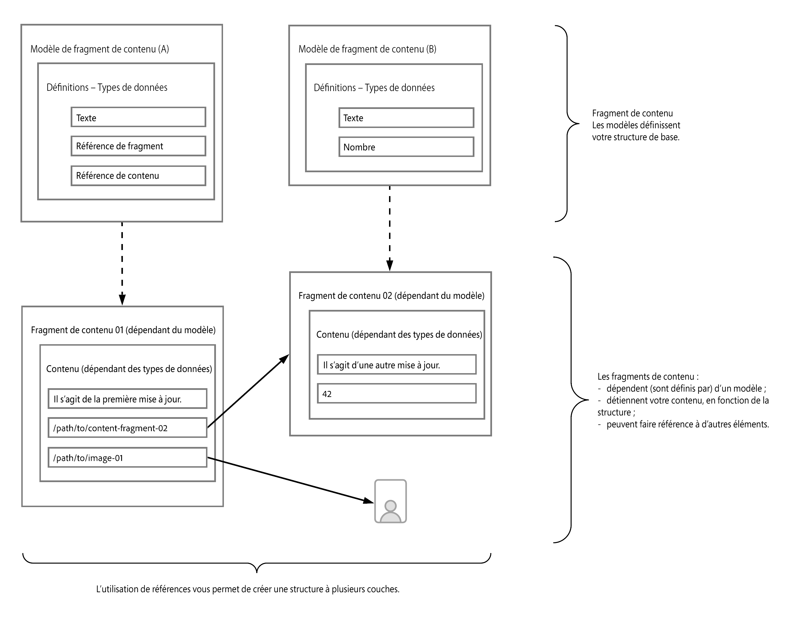
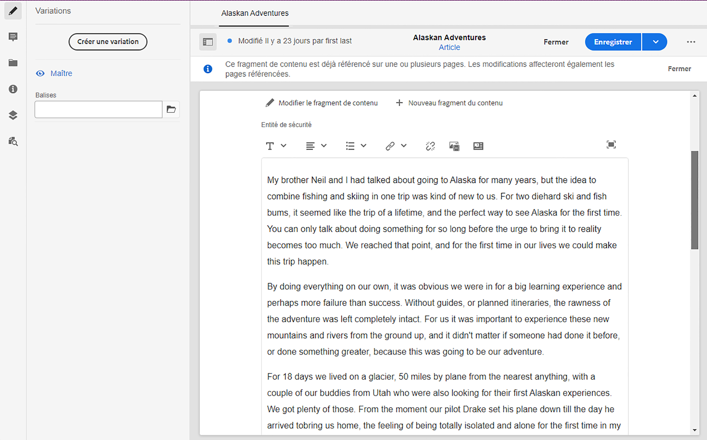

# Comment modéliser votre contenu {#model-your-content}

Dans cette partie du [AEM Parcours développeur sans tête](overview.md), vous apprenez à modéliser votre structure de contenu. Créez ensuite cette structure pour Adobe Experience Manager (AEM) à l’aide des modèles de fragments de contenu et des fragments de contenu, en vue de la réutiliser sur plusieurs canaux.

## Un peu d’histoire...  {#story-so-far}

Au début, [En savoir plus sur le développement CMS sans affichage](learn-about.md) la diffusion de contenu sans interface et la raison de son utilisation. Alors [Prise en main d’AEM sans affichage as a Cloud Service](getting-started.md) décrit AEM sans affichage dans le contexte de votre propre projet.

Dans le document précédent du parcours découplé AEM, [Premiers pas vers votre première expérience d’utilisation du découplage AEM](path-to-first-experience.md), vous avez découvert les étapes nécessaires à la mise en œuvre de votre premier projet. Après l’avoir lu, vous pouvez effectuer les opérations suivantes :

* Comprendre et expliquer les points importants de la planification pour concevoir votre contenu
* Comprenez et expliquez les étapes de mise en oeuvre sans interface utilisateur graphique, en fonction des exigences de niveau d’intégration.
* configurer les outils et les configurations AEM nécessaires ;
* Découvrez les bonnes pratiques afin de fluidifier votre parcours sans interface, de préserver l’efficacité de la génération du contenu et de garantir une diffusion rapide du contenu.

Cet article s’appuie sur ces principes de base pour que vous compreniez comment préparer votre propre projet AEM découplé.

## Objectif {#objective}

* **Audience** : débutant
* **Objectif** : découvrez comment modéliser votre structure de contenu, puis réaliser cette structure à l’aide des modèles de fragment de contenu et des fragments de contenu :
   * Présenter les concepts et la terminologie liés à la modélisation de contenu et de données
   * Apprendre pourquoi la modélisation de contenu est nécessaire pour la diffusion de contenu découplé
   * Découvrir comment réaliser cette structure à l’aide des modèles de fragments de contenu AEM (et créer du contenu avec des fragments de contenu).
   * Découvrir comment modéliser votre contenu ; principes avec des exemples de base.

>[!NOTE]
>
>La modélisation des données est un champ volumineux, car il est utilisé lors du développement de bases de données relationnelles. Il existe de nombreux livres et sources d&#39;information en ligne disponibles.
>
>Ce parcours ne prend en compte que les aspects intéressants lors de la modélisation des données à utiliser avec AEM sans affichage.

## Modélisation de contenu {#content-modeling}

*Le monde extérieur est vaste et malveillant*.

Peut-être, mais peut-être pas. C&#39;est certainement une ***compliqué*** la modélisation des données et de world out-out est utilisée pour définir une représentation simplifiée d’une très (très) petite sous-section, à l’aide des informations spécifiques nécessaires à une certaine fin.

>[!NOTE]
>
>Comme AEM traite du contenu, ce parcours fait référence à la modélisation de données comme étant de la modélisation de contenu.

Par exemple :

Il y a beaucoup d’écoles, mais elles ont toutes différentes choses en commun :

* Une localisation
* Un directeur
* Beaucoup d’enseignants
* De nombreux membres du personnel non enseignant
* Beaucoup d’élèves
* Beaucoup d’anciens enseignants
* Beaucoup d’anciens élèves
* De nombreuses salles de classe
* Beaucoup (beaucoup) de livres
* Beaucoup (beaucoup) d’équipements
* De nombreuses activités extrascolaires
* et ainsi de suite....

Même dans un si petit exemple, la liste peut sembler infinie. Mais si vous ne souhaitez que votre application effectue une tâche simple, limitez les informations aux éléments essentiels.

Par exemple, la publicité relative à des événements spéciaux pour toutes les écoles de la région :

* Le nom de l’école
* L’emplacement de l’école
* Le directeur
* Le type d’événement
* La date de l’événement
* Le professeur organisant l’événement

### Concepts {#concepts}

Ce que vous souhaitez décrire est appelé **Entités** - en gros les &quot;choses&quot; sur lesquelles vous voulez stocker des informations.

Les informations que vous souhaitez stocker à leur sujet sont : **Attributs** (propriétés), telles que le nom et les qualifications pour les enseignants.

Il existe ensuite diverses **relations** entre les entités. Par exemple, en général, une école n’a qu’un seul directeur, et de nombreux enseignants (et généralement le directeur est également enseignant).

Le processus d’analyse et de définition de ces informations, ainsi que les relations entre elles, est appelé **Modélisation de contenu**.

### Concepts de base {#basics}

Souvent, vous devez commencer par créer une **Schéma conceptuel** qui décrit les entités et leurs relations. Il s’agit généralement d’un niveau supérieur (conceptuel).

Une fois ce schéma établi de manière stable, vous pouvez traduire les modèles en **Schéma logique** qui décrit les entités, ainsi que les attributs et les relations. À ce niveau, examinez attentivement les définitions pour éliminer la duplication et optimiser votre conception.

>[!NOTE]
>
>Parfois, ces deux étapes sont fusionnées, souvent en fonction de la complexité de votre scénario.

Par exemple, avez-vous besoin d’entités distinctes pour `Head Teacher` et `Teacher`, ou simplement d’un attribut supplémentaire sur le modèle `Teacher` ?

### Assurer l’intégrité des données {#data-integrity}

L’intégrité des données est nécessaire pour garantir la précision et la cohérence de votre contenu tout au long de son cycle de vie. Cela implique de s’assurer que les auteurs de contenu peuvent facilement comprendre où le stocker, les éléments suivants sont donc essentiels :

* Une structure claire
* Une structure aussi concise que possible (sans sacrifier la précision)
* La validation de champs individuels
* Le cas échéant, limitez le contenu des champs spécifiques au plus important

### Suppression de la redondance de données {#data-redundancy}

La redondance des données se produit lorsque les mêmes informations sont stockées deux fois dans la structure de contenu. Vous devez éviter cette situation, car elle peut prêter à confusion lors de la création du contenu et entraîner des erreurs lors de l’interrogation, outre la mauvaise utilisation de l’espace de stockage.

### Optimisation et performance {#optimization-and-performance}

En optimisant votre structure, vous pouvez améliorer les performances, tant pour la création de contenu que pour l’interrogation.

Tout est un acte d’équilibrage, mais la création d’une structure trop complexe, ou comportant trop de niveaux, peut être déroutante pour les auteurs qui génèrent le contenu. De plus, cela peut affecter considérablement les performances si la requête doit accéder à plusieurs fragments de contenu imbriqués (référencés) pour récupérer le contenu requis.

## Modélisation de contenu pour le découplage AEM {#content-modeling-for-aem-headless}

La modélisation des données est un ensemble de techniques établies, souvent utilisées lors de bases de données de relations développées. Que signifie la modélisation de contenu pour le découplage AEM ?

### Pourquoi ? {#why}

Pour que votre application puisse demander et recevoir le contenu requis d’AEM de manière cohérente et efficace, ce contenu doit être structuré.

Votre application connaît donc à l’avance la forme de réponse et, donc, comment la traiter. Cela est plus facile que de recevoir du contenu de forme libre, qui doit être analysé pour déterminer ce qu’il contient et, par conséquent, comment il peut être utilisé.

### Comment ? {#how}

AEM utilise des fragments de contenu pour fournir les structures nécessaires pour une diffusion en mode découplé de votre contenu vers vos applications.

La structure de votre modèle de contenu possède les caractéristiques suivantes :

* Elle est réalisée par la définition de votre modèle de fragment de contenu,
* Elle est utilisée comme base des fragments de contenu utilisés pour la génération de votre contenu.

>[!NOTE]
>
>Les modèles de fragment de contenu sont également utilisés comme base des schémas GraphQL d’AEM utilisés pour récupérer votre contenu – en savoir plus à ce sujet lors d’une session ultérieure.

Les demandes de contenu sont effectuées à l’aide de l’API AEM GraphQL, une mise en œuvre personnalisée de l’API GraphQL standard. L’API GraphQL d’AEM vous permet d’effectuer des requêtes (complexes) sur vos fragments de contenu, chaque requête étant en fonction d’un type de modèle spécifique.

Le contenu renvoyé peut alors être utilisé par vos applications.

## Création de la structure à l’aide de modèles de fragment de contenu {#create-structure-content-fragment-models}

Les modèles de fragment de contenu offrent divers mécanismes qui vous permettent de définir la structure de votre contenu.

Un modèle de fragment de contenu décrit une entité.

>[!NOTE]
>Vous devez activer la fonctionnalité Fragment de contenu dans l’explorateur de configurations afin de pouvoir créer des modèles.

>[!TIP]
>
>Le modèle doit être nommé de sorte que l’auteur du contenu sache quel modèle sélectionner lors de la création d’un fragment de contenu.

Dans un modèle :

1. **Types de données** vous permet de définir les attributs individuels.
Par exemple, définissez le champ portant le nom d’un enseignant comme **Texte** et ses années de service comme **Nombre**.
1. Les types de données **Référence de contenu** et **Référence du fragment** permettent de créer des relations avec d’autres contenus dans AEM.
1. La variable **Référence de fragment** Le type de données vous permet de réaliser plusieurs niveaux de structure en imbriquant vos fragments de contenu (en fonction du type de modèle). Ceci est essentiel pour la modélisation de contenu.

Par exemple :

### Types de données {#data-types}

AEM fournit les types de données suivants pour que vous puissiez modéliser votre contenu :

* Texte monoligne
* Texte de plusieurs lignes
* Nombre
* Booléen
* Date et heure
* Énumération
* Balises
* Référence de contenu
* Référence du fragment
* Objet JSON

### Références et contenu imbriqué {#references-nested-content}

Deux types de données fournissent des références au contenu en dehors d’un fragment spécifique :

* **Référence de contenu**
Il s’agit d’une référence simple à tout autre contenu de n’importe quel type.
Par exemple, vous pouvez référencer une image à un emplacement spécifié.

* **Référence du fragment**
Cette section fournit des références à d’autres fragments de contenu.
Ce type de référence est utilisé pour créer du contenu imbriqué, présentant les relations nécessaires au modèle de votre contenu.
Le type de données peut être configuré pour permettre aux auteurs de fragments de procéder aux opérations suivantes :
   * Modifier directement le fragment référencé.
   * Créer un fragment de contenu, en fonction du modèle approprié

### Création de modèles de fragment de contenu {#creating-content-fragment-models}

Au début, vous devez activer les modèles de fragment de contenu pour votre site. Cette opération est effectuée dans le navigateur de configuration sous **Outils** > **Général** > **Explorateur de configuration**. Vous pouvez choisir de configurer l’entrée globale ou de créer une configuration. Par exemple :

>[!NOTE]
>
>Voir Ressources supplémentaires – Fragments de contenu dans l’explorateur de configurations

Ensuite, les modèles de fragments de contenu peuvent être créés et la structure définie. Vous pouvez effectuer cette action sous **Outils** -> **Général** -> **Modèles de fragment de contenu**. Par exemple :

>[!NOTE]
>
>Voir Ressources supplémentaires – Modèles de fragment de contenu.

## Utilisation du modèle pour créer du contenu avec des fragments de contenu {#use-content-to-author-content}

Les fragments de contenu sont toujours basés sur un modèle de fragment de contenu. Le modèle fournit la structure, le fragment contient le contenu.

### Sélection du modèle approprié {#select-model}

La première étape pour créer réellement votre contenu consiste à créer un fragment de contenu. Pour ce faire, utilisez Créer -> Fragment de contenu dans le dossier requis sous Ressources -> Fichiers. L’assistant vous guide tout au long des étapes.

Un fragment de contenu est basé sur un modèle de fragment de contenu spécifique que vous sélectionnez comme première étape du processus de création.

### Création et modification de contenu structuré {#create-edit-structured-content}

Une fois votre fragment créé, vous pouvez l’ouvrir dans l’éditeur de fragment de contenu. Vous pouvez effectuer les opérations suivantes :

* Modifiez votre contenu en mode normal ou plein écran.
* Mettez en forme votre contenu en tant que texte intégral, texte brut ou Markdown.
* Créez et gérez des variations de votre contenu.
* Associer le contenu.
* Modifier les métadonnées.
* Afficher l’arborescence.
* Prévisualiser la représentation JSON.

### Création de fragments de contenu {#creating-content-fragments}

Après avoir sélectionné le modèle approprié, un fragment de contenu est ouvert pour modification dans l’éditeur de fragment de contenu :

>[!NOTE]
>
>Voir Ressources supplémentaires – Utilisation de fragments de contenu.

## Prise en main de quelques exemples {#getting-started-examples}

<!--
tbc...
...and/or see the structures covered for the GraphQL samples...
...will those (ever) be delivered as an official sample package?
-->

Pour obtenir une structure de base en tant qu’exemple, voir la section Exemple de structure de fragment de contenu.

## Et après ? {#whats-next}

Maintenant que vous avez appris à modéliser votre structure et à créer du contenu en fonction de cela, l’étape suivante consiste à [Découvrir comment utiliser les requêtes GraphQL pour accéder à votre contenu de fragments de contenu](access-your-content.md) et le récupérer. Cette section présente et parle de GraphQL, puis examine quelques exemples de requêtes pour voir comment les choses fonctionnent dans la pratique.

## Ressources supplémentaires {#additional-resources}

* [Utilisation de fragments de contenu](/help/sites-cloud/administering/content-fragments/overview.md) : page d’introduction pour les fragments de contenu.
   * [Fragments de contenu dans l’explorateur de configurations](/help/sites-cloud/administering/content-fragments/setup.md#enable-content-fragment-functionality-configuration-browser) : activez la fonctionnalité Fragment de contenu dans l’explorateur de configurations.
   * [Modèles de fragment de contenu](/help/sites-cloud/administering/content-fragments/content-fragment-models.md) : création et modification de modèles de fragment de contenu
   * [Gestion des fragments de contenu](/help/sites-cloud/administering/content-fragments/managing.md) - création et création de fragments de contenu ; cette page vous mène à d’autres sections détaillées
* [Schéma AEM GraphQL](access-your-content.md) : méthode de GraphQL pour réaliser les modèles
* [Exemple de structure de fragment de contenu](/help/headless/graphql-api/sample-queries.md#content-fragment-structure-graphql)
* [Prise en main d’AEM découplé](https://experienceleague.adobe.com/docs/experience-manager-learn/getting-started-with-aem-headless/graphql/overview.html?lang=fr) – Une courte série de tutoriels vidéo qui donne un aperçu de l’utilisation des fonctionnalités d’AEM découplé, notamment la modélisation de contenu et GraphQL
   * [Concepts de base de la modélisation GraphQL](https://experienceleague.adobe.com/docs/experience-manager-learn/getting-started-with-aem-headless/graphql/video-series/modeling-basics.html?lang=fr) : découvrez comment définir et utiliser des fragments de contenu dans Adobe Experience Manager (AEM) pour une utilisation avec GraphQL.
