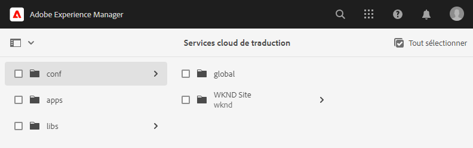

# Configuration du connecteur de traduction {#configure-connector}

Découvrez comment connecter AEM à un service de traduction.

## Un peu d’histoire...  {#story-so-far}

Dans le document précédent du parcours de traduction AEM sans interface utilisateur graphique, [Commencez par AEM traduction sans interface](learn-about.md) vous avez appris à organiser votre contenu sans interface et comment fonctionnent les outils de traduction et vous devez maintenant :

* Comprendre l’importance de la structure de contenu pour la traduction.
* Découvrez comment AEM stocke du contenu sans interface.
* Familiarisez-vous avec AEM outils de traduction.

Cet article s’appuie sur ces principes de base afin que vous puissiez effectuer la première étape de configuration et configurer un service de traduction, que vous utiliserez ultérieurement dans le parcours pour traduire votre contenu.

## Objectif {#objective}

Ce document vous aide à comprendre comment configurer un connecteur AEM pour le service de traduction de votre choix. Après l’avoir lu, vous devriez :

* Découvrez les paramètres importants de la structure d’intégration de traduction dans AEM.
* Vous pouvez configurer votre propre connexion à votre service de traduction.

## Structure de l’intégration de traduction {#tif}

AEM Translation Integration Framework (TIF) s’intègre aux services de traduction tiers pour orchestrer la traduction de contenu AEM. Elle implique trois étapes de base.

1. Connectez-vous à un fournisseur de services de traduction.
1. Créez une configuration de structure d’intégration de traduction.
1. Associez la configuration à votre contenu.

Les sections suivantes décrivent ces étapes de manière plus détaillée.

## Connexion à un fournisseur de services de traduction {#connect-translation-provider}

La première étape consiste à choisir le service de traduction que vous souhaitez utiliser. Il existe de nombreux choix pour les services de traduction humaine et automatique disponibles pour AEM. La plupart des fournisseurs proposent un package de traducteur à installer. Voir la section [Ressources supplémentaires](#additional-resources) pour une sélection d’options disponibles.

>[!NOTE]
>
>Le spécialiste de traduction est généralement chargé de choisir le service de traduction à utiliser, mais l’administrateur est généralement chargé d’installer le package connecteur de traduction requis.

Pour les besoins de ce parcours, nous utilisons le traducteur Microsoft qui AEM fourni une licence d’évaluation prête à l’emploi. Voir la section [Ressources supplémentaires](#additional-resources) pour plus d’informations sur ce fournisseur.

Si vous choisissez un autre fournisseur, votre administrateur doit installer le package connecteur conformément aux instructions fournies par le service de traduction.

>[!NOTE]
>
>L’utilisation de Microsoft Translator prêt à l’emploi dans AEM ne nécessite pas de configuration supplémentaire et fonctionne en l’état sans configuration de connecteur supplémentaire.
>
>Si vous choisissez d’utiliser le connecteur Microsoft Translator à des fins de test, il n’est pas nécessaire d’effectuer les étapes des deux sections suivantes : [Création d’une configuration d’intégration de traduction](#create-config) et [Associer la configuration à votre contenu.](#associate) Il est toutefois conseillé de les lire afin de vous familiariser avec les étapes de configuration du connecteur préféré.
>
>La licence d’évaluation du connecteur Microsoft Translator n’est pas destinée à des fins de production et si vous décidez d’en obtenir la licence, l’administrateur système doit suivre les étapes présentées dans la section [Ressources supplémentaires](#additional-resources) à la fin de ce document pour configurer cette licence.

## Création d’une configuration de l’intégration de traduction {#create-config}

Une fois le package connecteur correspondant au service de traduction préféré installé, vous devez créer une configuration de structure d’intégration de traduction pour ce service. La configuration contient les informations suivantes :

* Le fournisseur de service de traduction à utiliser
* Si une traduction humaine ou automatique doit être réalisée
* Indique s’il faut traduire d’autres contenus associés au fragment de contenu, tels que des balises.

Pour créer une configuration de traduction :

1. Dans le menu de navigation globale, cliquez ou appuyez sur **Outils** -> **Cloud Services** -> **Cloud Services de traduction**.
1. Accédez à l’emplacement où vous souhaitez créer la configuration dans votre structure de contenu. Il est souvent basé sur un projet particulier ou peut être global.
   * Par exemple, dans ce cas, une configuration peut être effectuée globalement pour s’appliquer à tout le contenu ou uniquement au projet WKND.

   

1. Indiquez les informations suivantes dans les champs, puis cliquez ou appuyez sur **Créer**.
   1. Sélectionnez **Type de configuration** dans la liste déroulante. Sélectionnez **Intégration de traduction** dans la liste.
   1. Indiquez un **Titre** pour votre configuration. Le **Titre** identifie la configuration dans la console **Cloud Services** ainsi que dans les listes déroulantes de propriétés de la page.
   1. Éventuellement, saisissez un **Nom** à utiliser pour le nœud du référentiel qui stocke la configuration.

   

1. Appuyez ou cliquez sur **Créer**. La fenêtre **Modifier la configuration** s’affiche, dans laquelle vous pouvez configurer les propriétés de configuration.

1. N’oubliez pas que les fragments de contenu sont stockés en tant que ressources dans AEM. Appuyez ou cliquez sur l’onglet **Ressources** .


1. Fournissez les informations suivantes.

   1. **Méthode de traduction**  : sélectionnez  **Traduction automatique** ou  **traduction** humaine en fonction de votre fournisseur de traduction. Pour les besoins de ce parcours, nous supposons la traduction automatique.
   1. **Fournisseurs de traduction**  : sélectionnez dans la liste le connecteur que vous avez installé pour votre service de traduction.
   1. **Catégorie de contenu**  : sélectionnez la catégorie la plus appropriée pour mieux cibler la traduction (uniquement pour la traduction automatique).
   1. **Traduire les ressources de fragments de contenu**  : cochez cette option pour traduire les ressources associées aux fragments de contenu.
   1. **Traduire les ressources**  : cochez cette option pour traduire les ressources.
   1. **Traduire les métadonnées**  : cochez cette option pour traduire les métadonnées des ressources.
   1. **Traduire les balises**  : cochez cette option pour traduire les balises associées à la ressource.
   1. **Exécuter automatiquement la traduction**  : cochez cette propriété si vous souhaitez que les traductions soient automatiquement envoyées à votre service de traduction.

1. Appuyez et cliquez sur **Enregistrer et fermer**.

Vous avez maintenant configuré le connecteur pour votre service de traduction.

## Association de la configuration à votre contenu {#associate}

AEM est un outil flexible et puissant qui prend en charge plusieurs services de traduction simultanés via plusieurs connecteurs et plusieurs configurations. La configuration d’une telle configuration dépasse le cadre de ce parcours. Toutefois, cette flexibilité signifie que vous devez spécifier les connecteurs et la configuration à utiliser pour traduire votre contenu en associant cette configuration à votre contenu.

Pour ce faire, accédez à la racine de langue de votre contenu. Dans notre exemple, ceci est

```text
/content/dam/<your-project>/en
```

1. Accédez à la navigation globale et à **Navigation** -> **Ressources** -> **Fichiers**.
1. Dans la console Ressources, sélectionnez la racine de langue à configurer et cliquez ou appuyez sur **Propriétés**.
1. Appuyez ou cliquez sur l’onglet **Cloud Services** .
1. Sous **Configurations de Cloud Service** dans la liste déroulante **Ajouter une configuration**, sélectionnez votre connecteur. Il doit apparaître dans la liste déroulante lorsque vous avez installé son package comme [décrit précédemment.](#connect-translation-provider)
1. Sous **Configurations de Cloud Service** dans la liste déroulante **Ajouter une configuration**, sélectionnez également votre configuration.
1. Appuyez et cliquez sur **Enregistrer et fermer**.


## Et après ? {#what-is-next}

Maintenant que vous avez terminé cette partie du parcours de traduction sans interface utilisateur graphique, vous devez :

* Découvrez les paramètres importants de la structure d’intégration de traduction dans AEM.
* Vous pouvez configurer votre propre connexion à votre service de traduction.

Tirez parti de ces connaissances et continuez votre parcours de traduction AEM sans interface utilisateur en consultant le document [Configurer les règles de traduction,](translation-rules.md) dans lequel vous apprendrez à définir le contenu à traduire.

## Ressources supplémentaires {#additional-resources}

Bien qu’il soit recommandé de passer à la partie suivante du parcours de traduction sans interface utilisateur graphique en consultant le document [Configurer les règles de traduction](translation-rules.md) , voici quelques ressources facultatives supplémentaires qui approfondissent certains concepts mentionnés dans ce document, mais qui ne sont pas requises pour continuer sur le parcours sans interface utilisateur.

* [Configuration de la structure d’intégration de traduction](/help/sites-cloud/administering/translation/integration-framework.md)  : consultez la liste des connecteurs de traduction sélectionnés et apprenez à configurer la structure d’intégration de traduction afin de l’intégrer à des services de traduction tiers.
* [Connexion à Microsoft Translator](/help/sites-cloud/administering/translation/connect-ms-translator.md)  : AEM fournit un compte d’évaluation Microsoft Translation à des fins de test.
