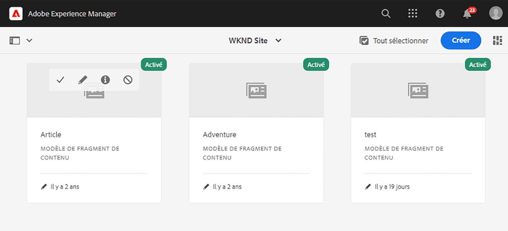
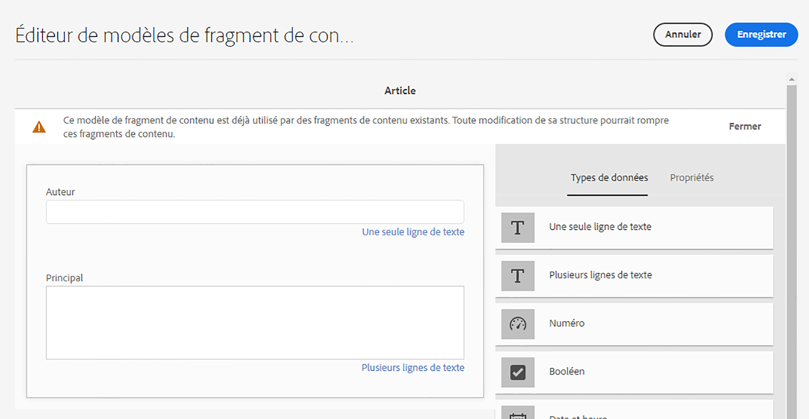
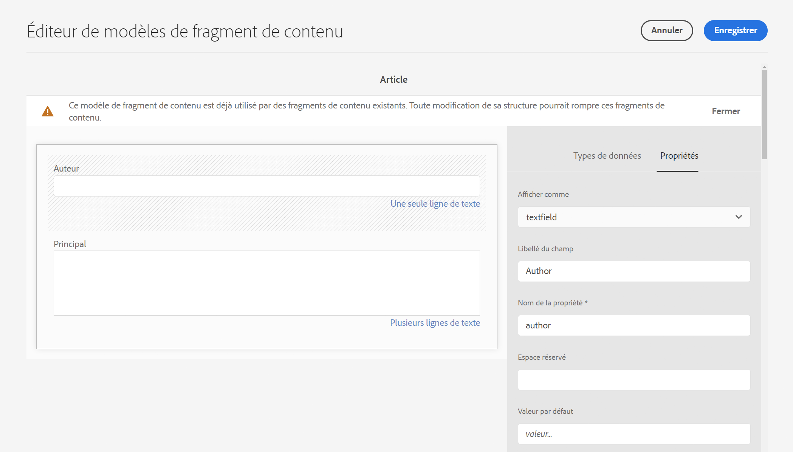

# Prise en main d’AEM traduction sans affichage {#getting-started}

Découvrez comment organiser votre contenu sans interface et comment AEM outils de traduction fonctionnent.

## Un peu d’histoire...  {#story-so-far}

Dans le document précédent du parcours de traduction sans interface utilisateur AEM, [Découvrez le contenu sans interface et comment traduire en AEM](learn-about.md) vous avez appris la théorie de base d’un CMS sans interface et vous devriez maintenant :

* Découvrez les concepts de base de la diffusion de contenu sans interface utilisateur.
* Familiarisez-vous avec la façon dont AEM prend en charge les traductions et les headless.

Cet article s’appuie sur ces principes de base afin que vous compreniez comment AEM stocke et gère le contenu headless et comment vous pouvez utiliser AEM outils de traduction pour traduire ce contenu.

## Objectif {#objective}

Ce document vous aide à comprendre comment commencer à traduire du contenu sans interface dans AEM. Après l’avoir lu, vous devriez :

* Comprendre l’importance de la structure de contenu pour la traduction.
* Découvrez comment AEM stocke du contenu sans interface.
* Familiarisez-vous avec AEM outils de traduction.

## Exigences et conditions préalables {#requirements-prerequisites}

Avant de commencer à traduire votre contenu d’AEM sans interface, plusieurs exigences s’imposent.

### Connaissances {#knowledge}

* Expérience de traduction de contenu dans un CMS
* Expérience d’utilisation des fonctionnalités de base d’un CMS à grande échelle
* posséder une connaissance pratique de AEM gestion de base ;
* Compréhension du service de traduction que vous utilisez
* avoir une compréhension de base du contenu que vous traduisez ;

>[!TIP]
>
>Si vous ne connaissez pas l’utilisation d’un système de gestion de contenu (CMS) à grande échelle comme AEM, consultez la documentation [Manipulation de base](/help/sites-cloud/authoring/getting-started/basic-handling.md) avant de continuer. La documentation Manipulation de base ne fait pas partie du parcours. Revenez donc sur cette page une fois l’opération terminée.

### Outils {#tools}

* Accès aux environnements de test pour tester la traduction de votre contenu
* Informations d’identification pour se connecter à votre service de traduction préféré
* Être membre du groupe `project-administrators` dans AEM

## La structure est la clé {#content-structure}

AEM contenu, qu’il s’agisse de pages web sans interface ou traditionnelles, est piloté par sa structure. AEM impose peu d’exigences à la structure de contenu, mais une prise en compte attentive de votre hiérarchie de contenu dans le cadre de la planification du projet peut rendre la traduction beaucoup plus simple.

>[!TIP]
>
>Prévoyez la traduction dès le début du projet sans tête. Collaborez rapidement avec le chef de projet et les architectes de contenu.
>
>Un responsable de projet d’internationalisation peut être requis en tant que personne distincte dont la responsabilité est de définir quel contenu doit être traduit et ce qui ne l’est pas, et quel contenu traduit peut être modifié par les producteurs de contenu régionaux ou locaux.

## Comment AEM stocke du contenu sans affichage {#headless-content-in-aem}

Pour le spécialiste de la traduction, il n’est pas important de comprendre en profondeur comment AEM gère le contenu sans interface. Toutefois, il sera utile de connaître les concepts et la terminologie de base, car vous utiliserez ensuite AEM outils de traduction. Plus important encore, vous devez comprendre votre propre contenu et sa structure afin de le traduire efficacement.

### Modèles de contenu {#content-models}

Pour que le contenu sans interface puisse être diffusé de manière cohérente sur plusieurs canaux, régions et langues, il doit être hautement structuré. AEM utilise des modèles de contenu pour appliquer cette structure. Considérez les modèles de contenu comme une sorte de modèle ou de modèle pour créer du contenu sans interface. Chaque projet ayant ses propres besoins, chaque projet définit ses propres modèles de fragment de contenu. AEM n’a pas de configuration ou de structure fixe pour de tels modèles.

L’architecte de contenu travaille au début du projet pour définir cette structure. En tant que traducteur, vous devez travailler en étroite collaboration avec l’architecte de contenu pour comprendre et organiser le contenu.

>[!NOTE]
>
>Il incombe à l’architecte de contenu de définir les modèles de contenu. Le traducteur ne doit connaître que sa structure, comme indiqué dans les étapes suivantes.

Comme les modèles de contenu définissent la structure de votre contenu, vous devez savoir quels champs de vos modèles doivent être traduits. En règle générale, vous travaillez avec l’architecte de contenu pour définir cela. Pour parcourir les champs de vos modèles de contenu, procédez comme suit.

1. Accédez à **Outils** -> **Ressources** -> **Modèles de fragment de contenu**.
1. Les modèles de fragment de contenu sont généralement stockés dans une structure de dossiers. Appuyez ou cliquez sur le dossier du projet.
1. Les modèles sont répertoriés. Appuyez ou cliquez sur le modèle pour afficher les détails.
   
1. **L’éditeur de modèle de fragment de contenu** s’ouvre.
   1. La colonne de gauche contient les champs du modèle. Cette colonne nous intéresse.
   1. La colonne de droite contient les champs qui peuvent être ajoutés au modèle. Cette colonne que nous pouvons ignorer.
      
1. Appuyez ou cliquez sur l’un des champs du modèle. AEM le marque et les détails de ce champ s’affichent dans la colonne de droite.
   

Prenez note du champ **Nom de la propriété** pour tous les champs qui doivent être traduits. Vous aurez besoin de ces informations plus tard dans le parcours. Ces **noms de propriété** sont nécessaires pour indiquer AEM champs de votre contenu qui doivent être traduits.

>[!TIP]
>
>En règle générale, l’architecte de contenu fournit au spécialiste de la traduction les **Nom de propriété** de tous les champs requis pour la traduction. Ces noms de champ sont nécessaires pour plus tard dans le parcours. Les étapes précédentes sont prévues pour la compréhension du spécialiste de la traduction.

### Fragments de contenu {#content-fragments}

Les modèles de contenu sont utilisés par les auteurs de contenu pour créer le contenu headless réel. Les auteurs de contenu sélectionnent le modèle sur lequel baser leur contenu, puis créent des fragments de contenu. Les fragments de contenu sont des instances des modèles et représentent le contenu réel à diffuser sans interface.

Si les modèles de contenu sont les modèles du contenu, les fragments de contenu sont le contenu réel basé sur ces modèles. Les fragments de contenu représentent le contenu qui doit être traduit.

Les fragments de contenu sont gérés en tant que ressources dans AEM dans le cadre de la gestion des ressources numériques (DAM). C’est important, car ils se trouvent tous sous le chemin `/content/dam`.

## Structure de contenu recommandée {#recommended-structure}

Comme recommandé précédemment, travaillez avec votre architecte de contenu pour déterminer la structure de contenu appropriée pour votre propre projet. Cependant, voici une structure éprouvée, simple et intuitive, qui est assez efficace.

Définissez un dossier de base pour votre projet sous `/content/dam`.

```text
/content/dam/<your-project>
```

La langue dans laquelle votre contenu est créé est appelée racine de langue. Dans notre exemple, il s’agit de l’anglais et il doit se trouver sous ce chemin.

```text
/content/dam/<your-project>/en
```

Tout le contenu du projet qui doit peut-être être localisé doit être placé sous la racine de langue.

```text
/content/dam/<your-project>/en/<your-project-content>
```

Les traductions doivent être créées en tant que dossiers frères à côté de la racine de langue avec leur nom de dossier représentant le code de langue ISO-2 de la langue. Par exemple, l’allemand aurait le chemin suivant.

```text
/content/dam/<your-project>/de
```

>[!NOTE]
>
>L’architecte de contenu est généralement chargé de créer ces dossiers de langue. S’ils ne sont pas créés, AEM ne pourra pas créer ultérieurement de tâches de traduction.

La structure finale peut ressembler à ce qui suit.

```text
/content
    |- dam
        |- your-project
            |- en
                |- some
                |- exciting
                |- headless
                |- content
            |- de
            |- fr
            |- it
            |- ...
        |- another-project
        |- ...
```

Vous devez prendre note du chemin spécifique de votre contenu, car il sera nécessaire ultérieurement pour configurer votre traduction.

>[!NOTE]
>
>Il incombe généralement à l’architecte de contenu de définir la structure du contenu, mais il peut collaborer avec le spécialiste de traduction.
>
>Il est présenté ici pour être complet.

## AEM outils de traduction {#translation-tools}

Maintenant que vous comprenez ce que sont les fragments de contenu et l’importance de la structure de contenu, nous pouvons examiner comment traduire ce contenu. Les outils de traduction en AEM sont assez puissants, mais sont faciles à comprendre à un haut niveau.

* **Connecteur de traduction**  : le connecteur est le lien entre AEM et le service de traduction que vous utilisez.
* **Règles**  de traduction : les règles définissent le contenu sous des chemins d’accès spécifiques qui doit être traduit.
* **Projets de traduction**  : les projets de traduction rassemblent le contenu qui doit être traité comme un effort de traduction unique et suivent l’avancement de la traduction, en interfaçant avec le connecteur pour transmettre le contenu à traduire et le recevoir du service de traduction.

En règle générale, vous ne configurez votre connecteur qu’une seule fois pour votre instance et les règles par projet sans interface utilisateur. Ensuite, vous utilisez des projets de traduction pour traduire votre contenu et tenir ses traductions à jour en permanence.

## Et après ? {#what-is-next}

Maintenant que vous avez terminé cette partie du parcours de traduction sans interface utilisateur graphique, vous devez :

* Comprendre l’importance de la structure de contenu pour la traduction.
* Découvrez comment AEM stocke du contenu sans interface.
* Familiarisez-vous avec AEM outils de traduction.

Tirez parti de ces connaissances et continuez votre parcours de traduction AEM sans interface utilisateur en consultant le document [Configurer le connecteur de traduction](configure-connector.md) dans lequel vous apprendrez à connecter AEM à un service de traduction.|

## Ressources supplémentaires {#additional-resources}

Bien qu’il soit recommandé de passer à la partie suivante du parcours de traduction sans interface utilisateur graphique en consultant le document [Configurer le connecteur de traduction](configure-connector.md), voici quelques ressources facultatives supplémentaires qui approfondissent certains concepts mentionnés dans ce document, mais qui ne sont pas requises pour continuer sur le parcours sans interface utilisateur.

* [AEM Manipulation de base](/help/sites-cloud/authoring/getting-started/basic-handling.md)  : découvrez les principes de base de l’interface utilisateur d’AEM pour pouvoir naviguer facilement et effectuer les tâches essentielles telles que trouver votre contenu.
* [Identification du contenu à traduire](/help/sites-cloud/administering/translation/rules.md)  : découvrez comment les règles de traduction identifient le contenu à traduire.
* [Configuration de la structure d’intégration de traduction](/help/sites-cloud/administering/translation/integration-framework.md)  - Découvrez comment configurer la structure d’intégration de traduction pour l’intégrer à des services de traduction tiers.
* [Gestion des projets de traduction](/help/sites-cloud/administering/translation/managing-projects.md)  : découvrez comment créer et gérer des projets de traduction humaine et automatique dans AEM.
