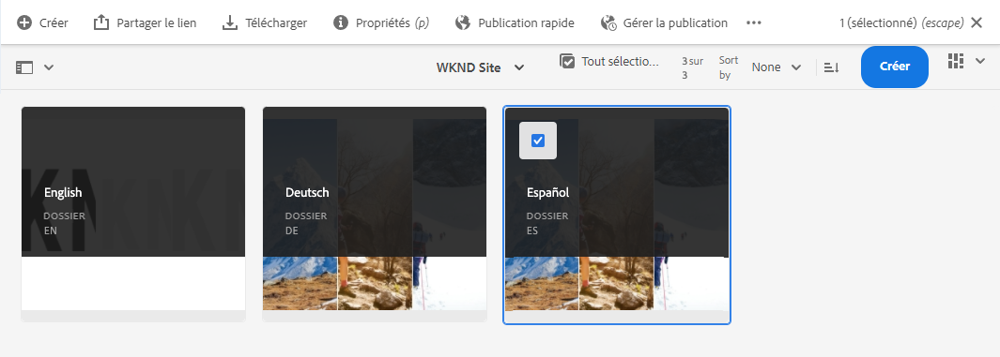
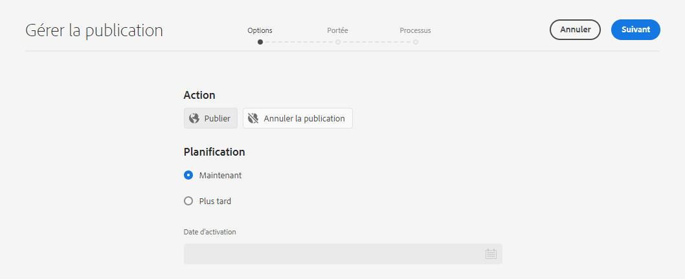
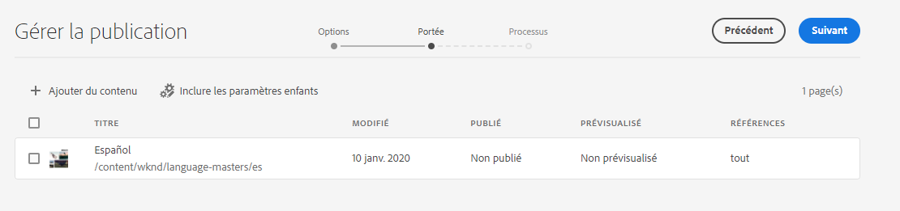
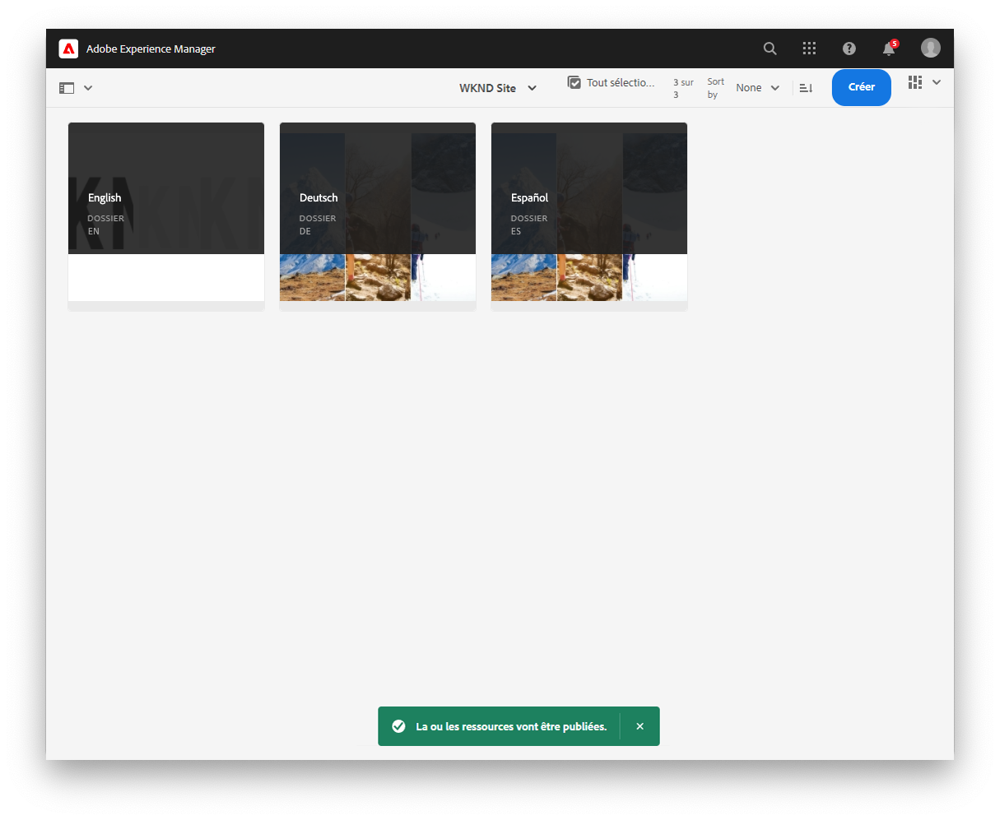
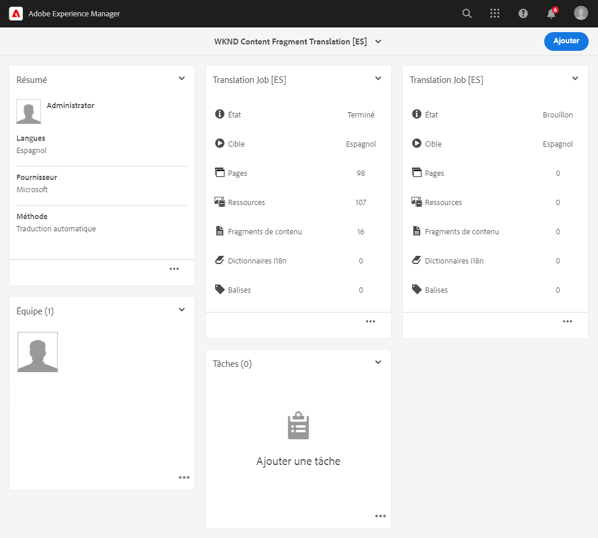
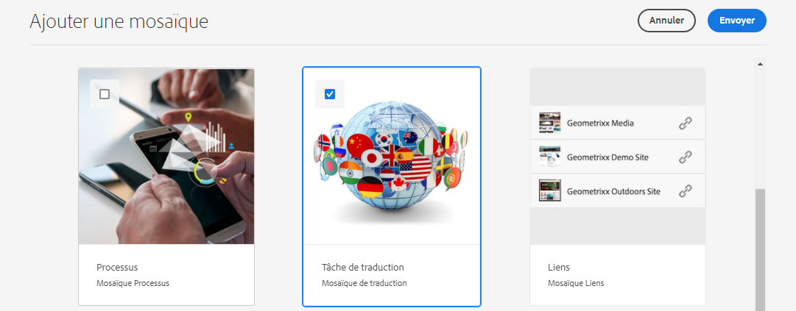
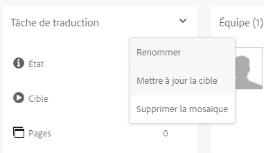

# Publication du contenu découplé traduit {#publish-content}

Découvrez comment publier votre contenu traduit et mettre à jour les traductions au fur et à mesure que le contenu est mis à jour.

## Un peu d’histoire... {#story-so-far}

Dans le document précédent du parcours de traduction découplée AEM, [Traduction du contenu](configure-connector.md), vous avez appris à utiliser les projets de traduction AEM pour traduire votre contenu découplé. Vous devez maintenant :

* comprendre ce qu’est un projet de traduction ;
* être capable de créer des projets de traduction ;
* savoir comment utiliser des projets de traduction pour traduire votre contenu découplé.

Maintenant que votre traduction initiale est terminée, cet article vous guide tout au long de l’étape suivante de la publication de ce contenu et de ce que vous devez faire pour mettre à jour vos traductions en tant que contenu sous-jacent dans les modifications racine de la langue.

## Objectif {#objective}

Ce document vous aide à comprendre comment publier du contenu découplé dans AEM et comment créer un workflow continu pour maintenir vos traductions à jour. Après avoir lu ce document, vous devriez :

* comprendre le modèle auteur-publication d’AEM ;
* savoir comment publier votre contenu traduit ;
* être capable de mettre en œuvre un modèle de mise à jour continue pour votre contenu traduit.

## Modèle auteur-publication d’AEM {#author-publish}

Avant de publier votre contenu, il est préférable de comprendre comment fonctionne le modèle auteur-publication d’AEM. Pour faire simple, AEM divise les utilisateurs du système en deux groupes.

1. Les personnes qui créent et gèrent le contenu et le système
1. Ceux qui utilisent le contenu du système

AEM est donc physiquement séparé en deux instances.

1. L’instance **auteur** est le système sur lequel les auteurs et les administrateurs de contenu travaillent à créer et à gérer le contenu.
1. L’instance de **publication** est le système qui diffuse le contenu aux consommateurs.

Une fois le contenu créé sur l’instance d’auteur, il doit être transféré sur l’instance de publication pour qu’il puisse être utilisé. Le processus de transfert de l’auteur à la publication est appelé **publication**.

## Publication de votre contenu traduit {#publishing}

Une fois que vous êtes satisfait de l’état de votre contenu traduit, il doit être publié pour que les services découplés puissent l’utiliser. Cette tâche n’est généralement pas de la responsabilité du spécialiste de traduction, mais elle est documentée ici pour illustrer l’ensemble du workflow.

>[!NOTE]
>
>Généralement, une fois la traduction terminée, le spécialiste des traductions informe les propriétaires du contenu que les traductions sont prêtes à être publiées. Les propriétaires de contenu les publient ensuite.
>
>Les étapes suivantes sont fournies pour vous offrir un point de vue exhaustif.

La méthode la plus simple pour publier les traductions consiste à accéder au dossier des ressources du projet.

```text
/content/dam/<your-project>/
```

Ce chemin d’accès mène aux sous-dossiers pour chaque langue de traduction et vous pouvez choisir laquelle publier.

1. Accédez à **Navigation** -> **Ressources** -> **Fichiers** et ouvrez le dossier du projet.
1. Vous pouvez y voir le dossier racine de langue et tous les autres dossiers de langue. Sélectionnez la ou les langues localisées que vous souhaitez publier.
   
1. Sélectionner **Gérer la publication**.
1. Dans la fenêtre **Gérer la publication**, assurez-vous que **Publier** est automatiquement sélectionné sous **Action** et que **Maintenant** est sélectionné sous **Planification**. Sélectionnez **Suivant**.
   
1. Dans la fenêtre **Gérer la publication**, vérifiez que le ou les chemins appropriés sont sélectionnés. Sélectionner **Publier**.
   
1. AEM confirme l’action de publication avec un message pop-up en bas de l’écran.
   

Votre contenu découplé traduit est maintenant publié ! Il peut désormais être accessible et utilisé par vos services découplés.

>[!TIP]
>
>Vous pouvez sélectionner plusieurs éléments (c’est-à-dire plusieurs dossiers de langues) lors de la publication afin de publier plusieurs traductions à la fois.

D’autres options s’offrent à vous lors de la publication de votre contenu, telles que la planification d’une heure de publication, mais elles dépassent la portée de ce parcours. Pour plus d’informations, consultez la section [Ressources supplémentaires](#additional-resources) à la fin du document.

## Mise à jour de votre contenu traduit {#updating-translations}

La traduction est rarement un exercice ponctuel. En règle générale, vos auteurs continuent à ajouter et à modifier votre contenu dans la racine de langue une fois la traduction initiale terminée. Cela signifie que vous devez également mettre à jour votre contenu traduit.

Les exigences spécifiques de projet définissent la fréquence à laquelle vous devez mettre à jour vos traductions et le processus de décision à suivre avant d’effectuer une mise à jour. Une fois que vous avez décidé de mettre à jour vos traductions, le processus à suivre dans AEM est très simple. De la même façon que pour la traduction initiale, toutes les mises à jour sont basées sur un projet de traduction.

Cependant, comme auparavant, le processus est légèrement différent si vous avez choisi de créer automatiquement votre projet de traduction ou de le créer manuellement.

### Mise à jour d’un projet de traduction créé automatiquement {#updating-automatic-project}

1. Accédez à **Navigation** > **Ressources** > **Fichiers**. N’oubliez pas que le contenu découplé dans AEM est stocké en tant que ressources appelées fragments de contenu.
1. Sélectionnez la racine de langue de votre projet. Dans ce cas, nous avons sélectionné `/content/dam/wknd/en`.
1. Sélectionnez le sélecteur de rail et affichez le **Références** du panneau.
1. **Sélectionner des copies de langue**.
1. Cochez l’option **Copies de langue**.
1. Développez la section **Mise à jour des copies de langue** en bas du panneau des références.
1. Dans le menu déroulant **Projet**, sélectionnez **Ajouter à un projet de traduction existant**.
1. Dans le menu déroulant **Projet de traduction existant**, sélectionnez le projet créé pour la traduction initiale.
1. Sélectionner **Début**.


Le contenu est ajouté au projet de traduction existant. Pour afficher le projet de traduction :

1. Accédez à **Navigation** -> **Projets**.
1. Sélectionnez le projet que vous venez de mettre à jour.
1. Appuyez ou cliquez sur la langue ou l’une des langues que vous avez mises à jour.

Vous voyez qu’une nouvelle carte de tâche a été ajoutée au projet. Dans cet exemple, un autre traduction en espagnol a été ajoutée.



Vous remarquerez peut-être que les statistiques répertoriées sur la nouvelle carte (nombre de ressources et de fragments de contenu) sont différentes. En effet, AEM reconnaît ce qui a changé depuis la dernière traduction et n’inclut que le contenu qui doit être traduit. Cela inclut la retraduction du contenu mis à jour et la première traduction du nouveau contenu.

À partir de là, vous pouvez [commencer et gérer votre tâche de traduction comme vous l’avez fait pour la traduction originale](translate-content.md#using-translation-project).

### Mise à jour d’un projet de traduction créé manuellement {#updating-manual-project}

Pour mettre à jour une traduction, vous pouvez ajouter à votre projet existant une nouvelle tâche chargée de traduire le contenu mis à jour.

1. Accédez à **Navigation** -> **Projets**.
1. Sélectionnez le projet que vous souhaitez supprimer.
1. Appuyez ou cliquez sur le bouton **Ajouter** en haut de la fenêtre.
1. Dans la fenêtre **Ajouter une mosaïque**, appuyez ou cliquez sur **Tâche de traduction** puis sur **Envoyer**.

   

1. Sur la carte de la nouvelle tâche de traduction, appuyez ou cliquez sur le bouton chevron situé en haut de la carte, puis sélectionnez **Mettre à jour la cible** pour définir la langue cible de la nouvelle tâche.

   

1. Dans la boîte de dialogue **Sélectionner la langue cible**, utilisez la liste déroulante pour sélectionner la langue, puis appuyez ou cliquez sur **Terminé**.

   

1. Une fois la langue cible de la nouvelle tâche de traduction définie, appuyez ou cliquez sur le bouton représentant des points de suspension en bas de la carte de la tâche pour afficher les détails de la tâche.
1. La tâche est vide lors de sa première création. Ajoutez du contenu à la tâche en appuyant ou en cliquant sur le bouton **Ajouter** et à l’aide de l’explorateur de chemins d’accès [comme vous l’avez fait lors de la création initiale du projet de traduction](translate-content.md##manually-creating).

>[!TIP]
>
>Les filtres puissants de l’explorateur de chemins d’accès peuvent à nouveau s’avérer utiles pour trouver uniquement le contenu qui a été mis à jour.
>
>Pour en savoir plus sur l’explorateur de chemins d’accès, consultez la [section des ressources supplémentaires](#additional-resources).

À partir de là, vous pouvez [commencer et gérer votre tâche de traduction comme vous l’avez fait pour la traduction originale.](translate-content.md#using-translation-project)

## Fin du parcours ? {#end-of-journey}

Félicitations ! Vous avez terminé le parcours de traduction découplée. Vous devez maintenant :

* disposer d’une vue d’ensemble sur la diffusion découplée ;
* disposer d’une compréhension de base des fonctions découplées d’AEM ;
* connaître les fonctionnalités de traduction d’AEM et leur lien avec le contenu découplé ;
* Soyez en mesure de traduire votre propre contenu sans tête.

Vous êtes maintenant prêt à traduire votre propre contenu découplé dans AEM. Cependant, AEM est un outil puissant et de nombreuses autres options sont disponibles. Consultez certaines des ressources supplémentaires disponibles dans la [Section Ressources supplémentaires](#additional-resources) pour en savoir plus sur les fonctionnalités rencontrées dans ce parcours.

## Ressources supplémentaires {#additional-resources}

* [Gestion des projets de traduction](/help/sites-cloud/administering/translation/managing-projects.md) – Découvrez les détails des projets de traduction et des fonctionnalités supplémentaires telles que les processus de traduction humaine et les projets multilingues.
* [Création de concepts](/help/sites-cloud/authoring/author-publish.md) – Apprenez-en plus sur le modèle de création et de publication d’AEM. Ce document se concentre sur la création de pages plutôt que sur les fragments de contenu, mais les mêmes principes s’appliquent.
* [Publication de pages](/help/sites-cloud/authoring/sites-console/publishing-pages.md) – Apprenez-en plus sur les fonctionnalités supplémentaires disponibles lors de la publication de contenu. Ce document se concentre sur la création de pages plutôt que sur les fragments de contenu, mais les mêmes principes s’appliquent.
* [Environnements et outils de création](/help/sites-cloud/authoring/path-selection.md#path-selection) – AEM fournit divers mécanismes d’organisation et de modification de votre contenu, notamment un puissant navigateur de chemins d’accès.
