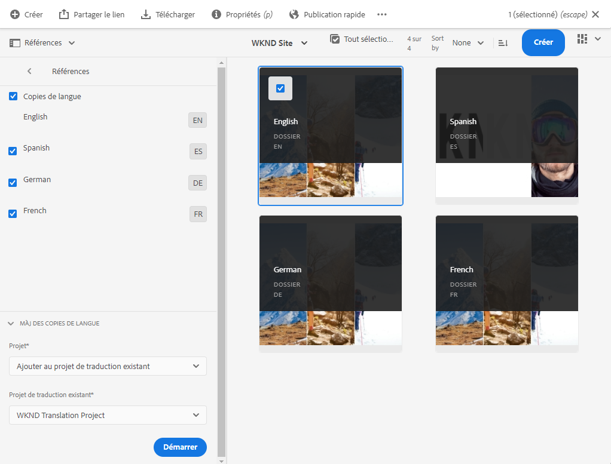

# Publier le contenu traduit {#publish-content}

Découvrez comment publier votre contenu traduit et mettre à jour les traductions au fur et à mesure que le contenu est mis à jour.

## Un peu d’histoire...  {#story-so-far}

Dans le document précédent du parcours de traduction sans interface utilisateur AEM, [Traduire le contenu,](configure-connector.md) vous avez appris à utiliser AEM projets de traduction pour traduire votre contenu sans interface utilisateur. Vous devez maintenant :

* Comprendre ce qu’est un projet de traduction.
* Vous pouvez créer de nouveaux projets de traduction.
* Utilisez des projets de traduction pour traduire votre contenu sans tête.

Maintenant que votre traduction initiale est terminée, cet article vous guide tout au long de l’étape suivante de la publication de ce contenu et de ce que vous devez faire pour mettre à jour vos traductions en tant que contenu sous-jacent dans les modifications racine de la langue.

## Objectif {#objective}

Ce document vous aide à comprendre comment publier du contenu sans interface dans AEM et comment créer un workflow continu pour maintenir vos traductions à jour. Après avoir lu ce document, vous devez :

* Comprendre le modèle d’AEM auteur-publication.
* Découvrez comment publier votre contenu traduit.
* Vous pouvez mettre en oeuvre un modèle de mise à jour continue pour votre contenu traduit.

## AEM modèle Auteur-Publication {#author-publish}

Avant de publier votre contenu, il est préférable de comprendre AEM modèle auteur-publication. En termes simplifiés, AEM divise les utilisateurs du système en deux groupes.

1. Les personnes qui créent et gèrent le contenu et le système
1. Ceux qui utilisent le contenu du système

AEM est donc physiquement séparé en deux instances.

1. L’instance **author** est le système dans lequel les auteurs et les administrateurs de contenu travaillent à créer et à gérer du contenu.
1. L’instance **publish** est le système qui diffuse le contenu aux consommateurs.

Une fois le contenu créé sur l’instance d’auteur, il doit être transféré sur l’instance de publication pour qu’il puisse être utilisé. Le processus de transfert de l’auteur à la publication s’appelle **publication**.

## Publication de contenu traduit {#publishing}

Une fois que vous êtes satisfait de l’état de votre contenu traduit, il doit être publié afin que les services sans interface puissent l’utiliser. Cette tâche n&#39;est généralement pas de la responsabilité du spécialiste de traduction, mais est documentée ici pour illustrer l&#39;ensemble du workflow.

>[!NOTE]
>
>Généralement, une fois la traduction terminée, le spécialiste des traductions informe les propriétaires du contenu que les traductions sont prêtes à être publiées. Les propriétaires de contenu les publient ensuite.
>
>Les étapes suivantes sont fournies à des fins d’exhaustivité.

La méthode la plus simple pour publier les traductions consiste à accéder au dossier des ressources du projet.

```text
/content/dam/<your-project>/
```

Sous ce chemin d’accès, vous disposez de sous-dossiers pour chaque langue de traduction et vous pouvez choisir celle à publier.

1. Accédez à **Navigation** -> **Ressources** -> **Fichiers** et ouvrez le dossier du projet.
1. Vous voyez ici le dossier racine de langue et tous les autres dossiers de langue. Sélectionnez la ou les langues localisées que vous souhaitez publier.
   
1. Appuyez ou cliquez sur **Gérer la publication**.
1. Dans la fenêtre **Gérer la publication** , vérifiez que **Publier** est automatiquement sélectionné sous **Action** et que **Maintenant** est sélectionné sous **Planification**. Cliquez ou appuyez sur **Suivant**.
   
1. Dans la fenêtre **Gérer la publication** suivante, vérifiez que le ou les chemins appropriés sont/sont sélectionnés. Appuyez ou cliquez sur **Publier**.
   
1. AEM confirme l’action de publication avec un message contextuel en bas de l’écran.
   

Votre contenu traduit sans tête est maintenant publié ! Il est désormais accessible et utilisé par vos services sans interface utilisateur graphique.

>[!TIP]
>
>Vous pouvez sélectionner plusieurs éléments (c’est-à-dire plusieurs dossiers de langues) lors de la publication afin de publier plusieurs traductions à la fois.

D’autres options s’offrent à vous lors de la publication de votre contenu, telles que la planification d’une heure de publication, qui dépassent le cadre de ce parcours. Pour plus d’informations, voir la section [Ressources supplémentaires](#additional-resources) à la fin du document.

## Mise à jour de votre contenu traduit {#updating-translations}

La traduction est rarement un exercice ponctuel. En règle générale, vos auteurs de contenu continuent à ajouter et à modifier votre contenu dans la racine de langue une fois la traduction initiale terminée. Cela signifie que vous devez également mettre à jour votre contenu traduit.

Les exigences de projet spécifiques définissent la fréquence à laquelle vous devez mettre à jour vos traductions et le processus de décision suivi avant d’effectuer une mise à jour. Une fois que vous avez décidé de mettre à jour vos traductions, le processus en AEM est très simple. Comme la traduction initiale était basée sur un projet de traduction, il en va de même pour toutes les mises à jour.

Cependant, comme auparavant, le processus diffère légèrement si vous avez choisi de créer automatiquement votre projet de traduction ou de créer manuellement votre projet de traduction.

### Mise à jour d’un projet de traduction créé automatiquement {#updating-automatic-project}

1. Accédez à **Navigation** -> **Ressources** -> **Fichiers**. N’oubliez pas que le contenu sans interface dans AEM est stocké en tant que ressources appelées fragments de contenu.
1. Sélectionnez la racine de langue de votre projet. Dans ce cas, nous avons sélectionné `/content/dam/wknd/en`.
1. Appuyez ou cliquez sur le sélecteur de rail et affichez le panneau **Références** .
1. Appuyez ou cliquez sur **Copies de langue**.
1. Cochez la case **Copies de langue** .
1. Développez la section **Mettre à jour les copies de langue** au bas du panneau Références.
1. Dans la liste déroulante **Projet**, sélectionnez **Ajouter à un projet de traduction existant**.
1. Dans la liste déroulante **Projet de traduction existant** , sélectionnez le projet créé pour la traduction initiale.
1. Appuyez ou cliquez sur **Démarrer**.



Le contenu est ajouté au projet de traduction existant. Pour afficher le projet de traduction :

1. Accédez à **Navigation** -> **Projets**.
1. Appuyez ou cliquez sur le projet que vous venez de mettre à jour.
1. Appuyez ou cliquez sur la langue ou l’une des langues que vous avez mises à jour.

Vous voyez qu’une nouvelle carte de tâche a été ajoutée au projet. Dans cet exemple, une autre traduction espagnole a été ajoutée.


Vous remarquerez peut-être que les statistiques répertoriées sur la nouvelle carte (nombre de ressources et fragments de contenu) sont différentes. En effet, AEM reconnaît ce qui a changé depuis la dernière traduction et n’inclut que le contenu qui doit être traduit. Cela inclut la retraduction du contenu mis à jour ainsi que la première traduction du nouveau contenu.

À partir de là, vous [démarrez et gérez votre tâche de traduction comme vous l’avez fait pour l’original.](translate-content.md#using-translation-project)

### Mise à jour d’un projet de traduction créé manuellement {#updating-manual-project}

Pour mettre à jour une traduction, vous pouvez ajouter à votre projet existant une nouvelle tâche chargée de traduire le contenu mis à jour.

1. Accédez à **Navigation** -> **Projets**.
1. Appuyez ou cliquez sur le projet que vous devez mettre à jour.
1. Appuyez ou cliquez sur le bouton **Ajouter** en haut de la fenêtre.
1. Dans la fenêtre **Ajouter une mosaïque** , appuyez ou cliquez sur **Tâche de traduction**, puis sur **Envoyer**.

   

1. Sur la carte de la nouvelle tâche de traduction, appuyez ou cliquez sur le bouton chevron en haut de la carte, puis sélectionnez **Mettre à jour la cible** pour définir la langue cible de la nouvelle tâche.

   

1. Dans la boîte de dialogue **Sélectionner la langue cible**, utilisez la liste déroulante pour sélectionner la langue et appuyez ou cliquez sur **Terminé**.

   

1. Une fois la langue cible de la nouvelle tâche de traduction définie, appuyez ou cliquez sur le bouton représentant des points de suspension en bas de la carte de la tâche pour afficher les détails de la tâche.
1. La tâche est vide lors de sa première création. Ajoutez du contenu à la tâche en appuyant ou en cliquant sur le bouton **Ajouter** et en utilisant l’explorateur de chemins d’accès [comme vous le faisiez auparavant lors de la création initiale du projet de traduction.](translate-content.md##manually-creating)

>[!TIP]
>
>Les filtres puissants de l’explorateur de chemins d’accès peuvent à nouveau s’avérer utiles pour trouver uniquement le contenu qui a été mis à jour.
>
>Vous pouvez en savoir plus sur l’explorateur de chemins d’accès dans la section [Ressources supplémentaires.](#additional-resources)

À partir de là, vous [démarrez et gérez votre tâche de traduction comme vous l’avez fait pour l’original.](translate-content.md#using-translation-project)

## Fin du Parcours ? {#end-of-journey}

Félicitations ! Vous avez terminé le parcours de traduction sans tête ! Vous devez maintenant :

* disposer d’une vue d’ensemble de la diffusion de contenu sans interface ;
* Comprendre de base AEM fonctions sans tête.
* Découvrez AEM fonctionnalités de traduction et comment elles sont liées au contenu sans interface.
* Vous pouvez commencer à traduire votre propre contenu sans tête.

Vous êtes maintenant prêt à traduire votre propre contenu sans tête en AEM. Cependant, AEM est un outil puissant et de nombreuses autres options sont disponibles. Consultez certaines des ressources supplémentaires disponibles dans la [section Ressources supplémentaires](#additional-resources) pour en savoir plus sur les fonctionnalités que vous avez vues dans ce parcours.

## Ressources supplémentaires {#additional-resources}

* [Gestion des projets de traduction](/help/sites-cloud/administering/translation/managing-projects.md)  : découvrez les détails des projets de traduction et les fonctionnalités supplémentaires telles que les processus de traduction humaine et les projets multilingues.
* [Concepts de création](/help/sites-cloud/authoring/getting-started/concepts.md)  : découvrez plus en détail le modèle d’AEM de création et de publication. Ce document se concentre sur la création de pages plutôt que sur les fragments de contenu, mais la théorie s’applique toujours.
* [Publication de pages](/help/sites-cloud/authoring/fundamentals/publishing-pages.md)  : découvrez les fonctionnalités supplémentaires disponibles lors de la publication de contenu. Ce document se concentre sur la création de pages plutôt que sur les fragments de contenu, mais la théorie s’applique toujours.
* [Environnement et outils de création](/help/sites-cloud/authoring/fundamentals/environment-tools.md##path-selection)  : AEM fournit divers mécanismes pour organiser et modifier votre contenu, notamment un navigateur de chemins d’accès robuste.
