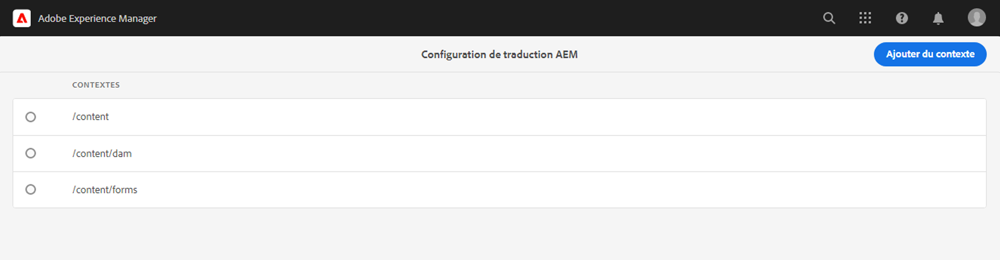
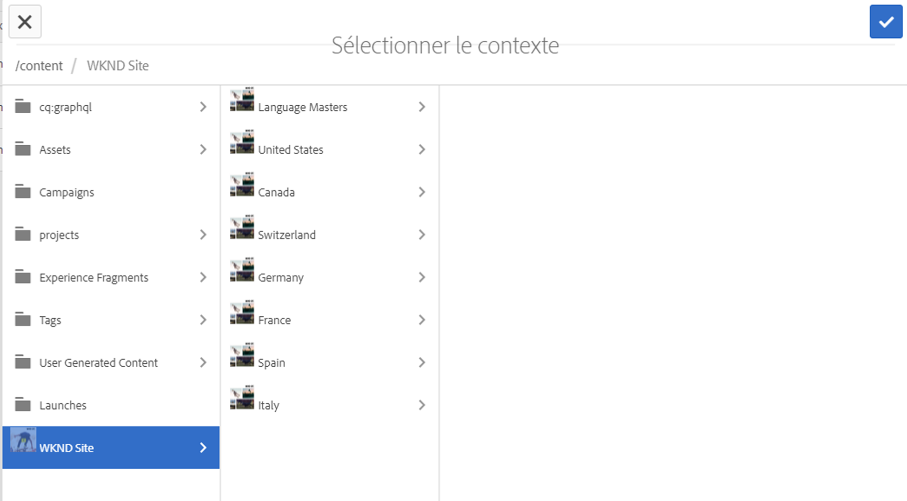
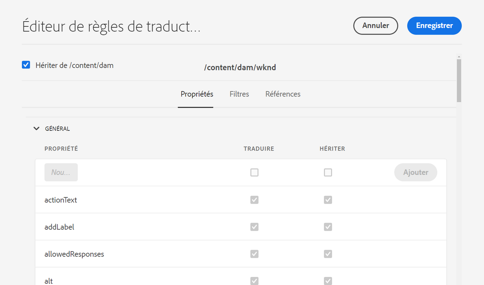
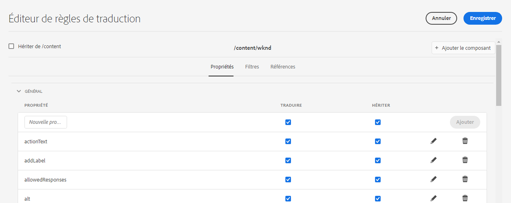

# Configuration des règles de traduction {#configure-translation-rules}

Découvrez comment définir des règles de traduction pour identifier le contenu à traduire.

## Un peu d’histoire... {#story-so-far}

Dans le document précédent du parcours de traduction découplée AEM, [Configuration de l’intégration de traduction](configure-connector.md), vous avez appris à installer et à configurer votre intégration de traduction. Vous devez maintenant :

* comprendre les paramètres importants de la structure d’intégration de traduction dans AEM ;
* savoir configurer votre propre connexion à votre service de traduction.

Maintenant que votre connecteur est configuré, cet article vous guide tout au long de l’étape suivante pour identifier le contenu à traduire.

>[!CAUTION]
>
>Cette étape du parcours de documentation n’est nécessaire que si vous n’utilisez pas l’indicateur **Traduisible** sur les fragments de contenu.
>
>* L’indicateur **Traduisible** crée automatiquement des règles de traduction pour vous et ne nécessite aucune intervention.
>* L’indicateur **Traduisible** n’est utilisé que si la configuration de la structure d’intégration de traduction est définie sur **[Activer les champs de modèle de contenu pour la traduction](/help/sites-cloud/administering/translation/integration-framework.md)**.
>* L’activation de cette option dans la configuration TIF remplace toute règle de traduction créée manuellement.|

## Objectif {#objective}

Ce document vous aide à comprendre comment utiliser les règles de traduction d’AEM pour identifier votre contenu de traduction. Après avoir lu ce document, vous devriez :

* comprendre ce que font les règles de traduction ;
* être capable de définir vos propres règles de traduction.

## Règles de traduction {#translation-rules}

Les fragments de contenu, qui représentent votre contenu découplé, peuvent contenir de nombreuses informations organisées dans des champs structurés. Selon les besoins de votre projet, il est probable que tous les champs d’un fragment de contenu n’aient pas besoin d’être traduits.

Les règles de traduction identifient le contenu à inclure dans les projets de traduction ou à exclure. Lorsque le contenu est traduit, AEM extrait ou récupère le contenu en fonction de ces règles. Ainsi, seul le contenu à traduire est envoyé au service de traduction.

Les règles de traduction comprennent les informations suivantes :

* Le chemin d’accès au contenu auquel la règle s’applique
   * La règle s’applique également aux descendants du contenu
* Les noms des propriétés contenant le contenu à traduire
   * Cette propriété peut être spécifique à un type de ressource en particulier ou à tous les types de ressource

Les modèles de fragment de contenu, qui définissent la structure de vos fragments de contenu, sont uniques à votre projet, c’est pourquoi il est essentiel de configurer des règles de traduction pour qu’AEM sache quels éléments traduire parmi vos modèles de contenu.

>[!TIP]
>
>En règle générale, l’architecte de contenu met à la disposition du spécialiste de la traduction les **noms de la propriété** de tous les champs nécessaires à la traduction. Ces noms sont nécessaires pour configurer les règles de traduction. En tant que spécialiste de la traduction, vous [pouvez trouver vous-même les **Noms de la propriété**](getting-started.md#content-modlels) comme décrit précédemment dans ce parcours.

## Création de règles de traduction {#creating-rules}

Plusieurs règles peuvent être créées pour prendre en charge des exigences de traduction complexes. Par exemple, un projet sur lequel vous travaillez peut nécessiter la traduction de tous les champs du modèle, mais pour un autre, seuls les champs de description doivent être traduits, tandis que les titres ne sont pas traduits.

Les règles de traduction sont conçues pour gérer ces scénarios. Cependant, dans cet exemple, nous illustrons comment créer des règles en se concentrant sur une configuration simple et unique.

Il existe une console **Configuration de traduction** disponible pour la configuration des règles de traduction. Pour y accéder :

1. Accédez à **Outils** -> **Général**.
1. Sélectionnez **Configuration de traduction**.

Dans l’IU **Configuration de traduction**, plusieurs options sont disponibles pour vos règles de traduction. Dans cette partie, nous mettons en évidence les étapes les plus nécessaires et les plus courantes requises pour une configuration de localisation découplée de base.

1. Sélectionner **Ajouter un contexte** pour ajouter un chemin. Il s’agit du chemin d’accès du contenu qui sera affecté par la règle.
   
1. Utilisez l’explorateur de chemins d’accès pour sélectionner le chemin d’accès requis et sélectionnez **Confirmer** pour enregistrer. N’oubliez pas que les fragments de contenu, qui contiennent du contenu découplé, se trouvent généralement sous `/content/dam/<your-project>`.
   
1. Sélectionnez le contexte que vous avez créé, puis sélectionnez **Modifier**. Vous ouvrez ainsi la fenêtre de l’**Éditeur de règles de traduction** pour configurer les propriétés.
   
1. Par défaut, toutes les configurations sont héritées du chemin d’accès parent, dans ce cas `/content/dam`. Désélectionnez l’option **Hériter de`/content/dam`** afin d’ajouter des champs supplémentaires à la configuration.
1. Une fois la case décochée, dans la section **Général** de la liste, ajoutez les noms des propriétés du ou des modèles de fragment de contenu que vous avez [précédemment identifiés comme des champs pour la traduction](getting-started.md#content-models).
   1. Dans le **Nouvelle propriété** , saisissez le nom de la propriété. Les options **Traduire** et **Hériter** sont cochées automatiquement.
   1. Sélectionnez **Ajouter**.
   1. Répétez ces étapes pour tous les champs que vous devez traduire.
   1. Sélectionnez **Enregistrer**.
      

Vous avez maintenant configuré vos règles de traduction.

## Utilisation avancée {#advanced-usage}

Plusieurs propriétés supplémentaires peuvent être configurées dans le cadre de vos règles de traduction. En outre, vous pouvez spécifier vos règles manuellement au format XML, ce qui vous permet d’obtenir plus de précision et de flexibilité.

Ces fonctionnalités ne sont généralement pas nécessaires pour commencer à localiser votre contenu découplé, mais vous pouvez en apprendre plus à ce sujet dans la section [Ressources supplémentaires](#additional-resources), si vous êtes intéressé.

## Prochaines étapes {#what-is-next}

Maintenant que vous avez terminé cette partie du parcours de traduction découplée, vous devriez savoir :

* comprendre ce que font les règles de traduction ;
* être capable de définir vos propres règles de traduction.

Tirez parti de ces connaissances et continuez à progresser sur votre parcours de traduction découplée AEM en consultant le document [Traduire le contenu](translate-content.md), dans lequel vous découvrirez comment votre connecteur et vos règles s’associent pour traduire du contenu découplé.

## Ressources supplémentaires {#additional-resources}

Bien qu’il soit recommandé de passer à la partie suivante du parcours de traduction découplée en consultant le document [Traduire du contenu](translate-content.md), vous trouverez ci-après quelques ressources facultatives supplémentaires pour approfondir un certain nombre de concepts mentionnés dans ce document, même s’ils ne sont pas nécessaires pour poursuivre le parcours en mode découplé.

* [Identification du contenu à traduire](/help/sites-cloud/administering/translation/rules.md) – Découvrez comment les règles de traduction identifient le contenu à traduire.
