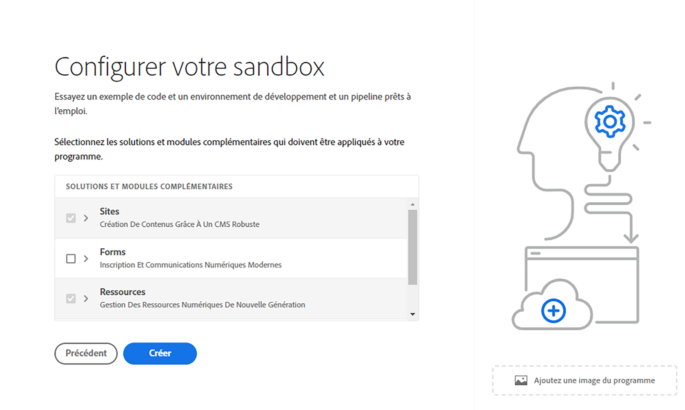

# Créer un programme {#create-program}

Dans cette partie du [parcours d’intégration](overview.md), vous apprendrez à utiliser Cloud Manager pour créer votre premier programme.

## Objectif {#objective}

Après avoir consulté le document précédent de ce parcours d’intégration, [Accéder à Cloud Manager](cloud-manager.md), vous avez vérifié que vous disposez d’un accès approprié à Cloud Manager. Vous pouvez maintenant créer votre premier programme.

Après avoir lu ce document, vous pourrez :

* Comprendre et expliquer ce qu&#39;est un programme.
* Connaître la différence entre les programmes de production et les programmes sandbox.
* Créez votre propre programme.

## Qu’est-ce qu’un programme ? {#programs}

Les programmes constituent le niveau d’organisation le plus élevé de Cloud Manager. En fonction de votre licence avec Adobe, les programmes vous permettent d’organiser votre solution et d’accorder l’accès à ces programmes à certains membres de l’équipe.

Les programmes Cloud Manager représentent des ensembles d’environnements Cloud Manager. Ces programmes prennent en charge des ensembles logiques d’initiatives professionnelles, correspondant généralement à un contrat de niveau de service (SLA) sous licence. Par exemple, un programme peut représenter les ressources AEM pour prendre en charge un site web public global pour une organisation, tandis qu’un autre programme représente une gestion des ressources numériques (DAM) centrale et interne.

Si vous vous souvenez de l’exemple de la théorie des entreprises de voyage et d’aventure WKND, un client qui se concentre sur les médias liés au voyage, elles peuvent avoir deux programmes. Un programme Sites pour la division WKND Magazine et un programme Ressources pour la division WKND Media. Différentes personnes membres de l’équipe auraient alors accès aux différents programmes en raison de leurs propres exigences en matière de division du travail.

Il existe deux types de programmes différents :

* Un **programme de production** est créé pour activer le trafic en direct pour votre site. C’est votre environnement « réel ».
* Un **programme sandbox** est généralement créé pour les besoins de formation, à des fins de démonstration, d’activation, de preuve de concept ou de documentation.

Étant donné qu’ils servent des objectifs différents, les différents environnements disposent d’options différentes. Cependant, leur processus de création est similaire. Pour ce parcours d’intégration, nous allons créer un environnement de sandbox.

>[!TIP]
>
>Si vous devez créer un programme de production, consultez la section [Ressources supplémentaires](#additional-resources) pour obtenir un lien vers la documentation décrivant les programmes en détail.

## Créer un programme sandbox {#create-sandbox}

1. Connectez-vous à Cloud Manager à l’adresse [my.cloudmanager.adobe.com](https://my.cloudmanager.adobe.com/) et sélectionnez l’organisation appropriée.

1. Dans la page de destination de Cloud Manager, cliquez sur **Ajouter un programme** dans le coin supérieur droit de l’écran.

   

1. Dans l’assistant de création de programme, sélectionnez **Configurer un sandbox**, indiquez un nom de programme, puis appuyez ou cliquez sur **Continuer**.

   

1. Dans la boîte de dialogue **Configuration de votre sandbox**, vous pouvez choisir les solutions que vous souhaitez activer dans votre programme sandbox. Les solutions **Sites** et **Assets** sont toujours incluses dans les programmes sandbox et sont automatiquement sélectionnées. Cela suffit pour notre exemple d’intégration. Cliquez sur **Créer**.

   

Une nouvelle carte de programme Sandbox s’affiche sur la page de destination avec un indicateur de statut au fur et à mesure que le processus de configuration progresse.

Une fois l’environnement disponible, les membres de votre organisation affectés au profil de produit **Développeur** peuvent se connecter à Cloud Manager et gérer les référentiels Git de Cloud Manager.

## Prochaines étapes {#whats-next}

Maintenant que votre premier programme est créé, vous pouvez créer des environnements pour celui-ci. Continuez votre parcours d’intégration en consultant le document [Créer des environnements](create-environments.md).

## Ressources supplémentaires {#additional-resources}

Vous trouverez ci-dessous des ressources facultatives supplémentaires si vous souhaitez aller au delà du contenu du parcours d’intégration.

* [Programmes et types de programmes](/help/implementing/cloud-manager/getting-access-to-aem-in-cloud/program-types.md) : découvrez la hiérarchie de Cloud Manager, comment les différents types de programmes s’intègrent dans sa structure et en quoi ils diffèrent.
* [Créer des programmes sandbox](/help/implementing/cloud-manager/getting-access-to-aem-in-cloud/creating-sandbox-programs.md) : découvrez comment utiliser Cloud Manager pour créer votre propre programme sandbox à des fins de formation, de démonstration, de preuve de concept ou à d’autres fins hors production.
* [Créer des programmes de production](/help/implementing/cloud-manager/getting-access-to-aem-in-cloud/creating-production-programs.md) : découvrez comment utiliser Cloud Manager pour créer votre propre programme de production afin d’héberger le trafic en direct.
* [Utiliser Adobe Cloud Manager - Programmes](https://experienceleague.adobe.com/docs/experience-manager-learn/cloud-service/cloud-manager/programs.html?lang=fr) : les programmes Cloud Manager représentent des ensembles d’environnements AEM prenant en charge des ensembles logiques d’initiatives professionnelles, correspondant généralement à un contrat de niveau de service (SLA) acheté.
* [Profils de produits et équipe AEM as a Cloud Service](/help/onboarding/aem-cs-team-product-profiles.md) : découvrez comment l’équipe et les profils de produits AEM as a Cloud Service peuvent accorder et limiter l’accès à vos solutions Adobe sous licence.
