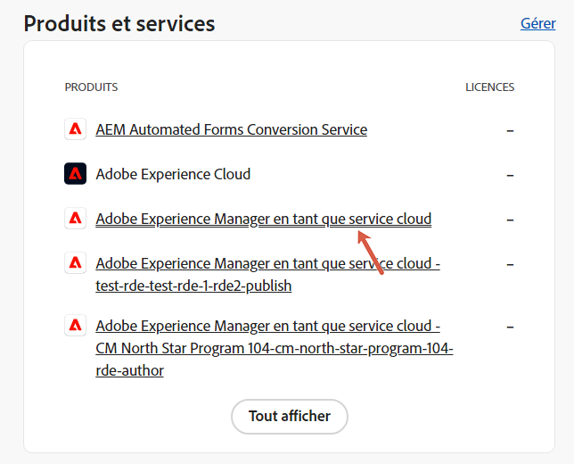
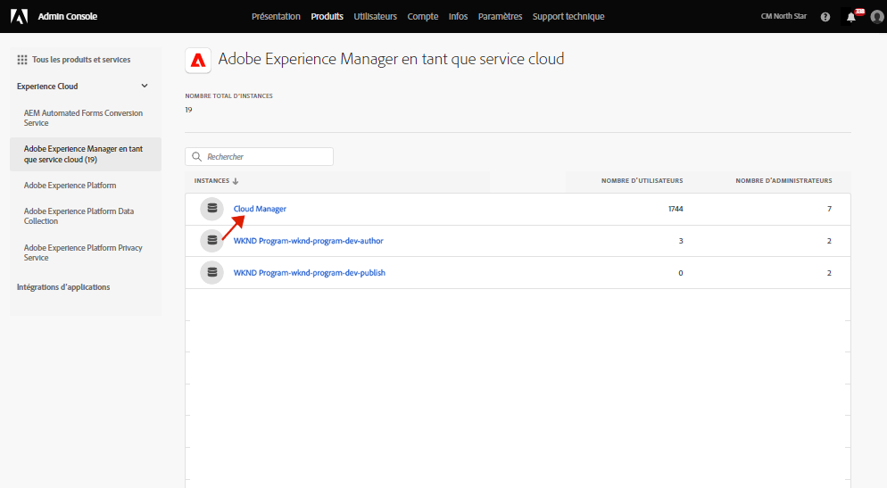
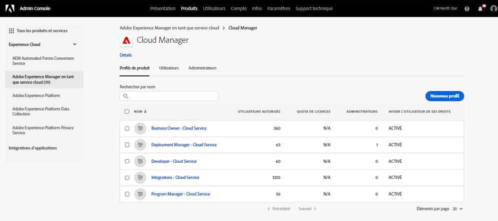
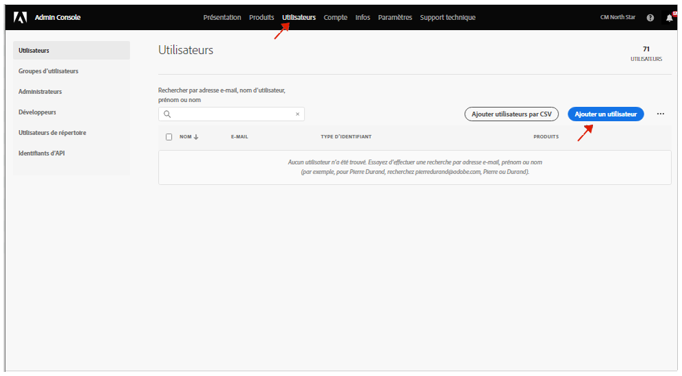

# Profils de notification {#notification-profiles}

Découvrez comment créer des profils utilisateur dans le Admin Console pour gérer la réception de notifications par e-mail importantes.

## Présentation {#overview}

De temps à autre, Adobe doit contacter les utilisateurs et utilisatrices au sujet des environnements AEM as a Cloud Service. En plus des notifications dans le produit, Adobe utilise parfois également les notifications par e-mail. Il existe deux types de notification par e-mail :

* **Notification d’incident** : ces notifications sont envoyées lors d’un incident ou lorsqu’Adobe identifie un problème de disponibilité potentiel avec votre environnement AEM as a Cloud Service.
* **Notification proactive** : ces notifications sont envoyées lorsqu’un membre de l’équipe d’assistance Adobe souhaite fournir des conseils sur une optimisation potentielle ou une recommandation susceptible de bénéficier à votre environnement AEM as a Cloud Service.

Pour que les utilisateurs appropriés puissent recevoir ces notifications, vous devez configurer et affecter des profils utilisateur comme décrit dans ce document.

## Prérequis {#prerequisites}

Les profils utilisateur étant créés et conservés dans le Admin Console, vous devez :

* Posséder les autorisations nécessaires pour ajouter des appartenances et des abonnements au profil.
* Disposer d’un profil Adobe Admin Console valide.

## Créer des profils de produits Cloud Manager {#create-profiles}

Pour configurer correctement la réception des notifications, vous devez créer deux profils utilisateur. Ces étapes ne doivent être effectuées qu’une seule fois.

1. Connectez-vous à Admin Console à l’adresse [`https://adminconsole.adobe.com`.](https://adminconsole.adobe.com)

1. Assurez-vous que vous vous trouvez dans la bonne organisation.

1. Sur la page **Présentation**, sélectionnez **Adobe Experience Manager as a Cloud Service** dans la vignette **Produits et services**.

   

1. Accédez à l’instance **Cloud Manager** à partir de la liste de toutes les instances.

   

1. La liste de tous les profils de produits Cloud Manager configurés s’affiche.

   

1. Cliquez sur **Nouveau profil** et fournissez les détails suivants :

   * **Nom du profil de produit** : `Incident Notification - Cloud Service`.
   * **Nom d’affichage** : `Incident Notification - Cloud Service`
   * **Description** : profil Cloud Manager des utilisateurs et utilisatrices qui recevront des notifications lors d’un incident ou lorsqu’Adobe identifie un problème de disponibilité potentiel avec l’environnement AEM as a Cloud Service.

1. Cliquez sur **Enregistrer**.

1. Cliquez sur **Nouveau profil** une fois de plus et fournissez les détails suivants :

   * **Nom du profil de produit** : `Proactive Notification - Cloud Service`.
   * **Nom d’affichage** : `Proactive Notification - Cloud Service`
   * **Description** : profil Cloud Manager des utilisateurs et utilisatrices qui recevront des notifications lorsqu’un membre de l’équipe d’assistance Adobe souhaite fournir des conseils sur une optimisation potentielle ou une recommandation relative à la configuration de l’environnement AEM as a Cloud Service.

1. Cliquez sur **Enregistrer**.

Vos deux nouveaux profils de notification sont créés.

>[!NOTE]
>
>Il est important que le **nom du profil de produit** Cloud Manager soit identique à celui fourni. Copiez et collez le nom du profil de produit fourni pour éviter toute erreur. Tout écart ou faute de frappe aura pour effet que les notifications ne seront pas envoyées comme vous le souhaitez.
>
>En cas d’erreur ou si les profils n’ont pas été définis, Adobe avertit par défaut les utilisateurs et utilisatrices existant(e)s affecté(e)s aux profils **Développeur Cloud Manager** ou **Responsable de déploiement**.

## Affectation d’utilisateurs aux profils de notification {#add-users}

Maintenant que les profils ont été créés, vous devez affecter les utilisateurs appropriés. Vous pouvez effectuer cela lors de la création d’utilisateurs et utilisatrices ou de la mise à jour d’utilisateurs ou utilisatrices existant(e)s.

### Ajout de nouveaux utilisateurs à des profils {#new-user}

Pour ajouter des utilisateurs et utilisatrices n’ayant pas encore de Federated ID configurés, procédez comme suit.

1. Identifiez les personnes qui doivent recevoir des notifications d’incident ou des notifications proactives.

1. Si vous ne l’avez pas encore fait, connectez-vous à Admin Console à l’adresse [`https://adminconsole.adobe.com`](https://adminconsole.adobe.com).

1. Assurez-vous d’avoir sélectionné l’organisation appropriée.

1. Sur la page **Présentation**, sélectionnez **Adobe Experience Manager as a Cloud Service** dans la vignette **Produits et services**.

   

1. Si le Federated ID des membres de votre équipe n’a pas encore été configuré, sélectionnez l’onglet **Utilisateurs** dans la section de navigation supérieure, puis sélectionnez **Ajouter un utilisateur**. Sinon, passez à la section [Ajout d’utilisateurs existants à des profils](#existing-users)

   

1. Dans la boîte de dialogue **Ajouter des utilisateurs à votre équipe**, saisissez l’ID d’e-mail de la personne que vous souhaitez ajouter et sélectionnez `Adobe ID` pour le **Type d’ID**.

1. Cliquez sur le bouton Plus sous l’en-tête **Sélectionner des produits** pour commencer la sélection de produits.

1. Sélectionner **Adobe Experience Manager as a Cloud Service** et affecter l’un des nouveaux profils ou les deux à l’utilisateur.

   * **Notification d’incident - Cloud Service**
   * **Notification proactive - Cloud Service**

1. Cliquez sur **Enregistrer** et un e-mail de bienvenue est envoyé à l’utilisateur ou utilisatrice que vous avez ajouté(e).

La personne invitée recevra désormais les notifications. Répétez ces étapes pour les personnes de votre équipe qui doivent recevoir des notifications.

### Ajout d’utilisateurs existants à des profils {#existing-user}

Pour ajouter des utilisateurs et utilisatrices dont les Federated ID existent déjà, procédez comme suit.

1. Identifiez les personnes qui doivent recevoir des notifications d’incident ou des notifications proactives.

1. Si vous ne l’avez pas encore fait, connectez-vous à Admin Console à l’adresse [`https://adminconsole.adobe.com`](https://adminconsole.adobe.com).

1. Assurez-vous d’avoir sélectionné l’organisation appropriée.

1. Sur la page **Présentation**, sélectionnez **Adobe Experience Manager as a Cloud Service** dans la vignette **Produits et services**.

1. Sélectionnez **Utilisateurs** dans la barre de navigation supérieure.

1. Si l’identifiant fédéré existe déjà pour le membre de l’équipe que vous souhaitez ajouter à un profil de notification, localisez cet utilisateur dans la liste et cliquez dessus. Sinon, passez à la section [Ajout de nouveaux utilisateurs aux profils](#add-user)

1. Dans la section **Produits** de la fenêtre Détails de l’utilisateur, cliquez sur les trois points de suspension, puis sélectionnez **Modifier**.

1. Dans la fenêtre **Modifier des produits**, cliquez sur le bouton en forme de crayon situé sous l’en-tête **Sélection de produits** pour commencer la sélection de produits.

1. Sélectionner **Adobe Experience Manager as a Cloud Service** et affecter l’un des nouveaux profils ou les deux à l’utilisateur.

   * **Notification d’incident - Cloud Service**
   * **Notification proactive - Cloud Service**

1. Cliquez sur **Enregistrer** et un e-mail de bienvenue est envoyé à l’utilisateur ou utilisatrice que vous avez ajouté(e).

La personne invitée recevra désormais les notifications. Répétez ces étapes pour les personnes de votre équipe qui doivent recevoir des notifications.
