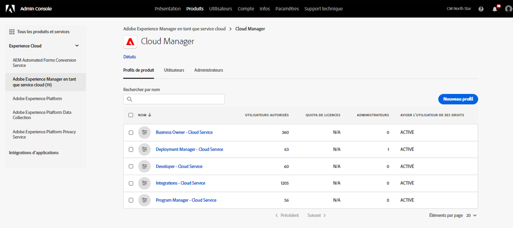
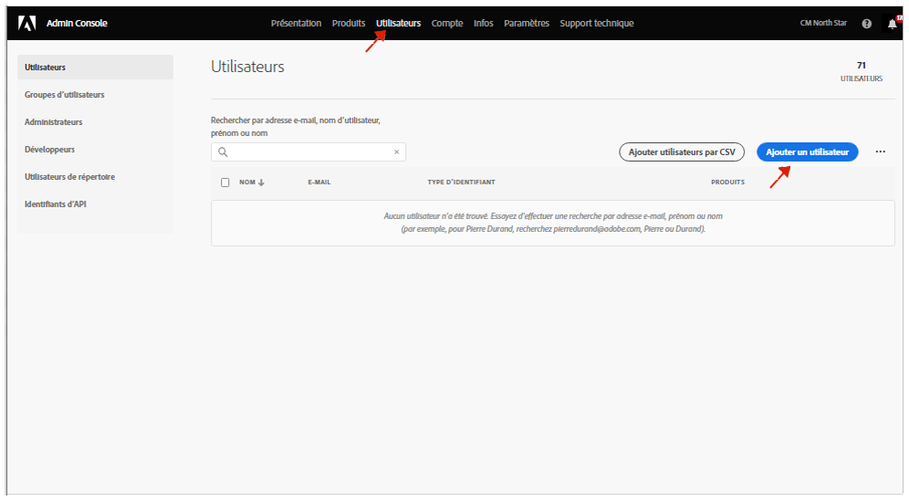

# Groupes d’utilisateurs pour les notifications {#user-groups}

Découvrez comment créer un groupe d’utilisateurs dans le Admin Console pour gérer la réception de notifications par e-mail importantes.

## Présentation {#overview}

De temps à autre, les Adobes doivent contacter concernant leurs environnements as a Cloud Service AEM. Outre la notification intégrée au produit, Adobe utilise également occasionnellement des courriers électroniques pour ces notifications. Il existe deux types de notification de ce type :

* **Notification d’incident - Cloud Service** - Ces notifications sont envoyées lors d’un incident ou lorsque l’Adobe a identifié un problème de disponibilité potentiel avec votre environnement as a Cloud Service AEM.
* **Notification proactive - Cloud Service** - Ces notifications sont envoyées lorsqu’un membre de l’équipe d’assistance Adobe souhaite fournir des conseils sur une optimisation potentielle ou une recommandation susceptible de bénéficier à votre environnement as a Cloud Service AEM.

Pour que les utilisateurs appropriés puissent recevoir ces notifications, vous devez configurer des groupes d’utilisateurs.

## Conditions préalables {#prerequisites}

Les groupes d’utilisateurs étant créés et gérés dans le Admin Console, vous devez :

* Posséder les autorisations nécessaires pour ajouter et modifier des appartenances à un groupe.
* Posséder un profil Adobe Admin Console valide.

## Création de profils de produit Cloud Manager {#create-groups}

Pour configurer correctement la réception des notifications, vous devez créer deux groupes d’utilisateurs. Ces étapes ne doivent être effectuées qu’une seule fois.

1. Connectez-vous à Admin Console à l’adresse [`https://adminconsole.adobe.com`.](https://adminconsole.adobe.com)

1. Sur la page **Aperçu**, sélectionnez **Adobe Experience Manager as a Cloud Service** dans la carte **Produits et services**.

   

1. Accédez à l’instance **Cloud Manager** à partir de la liste de toutes les instances.

   

1. La liste de tous les profils de produits Cloud Manager configurés s’affiche. Par exemple :

   

1. Cliquez sur **Nouveau profil** et présentez les informations suivantes :

   * Nom du profil de produit : Notification d’incident - Cloud Service
   * Nom d’affichage : Notification d’incident - Cloud Service
   * Description : Profil Cloud Manager pour les utilisateurs qui recevront des notifications lors d’un incident ou lorsque l’Adobe a identifié un problème de disponibilité potentiel avec votre environnement as a Cloud Service AEM.

1. Cliquez sur **Enregistrer** et répétez l’étape 5 avec les détails suivants :

   * Nom du profil de produit : Notification proactive - Cloud Service
   * Nom d’affichage : Notification proactive - Cloud Service
   * Description : Profil Cloud Manager pour les utilisateurs qui recevront des notifications lorsqu’un membre de l’équipe d’assistance à l’Adobe souhaite fournir des conseils sur une optimisation potentielle ou une recommandation concernant votre configuration d’environnement as a Cloud Service AEM.

>[!NOTE]
>
>Il est important que le nom du profil Cloud Manager soit identique à celui indiqué ci-dessus. Copiez et collez le nom du profil de produit à partir de la description fournie. Toute déviation ou faute de frappe entraînera l’envoi de notifications selon vos besoins. En cas d’erreur ou si les profils n’ont pas été définis, Adobe avertit par défaut les utilisateurs existants affectés aux profils du développeur de Cloud Manager (s’il s’agit de ou , ou et) de Deployment Manager.

## Affecter les utilisateurs aux nouveaux profils de produit de notification {#add-users}

Maintenant que les groupes ont été créés, vous devez affecter les utilisateurs appropriés. Vous pouvez le faire lors de la création de nouveaux utilisateurs ou de la mise à jour d’utilisateurs existants.

### Ajout de nouveaux utilisateurs à des groupes {#new-user}

1. Identifiez le ou les utilisateurs qui doivent recevoir des notifications d’incident ou proactives.

1. Connectez-vous à Admin Console à l’adresse [`https://adminconsole.adobe.com`](https://adminconsole.adobe.com) si vous n’êtes pas encore connecté.

1. Sur la page **Aperçu**, sélectionnez **Adobe Experience Manager as a Cloud Service** dans la carte **Produits et services**.

   

1. Sélectionnez l’onglet **Utilisateurs** dans la barre de navigation supérieure, puis sélectionnez **Ajouter un utilisateur**.

1. Dans la boîte de dialogue **Ajouter des utilisateurs à votre équipe**, entrez l’adresse e-mail de l’utilisateur que vous souhaitez ajouter.

   * Si l’identifiant fédéré des membres de votre équipe n’a pas encore été configuré, sélectionnez Adobe ID pour le Type d’ID.
   * Si l’utilisateur existe déjà, voir l’étape 9.

1. Cliquez sur le bouton Plus sous la **Sélection de produits** en-tête pour commencer la sélection de produit et sélectionnez **Adobe Experience Manager as a Cloud Service** et affectez **Notification d’incident - Cloud Service** ou **Notification proactive - Cloud Service** ou les deux à l’utilisateur.

1. Cliquez sur **Enregistrer** et un e-mail de bienvenue est envoyé à l’utilisateur que vous avez ajouté. L’utilisateur invité recevra désormais les notifications.

1. Répétez ces étapes pour les utilisateurs de votre équipe qui souhaitent recevoir les notifications.

1. Si l’utilisateur existe déjà, recherchez son nom et :

   * Cliquez sur le nom de l’utilisateur.
   * Dans le **Produits** , cliquez sur **Modifier**.
   * Cliquez sur le bouton représentant un crayon dans la **Sélection de produits** en-tête pour commencer la sélection de produit et sélectionnez **Adobe Experience Manager as a Cloud Service** et affectez **Notification d’incident - Cloud Service** ou **Notification proactive - Cloud Service** ou les deux à l’utilisateur.
   * Cliquez sur **Enregistrer** et un e-mail de bienvenue est envoyé à l’utilisateur que vous avez ajouté. L’utilisateur invité recevra désormais les notifications.
