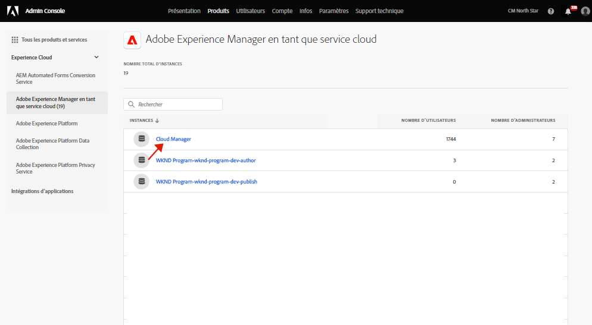

# Groupes d’utilisateurs pour les notifications {#user-groups}

Découvrez comment créer un groupe d’utilisateurs dans le Admin Console pour gérer la réception de notifications par e-mail importantes.

##  du commerce électronique {#overview}

De temps à autre, Adobe doit contacter les utilisateurs au sujet de leurs environnements as a Cloud Service AEM. Outre les notifications internes au produit, Adobe utilise également occasionnellement des courriers électroniques pour les notifications. Il existe deux types de notification par courrier électronique :

* **Notification d’incident** - Ces notifications sont envoyées lors d’un incident ou lorsque l’Adobe a identifié un problème de disponibilité potentiel avec votre environnement as a Cloud Service AEM.
* **Notification proactive** - Ces notifications sont envoyées lorsqu’un membre de l’équipe d’assistance Adobe souhaite fournir des conseils sur une optimisation potentielle ou une recommandation susceptible de bénéficier à votre environnement as a Cloud Service AEM.

Pour que les utilisateurs appropriés puissent recevoir ces notifications, vous devez configurer et affecter des groupes d’utilisateurs, comme décrit dans ce document.

## Prérequis {#prerequisites}

Les groupes d’utilisateurs étant créés et gérés dans le Admin Console, vous devez :

* Posséder les autorisations nécessaires pour ajouter et modifier des appartenances à un groupe.
* Posséder un profil Adobe Admin Console valide.

## Création de profils de produit Cloud Manager {#create-groups}

Pour configurer correctement la réception des notifications, vous devez créer deux groupes d’utilisateurs. Ces étapes ne doivent être effectuées qu’une seule fois.

1. Connectez-vous à Admin Console à l’adresse [`https://adminconsole.adobe.com`.](https://adminconsole.adobe.com)

1. Sur la page **Aperçu**, sélectionnez **Adobe Experience Manager as a Cloud Service** dans la carte **Produits et services**.

   

1. Accédez à l’instance **Cloud Manager** à partir de la liste de toutes les instances.

   

1. La liste de tous les profils de produits Cloud Manager configurés s’affiche.

   

1. Cliquez sur **Nouveau profil** et fournissez les détails suivants :

   * **Nom du profil de produit**: `Incident Notification - Cloud Service`
   * **Nom d’affichage**: `Incident Notification - Cloud Service`
   * **Description**: Profil Cloud Manager pour les utilisateurs qui recevront des notifications lors d’un incident ou lorsque l’Adobe a identifié un problème de disponibilité potentiel avec votre environnement as a Cloud Service AEM

1. Cliquez sur **Enregistrer**.

1. Cliquez sur **Nouveau profil** une fois de plus et fournissez les détails suivants :

   * **Nom du profil de produit**: `Proactive Notification - Cloud Service`
   * **Nom d’affichage**: `Proactive Notification - Cloud Service`
   * **Description**: Profil Cloud Manager pour les utilisateurs qui recevront des notifications lorsqu’un membre de l’équipe d’assistance à l’Adobe souhaite fournir des conseils sur une optimisation potentielle ou une recommandation concernant votre configuration d’environnement as a Cloud Service AEM

1. Cliquez sur **Enregistrer**.

Vos deux nouveaux groupes de notifications sont créés.

>[!NOTE]
>
>Il est important que Cloud Manager **nom du profil de produit** est identique à celui fourni. Copiez et collez le nom du profil de produit fourni pour éviter toute erreur. Toute déviation ou faute de frappe entraînera l’envoi de notifications selon vos besoins.
>
>En cas d’erreur ou si les profils n’ont pas été définis, Adobe avertit par défaut les utilisateurs existants affectés au **Développeur de Cloud Manager** ou **Responsable de déploiement** profils.

## Affecter les utilisateurs aux nouveaux profils de produit de notification {#add-users}

Maintenant que les groupes ont été créés, vous devez affecter les utilisateurs appropriés. Vous pouvez le faire lors de la création de nouveaux utilisateurs ou de la mise à jour d’utilisateurs existants.

### Ajout de nouveaux utilisateurs à des groupes {#new-user}

Pour ajouter des utilisateurs pour lesquels des ID fédérés n’ont pas encore été configurés, procédez comme suit.

1. Identifiez le ou les utilisateurs qui doivent recevoir des notifications d’incident ou proactives.

1. Connectez-vous à Admin Console à l’adresse [`https://adminconsole.adobe.com`](https://adminconsole.adobe.com) si vous n’êtes pas encore connecté.

1. Sur la page **Aperçu**, sélectionnez **Adobe Experience Manager as a Cloud Service** dans la carte **Produits et services**.

   

1. Si l’identifiant fédéré des membres de votre équipe n’a pas encore été configuré, sélectionnez la variable **Utilisateurs** dans le volet de navigation supérieur, puis sélectionnez **Ajouter un utilisateur**. Sinon, passez à la section [Ajout d’utilisateurs existants à des groupes.](#existing-users)

   

1. Dans le **Ajout d’utilisateurs à votre équipe** , saisissez l’e-mail de l’utilisateur que vous souhaitez ajouter et sélectionnez `Adobe ID` pour le **Type d’ID**.

1. Cliquez sur le bouton Plus sous la **Sélection de produits** pour commencer la sélection de produits.

1. Sélectionner **Adobe Experience Manager as a Cloud Service** et affectez l’un des nouveaux groupes ou les deux à l’utilisateur.

   * **Notification d’incident - Cloud Service**
   * **Notification proactive - Cloud Service**

1. Cliquez sur **Enregistrer** et un e-mail de bienvenue est envoyé à l’utilisateur que vous avez ajouté.

L’utilisateur invité recevra désormais les notifications. Répétez ces étapes pour les utilisateurs de votre équipe que vous souhaitez recevoir des notifications.

### Ajout d’utilisateurs existants à des groupes {#existing-user}

Pour ajouter des utilisateurs pour lesquels des ID fédérés existent déjà, procédez comme suit.

1. Identifiez le ou les utilisateurs qui doivent recevoir des notifications d’incident ou proactives.

1. Connectez-vous à Admin Console à l’adresse [`https://adminconsole.adobe.com`](https://adminconsole.adobe.com) si vous n’êtes pas encore connecté.

1. Sur la page **Aperçu**, sélectionnez **Adobe Experience Manager as a Cloud Service** dans la carte **Produits et services**.

1. Sélectionnez la **Utilisateurs** dans la barre de navigation supérieure.

1. Si l’identifiant fédéré existe déjà pour le membre de l’équipe que vous souhaitez ajouter à un groupe de notifications, localisez cet utilisateur dans la liste et cliquez dessus. Sinon, passez à la section [Ajout de nouveaux utilisateurs aux groupes.](#add-user)

1. Dans le **Produits** dans la fenêtre détails de l’utilisateur, cliquez sur le bouton représentant des points de suspension, puis sélectionnez **Modifier**.

1. Dans le **Modifier des produits** , cliquez sur le bouton en forme de crayon situé sous la fenêtre **Sélection de produits** pour commencer la sélection de produits.

1. Sélectionner **Adobe Experience Manager as a Cloud Service** et affectez l’un des nouveaux groupes ou les deux à l’utilisateur.

   * **Notification d’incident - Cloud Service**
   * **Notification proactive - Cloud Service**

1. Cliquez sur **Enregistrer** et un e-mail de bienvenue est envoyé à l’utilisateur que vous avez ajouté.

L’utilisateur invité recevra désormais les notifications. Répétez ces étapes pour les utilisateurs de votre équipe que vous souhaitez recevoir des notifications.
