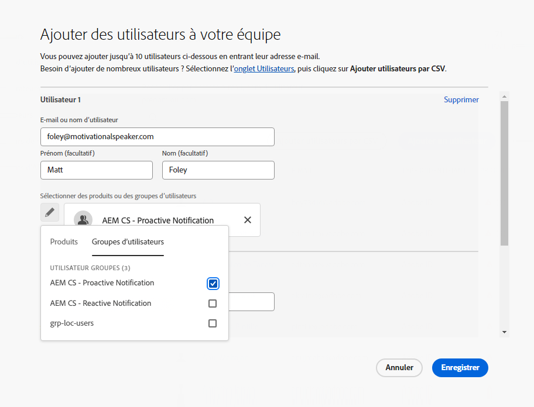

# Groupes d’utilisateurs pour les notifications {#user-groups}

Découvrez comment créer un groupe d’utilisateurs dans le Admin Console pour gérer la réception de notifications par e-mail importantes.

## Présentation {#overview}

De temps à autre, les Adobes doivent contacter concernant leurs environnements as a Cloud Service AEM. Outre la notification intégrée au produit, Adobe utilise également occasionnellement des courriers électroniques pour ces notifications. Il existe deux types de notification de ce type :

* **Notification réactive** - Ces notifications sont envoyées lors d’un incident ou lorsque l’Adobe a identifié un problème de disponibilité potentiel avec votre environnement as a Cloud Service AEM.
* **Notification proactive** - Ces notifications sont envoyées lorsqu’un membre de l’équipe d’assistance Adobe souhaite fournir des conseils sur une optimisation potentielle ou une recommandation susceptible de bénéficier à votre environnement as a Cloud Service AEM.

Pour que les utilisateurs appropriés puissent recevoir ces notifications, vous devez configurer des groupes d’utilisateurs.

## Conditions préalables {#prerequisites}

Les groupes d’utilisateurs étant créés et gérés dans le Admin Console, vous devez :

* Posséder les autorisations nécessaires pour ajouter et modifier des appartenances à un groupe.
* Posséder un profil Adobe Admin Console valide.

## Création de groupes d’utilisateurs pour la notification {#create-groups}

Pour configurer correctement la réception des notifications, vous devez créer deux groupes d’utilisateurs. Ces étapes ne doivent être effectuées qu’une seule fois.

1. Connectez-vous à Admin Console à l’adresse [`https://adminconsole.adobe.com`.](https://adminconsole.adobe.com)

1. Cliquez sur le bouton **Utilisateurs** puis l’onglet **Groupes d’utilisateurs** dans le panneau de navigation de gauche.

   

1. Cliquez sur le bouton **Nouveau groupe d’utilisateurs** et fournissez un **Nom du groupe d’utilisateurs** Exactement comme spécifié et facultatif **Description**.

   * Les noms des groupes doivent correspondre à ce qui suit. N’ajustez pas ou ne modifiez pas les noms des groupes de quelque manière que ce soit.
      * `AEM CS - Reactive Notification`
      * `AEM CS - Proactive Notification`

   

1. Cliquez sur **Enregistrer**.

1. Répétez les étapes pour le deuxième groupe.

Dans les cas où les groupes ne sont pas définis, Adobe avertit les utilisateurs existants avec Cloud Manager. **Développeur** ou **Déploiement** profils.

## Ajouter des utilisateurs aux groupes {#add-users}

Maintenant que les groupes ont été créés, vous devez affecter les utilisateurs appropriés. Vous pouvez le faire lors de la création de nouveaux utilisateurs ou de la mise à jour d’utilisateurs existants.

### Ajout de nouveaux utilisateurs à des groupes {#new-user}

1. Connectez-vous à Admin Console à l’adresse [`https://adminconsole.adobe.com`](https://adminconsole.adobe.com) si vous n’êtes pas encore connecté.

1. Cliquez sur le bouton **Utilisateurs** puis l’onglet **Utilisateurs** dans le panneau de navigation de gauche.

   

1. Cliquez sur le bouton **Ajouter un utilisateur** et indiquez l’adresse électronique de l’utilisateur. Vous pouvez également fournir un prénom et un nom.

   * Si l’utilisateur existe déjà, le Admin Console correspondra à l’adresse électronique et prérenseignera les champs.

1. Cliquez sur le signe plus sous les champs du nom d’utilisateur, puis cliquez sur le bouton **Groupes d’utilisateurs** dans la fenêtre contextuelle pour sélectionner les groupes de l’utilisateur.

   

1. Cliquez sur **Enregistrer** pour enregistrer le nouvel utilisateur.

Répétez ces étapes pour chaque utilisateur pour lequel vous devez affecter les groupes de notifications.

### Ajout d’utilisateurs existants à des groupes {#existing-user}

1. Connectez-vous à Admin Console à l’adresse [`https://adminconsole.adobe.com`](https://adminconsole.adobe.com) si vous n’êtes pas encore connecté.

1. Cliquez sur le bouton **Utilisateurs** puis l’onglet **Utilisateurs** dans le panneau de navigation de gauche.

   

1. Cliquez sur la ligne de l&#39;utilisateur que vous souhaitez ajouter à un groupe de notifications. Un panneau contenant les détails de l’utilisateur s’ouvre.

1. Cliquez sur l’icône représentant des points de suspension sur le côté droit du **Groupes d’utilisateurs** dans le panneau des détails.