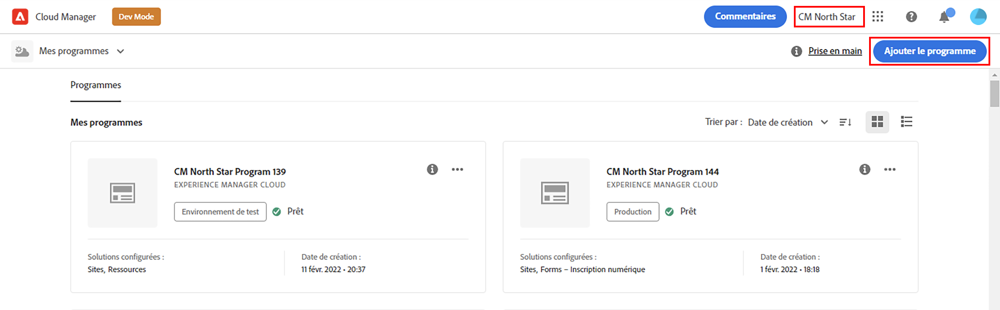
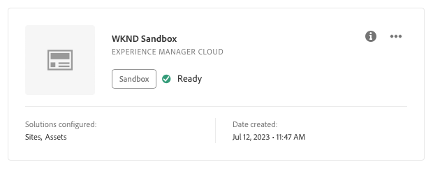

# Créer un programme {#creating-a-program}

Découvrez comment configurer un nouveau programme et un nouveau pipeline pour déployer le module complémentaire.

## Un peu d’histoire... {#story-so-far}

Dans le document précédent du parcours du module complémentaire de démonstration de référence d’Adobe Experience Manager (AEM), [Présentation de l’installation du module complémentaire de démonstration de référence](installation.md), vous avez appris comment fonctionne le processus d’installation du module complémentaire de démonstration de référence, illustrant comment les différents éléments fonctionnent ensemble. Vous devez maintenant :

* Posséder une compréhension de base de Cloud Manager.
* Découvrez comment les pipelines diffusent du contenu et une configuration à AEM.
* Découvrez comment les modèles peuvent créer des sites préremplis avec du contenu de démonstration en quelques clics seulement.

Cet article s’appuie sur ces principes de base et effectue la première étape de configuration pour créer un programme à des fins de test et utilise un pipeline pour déployer le contenu du module complémentaire.

## Objectif {#objective}

Ce document vous aide à comprendre comment configurer un nouveau programme ainsi qu’un nouveau pipelin pour déployer le module complémentaire. Après lecture, vous devriez être en mesure de comprendre :

* Découvrir comment utiliser Cloud Manager pour créer un programme.
* Activez le module complémentaire de démonstration de référence pour le nouveau programme.
* Exécutez un pipeline pour déployer le contenu du module complémentaire.

## Créer un programme {#create-program}

Après vous être connecté à Cloud Manager, vous pouvez créer un nouveau programme sandbox à des fins de test et de démonstration.

>[!NOTE]
>
>Votre utilisateur ou utilisatrice doit être membre du rôle **Propriétaire de l’entreprise** dans Cloud Manager dans votre entreprise pour créer des programmes.

1. Connectez-vous à Adobe Cloud Manager à l’adresse [my.cloudmanager.adobe.com](https://my.cloudmanager.adobe.com/).

1. Une fois connecté, vérifiez que vous vous trouvez dans la bonne organisation en la cochant dans le coin supérieur droit de l’écran. Si vous n’êtes membre que d’une seule organisation, cette étape n’est pas nécessaire.

   

1. Sélectionner **Ajout d’un programme** en haut à droite de la fenêtre.

1. Dans le **Créons votre programme** dialog :

   1. Fournissez un **Nom du programme** pour décrire votre programme.
   1. Sélectionner **Configuration d’un environnement de test** pour votre **Objectif du programme**
   1. Sélectionnez **Continuer**.

   

1. Dans le **Configuration de votre environnement de test** dans la boîte de dialogue **Solutions et modules complémentaires** , développez le tableau **Sites** entrée dans la liste en appuyant ou en cliquant dessus, puis en cochant **Démonstrations de référence**.

   * Si vous souhaitez également créer des démonstrations pour AEM Screens, cochez la case **Screens** dans la liste. Sélectionner **Mettre à jour**.

   

1. Sélectionner **Créer** et Cloud Manager commence à configurer votre programme d’environnement de test. Vous accédez à l’écran de présentation du programme et une courte notification de bannière indique que le processus a commencé. Une carte a été ajoutée à la page d’aperçu de votre nouveau programme. Le processus de configuration prend quelques minutes.

1. Une fois la configuration terminée, la carte de l’environnement sur la page d’aperçu affiche son état comme **Prêt**. Sélectionnez la carte pour ouvrir l’environnement.

   

1. Votre environnement est prêt et le module complémentaire est désormais activé en tant qu’option, mais le contenu de la démonstration doit être déployé pour AEM être disponible. Pour ce faire, sélectionnez le bouton représentant des points de suspension en regard du pipeline Déployer vers le développement dans la variable **Pipelines** carte et sélectionnez **Exécuter**.

   

1. Le pipeline démarre et vous accédez à une page détaillant la progression du déploiement. Vous pouvez quitter cet écran au fur et à mesure que le programme est créé et revenir ultérieurement si nécessaire.

   

L’exécution du pipeline peut prendre plusieurs minutes. Une fois le pipeline terminé, le module complémentaire et son contenu de démonstration sont disponibles dans l’environnement de création AEM.

## Prochaines étapes {#what-is-next}

Maintenant que vous avez terminé cette partie du parcours de module complémentaire de démonstration de référence d’AEM, vous devez :

* Découvrir comment utiliser Cloud Manager pour créer un programme.
* Savoir comment activer le module complémentaire de démonstration de référence pour le nouveau programme.
* Être en mesure d’exécuter un pipeline pour déployer le contenu du module complémentaire.

Tirez parti de ces connaissances et poursuivez votre parcours de module complémentaire de démonstration de référence AEM en consultant [Création d’un site de démonstration](create-site.md). Vous y apprendrez à créer un site de démonstration dans AEM basé sur une bibliothèque de modèles préconfigurés qui ont été déployés par le pipeline.

## Ressources supplémentaires {#additional-resources}

* [Documentation de Cloud Manager](https://experienceleague.adobe.com/docs/experience-manager-cloud-service/content/onboarding/onboarding-concepts/cloud-manager-introduction.html?lang=fr) - Pour obtenir plus de détails sur les fonctionnalités de Cloud Manager, vous pouvez consulter directement la documentation technique détaillée.
