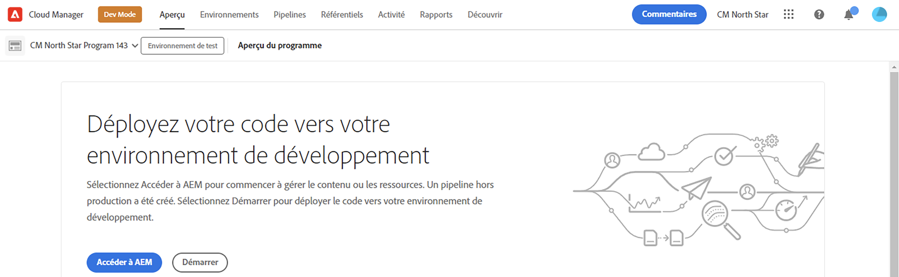

# Créer un programme {#creating-a-program}

Découvrez comment configurer un nouveau programme et un nouveau pipeline pour déployer le module complémentaire.

## Un peu d’histoire...  {#story-so-far}

Dans le document précédent du parcours de création rapide de site AEM, [Présentation de l’installation du module complémentaire de démonstration de référence,](installation.md) vous avez appris comment fonctionne le processus d’installation du module complémentaire de démonstration de référence, illustrant comment les différentes pièces fonctionnent ensemble. Vous devez maintenant :

* posséder une compréhension de base de Cloud Manager.
* Découvrez comment les pipelines diffusent du contenu et une configuration à AEM.
* Découvrez comment les modèles peuvent créer des sites préremplis avec du contenu de démonstration en quelques clics seulement.

Cet article s’appuie sur ces principes de base et effectue la première étape de configuration pour créer un programme à des fins de test et utilise un pipeline pour déployer le contenu du module complémentaire.

## Objectif {#objective}

Ce document vous aide à comprendre comment configurer un nouveau programme et un nouveau pipeline pour déployer le module complémentaire. Après l’avoir lu, vous devriez :

* Découvrez comment utiliser Cloud Manager pour créer un programme.
* Découvrez comment activer le module complémentaire de démonstration de référence pour le nouveau programme.
* Vous pouvez exécuter un pipeline pour déployer le contenu du module complémentaire.

## Création d’un programme {#create-program}

Après vous être connecté à Cloud Manager, vous pouvez créer un programme d’environnement de test à des fins de test et de démonstration.

>[!NOTE]
>
>Votre utilisateur doit être membre de la fonction **Propriétaire de l’entreprise** rôle dans Cloud Manager dans votre entreprise pour créer des programmes.

1. Connectez-vous à Adobe Cloud Manager à l’adresse [my.cloudmanager.adobe.com](https://my.cloudmanager.adobe.com/).

1. Une fois connecté, vérifiez que vous vous trouvez dans la bonne organisation en la cochant dans le coin supérieur droit de l’écran. Si vous n’êtes membre que d’une seule organisation, cette étape n’est pas nécessaire.

   

1. Appuyez ou cliquez sur **Ajout d’un programme** en haut à droite de la fenêtre.

1. Dans le **Créons votre programme** , assurez-vous que la variable **Adobe Experience Manager** est sélectionné sous **Produits** puis appuyez ou cliquez sur **Continuer**.

   

1. Dans la boîte de dialogue suivante :

   * Fournissez une **Nom du programme** pour décrire votre programme.
   * Appuyez ou cliquez sur **Configuration d’un environnement de test** pour votre **Objectif du programme**

   Ensuite, appuyez ou cliquez sur **Créer**.

   

1. Vous accédez à l’écran de présentation du programme dans lequel vous pouvez observer le processus de création de votre programme. Cloud Manager fournit des estimations du temps restant. Vous pouvez quitter cet écran au fur et à mesure que le programme est créé et revenir ultérieurement si nécessaire.

   

1. Une fois l’opération terminée, Cloud Manager présente un aperçu comprenant les environnements et les pipelines créés automatiquement.

   

1. Modifiez les détails du programme en cliquant sur le nom du programme dans le coin supérieur gauche de la page, puis dans la liste déroulante, sélectionnez **Modifier le programme**.

   

1. Dans le **Modifier le programme** , passez à la boîte de dialogue **Solutions et modules complémentaires** .

   

1. Sur le **Solutions et modules complémentaires** , développez l’onglet **Sites** entrée dans la liste, puis cochez **Démonstrations de référence**. Appuyez ou cliquez sur **Mettre à jour**.

   

1. Le module complémentaire est désormais activé en tant qu’option, mais son contenu doit être déployé pour AEM être disponible. De retour sur la page de présentation du programme, appuyez ou cliquez sur **Début** pour démarrer le pipeline afin de déployer le contenu du module complémentaire dans AEM.

   

1. Le pipeline démarre et vous accédez à une page détaillant la progression du déploiement. Vous pouvez quitter cet écran au fur et à mesure que le programme est créé et revenir ultérieurement si nécessaire.

   

Une fois le pipeline terminé, le module complémentaire et son contenu de démonstration sont disponibles dans l’environnement de création AEM.

## Et après ? {#what-is-next}

Maintenant que vous avez terminé cette partie du parcours de module complémentaire de démonstration de référence d’AEM, vous devez :

* Découvrez comment utiliser Cloud Manager pour créer un programme.
* Découvrez comment activer le module complémentaire de démonstration de référence pour le nouveau programme.
* Vous pouvez exécuter un pipeline pour déployer le contenu du module complémentaire.

Tirez parti de ces connaissances et poursuivez votre parcours de démonstration de référence AEM en consultant le document. [Créer un site de démonstration,](create-site.md) où vous apprendrez à créer un site de démonstration dans AEM en fonction d’une bibliothèque de modèles préconfigurés qui ont été déployés par le pipeline.

## Ressources supplémentaires {#additional-resources}

* [Documentation de Cloud Manager](https://experienceleague.adobe.com/docs/experience-manager-cloud-service/onboarding/onboarding-concepts/cloud-manager-introduction.html) - Si vous souhaitez plus de détails sur les fonctionnalités de Cloud Manager, vous pouvez consulter directement la documentation technique détaillée.
