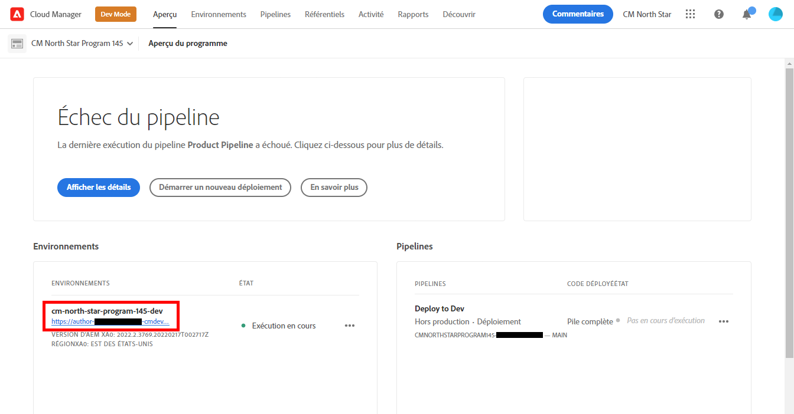
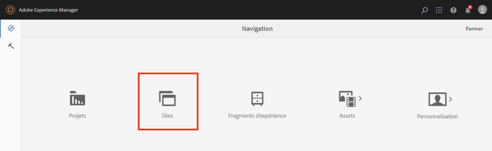
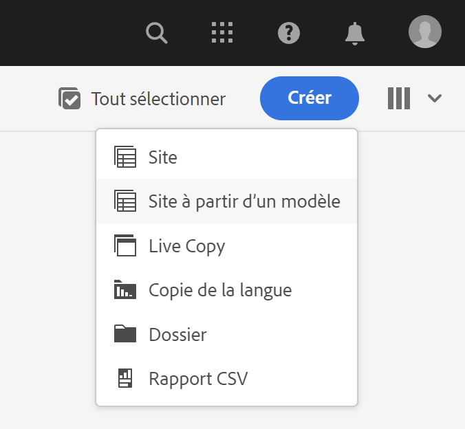
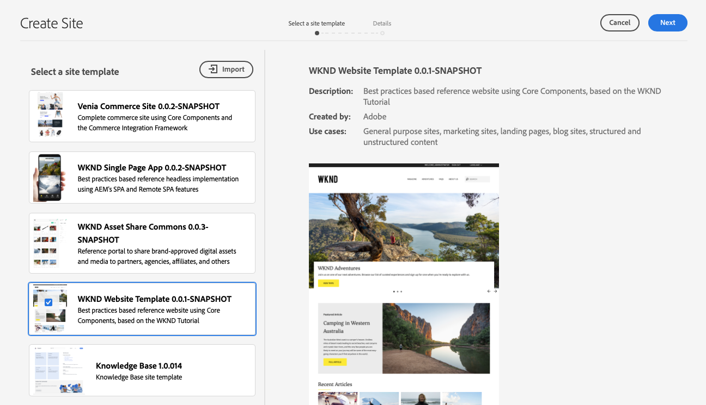
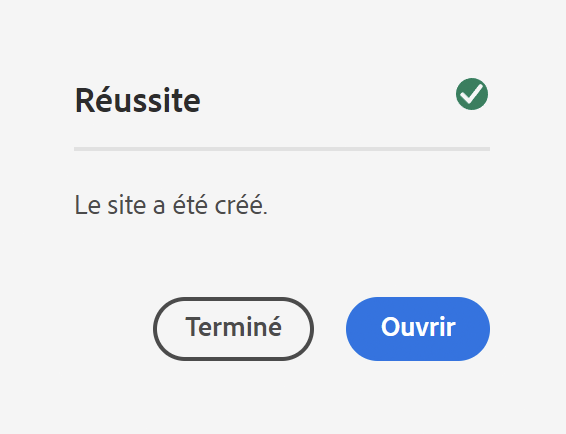
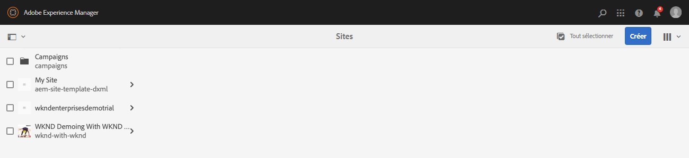
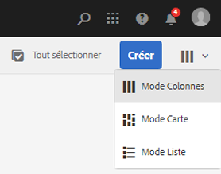
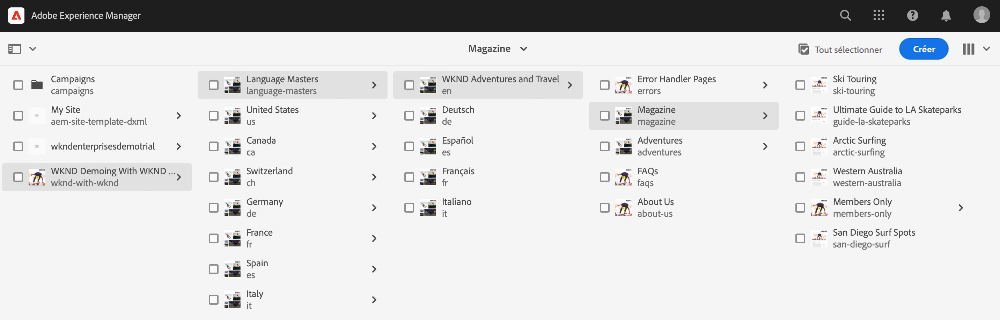
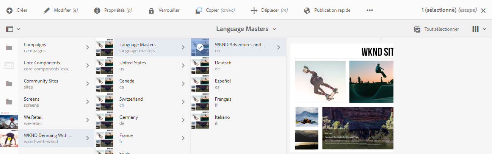
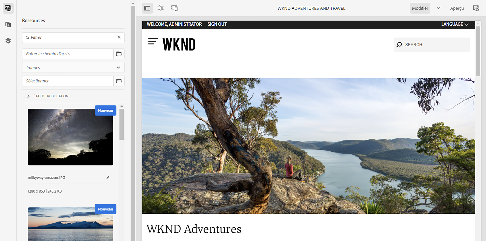

# Créer un site de démonstration {#creating-a-site}

Créez un site de démonstration dans AEM basé sur une bibliothèque de modèles préconfigurés.

## Un peu d’histoire… {#story-so-far}

Dans le document précédent du parcours de modules complémentaires de démonstration de référence d’AEM, [Créer un programme](create-program.md), vous avez effectué la première étape de configuration pour créer un programme à des fins de test et utilisé un pipeline pour déployer le contenu du module complémentaire. Vous devriez maintenant :

* Découvrir comment utiliser Cloud Manager pour créer un programme.
* Savoir comment activer le module complémentaire de démonstration de référence pour le nouveau programme.
* Être en mesure d’exécuter un pipeline pour déployer le contenu du module complémentaire.

Cet article décrit l’étape suivante du processus en créant un nouveau site ou un projet AEM Screens dans AEM à partir des modèles du module complémentaire de démonstration de référence.

## Objectif {#objective}

Ce document vous aide à comprendre comment créer un nouveau site à partir des modèles du module complémentaire de démonstration de référence. Après avoir lu ce document, vous devriez :

* Découvrir comment accéder à l’environnement de création AEM.
* Savoir comment créer un site à partir d’un modèle.
* Découvrir les principes de base de la navigation dans la structure du site et de la modification d’une page.

## Créer un site de démonstration ou un projet Screens {#create-site}

Une fois que le pipeline a déployé le module complémentaire de démonstration de référence, vous pouvez accéder à l’environnement de création AEM pour créer des sites de démonstration basés sur le contenu du module complémentaire.

1. Dans la page de présentation du programme de Cloud Manager, appuyez ou cliquez sur le lien vers l’environnement de création AEM.

   

1. Dans le menu principal de l’AEM, sélectionnez **Sites**.

   

1. Dans la console Sites, appuyez ou cliquez sur **Créer** dans le coin supérieur droit de l’écran, puis sélectionnez **Site à partir d’un modèle** dans la liste déroulante.

   

1. L’assistant Création de site démarre. Dans la colonne de gauche, vous pouvez voir les modèles de démonstration que le pipeline a déployés sur votre instance de création. Appuyez ou cliquez sur l’un d’eux pour le sélectionner et afficher les détails dans la colonne de droite. Si vous souhaitez faire un test ou une démonstration AEM Screens, veillez à choisir le **modèle de site We.Cafe**. Sélectionnez **Suivant**.

   

1. Dans l’écran suivant, indiquez un titre pour votre site ou votre projet Screens. Un nom de site peut être fourni ou généré à partir du titre s’il est omis. Sélectionnez **Créer**.

   * Le titre du site s’affiche dans la barre de titre des navigateurs.
   * Le nom du site fait alors partie de l’URL.
   * Le nom du site doit respecter les conventions de dénomination des pages d’AEM, dont les détails sont disponibles dans la section [Ressources supplémentaires](#additional-resources).

   

1. La création du site est confirmée par une boîte de dialogue. Sélectionnez **Terminé**.

   

Vous avez maintenant créé votre propre site de démonstration !

## Utiliser le site de démonstration {#use-site}

Maintenant que votre site de démonstration est créé, vous pouvez le parcourir et l’utiliser comme vous le feriez pour tout autre site dans AEM.

1. Le site s’affiche désormais dans la console Sites.

   

1. Dans le coin supérieur droit de l’écran, assurez-vous que l’affichage de la console est défini sur **Mode Colonnes**.

   

1. Sélectionnez le site pour explorer sa structure et son contenu. Le mode Colonnes se développe en permanence lorsque vous naviguez dans l’arborescence de contenu du site de démonstration.

   

1. Sélectionnez une page pour la sélectionner, puis sélectionnez **Modifier** dans la barre d’outils.

   

1. Vous pouvez modifier la page comme toute autre page de contenu d’AEM telle que l’ajout ou la modification de composants ou de ressources, et tester les fonctionnalités d’AEM.

   

Félicitations. Vous pouvez maintenant explorer davantage le contenu de votre site de démonstration et découvrir tout ce que AEM a à offrir grâce au contenu des bonnes pratiques du module complémentaire de démonstration de référence.

Créez d’autres sites en fonction d’autres modèles pour explorer d’autres fonctionnalités AEM.

## Prochaines étapes {#what-is-next}

Maintenant que vous avez terminé cette partie du parcours de module complémentaire de démonstration de référence d’AEM, vous devez :

* Découvrir comment accéder à l’environnement de création AEM.
* Savoir comment créer un site à partir d’un modèle.
* Découvrir les principes de base de la navigation dans la structure du site et de la modification d’une page.

Vous pouvez désormais tester les fonctionnalités d’AEM à l’aide du contenu du module complémentaire. Vous disposez de deux options pour poursuivre votre parcours :

* Si vous souhaitez effectuer une démonstration complète et tester le contenu d’AEM Screens, assurez-vous d’avoir déployé un site en fonction du modèle de site **We.Cafe** comme décrit précédemment et continuez pour [ Activer AEM Screens pour votre site de démonstration](screens.md).
* Si vous utilisez uniquement pour la démonstration du contenu de Sites, poursuivez sur [Gérer vos sites de démonstration](manage.md), où vous découvrirez les outils disponibles pour vous aider à gérer vos sites de démonstration et comment les supprimer.

## Ressources supplémentaires {#additional-resources}

* [Documentation de Cloud Manager](https://experienceleague.adobe.com/docs/experience-manager-cloud-service/content/onboarding/onboarding-concepts/cloud-manager-introduction.html?lang=fr) - Pour obtenir plus de détails sur les fonctionnalités de Cloud Manager, vous pouvez consulter directement la documentation technique détaillée.
* [Créer un site](/help/sites-cloud/administering/site-creation/create-site.md) - Découvrez comment utiliser AEM pour créer un site à l’aide de modèles de site afin de définir le style et la structure de votre site.
* [Conventions de dénomination des pages d’AEM](/help/sites-cloud/authoring/sites-console/organizing-pages.md#page-name-restrictions-and-best-practices). - Reportez-vous à cette page pour mieux comprendre les conventions d’organisation des pages AEM.
* [Manipulation de base d’AEM](/help/sites-cloud/authoring/basic-handling.md) - Explorez ce document si vous êtes un nouvel utilisateur ou une nouvelle utilisatrice d’AEM pour comprendre les concepts de base tels que la navigation et l’organisation des consoles.
