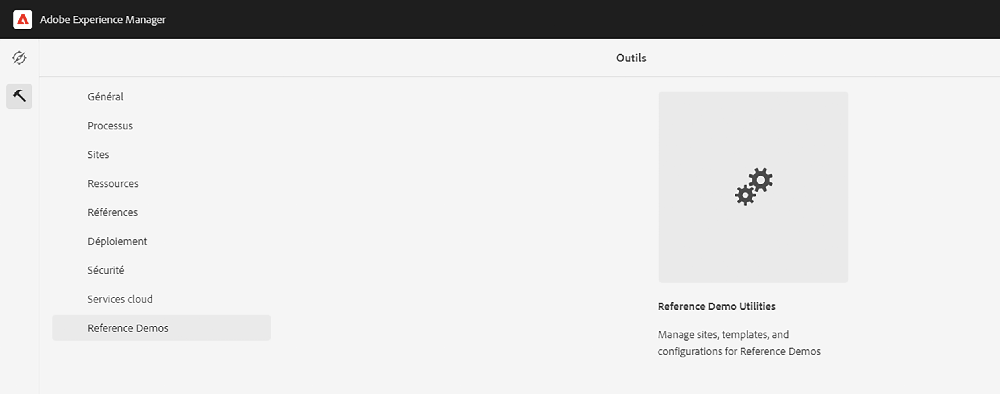
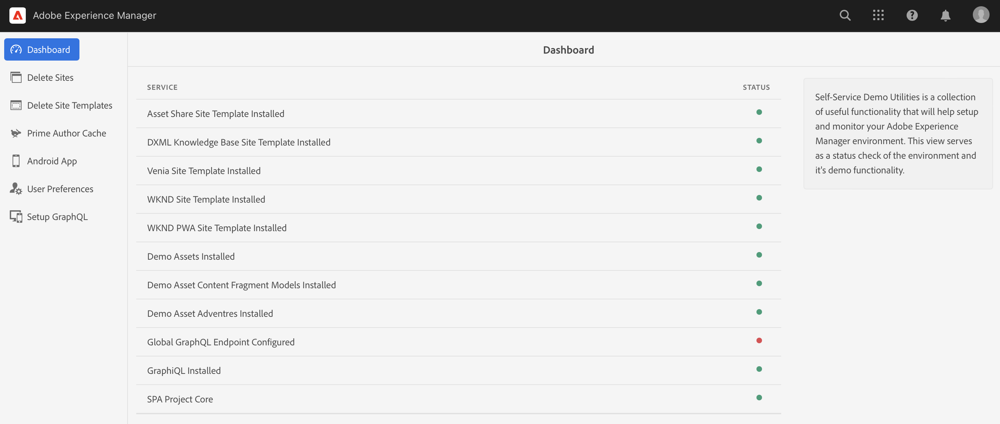
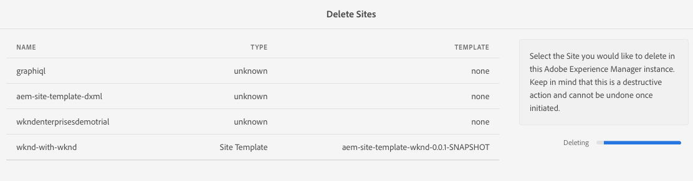

# Gestion de vos sites de démonstration {#manage-demo-sites}

Découvrez les outils disponibles pour vous aider à gérer vos sites de démonstration et comment les supprimer.

## Un peu d’histoire... {#story-so-far}

Dans le document précédent du parcours du module complémentaire des démonstrations de référence d’AEM, [Créer un site](create-site.md), vous avez créé un site de démonstration basé sur les modèles du module complémentaire de démonstration de référence. Vous devez maintenant :

* Découvrir comment accéder à l’environnement de création AEM.
* Savoir comment créer un site à partir d’un modèle.
* Découvrir les principes de base de la navigation dans la structure du site et de la modification d’une page.

Si vous avez aussi [activé AEM Screens pour votre site de démonstration](screens.md), vous devriez également disposer des compétences suivantes :

* Connaître les principes de base d’AEM Screens.
* Comprendre le contenu de la démonstration de We.Cafe.
* Découvrir comment configurer AEM Screens pour We.Cafe.

Maintenant que vous avez votre propre site de démonstration à explorer, cet article décrit les outils disponibles pour vous aider à gérer vos sites de démonstration et comment les supprimer.

## Objectif {#objective}

Ce document vous aide à comprendre comment gérer les sites de démonstration que vous avez créés. Après avoir lu ce document, vous devriez :

* Découvrir comment accéder aux utilitaires de démonstration en libre-service.
* Sachez quels utilitaires vous avez à votre disposition.
* Comment supprimer un site ou un modèle de démonstration existant.

## Accès aux utilitaires de démonstration en libre-service {#accessing-utilities}

Maintenant que vous disposez de vos propres sites de démonstration, vous souhaitez probablement savoir comment les gérer. Le pipeline a non seulement déployé les modèles de site pour fournir le contenu de vos sites de démonstration, mais a également déployé un ensemble d’utilitaires pour gérer ces sites.

1. Dans la barre de navigation globale dʼAEM, sélectionnez **Outils** -> **Démonstrations de référence** -> **Utilitaires de démonstration de référence**.

   

1. Les utilitaires de démonstration de référence regroupent un ensemble de fonctionnalités utiles qui vous aident à configurer et surveiller votre environnement Adobe Experience Manager. La vue initiale est le **Tableau de bord**, qui permet de vérifier l’état de l’environnement et sa fonctionnalité de démonstration.

   

Les utilitaires de démonstration en libre-service fournissent plusieurs outils.

* **Suppression de sites** : sélection du site à supprimer dans cette instance Adobe Experience Manager. Gardez à l’esprit qu’il s’agit d’une action destructrice, elle ne peut être annulée une fois lancée.
* **Suppression de modèles de site** : sélection du modèle de site à supprimer dans cette instance Adobe Experience Manager. Avant de supprimer un modèle de site, assurez-vous que tous les sites qui font référence à ce modèle sont également supprimés. Gardez à l’esprit qu’il s’agit d’une action destructrice, elle ne peut être annulée une fois lancée.
* **Cache dʼauteur principal** : cet outil permet de récupérer plusieurs ressources au sein de l’instance Adobe Experience Manager, en accélérant leur temps de récupération. Cette opération peut prendre plusieurs secondes.
* **Application Android** : outils d’installation et de lancement de l’application Android de démonstration. Permet de créer un site basé sur lʼ&#x200B;**Application monopage WKND** pour alimenter cette page. Utilisation à partir d’un appareil Android, d’un émulateur ou de la plateforme Bluestacks.
* **Préférences utilisateur** : désactivation des boîtes de dialogue contextuelles de tutoriel.
* **Configuration de GraphQL** : configuration rapide du point d’entrée global GraphQL.

## Suppression de sites et de modèles de démonstration {#deleting}

Vous avez à présent testé tout un panel de fonctionnalités dʼAEM. Vous nʼavez sans doute plus besoin de votre site de démonstration, ni même du modèle sur lequel il est basé. La suppression des sites et modèles de démonstration est une tâche facile.

1. Accédez au **Utilitaires de démonstration de référence** et sélectionnez **Supprimer des sites**.

   

1. Les sites disponibles sont présentés dans une liste. Vérifiez le ou les sites que vous souhaitez supprimer, puis sélectionnez **Supprimer**.

   >[!CAUTION]
   >
   >La suppression dʼun site ou dʼun modèle est une action destructrice, elle ne peut être annulée une fois lancée.

1. Confirmez la suppression du site dans la boîte de dialogue.

   

1. AEM supprime le ou les sites sélectionnés et affiche la progression de la suppression à lʼendroit où se trouvait précédemment le bouton **Supprimer**.

   

Le site est maintenant supprimé.

Pour supprimer des modèles, effectuez une procédure identique sous lʼen-tête **Supprimer des modèles de site** dans le menu **Utilitaires de démonstration de référence**.

>[!CAUTION]
>
>Avant de supprimer un modèle de site, assurez-vous que tous les sites qui font référence à ce modèle sont également supprimés.

## Fin du parcours ? {#end-of-journey}

Félicitations. Vous avez terminé le parcours du module complémentaire de démonstration d’AEM ! Vous devez maintenant :

* Posséder une connaissance de base de Cloud Manager et comprendre comment les pipelines diffusent du contenu et de la configuration vers AEM.
* Découvrir comment utiliser Cloud Manager pour créer un programme.
* Savoir comment activer le module complémentaire de démonstration de référence pour le nouveau programme et être capable d’exécuter un pipeline pour déployer le contenu du module complémentaire.
* Découvrir comment accéder à l’environnement de création AEM pour créer un site basé sur un modèle.
* Découvrir comment accéder aux utilitaires de démonstration en libre-service.
* Savoir comment supprimer un site de démonstration ou un modèle existant.

Vous êtes maintenant prêt à explorer les fonctionnalités d’AEM à l’aide de vos propres sites de démonstration. Cependant, AEM est un outil puissant et de nombreuses autres options sont disponibles. Consultez certaines des ressources supplémentaires disponibles dans la [Section Ressources supplémentaires](#additional-resources) pour en savoir plus sur les fonctionnalités rencontrées dans ce parcours.

## Ressources supplémentaires {#additional-resources}

* [Documentation de Cloud Manager](https://experienceleague.adobe.com/docs/experience-manager-cloud-service/content/onboarding/onboarding-concepts/cloud-manager-introduction.html?lang=fr) - Pour obtenir plus de détails sur les fonctionnalités de Cloud Manager, vous pouvez consulter directement la documentation technique détaillée.
* [Créer un site](/help/sites-cloud/administering/site-creation/create-site.md) - Découvrez comment utiliser AEM pour créer un site à l’aide de modèles de site afin de définir le style et la structure de votre site.
* [Conventions de dénomination des pages d’AEM](/help/sites-cloud/authoring/sites-console/organizing-pages.md#page-name-restrictions-and-best-practices). - Reportez-vous à cette page pour mieux comprendre les conventions d’organisation des pages AEM.
* [Manipulation de base d’AEM](/help/sites-cloud/authoring/basic-handling.md) - Explorez ce document si vous êtes un nouvel utilisateur ou une nouvelle utilisatrice d’AEM pour comprendre les concepts de base tels que la navigation et l’organisation des consoles.
* [Documentation technique d’AEM as a Cloud Service](https://experienceleague.adobe.com/docs/experience-manager-cloud-service.html?lang=fr) - Si vous avez déjà une bonne compréhension d’AEM, vous pouvez consulter directement notre documentation technique détaillée.
* [Modèles de site](/help/sites-cloud/administering/site-creation/site-templates.md) - Si vous souhaitez en savoir plus sur la structure des modèles de site et leur utilisation pour créer des sites, consultez ce document.
